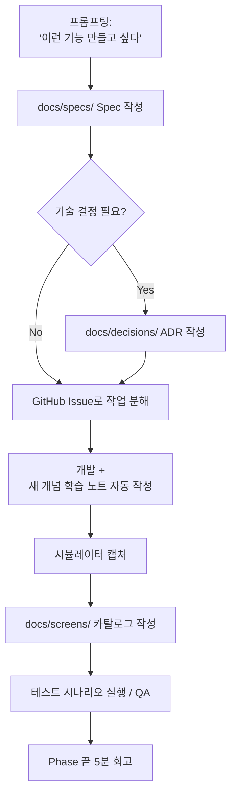

# Trailog — 프로젝트 루트 문서

> **Trailog** = Trail(발자취) + Log(기록)
> _A trail of your moments_ — 내 모든 순간(여행/일상/단발)을 사진 + 지도로 박제하는 개인 메모리 아카이브 모바일 앱
> 학습 + 취미 + 실무 학습 포트폴리오를 위한 사이드 프로젝트
>
> **기록 단위**: `Moment` — 여행/카페 방문/산책/단발 외출 모두 포함. 사진 + 시간 + 위치로 박제.

---

## 0. 이 문서의 목적

이 문서는 프로젝트 전체의 **북극성(North Star)** 역할을 한다. 개발 도중 길을 잃거나, 새로운 기능을 추가할지 고민될 때, 또는 "내가 왜 이걸 만들고 있지?" 라는 생각이 들 때 돌아와서 읽는다.

- **언제 업데이트하는가**: 큰 방향 전환이 있을 때만 (예: 스택 변경, 우선순위 재조정). 자잘한 기능 추가는 별도 문서/이슈에서 관리.
- **언제 읽는가**: 매 Phase 시작 전, 그리고 흥미가 떨어졌을 때.

---

## 1. 개발자 컨텍스트

| 항목        | 내용                                                                                         |
| ----------- | -------------------------------------------------------------------------------------------- |
| 학습        | 프론트엔드 2년차                                                                             |
| 실무 환경   | 실무 백엔드 (데스크탑 웹 기반)                                                               |
| 메인 스택   | React, Next.js, TypeScript, NestJS, RDB(Postgres/MySQL), 상태관리(Redux/Zustand/React Query) |
| 다뤄본 영역 | 웹뷰 개발 경험 있음                                                                          |
| 약한 영역   | 인프라 거의 모름                                                                             |
| 가용 시간   | 주 10시간 이상 (제대로 몰입)                                                                 |
| 목표        | 실무 학습 (프론트 개발자 포지션 유지) + 도메인/기술 역량 확장 + 취미                         |

---

## 2. 프로젝트의 진짜 목표

**"기능을 만드는 것이 아니라, 의도적으로 못 다뤄본 기술 영역을 채우는 것."**

도메인(개인 메모리 아카이브 — 여행/일상/단발 무관)은 동기부여용 껍데기이며, 본질적인 목표는 아래 영역의 실전 경험 확보다.

### 학습 목표 (우선순위 순)

1. **인프라 / 배포 / DevOps** — Docker, CI/CD, 클라우드 배포
2. **이미지 / 미디어 처리, 파일 스트리밍** — 사진 앱의 본질 영역
3. **지도 / 데이터 시각화** — 새로운 프론트 영역
4. **실시간 통신** — WebSocket, SSE
5. **성능 최적화 / 캐싱 전략** — Redis 등
6. **(보너스) 모바일 네이티브 + 앱 배포 경험** — React Native, 스토어 출시

이 6개 영역은 모두 "**개인 메모리 아카이브 (사진 + 시간 + 위치)**"라는 도메인에 자연스럽게 녹아든다. 억지로 끼워맞춘 것이 아니며, 사진/위치 기반 앱 자체가 이 기술들을 요구한다.

---

## 3. 의사결정 기록 (Decision Log)

논의 과정에서 결정한 핵심 사항들. 흔들릴 때마다 돌아와서 확인한다.

### 결정 1: 도메인 — 개인 메모리 아카이브 (광의) + 한국 사용자 중심

- **선택**: **지도 기반 비주얼 모먼트 아카이브** — 여행/일상/카페 방문/산책/단발 외출 모두 포함. 동행자 공유는 Phase 3+.
- **사용자 우선순위**: **한국 사용자 중심 MVP**. 본인 + 한국 사용자가 일상에서 친숙한 UX 우선 (네이버맵 채택, [ADR-0010](./decisions/0010-mobile-map-library-naver-map.md)). **해외 사진 처리는 Phase 후속** (글로벌 출시 검토 시점에 multi-provider 또는 글로벌 lib 추가).
- **이유**:
  - 본인이 직접 쓸 수 있어 동기 유지에 유리 ("당장은 내가 쓰고 싶은 앱")
  - 본인이 남기고 싶은 순간들이 매우 다양 — 여행 한정 도메인은 사용 시나리오 좁힘
  - 학습 목표 6개가 모두 자연스럽게 들어맞음
  - 한국 사용자 우선 — Google/Apple Maps의 한국 UX 거부감 회피 + 네이버맵 일상 친숙도 ↑ + 한국 모바일 지도 SDK 정복 실무 가치
- **기록 단위**: `Moment` (여행 = Trip 아님)
- **결정 변경 이력**:
  - 2026-05-31 도메인 광의 재정의 — 처음엔 "여행 사진"으로 그렸으나 본인 의도가 "여행 + 일상 모든 순간"이라 확장. Trailog 어휘(Trail + Log)는 광의에 충분 — 단위만 `Moment`로.
  - 2026-06-07 사용자 우선순위 한국 중심 명시 — Phase 2 4.7 지도 lib 결정 흐름에서 Google/Apple UX 거부감 + 네이버맵 친숙도 비교 후 본인 결정. 해외 사진 처리는 Phase 후속(글로벌 출시 검토 시점). 자세한 사유 + 학습 영역 #3 정복 관점 정정은 [ADR-0010](./decisions/0010-mobile-map-library-naver-map.md) 참고.

### 결정 2: 플랫폼 — 모바일 앱 (React Native + Expo)

- **선택**: Web(Next.js) 대신 **React Native (Expo)**
- **이유**:
  - 사진/여행 도메인은 본질적으로 모바일이 본진 (카메라, 위치, 오프라인, 사용 맥락)
  - 업무에서 데스크탑 웹만 다뤄왔으므로 모바일은 의도적 보강 영역
  - 포트폴리오/학습 차별화 가치 ("RN으로 직접 만든 앱" > "Next.js 사이드 하나 더")
- **트레이드오프 인식**: 첫 셋업 부담, 디버깅 사이클 길어짐, 스토어 배포 시 비용 발생. 감수 가능.

### 결정 3: 백엔드 — NestJS (Spring 채택 안 함)

- **선택**: NestJS 유지
- **이유**:
  - **실무 학습 목표가 프론트엔드 개발자**이므로 Spring을 굳이 사이드에서 배울 필요 없음
  - 학습 토픽에서 "프론트 지원자가 Spring 사이드"보다 "프론트 지원자가 풀스택 + 모바일 + 배포까지 직접"이 더 강한 시그널
  - Spring 어설프게 배워 학습 토픽에서 깊이 못 들어가면 오히려 마이너스
  - 사이드 프로젝트 규모에서는 Nest의 개발 속도, 모노레포 친화성, 실시간 친화성이 압도적으로 유리
- **단, Spring 학습 자체를 부정하지는 않음**: 본 프로젝트 완성 후, 같은 백엔드를 Spring(Kotlin) + JPA로 포팅하는 2차 프로젝트는 가능. 이때 "두 스택 모두 다뤄봤고 차이를 안다"가 강력한 셀링 포인트가 됨.

### 결정 4: 상용화 관점 — "확장 가능하게 설계하되, 처음부터 상용화를 목표로 두지 않음"

- **선택**: 학습 우선, 상용화는 옵션
- **이유**:
  - 처음부터 상용화 목표로 만들면 학습 흐름이 굳어짐
  - 6개월 정도 본인이 직접 써본 후, 진짜 가치 있는지 판단
  - 단, 구조는 처음부터 멀티유저/인증/권한/결제 끼울 자리를 비워두고 설계

### 결정 6: 프로젝트명 — Trailog

- **선택**: Trailog (Trail + Log)
- **이유**:
  - 의미가 도메인과 정확히 일치 (발자취 + 기록)
  - 발음 쉽고 외우기 좋음 ("트레일로그")
  - 앱스토어/구글플레이에 동명 정식 앱 없음
  - `.com`은 매물($2,995)이지만 `.app` 등 다른 TLD는 합리적 가격
- **도메인 잠정**: `trailog.app` 추천 (학습/베타 단계엔 도메인 구매 미뤄도 무방)

### 결정 5: 비용 — 무료 ~ 최소 비용으로 진행

- **개발 단계**: 0원 가능
- **스토어 출시 시점**: 첫해 약 18만원 (Apple $99 + Google $25 + 도메인 약 12,000원)
- **베타 운영 (~100명)**: 월 1만원 이하
- **본격 상용 (~1,000명)**: 월 7~10만원 수준
- **핵심 비용 절감 전략**: Cloudflare R2 사용 (무료 egress) — 사진 앱에서 트래픽 비용 폭발 방지

---

## 4. 기술 스택

### 클라이언트 (모바일)

| 항목       | 선택                                                                                                  |
| ---------- | ----------------------------------------------------------------------------------------------------- |
| 프레임워크 | React Native (Expo SDK)                                                                               |
| 언어       | TypeScript                                                                                            |
| 상태관리   | Zustand 또는 Redux Toolkit + React Query                                                              |
| 네비게이션 | Expo Router 또는 React Navigation                                                                     |
| 지도       | react-native-maps (Google/Apple Maps) 또는 MapLibre                                                   |
| 이미지     | expo-image, expo-image-picker, expo-image-manipulator                                                 |
| 위치       | expo-location                                                                                         |
| 푸시       | Expo Push Notifications                                                                               |
| 빌드/배포  | **EAS Build** (development/preview/production profile) + EAS Submit (Phase 4) + EAS Update (Phase 3+) |

### 서버 (백엔드)

| 항목        | 선택                                                           |
| ----------- | -------------------------------------------------------------- |
| 프레임워크  | NestJS                                                         |
| 언어        | TypeScript                                                     |
| ORM         | **TypeORM 1.0** (ADR-0006 확정, 친숙도 정복. Node 20.19+ 필요) |
| DB          | PostgreSQL (PostGIS 확장으로 위치 쿼리)                        |
| 작업 큐     | BullMQ                                                         |
| 캐시        | Redis                                                          |
| 이미지 처리 | sharp (썸네일/WebP 변환)                                       |
| 실시간      | NestJS Gateway (Socket.io) 또는 SSE                            |
| 인증        | JWT + Refresh Token (직접 구현하여 학습)                       |

### 인프라

| 항목                      | 무료 또는 저비용 선택지                                                |
| ------------------------- | ---------------------------------------------------------------------- |
| 패키지 매니저             | **pnpm 9.9.0** + `.npmrc node-linker=hoisted` (Expo/RN 호환, ADR-0003) |
| 모노레포 빌드 도구        | **Turborepo 2.x** (ADR-0001)                                           |
| 백엔드 호스팅 (Phase 1~3) | **Fly.io** (PaaS, ADR-0004 확정. region=nrt, hobby plan 무료)          |
| 백엔드 호스팅 (Phase 4+)  | **AWS ECS Fargate** (마이그레이션, ADR-0002 참고)                      |
| DB                        | Supabase 또는 Neon (Postgres 무료 티어). Phase 4에 RDS로 전환 검토     |
| 이미지 저장               | **Cloudflare R2** (10GB 무료, egress 무료) ⭐                          |
| Redis                     | Upstash (무료 티어). Phase 4에 ElastiCache로 전환 검토                 |
| CI/CD                     | GitHub Actions                                                         |
| 모니터링                  | Sentry (무료 티어) + CloudWatch (Phase 4+)                             |
| 도메인                    | Cloudflare Registrar                                                   |
| 문서 publish              | **Notion + 자체 sync 스크립트** (ADR-0005, GitHub Actions 자동 트리거) |
| IaC (Phase 4+)            | Terraform (선택, 참조 패턴 모방 학습)                                  |

### 인프라 배포 전략 (하이브리드, ADR-0002)

본 프로젝트는 **단계별 인프라 전환**을 채택. 자세한 사유와 트레이드오프는 [ADR-0002](./decisions/0002-hybrid-infra-paas-then-aws-ecs.md) 참고.

- **Phase 1~3**: PaaS (Railway 또는 Fly.io) — 본진(이미지 파이프라인/지도/모바일) 학습 가속, 빠른 출시
- **Phase 4**: AWS ECS Fargate로 마이그레이션 — 실무 표준 인프라 경험, 실무 환경과 동일 스택
- **Phase 5+**: AWS 위에서 운영 안정화, 실시간/캐싱/AI 추가

#### 왜 하이브리드인가

1. **시간 분배**: Phase 1~3 = PaaS로 본진 가속. Phase 4 = 인프라 한 번에 본격 학습.
2. **실무 학습 시그널**: AWS ECS·Terraform·ECR·CloudWatch 직접 운영 경험 확보. 백엔드/인프라 직군 채용에 강한 시그널.
3. **실무 학습 직결**: 실무 환경가 ECS Fargate 운영 중 → 사이드 학습이 참조 코드 이해·동료 대화에 직접 활용.
4. **마이그레이션 스토리**: "PaaS로 빠르게 출시 → AWS로 옮긴 경험" = 학습 토픽에서 강력한 토픽.

#### 비용 통제

| 시점                    | 인프라                                    | 월 비용 (추정) |
| ----------------------- | ----------------------------------------- | -------------- |
| Phase 1~3               | PaaS 무료/저티어                          | $0~10          |
| Phase 4 마이그레이션 후 | AWS ECS Fargate 최소 사양 + RDS Single-AZ | $30~50         |
| Phase 5+                | 트래픽에 따라 조정                        | $30~80         |

- **CloudWatch Billing Alarm 필수** (Phase 4 진입 즉시 셋업)
- AWS 무료 티어 1년 활용 가능 (신규 계정 시)
- 보조 학습: 사내 AWS read-only 권한 요청 + LocalStack (로컬에서 AWS API 흉내)

---

## 5. 운영 방식 — 1인 풀팀 + 문서 자동화

### 5.1 1인 풀팀 운영

실무 환경에 기획자/디자이너/QA가 없는 상황을 사이드에서도 동일하게 가져간다. 단순 코딩 연습이 아니라 **풀팀 책임을 본인이 메우는 근육**을 키운다.

| 역할   | 산출물                                         | 깊이                             | 비고                                        |
| ------ | ---------------------------------------------- | -------------------------------- | ------------------------------------------- |
| 기획   | Spec/PRD 문서 (`docs/specs/`)                  | 1~2페이지, 매 기능마다 필수      | 사용자 스토리 + 수용 기준 + 비범위          |
| 디자인 | 화면 카탈로그 (`docs/screens/`)                | 와이어프레임 X, 실제 캡처 + 정책 | 본인 시간 투자 최소화                       |
| QA     | Spec 내 테스트 시나리오 + 핵심 흐름 E2E 자동화 | 시나리오 기반, 단위테스트 강박 X | "사용자 시나리오가 깨지면 알아챌 것"이 목표 |

### 5.2 문서 자동화 원칙

본인은 **문서를 직접 쓰지 않는다**. 모든 문서는 Claude와의 프롬프팅을 통해 자동으로 생성·갱신된다.

| 단계        | 본인이 하는 일                           | Claude가 하는 일                                     |
| ----------- | ---------------------------------------- | ---------------------------------------------------- |
| 기획        | "이런 기능 만들고 싶다" 프롬프팅         | Spec/PRD 마크다운 작성                               |
| 기술 결정   | 선택지 검토 + 최종 결정                  | ADR 작성                                             |
| 개발        | 실제 코드 작성                           | 새 개념 등장 시 학습 노트 자동 제안·작성             |
| 디자인 정리 | 시뮬레이터 캡처 → `docs/screens/images/` | 화면 카탈로그 작성 (Mermaid 유저 플로우 + 정책 정리) |
| QA          | 테스트 실행 + 결과 피드백                | 테스트 시나리오 작성, 회귀 체크리스트                |

**왜 Figma 와이어프레임 대신 캡처 카탈로그인가**

- Figma 무료 플랜의 MCP 한계 (월 6회 호출) — 자동화 사실상 불가능
- 와이어프레임은 디자이너 없는 환경에선 시간 대비 가치가 낮음
- 실제 화면이 그대로 디자인 도큐먼트가 되므로 sync 깨질 일이 없음
- GitHub 마크다운 + Mermaid로 충분한 시각화·플로우 표현 가능
- Figma 자체 학습은 유료 계정으로 별도로 익히는 게 효율적

### 5.3 문서 폴더 구조

```
docs/
├── PROJECT_ROOT.md          # 이 문서 (북극성)
├── specs/                   # 기획 PRD (Claude 작성)
├── decisions/               # ADR (Claude 작성)
├── learnings/               # 학습 노트 (Claude 작성)
├── screens/                 # 화면 카탈로그 + 캡처
│   └── images/              # 시뮬레이터 캡처
└── templates/               # 빈 템플릿 (spec/adr/learning-note/screen-catalog)
```

### 5.4 기능 단위 워크플로 사이클



본인은 **A, G, I, J**만 직접 수행. 나머지(B, D, F의 노트, H)는 모두 Claude가 작성한다.

### 5.5 외부 도구

| 도구            | 용도                                       | 비고                              |
| --------------- | ------------------------------------------ | --------------------------------- |
| GitHub Issues   | 작업 단위 트래킹                           | Spec 링크 + 작업 체크리스트       |
| GitHub Projects | 칸반 보드 (진행 시각화)                    | Phase 진행 한눈에 확인용          |
| Mermaid         | 유저 플로우 / 시퀀스 / 아키텍처 다이어그램 | 마크다운 안에서 자동 렌더링       |
| Figma (선택)    | 포트폴리오용 핵심 화면 정리만 가끔         | 일상 워크플로에서는 사용하지 않음 |

---

## 6. 단계별 로드맵

**전체 예상 기간**: 약 4~6개월 (주 10시간 기준)

> **진행 원칙 (2026-05-21 확정)**: **인프라 먼저**. 기능을 짓기 전에 "내 코드가 클라우드에서 돌아가는 상태"를 먼저 만든다. 이유: 1) 학습 우선순위 1번이 인프라/배포이고, 2) 배포 환경을 먼저 세워두면 이후 모든 기능이 "로컬→배포" 사이클을 자연스럽게 반복하게 됨.

### Phase 1: 기초 셋업 + 조기 배포 (1.5~2주)

**학습 영역: 인프라 / 배포 / DevOps (1차)**

- Expo + NestJS 모노레포 셋업 (Turborepo 또는 Nx)
- 로컬 Docker Compose (Nest + Postgres + Redis)
- 기본 폴더 구조 + 린팅/포매팅 + 커밋 컨벤션
- GitHub 저장소 생성, README 작성
- **GitHub Actions 기본 CI 파이프라인** (lint + build + test 단계만이라도)
- **Hello-World 수준의 백엔드를 Railway/Fly.io에 실배포** (`/health` 엔드포인트만 있어도 OK)
- **환경변수/시크릿 관리** 1차 정리 (로컬 `.env` ↔ 클라우드 시크릿)
- EAS Build로 빈 RN 앱 빌드해서 본인 폰에 한 번 설치까지

**산출물**: 로컬에서 `docker compose up` 한 번에 전체가 돌고, `main` 푸시하면 자동으로 클라우드에 배포되며, 빈 앱이 본인 폰에 깔려 있는 상태.

### Phase 2: 핵심 도메인 + 이미지 파이프라인 (3~4주)

**학습 영역: 이미지 처리, 파일 스트리밍, DB 모델링**

- DB 스키마: User, Trip, Photo (위경도, 촬영일, EXIF JSON)
- JWT 기반 인증 (직접 구현)
- 사진 업로드: **presigned URL** 방식으로 클라이언트 → R2 직접 업로드
- 백그라운드 워커 (BullMQ + Redis): EXIF 추출, 썸네일 3종 생성, WebP 변환
- 업로드 진행률 표시 (SSE)
- RN 측: 카메라/갤러리 선택, 업로드 UI

**산출물**: 사진을 찍거나 갤러리에서 골라 업로드하면, 자동으로 메타데이터 추출되고 썸네일이 생기는 파이프라인.

### Phase 3: 사진 공유 + EXIF strip + 실시간 통신 학습 (1.5~2주)

> **2026-06-09 1차 reshape**: 원 Phase 3 정의(지도 + 시각화)는 Phase 2 4.7에서 지도 표시 + 클러스터링 흡수 완료. Trip + polyline + 타임라인은 Phase 3 종료 후 별도 wave로 분리.
>
> **2026-06-09 2차 reshape**: 본인 의문 제기 — 동행자 시스템이 Trailog 도메인 "본인 박제 본질" fit X. Day One 패턴(혼자 일기 + 단방향 공유) 자연. **동행자 시스템 제거 + 공유 링크 중심으로 재정의**. 자세히: [Phase 3 Spec](./specs/phase-03-sharing.md).

**학습 영역: 실시간 통신 (SSE) + 이미지 보안 (EXIF strip)**

- **공유 링크** (만료 + 비밀번호 + 외부 사용자 read-only) — nanoid 21자 + DB Share entity ([ADR-0014](./decisions/0014-share-link-token-uuid.md))
- **EXIF GPS strip** (프라이버시) — sharp `withExif()` 정책별 strip + R2 strip prefix ([ADR-0015](./decisions/0015-exif-strip-sharp.md))
- **실시간 통신 (SSE)** — Phase 2 4.6 사진 처리 polling → SSE 마이그레이션 + 알림 센터(자기 알림) + 공유 링크 조회됨 알림 ([ADR-0012](./decisions/0012-realtime-communication-sse.md))
- **권한 모델 단순** — `moment.userId === req.user.id` 검사만. 다층 RBAC + decorator + MomentMember entity는 [ADR-0013 보류](./decisions/0013-rbac-single-guard-decorator.md) (동행자 시스템 활성 시점에 재검토)

**산출물**: 본인이 박제한 Moment/사진을 공유 링크로 외부 사람에게 보여주고, GPS strip으로 프라이버시 지키고, 사진 처리 진행률 + 알림 센터를 실시간으로 받는 흐름.

### Phase 3 종료 후 별도 wave 후보

1. **Trip + 시각화 깊이** — 여행 단위 묶기 + polyline + 타임라인 슬라이더 + 갤러리 인터랙션 + Bottom Sheet (학습 영역 #3)
2. **동행자 시스템 (재활성 시)** — 사용자 피드백/협업 가치 검증 시점에 [ADR-0013](./decisions/0013-rbac-single-guard-decorator.md) 채택 + MomentMember entity + 초대/수락 흐름

### Phase 4: 운영 강화 + AWS ECS 마이그레이션 (4~6주)

**학습 영역: 인프라 / DevOps (2차 — 운영 관점 + AWS 실무 스택)**

> Phase 1에서 PaaS로 기본 배포 완료. Phase 4에서는 운영 안정화 + **AWS ECS Fargate로 마이그레이션** ([ADR-0002](./decisions/0002-hybrid-infra-paas-then-aws-ecs.md)).

#### 4-1. 운영 안정화 (PaaS 또는 ECS 어느 쪽에서도 필요)

- CI/CD 파이프라인 고도화 (preview 환경, 마이그레이션 자동화, rollback 전략)
- 도메인 연결, HTTPS, 커스텀 도메인 정리
- **Sentry 연동** (백엔드 + 모바일 양쪽 에러 추적)
- 구조화 로깅 + 로그 집계
- 헬스체크, 알람 (Uptime monitoring)
- EAS Build/Submit로 **TestFlight + Google Play 내부 테스트 트랙** 업로드 1회 경험
- 비용 모니터링 셋업 (R2, DB, 호스팅 비용 확인 루틴)

#### 4-2. AWS ECS Fargate 마이그레이션 (ADR-0002)

선후행 작업:

- [ ] AWS 계정 셋업 + IAM 사용자/역할 + **CloudWatch Billing Alarm 최우선 설정**
- [ ] 백엔드 production용 **Dockerfile** 작성 (multi-stage build, 최소 이미지)
- [ ] **ECR repo** 생성 + 이미지 push (GitHub Actions 자동화)
- [ ] **VPC 셋업** (간소화: 단일 AZ + Public subnet, 비용 ↓)
- [ ] **ECS Cluster** + **Task Definition** + **Service** (Fargate, 0.25 vCPU/0.5GB부터)
- [ ] **ALB** + Target Group + **Route 53** + **ACM 인증서**
- [ ] **CloudWatch Log Group** 연결, 구조화 로그 전송
- [ ] (선택) **Terraform IaC**로 위 모든 리소스 코드화 (참조 패턴 모방 학습)
- [ ] 트래픽 컷오버 (PaaS → ECS) + 모니터링
- [ ] ADR-0004 마이그레이션 후일담 작성 (트러블슈팅·비용 실측·학습 정리)

**산출물**:

- PaaS → AWS ECS Fargate로 운영 환경 이전 완료
- Sentry로 장애 모니터링, IaC로 인프라 관리
- 실무 환경과 동일 스택 경험 확보 → 참조 코드 읽기·동료 대화 가속
- "마이그레이션 했던 이유" 학습 토픽 스토리 확보

### Phase 5: 실시간 + 캐싱 (3~4주)

**학습 영역: 실시간 통신, 캐싱 전략**

- 실시간 시나리오 미확정 (논의 사항):
  - **옵션 A**: 동행자 공유 모드 (같은 Trip의 새 사진 실시간 push, presence)
  - **옵션 B**: SSE로 백그라운드 작업 진행률만 (더 자연스러움)
  - **옵션 C**: 멀티 디바이스 동기화
- Redis 캐싱: 지도 영역별 사진 조회, 인기 여행
- Cache invalidation 전략 (사진 업로드 시 무효화)
- 푸시 알림 (Expo Push)

**산출물**: 동행자가 사진 올리면 실시간 반영, 또는 멀티 디바이스 동기화.

### Phase 6 (선택): AI 통합 또는 SNS 확장

- **옵션 A — AI 통합**:
  - 오픈소스 CLIP으로 사진 임베딩 생성 (비용 거의 0)
  - pgvector로 벡터 검색
  - 자연어 검색 ("바다 보이는 카페에서 찍은 사진")
- **옵션 B — SNS 확장**:
  - 공개 여행 둘러보기, 팔로우, 좋아요
- **옵션 C — 상용화 준비**:
  - RevenueCat으로 인앱 결제
  - 프리미엄 요금제 설계
  - 개인정보 처리방침, 이용약관

---

## 7. 결정 사항 (구 Open Questions)

2026-05-21 기준 6개 모두 결정. 일부는 특정 시점에 재확인 예약.

| 번호 | 사안                                              | 결정 (2026-05-21)                 | 비고                                                      |
| ---- | ------------------------------------------------- | --------------------------------- | --------------------------------------------------------- |
| Q1   | Phase 1~2 순서 — 인프라 먼저 vs 기능 먼저 vs 절충 | ✅ **인프라 먼저** (확정)         | Phase 1에 조기 배포까지 포함하도록 로드맵 재구성          |
| Q2   | 실시간 통신 시나리오                              | ⏳ **Phase 5 진입 시점에 재논의** | 기능 구현 진행 후 옵션 A/B/C 선택. 지금 미리 정하지 않음. |
| Q3   | 학습 범위 — 6개 모두 vs 3개로 축소 vs MVP 후 확장 | ✅ **6개 영역 전부** (확정)       | Phase 3 종료 시점에 부담 재확인은 유지                    |
| Q4   | AI 기능 포함 여부                                 | ⏳ **Phase 6 진입 시점에 재확인** | 상용화 판단과 함께 결정                                   |
| Q5   | iOS 우선 vs Android 우선 vs 동시                  | ✅ **iOS + Android 동시** (확정)  | Expo로 동시 개발. 테스트 디바이스 양쪽 확보 필요          |
| Q6   | 인증 — NextAuth/Auth0 vs JWT 직접 구현            | ✅ **JWT 직접 구현** (확정)       | 학습 목적 + RN 환경 적합성                                |

---

## 8. 안티 패턴 — 하지 말아야 할 것

사이드 프로젝트 실패의 흔한 원인. 의식적으로 피한다.

1. **새 언어/프레임워크 욕심**: Spring, Flutter, Go 등 호기심으로 추가 X. 학습 영역 6개로도 충분히 많다.
2. **완벽한 디자인 시스템 만들기**: 디자인은 최소한으로. 기본 컴포넌트로 동작 위주.
3. **처음부터 마이크로서비스**: 모놀리스로 시작. 분리는 필요해질 때.
4. **테스트 100% 커버리지**: 핵심 로직만 테스트. 시간 낭비 X.
5. **유저 0명일 때 스케일 걱정**: 최적화는 측정 후. Phase 5 전엔 캐싱조차 미루기.
6. **포기하지 말 것의 함정**: 3개월 해보고 정말 안 맞으면 갈아엎거나 접는 것도 옵션. 침몰 비용 함정에 빠지지 말 것.

---

## 9. 성공 기준

이 프로젝트는 어떤 상태가 되었을 때 "성공"인가?

### 최소 성공 (Must)

- 본인 폰에 깔고 실제 여행 가서 1번 이상 사용
- 학습 영역 6개 중 4개 이상 실전 경험 확보
- GitHub에 정리된 코드 + 작성된 README

### 중간 성공 (Should)

- 학습 영역 6개 모두 경험
- 지인 베타 5명 이상 사용
- 기술 블로그 글 3편 이상 작성 (인프라, 이미지 파이프라인, 실시간 등)
- 실무 학습 학습 토픽에서 이 프로젝트로 30분 이상 깊이 있게 대화 가능

### 추가 성공 (Could)

- 스토어 정식 출시
- 유료 사용자 발생
- 또는 같은 백엔드를 Spring(Kotlin)으로 포팅하여 비교 글 작성

---

## 10. 실무 학습 어필 포인트 (예상)

학습 토픽에서 이 프로젝트로 무엇을 말할 수 있는가? (지속 업데이트)

- **풀스택 + 모바일 + 인프라까지 직접 운영**: 프론트 2년차 중 보기 드문 폭
- **이미지 파이프라인 직접 설계 및 구현**: presigned URL, 백그라운드 처리, 썸네일/포맷 변환
- **실시간 시스템 설계**: 단순 채팅이 아닌, 이벤트 기반 동기화
- **캐시 무효화 전략**: 실무에서 어려운 문제를 작은 스케일로 경험
- **클라우드 비용 최적화 의사결정**: S3 대신 R2 선택 등 실용적 판단
- **(가능 시) AI 통합**: 오픈소스 모델 직접 운용 경험

---

## 11. 문서 변경 이력

| 날짜       | 변경 내용                                                                                                                                                                                                                                                                                                                                                                                                                                                                                                                                                                                                                                                                                                                                                                                                                                                                                                                                                                                                                                                                                                                                                                                                                                                                                                                                                                                                                                                                                                                                                                                                                                                                                                                                                                                                                                                                                                                                                                                                                                           |
| ---------- | --------------------------------------------------------------------------------------------------------------------------------------------------------------------------------------------------------------------------------------------------------------------------------------------------------------------------------------------------------------------------------------------------------------------------------------------------------------------------------------------------------------------------------------------------------------------------------------------------------------------------------------------------------------------------------------------------------------------------------------------------------------------------------------------------------------------------------------------------------------------------------------------------------------------------------------------------------------------------------------------------------------------------------------------------------------------------------------------------------------------------------------------------------------------------------------------------------------------------------------------------------------------------------------------------------------------------------------------------------------------------------------------------------------------------------------------------------------------------------------------------------------------------------------------------------------------------------------------------------------------------------------------------------------------------------------------------------------------------------------------------------------------------------------------------------------------------------------------------------------------------------------------------------------------------------------------------------------------------------------------------------------------------------------------------- |
| 2026-05-21 | 최초 작성 (Claude와의 논의를 기반으로 정리)                                                                                                                                                                                                                                                                                                                                                                                                                                                                                                                                                                                                                                                                                                                                                                                                                                                                                                                                                                                                                                                                                                                                                                                                                                                                                                                                                                                                                                                                                                                                                                                                                                                                                                                                                                                                                                                                                                                                                                                                         |
| 2026-05-21 | Open Questions 6건 일괄 결정 (Q1 인프라 먼저 / Q3 6영역 전체 / Q5 iOS+Android 동시 / Q6 JWT 직접 / Q2·Q4는 해당 Phase에 재논의). Phase 1·4 로드맵을 "인프라 먼저"에 맞춰 재구성.                                                                                                                                                                                                                                                                                                                                                                                                                                                                                                                                                                                                                                                                                                                                                                                                                                                                                                                                                                                                                                                                                                                                                                                                                                                                                                                                                                                                                                                                                                                                                                                                                                                                                                                                                                                                                                                                    |
| 2026-05-22 | Section 5 "운영 방식 (1인 풀팀 + 문서 자동화)" 신규 추가. 와이어프레임 폐기 → 개발 후 화면 캡처 카탈로그 방식 채택. 모든 문서를 Claude가 작성, 본인은 프롬프팅·리뷰만 수행하는 워크플로 확정. 기존 5~10장을 6~11장으로 번호 이동.                                                                                                                                                                                                                                                                                                                                                                                                                                                                                                                                                                                                                                                                                                                                                                                                                                                                                                                                                                                                                                                                                                                                                                                                                                                                                                                                                                                                                                                                                                                                                                                                                                                                                                                                                                                                                   |
| 2026-05-24 | 인프라 배포 전략 변경 ([ADR-0002](./decisions/0002-hybrid-infra-paas-then-aws-ecs.md)): PaaS 전체 운영 → **하이브리드** (Phase 1~3 PaaS, Phase 4에 AWS ECS Fargate 마이그레이션). 사유: 본인 우려 "보편적 스택 학습 필요" 반영, 실무 환경과 일치, 마이그레이션 스토리 자체가 강한 학습. 4장 인프라 표/AWS 학습 전략 + 6장 Phase 4 로드맵 갱신.                                                                                                                                                                                                                                                                                                                                                                                                                                                                                                                                                                                                                                                                                                                                                                                                                                                                                                                                                                                                                                                                                                                                                                                                                                                                                                                                                                                                                                                                                                                                                                                                                                                                                                      |
| 2026-05-24 | 패키지 매니저 재검토 후 **pnpm 유지** 확정 ([ADR-0003](./decisions/0003-package-manager-pnpm-keep.md)). npm/Yarn Berry 실제 마이그레이션 두 번 시도(npm: 동작 OK이나 모노레포 기능 약함, Yarn Berry: Expo SDK 56 quarantine 이슈로 실패) 후, 본인 학습 영역 6개에 패키지 매니저가 없는 점 + 본진 시간 우선 원칙으로 pnpm + `.npmrc node-linker=hoisted` 트릭 유지. 패키지 매니저는 나중에 바꾸기 비교적 쉬워 첫 결정에 100% 무게 X. 4장 인프라 표에 패키지 매니저 명시. PaaS 도구 결정은 ADR-0004로 미룸.                                                                                                                                                                                                                                                                                                                                                                                                                                                                                                                                                                                                                                                                                                                                                                                                                                                                                                                                                                                                                                                                                                                                                                                                                                                                                                                                                                                                                                                                                                                                           |
| 2026-05-24 | **GitHub Actions CI + husky 4계층 안전망** 도입. (1) repo public 전환 (Actions 무료 무제한 + 포트폴리오). (2) 로컬 husky: pre-commit→lint-staged, commit-msg→commitlint, pre-push→typecheck. (3) 클라우드 CI: PR(main)/push(main) 시 lint+typecheck+build, paths-ignore로 docs/\** 스킵. (4) branch 전략: 지금~Phase 1 main 직접, Phase 2부터 feature/*→PR. Phase 1 spec Q4 commitlint/husky 도입 확정 처리. 회사 식별 정보 공개 문서에서 일반화 — public 전환 안전 확보.                                                                                                                                                                                                                                                                                                                                                                                                                                                                                                                                                                                                                                                                                                                                                                                                                                                                                                                                                                                                                                                                                                                                                                                                                                                                                                                                                                                                                                                                                                                                                                           |
| 2026-05-24 | **Fly.io PaaS 배포 확정** ([ADR-0004](./decisions/0004-paas-tool-flyio.md)) + Phase 1 4.4 충족. apps/server에 single-stage Dockerfile + 루트 fly.toml + .dockerignore. region=nrt(도쿄), hobby plan, auto_stop_machines로 비용 0. 공개 URL https://trailog-server.fly.dev/health 200 OK 검증. GitHub Actions deploy workflow(main 머지 시 자동) 추가. Phase 1 spec Q2 해결. Phase 4 AWS ECS 마이그레이션의 워밍업 — Dockerfile/시크릿/헬스체크/리전 개념 모두 ECS 직결.                                                                                                                                                                                                                                                                                                                                                                                                                                                                                                                                                                                                                                                                                                                                                                                                                                                                                                                                                                                                                                                                                                                                                                                                                                                                                                                                                                                                                                                                                                                                                                             |
| 2026-05-24 | **문서 publish 자동화 — Notion + 자체 sync 스크립트** ([ADR-0005](./decisions/0005-docs-publishing-notion-sync.md)). PROJECT_ROOT 5장 "1인 풀팀 + 문서 자동화" 운영 방식의 두 번째 축 완성. `scripts/sync-to-notion.mjs` (Node.js + @notionhq/client, ~400 lines) + `.github/workflows/notion-sync.yml` (main 푸시 + docs/\*\* 트리거). 단방향(Git→Notion), idempotent upsert. 사내 위키 자동화 prototype 겸 외부 API 통합 학습. 4장 인프라 표에 "문서 publish" 행 추가. 학습 노트 `notion-sync-automation.md` 작성.                                                                                                                                                                                                                                                                                                                                                                                                                                                                                                                                                                                                                                                                                                                                                                                                                                                                                                                                                                                                                                                                                                                                                                                                                                                                                                                                                                                                                                                                                                                                |
| 2026-05-25 | **EAS Build 셋업 진행** (Phase 1 4.5). Q6 결정: iOS 본인 iPhone만 Phase 1 충족, Android는 deferred. 4장 클라이언트 표 빌드/배포 행에 EAS 3종(Build/Submit/Update) 명시. `apps/mobile/package.json` scripts (build:dev:ios 등) 추가. 무료 Apple ID로 7일 ad-hoc 시작 — Apple Developer Program($99/년) 가입은 Phase 4 출시 임박 시. 학습 노트 `eas-and-mobile-build.md` 작성 (RN 빌드 모델, EAS 3종, profile 3종, 함정 8종, 사이드 빌드 빈도 분석).                                                                                                                                                                                                                                                                                                                                                                                                                                                                                                                                                                                                                                                                                                                                                                                                                                                                                                                                                                                                                                                                                                                                                                                                                                                                                                                                                                                                                                                                                                                                                                                                  |
| 2026-05-25 | **Phase 1 4.5 iOS 검증 완료 + 자잘 마무리**. 로컬 Xcode + Personal Team 경로 (무료 Apple ID + 7일 ad-hoc)로 iPhone 14 + iOS 26.4.2에 dev build 설치 + tunnel 모드(ngrok) Metro dev server 연결 검증. EAS Cloud 실기기 빌드는 Apple Developer Program 필요 (Phase 4). Node 버전 `20.14.0 → 20.19.4` 업데이트 (Expo SDK 56 권장 minimum, `pnpm dlx expo` 경고 해소). Phase 1 spec Q3(Node/pnpm 버전 고정), Q5(@trailog/\* prefix) 확정 박제. apps/server + apps/mobile `.env.example` 신규 (루트 기존 유지). Phase 1 spec 4.2 모든 항목 ✅.                                                                                                                                                                                                                                                                                                                                                                                                                                                                                                                                                                                                                                                                                                                                                                                                                                                                                                                                                                                                                                                                                                                                                                                                                                                                                                                                                                                                                                                                                                           |
| 2026-05-26 | **Notion sync 증분(incremental) 최적화**. 매 트리거마다 전체 재작성 → git diff 기반으로 변경 파일만 sync. workflow에서 `git diff before..sha -- 'docs/**'` 결과를 `SYNC_CHANGED_FILES` 환경변수로 스크립트에 전달. Initial push / workflow_dispatch → 전체 sync fallback. 로컬에서도 `SYNC_CHANGED_FILES=...` 또는 `--all` flag로 모드 제어 가능. 단일 파일 변경 sync 시간 ~1~2분 → ~10~30초. 학습 노트 `notion-sync-automation.md` 2026-05-26 추가 섹션. README + Phase 1 작업 모두 끝나기 전에 본인이 sync 시간 비효율 지적해서 Phase 1 클로징 중 끼워넣음.                                                                                                                                                                                                                                                                                                                                                                                                                                                                                                                                                                                                                                                                                                                                                                                                                                                                                                                                                                                                                                                                                                                                                                                                                                                                                                                                                                                                                                                                                       |
| 2026-05-28 | **Phase 2 spec Draft 작성** (`docs/specs/phase-02-core-features.md`). 범위 옵션 C 채택 (B + 지도 = 인증 + DB + 사진 업로드 + 이미지 처리 + EXIF + 모바일 첫 화면 + 지도 표시). 6주 호흡, sub-phase 7개(4.1~4.7) 분할로 부풀어도 흐름 유지. Open Questions 11건 (ORM, JWT 저장 위치, 이미지 저장소, 큐 도구, EXIF 라이브러리, 지도 라이브러리, UI 패턴, 상태관리, form, 위치 권한, DB 호스팅). ADR 후보 3건 (R2/지도/DB 호스팅). 학습 영역 #2 + #3 동시 충족. Phase 4까지의 MVP 출시 가능 상태 목표.                                                                                                                                                                                                                                                                                                                                                                                                                                                                                                                                                                                                                                                                                                                                                                                                                                                                                                                                                                                                                                                                                                                                                                                                                                                                                                                                                                                                                                                                                                                                                 |
| 2026-05-28 | **expo-updates 패키지 추가** (Android dev build의 channel 경고 해소). Phase 3+ OTA 업데이트 자산이 자연스럽게 미리 셋업됨. app.json에 runtimeVersion + updates.url 자동 추가.                                                                                                                                                                                                                                                                                                                                                                                                                                                                                                                                                                                                                                                                                                                                                                                                                                                                                                                                                                                                                                                                                                                                                                                                                                                                                                                                                                                                                                                                                                                                                                                                                                                                                                                                                                                                                                                                       |
| 2026-05-28 | **🎉 Phase 1 본격 완료 회고**. 25개 수용 기준 중 24개 통과 (Android dev build 검증만 EAS Cloud 빌드 큐 대기 중, 별도 박제). Phase 1 spec 상태 Draft → ✅ Completed. 학습 영역 #1 (인프라/DevOps) 1차 실전 완수: pnpm 모노레포 + Turborepo + Docker Compose + NestJS + Expo + husky 4계층 + GitHub Actions(CI/deploy/sync) + Fly.io + iOS dev build + Notion sync 자동화(증분). ADR 5건 + 학습 노트 12건 누적. "이제 기능만 추가하면 되는 상태" 체감 충족. 다음: Phase 2 (인증 4.1부터).                                                                                                                                                                                                                                                                                                                                                                                                                                                                                                                                                                                                                                                                                                                                                                                                                                                                                                                                                                                                                                                                                                                                                                                                                                                                                                                                                                                                                                                                                                                                                             |
| 2026-05-28 | **Q1 ORM 확정 — TypeORM** ([ADR-0006](./decisions/0006-orm-typeorm.md)). 실무 환경(NestJS + TypeORM) 친숙도를 사이드에서 "제대로 학습"으로 정복하는 전략. 본진(이미지/미디어/지도) 시간 보호 + NestJS 정석 통합 + 참조 코드 기여 가능. Prisma는 사이드 후속 또는 별도 프로젝트 비교 학습으로 미룸. 4장 서버 스택 ORM 확정 + Phase 2 spec Q1 박제.                                                                                                                                                                                                                                                                                                                                                                                                                                                                                                                                                                                                                                                                                                                                                                                                                                                                                                                                                                                                                                                                                                                                                                                                                                                                                                                                                                                                                                                                                                                                                                                                                                                                                                   |
| 2026-05-28 | **🎉 Phase 1 100% 완료** — 4.5 Android 항목 ✅. 본인 갤럭시 + EAS Cloud Android dev build (Apple Developer 같은 가입 X, 무료 sideload) + LAN Metro dev server 연결 검증. Phase 1 spec 25/25 ✅. Q6 deferred → 진행 완료 정정. iOS는 로컬 Xcode + Personal Team, Android는 EAS Cloud — 두 경로 동시 학습. 다음: Phase 2 4.1 인증 (TypeORM 도입 진행 중).                                                                                                                                                                                                                                                                                                                                                                                                                                                                                                                                                                                                                                                                                                                                                                                                                                                                                                                                                                                                                                                                                                                                                                                                                                                                                                                                                                                                                                                                                                                                                                                                                                                                                             |
| 2026-05-28 | **Phase 2 4.1 TypeORM 도입 + User 엔티티 + 첫 마이그레이션 완료**. `apps/server/src/database/` (data-source.ts + database.module.ts + migrations/) + `apps/server/src/users/user.entity.ts`. `@nestjs/typeorm` + `typeorm@1.0` + `pg` + `dotenv` + `@nestjs/config` 도입. `1779978806585-Init.ts` 마이그레이션 생성 + 적용 (`users` 테이블 + `migrations` 메타). package.json scripts에 prettier 자동 hook (참조 패턴 채택). 학습 노트 `typeorm-deep-dive.md` (참조 패턴 비교 + 정복 추적표) + `postgres-vs-mysql.md` (PostGIS 사유). ADR-0006 버전 정정 (0.3.x → 1.0).                                                                                                                                                                                                                                                                                                                                                                                                                                                                                                                                                                                                                                                                                                                                                                                                                                                                                                                                                                                                                                                                                                                                                                                                                                                                                                                                                                                                                                                                             |
| 2026-05-29 | **Phase 2 Q2 JWT 저장/전송 방식 확정 + 참조 인증 패턴 본격 분석**. 결정: `expo-secure-store` + `Bearer header`. Trailog 모바일 only라 XSS/CSRF 위험 X → cookie 이점 무용. 참조 인증 시스템(3 token: access+refresh+CSRF, 2FA 4종, OAuth 카카오/네이버, IP whitelist, 다층 캐싱 3단계, 로그 중요도별 알림, service 11개+guard 9개) 분석 후 모바일 컨텍스트에 단순한 Bearer만 채택. 참조 패턴 중 Phase 후속 채택 가치 있는 항목(PasswordService 분리, last_login_at, Stateful logout, Token rotation, 다층 캐싱, OAuth, 2FA, 회원 탈퇴 soft delete) 메모리 `auth-deep-dive-revisit`에 박제 — Phase 3/4/5 시점 자동 인지.                                                                                                                                                                                                                                                                                                                                                                                                                                                                                                                                                                                                                                                                                                                                                                                                                                                                                                                                                                                                                                                                                                                                                                                                                                                                                                                                                                                                                              |
| 2026-05-30 | **Phase 2 4.1 인증 코드 완성** — Commit 1~6 누적(의존성/UsersService/AuthService/Controller/Strategy/Swagger). 참조 패턴 채택: 401 throw 안전망(@CurrentUser), Swagger 통합. 학습 노트 `jwt-auth-and-refresh-rotation.md` 작성 — JWT vs Session, Bearer vs Cookie, Stateless/Blacklist/Rotation 3 패턴, bcrypt cost factor 깊이, 참조 코드 비교 채택/거부 표, NestJS 통합, Swagger 통합, 함정 8종, Phase 후속 정복 항목 13 섹션. 메모리 박제 4건(commit/push 자동 X, 참조 코드 비교 모드, auth/error/typeorm 추후 인지).                                                                                                                                                                                                                                                                                                                                                                                                                                                                                                                                                                                                                                                                                                                                                                                                                                                                                                                                                                                                                                                                                                                                                                                                                                                                                                                                                                                                                                                                                                                            |
| 2026-05-30 | **🎉 Phase 2 4.1 인증 종료** — Commit 8 (모바일 secure storage + HTTP interceptor + 자동 token refresh). 참조 프론트 `RestAPIInstance` 실측 후 채택/거부 결정: 채택 5건(refreshPromise 단일화로 race condition 방어, `_retried` flag로 무한 루프 차단, isRefreshEndpoint 분기, `x-client-platform` 헤더, ApiError class) / 거부 4건(class 2단계 wrapper, setAPIErrorCallback 전역, APIError.method 필드, Cookie+CSRF). 의도적 다양화 전략 — 참조 axios → 사이드 fetch wrapper로 interceptor 내부 동작 직접 정복 (TypeORM의 "친숙→정복" 반대 전략). 검증은 Phase 2 4.6 모바일 첫 화면 진입 시 자연 검증 (dev build 재빌드는 native module 추가와 묶음). 메모리 박제 2건(`관련 메모리`, `관련 메모리`). 다음: Phase 2 4.2 DB 스키마 + 마이그레이션 (User/Trip/Photo 엔티티).                                                                                                                                                                                                                                                                                                                                                                                                                                                                                                                                                                                                                                                                                                                                                                                                                                                                                                                                                                                                                                                                                                                                                                                                                                                                          |
| 2026-05-30 | **🎯 Phase 2 4.2 인프라 완료** — Node 22 LTS 업그레이드(Node 20 EOL 진입 + TypeORM yargs ESM 호환 해결) + PostGIS 확장 enable 마이그레이션 + Fly `release_command`로 자동 migration 박제 + 학습 노트 2건(`postgis-basics.md` 함정 7종 / `indexes-strategy.md` 함정 10종). **방식 전환 박제** — Feature-first incremental schema(메모리 `feedback-feature-first-schema`): entity 미리 설계 X, 각 feature 진입 시 점진 작성. 마이그레이션 검수 룰 박제(메모리 `feedback-migration-confirmation`). 4.2 spec 항목 재정의(entity → 4.3+ 점진 이동). 다음: 4.3 사진 업로드 인프라(Trip entity 초안 + R2 presigned URL + Photo entity 초안 + 모바일 client 통합).                                                                                                                                                                                                                                                                                                                                                                                                                                                                                                                                                                                                                                                                                                                                                                                                                                                                                                                                                                                                                                                                                                                                                                                                                                                                                                                                                                                          |
| 2026-05-31 | **🎯 도메인 광의 재정의 + 4.3 D1/D2 완료** — 처음 "여행 사진 아카이브"로 그렸으나 본인 의도 확인 결과 "여행 + 일상 모든 순간(카페/산책/단발) 아카이브"임. 기록 단위 `Trip` → `Moment` 변경. Trailog 어휘는 광의에 충분 — "a trail of moments" tagline 박제. **D1**: Moments entity/dto/service/controller/module/spec/migration 작성(createMoment / findMomentsByUserId 새 룰 적용). FK CASCADE + (user_id) 인덱스. 마이그레이션 적용 완료(local). **D2**: ADR-0007 이미지 저장소 Cloudflare R2 확정 (R2 vs S3 vs Supabase vs B2 4비교 — egress 무료가 결정적) + 학습 노트 `r2-presigned-url-basics.md`(Signature V4, IAM, presigned 흐름, 함정 8종). **메서드명 룰 추가** — Controller/Service 도메인 명사 명시(`createMoment` 등). 기존 UsersService/AuthService/AuthController 일관 정정. 다음: 4.3 D3 R2 셋업(버킷+IAM+Fly secrets) + D4 Photo entity + presigned endpoint.                                                                                                                                                                                                                                                                                                                                                                                                                                                                                                                                                                                                                                                                                                                                                                                                                                                                                                                                                                                                                                                                                                                                                                     |
| 2026-05-31 | **🎉 Phase 2 4.3 사진 업로드 인프라 완료** — D3(Cloudflare R2 셋업 + `pnpm verify:r2` PUT/GET/Presigned/DELETE 통과) + D4(R2Module + Photos 도메인 + presigned endpoints 3종 + 5단 보안 layer + Photo entity 초안) + D5(모바일 client lib 4 helper + uploadPhoto high-level + Web↔Mobile 비교 주석). 학습 노트 `typescript-strict-mode.md` (`!:` 발 질문에서 파생 — strict 7+ 옵션 + 함정 6종) + `api-client-patterns.md` + **ADR-0008** Zod 응답 검증 도입 (4.6에 react-hook-form + zodResolver + React Query 자연 통합 시점). 참조 Class+Zod vs 함수+interface 비교 — Class vs 함수는 트렌드(함수형) 따름. 다음: 4.4 sharp + BullMQ.                                                                                                                                                                                                                                                                                                                                                                                                                                                                                                                                                                                                                                                                                                                                                                                                                                                                                                                                                                                                                                                                                                                                                                                                                                                                                                                                                                                                              |
| 2026-06-01 | **🎉 Phase 2 4.4 sharp 이미지 처리 + BullMQ 완료** — D1(BullMQ + ioredis + Redis Docker, `BullModule.forRootAsync` + `registerQueue`를 `PhotosModule` 안에 박음 — 참조 패턴 도메인 모듈 응집) + D2(sharp processor + photo-processing 큐 enqueue, sequential 3 size WebP `small/medium/large`, jobId=photoId 멱등 + retry 3 exp backoff) + D3a/b/c(Photo entity 보강 `thumbnail_keys jsonb` + `processing_status varchar`, processor 결과 DB 반영 + `@OnWorkerEvent('failed')` 최종 실패 마킹, Photos API 응답에 `thumbnailUrls(small/medium/large)` + `processingStatus` 노출). **추가 박제** — Entity DB COMMENT 룰 정착(인수인계 패턴, `@Entity({comment})` + `@Column({comment})` 한국어 일괄, nest-backend.md 룰 박제 — 미래 entity 자동 적용). 학습 노트 2건(`sharp-image-processing.md` libvips demand-driven pipeline + WebP + 함정 10종 / `bullmq-and-redis-queues.md` Redis 자료구조 활용 + job lifecycle + 함정 10종). Notion sync archived 페이지 함정 fix + Phase 2 4.4 종료 후 정착(frontmatter notion_page_id + @tryfabric/martian 전환) 메모리 박제. 메모리 박제 5건(thumbnail-sizes-revisit, bullmq-domain-vs-root-revisit, feedback-entity-comment-pattern, feedback-skip-artificial-verification-when-natural-coming, notion-sync-rearchitect-revisit). 다음: 4.5 EXIF 추출 (takenAt + PostGIS location).                                                                                                                                                                                                                                                                                                                                                                                                                                                                                                                                                                                                                                                                                                                        |
| 2026-06-03 | **🎉 Phase 2 4.5 EXIF 추출 완료** — D1(**Q5 확정 — `exifreader`** pure JS + GPS decimal 자동 + HEIC/PNG/TIFF 지원 + Fly.io 256MB 안전; Photo entity 보강 `taken_at timestamptz` + `location geometry(Point, 4326)` + `exif_json jsonb` + GIST/B-tree 인덱스 + 마이그레이션 적용) + D2(BullMQ worker에 EXIF 단계 — `ExifReader.load(buf, {expanded:true})`, `DateTimeOriginal` ':' 구분자 파싱, GPS → GeoJSON `[lng,lat]` 변환, **EXIF 추출 실패 fault tolerance**(스크린샷/깨진 메타 throw X, null로 박고 사진 자체는 done)) + D3(Photos API 응답 `takenAt(ISO\|null)` + `location({latitude,longitude}\|null)` 노출, `PhotoLocationDto` nested class, **DB GeoJSON ↔ API friendly Service mapping layer**). **추가 박제** — `exif_json` 원본 통째 보존(미래 새 필드 reprocess 없이 DB만 update + 디버깅) + jsonb update TypeORM type 한계 회피(`as never` cast + 주석). 학습 노트 [exif-and-photo-metadata.md](./learnings/exif-and-photo-metadata.md) — EXIF IFD 트리 구조, DateTime 3종(Original/Digitized/DateTime), timezone 함정(OffsetTimeOriginal 단순화 채택), GPS rational→decimal, **GeoJSON [lng,lat] 순서 함정**(가장 흔한 버그), PostGIS Point + SRID 4326(WGS84), **프라이버시 깊이**(John McAfee 사고 + SNS strip 패턴 + Phase 3 공유 시 strip 정책). 참조 EXIF 미사용 → 보편 Node 패턴 채택. EXIF 없는 사진 수동 입력 fallback UI는 4.6 모바일로 이동. 다음: 4.6 모바일 첫 화면(Expo Router + react-hook-form + Zod + React Query + 기존 lib Schema 정정).                                                                                                                                                                                                                                                                                                                                                                                                                                                                                                                                                                         |
| 2026-06-03 | **🎉 Phase 2 4.6 모바일 첫 화면 완료** — D1(Expo Router 라우트 골격 7개 + QueryClient 글로벌 + 의존성 6개) + D2(Login/Signup RHF + zodResolver + Controller + index 인증 분기 + `setOnUnauthorized` 401 자동 redirect layer + zod v3 다운) + D3(Moments lib Schema/API/React Query hooks + 리스트/생성/상세 + queryKey factory + invalidate on mutation) + D4(Photos lib Schema 정정 4.4/4.5 누락 필드 추가 + 사진 grid `numColumns=3` + expo-image + 사진 업로드 흐름 `expo-image-picker` + `FileSystem.uploadAsync` BINARY_CONTENT + **refetchInterval polling** + manual refresh state + 사진 상세 full-screen + EXIF 표시) + D5(학습 노트 5건). **Q9 결정** — 글로벌 상태 lib 미도입(React Query + 로컬 state 충분, 메모리 `client-state-mgmt-revisit` 트리거 박제). **ADR-0008 Zod 응답 검증 정착** — 모든 모바일 lib(auth/moments/photos) `Schema.parse` + `z.infer` 단일 출처. **추가 백엔드 fix 2건** — `RestResponse.toJSON()` Phase 2 4.1~4.5 회귀(모바일이 호출 시작하면서 발견) + photo-processing `exif_json` sanitize(PostgreSQL jsonb null char + XMP raw 제거). dev CORS 활성화. 학습 노트 5건([expo-router-patterns.md](./learnings/expo-router-patterns.md) + [expo-image-picker-and-uploadasync.md](./learnings/expo-image-picker-and-uploadasync.md) + [react-query-usage-and-polling.md](./learnings/react-query-usage-and-polling.md) + [zod-runtime-validation-ux.md](./learnings/zod-runtime-validation-ux.md) + [react-native-fundamentals-for-web-devs.md](./learnings/react-native-fundamentals-for-web-devs.md)). **4.8 UI/UX 폴리시 wave 신설** — 4.6 진행 중 발견된 UX 디테일(raw ISO input/색상/spacing/HEIC 변환) 즉시 정정 X, 4.7 종료 후 별도 wave 일괄. 메모리 박제 2건(`client-state-mgmt-revisit` + `ui-ux-polish-wave-revisit`). iOS Simulator + Android Emulator 검증. 다음: 4.7 지도 표시(Q6 지도 라이브러리 + 사진 pin + cluster + PostGIS 공간 쿼리).                                                                                                                                                     |
| 2026-06-03 | **Phase 2 4.6 Android 통합 검증 중 발견 4건 + fix 박제**. ① 백엔드 worker `POINT(0 0)` 버그 fix(exifreader가 GPS Ref 없을 때 NaN/null 반환 → `JSON.stringify` NaN → null → TypeORM이 PostGIS Point 변환 시 0,0 fallback. `Number.isFinite()` 일괄 guard) ② Android Emulator localhost networking fix(`Platform.OS === 'android'` 분기로 `10.0.2.2` 자동) ③ React state warning fix(`index.tsx` `setChecking` state 제거 + lifecycle 안전 패턴 `let cancelled`) ④ Picker EXIF OS별 차이 발견(sips/exiftool 합성 EXIF가 Android picker만 GPS Ref 손실. 진짜 카메라 EXIF는 양쪽 정상 — production 영향 X). 학습 노트 3건 보강 — `exif-and-photo-metadata.md`(POINT(0 0) 추적 흐름 + EXIF Ref 결정적 역할 + R2 객체 직접 다운로드 검증 도구 + picker OS별 차이) + `postgis-basics.md`(geometry raw SELECT는 hex 함정 + `ST_AsText`/`ST_AsGeoJSON` + 자주 쓰는 디버깅 쿼리 4종) + `react-native-fundamentals-for-web-devs.md`(Android Emulator `adb push` 사진 + `10.0.2.2` networking + iOS vs Android picker EXIF + React state warning lifecycle). 메모리 박제 1건(`picker-exif-preservation-revisit` — Phase 3 공유 흐름/사용자 손실 보고/Phase 4 production/picker 업그레이드 시 능동 알림). 다음: 4.7 지도 표시.                                                                                                                                                                                                                                                                                                                                                                                                                                                                                                                                                                                                                                                                                                                                                                                                                                   |
| 2026-06-07 | **🎯 도메인 사용자 우선순위 한국 중심 확정 + Q6 지도 라이브러리 결정 흐름 정정 (ADR-0009 → ADR-0010 supersede)**. Phase 2 4.7 D1 진입 시 Q6 라이브러리를 처음 react-native-maps로 결정([ADR-0009](./decisions/0009-mobile-map-library-react-native-maps.md))했으나, 본인 검토 결과 ① **Google/Apple Maps의 한국 사용자 UX 거부감이 크다**는 본인 판단 + ② **Trailog 도메인의 사용자 우선순위를 한국 중심으로 명확화** 필요성 부각. 두 가지가 글로벌 lib 가정 자체를 fundamental 변경 → [ADR-0010](./decisions/0010-mobile-map-library-naver-map.md) supersede. **네이버맵 채택** (`@mj-studio/react-native-naver-map` v2.9.0, MIT, New Architecture 호환 명시, Expo config plugin 공식). **얻는 것**: 한국 사용자 UX 친숙도(네이버맵 일상 사용) + 한국 도로/지명 정확도 + RN/Expo 안정 통합 + 무료 한도 ↑(Naver Cloud 모바일 dynamic map 사실상 무제한) + 한국 시장 모바일 지도 SDK 정복 실무 가치. **포기**: 해외 사진 정확도(일본/유럽 등 데이터 약함) → Phase 후속(글로벌 출시 검토 시점)에 multi-provider 또는 글로벌 lib 추가 / RN 표준 lib 베이스 정복 보류. **결정 1 도메인 정의에 사용자 우선순위 한국 중심 명시** + 학습 영역 #3 정복 관점 정정(RN 표준 → 한국 시장 실무 SDK). 카카오는 RN community lib 안정성 검증 부담으로 제외 — 네이버가 RN/Expo 통합 안정성 우위. 다음: 의존성 swap(react-native-maps 제거 + 네이버맵 + expo-build-properties install) + app.json plugin 정정 + Naver Cloud Platform Client ID 발급 + dev build 재빌드.                                                                                                                                                                                                                                                                                                                                                                                                                                                                                                                                                                                              |
| 2026-06-07 | **🎉 Phase 2 4.7 지도 표시 완료** — D2(NaverMap mount + Seoul initialCamera + expo-location 권한 + animateCameraTo + denied banner UI + `let cancelled` lifecycle) + D3(백엔드 `GET /photos/map?bbox=...` PostGIS `ST_Within` + `ST_MakeEnvelope` + GIST 인덱스 자연 활용 EXPLAIN `Index Scan ~4.5ms` + 모바일 `useMapPhotos(bbox)` + `keepPreviousData`) + D4(`onCameraIdle` 자체 debounce → bbox → marker overlay + `onTap` photo detail navigation) + D5(NaverMap 자체 `clusters` props + ClusterMarkerProp 배열 + screenDistance 100px + `onTapClusterLeaf`) + D6(사진 상세 정적 미니맵 + **NCP Reverse Geocoding 백엔드 proxy**). **OS별 reverseGeocode 차이 발견 + 통일** — iOS Apple Geocoding "서울특별시 태평로1가 세종대로 서울특별시청" vs Android Google "서울특별시 중구 태평로1가 31"이라 같은 좌표 다른 form. 백엔드 proxy(`apps/server/src/geocoding/` + 신규 게이트웨이 `maps.apigw.ntruss.com` + Service/Controller/DTO/AppModule) + 모바일 lib(`apps/mobile/src/lib/geocoding/` + Schema + useReverseGeocode `staleTime: Infinity`). NCP_CLIENT_SECRET 백엔드 only(.env, gitignored). **Android Emulator 위치 mock 함정 박제** — `adb emu geo fix`는 GPS provider만 mock, expo-location은 fused_location_provider 사용 → Google HQ cache 반환. RN fundamentals 노트 2026-06-07 추가. **학습 노트 3건 신규** — [mobile-map-libraries-comparison.md](./learnings/mobile-map-libraries-comparison.md)(6 lib 비교 + 한국 시장 SDK 정복 관점) + [cluster-algorithms-and-spatial-queries.md](./learnings/cluster-algorithms-and-spatial-queries.md)(Grid/DBSCAN/Supercluster + NaverMap built-in + PostGIS bbox + GIST 인덱스) + [naver-cloud-platform-reverse-geocoding.md](./learnings/naver-cloud-platform-reverse-geocoding.md)(NCP API + OS별 Geocoding 통일 + 백엔드 proxy 패턴 + Client Secret 보안). 메모리 박제 1건 — `mobile-map-library-revisit` (글로벌 출시/lib 정체/SDK 업그레이드/사용자 100명+ 시점 능동 알림 + NCP Client ID git 박힘 → Phase 4 env 분리 추후 인지). 다음: 4.8 UI/UX 폴리시 wave 또는 Phase 3 (공유). |
| 2026-06-08 | **🎉 Phase 2 4.8 UI/UX 폴리시 + 고도화 학습 완료** — D1(본인 iPhone + Galaxy 실 디바이스 dev build — iPhone Apple Personal Team free 7일 인증 + bundle ID `com.trailog.app` → `com.sling.trailog` Personal Team uniqueness 회피 + NCP iOS bundle ID 추가 + Galaxy USB 디버깅 + Mac LAN IP `.env.local` + macOS 방화벽) + D2(**NativeWind v4** [ADR-0011](./decisions/0011-mobile-design-system-nativewind.md) — Tamagui/Restyle/StyleSheet 비교 후 참조 Web Tailwind transfer + className + `dark:` prefix 자동 + Modern Minimal + Earthy Brown 토큰 light/dark + Pretendard 4 weight expo-font + SplashScreen race 방어 + Tailwind fontFamily 토큰) + D3(8개 화면 StyleSheet → NativeWind 마이그레이션 + Tab Bar useColorScheme native option + **expo-system-ui** 통합 + **Metro cache babel 변경 인지 X 함정 박제** `pnpm dev:clear` 필수) + D4(`react-native-modal-datetime-picker` + `@react-native-community/datetimepicker` — moments/create raw ISO input → date picker 모달 + ko-KR + Date → ISO datetime 변환) + D5(빈 상태/에러/로딩 재사용 컴포넌트 신규 `components/states/`) + D6(접근성 a11y — accessibilityRole/Label/Hint/State 핵심 인터랙티브) + D7(Android Emulator 위치 mock 함정 우회 `__DEV__ + Platform.OS === 'android'`면 서울 시청 mock — fused_location_provider Google HQ cache 회피). **학습 노트 3건 신규** — [mobile-design-system-and-nativewind.md](./learnings/mobile-design-system-and-nativewind.md)(NativeWind v4 빌드 파이프라인 + 4 lib 비교 + 참조 Web↔Mobile transfer + 함정 10종) + [pretendard-and-korean-font-in-rn.md](./learnings/pretendard-and-korean-font-in-rn.md)(expo-font + SplashScreen + iOS/Android 폰트 차이 + Pretendard 채택 + 함정 10종) + [react-native-accessibility.md](./learnings/react-native-accessibility.md)(4가지 a11y prop + VoiceOver/TalkBack + 비-스크린리더 a11y 4핵심 + 한국 정보접근성 + 함정 10종). 본인 iPhone + Galaxy 실 디바이스 시각 검증 완료. 다음: Phase 3 사진 공유 흐름.                                                                                   |
| 2026-06-09 | **Notion sync 재설계 — @tryfabric/martian 전환**. 자체 markdown 파서 fix 7회 누적(b611d8b JWT link + 89f4c91 retry + 2026-06-01 archived 필터 + dbfbb9a `./memory` link 4건 + a518e4f photoId markdown 오해석) + 본인 답답함 표현 → 메모리 `notion-sync-rearchitect-revisit` 트리거 활성화 → 옵션 C 채택. **@tryfabric/martian v1.2.4** (remark-parse 기반 GFM 표준 + Notion API 호환) wrapper로 자체 파서(tokenizeInline + parseInline + markdownToBlocks + chunkText + makeRichText + normalizeLanguage + parseTableRow + NOTION_LANGUAGES + LANG_ALIAS 등 ~340 lines) 통째로 제거. sync-to-notion.mjs 699 → 387 lines(45% 감소). notionLimits.truncate + onError callback + strictImageUrls. 학습 노트 보강 [notion-sync-automation.md](./learnings/notion-sync-automation.md) 2026-06-09 추가분. 메모리 update — martian 영역 해소 표시 + 잔여(`notion_page_id` frontmatter)는 별도 트리거(archived/이동/title 변경 edge case 재발 시점)로 분리. 다음: Phase 3 reshape + 진입.                                                                                                                                                                                                                                                                                                                                                                                                                                                                                                                                                                                                                                                                                                                                                                                                                                                                                                                                                                                                                                                                  |
| 2026-06-09 | **🎯 Phase 3 reshape + spec 작성**. 원 PROJECT_ROOT 6장 Phase 3 정의(지도 + 시각화 — 핀/클러스터/Trip/polyline/타임라인)는 Phase 2 4.7에서 지도 표시 + 클러스터링 흡수 완료로 부분 무효화. **Phase 3 = 사진 공유 + 동행자 + 권한 모델 + 실시간 통신**으로 reshape (학습 영역 #4 실시간 통신 본격 진입). 잔여 Trip + polyline + 타임라인 슬라이더는 **Phase 3 종료 후 별도 wave**로 분리(시각화 깊이). [Phase 3 Spec](./specs/phase-03-sharing.md) 작성 — 5장(동행자 초대 + 공유 링크 + EXIF strip + 실시간 알림 + 권한 모델) + Q1~Q8 미정 사안(SSE vs WebSocket / 푸시 시점 / 공유 토큰 형식 / EXIF strip lib / RBAC 패턴 / 초대 이메일 / short URL / 비밀번호 해시). 메모리 트리거 활성화 — `picker-exif-preservation-revisit`(공유 흐름 EXIF picker 한계) + `auth-deep-dive-revisit`(참조 다층 가드 9개 비교 시점) + `error-handling-revisit`(공유 링크 에러 layer 시점). 다음: Q 단계(Q1~Q8 결정 + ADR 작성).                                                                                                                                                                                                                                                                                                                                                                                                                                                                                                                                                                                                                                                                                                                                                                                                                                                                                                                                                                                                                                                                                                                                    |
| 2026-06-09 | **Phase 3 Q 단계 완료 — ADR 4건**. Q1~Q8 8개 결정: SSE([ADR-0012](./decisions/0012-realtime-communication-sse.md)) + 푸시 Phase 4 이동 + nanoid 공유 토큰([ADR-0014](./decisions/0014-share-link-token-uuid.md)) + sharp EXIF strip([ADR-0015](./decisions/0015-exif-strip-sharp.md)) + 단일 MomentRoleGuard([ADR-0013](./decisions/0013-rbac-single-guard-decorator.md)) + in-app 초대만 + 신규 라우트 short URL + bcrypt 비밀번호. wave 5.5 푸시 알림 제거 + 5개로 정리 + 작업 기간 3~4주 → 2~3주 단축. 다음: wave 5.1 진입.                                                                                                                                                                                                                                                                                                                                                                                                                                                                                                                                                                                                                                                                                                                                                                                                                                                                                                                                                                                                                                                                                                                                                                                                                                                                                                                                                                                                                                                                                                                      |
| 2026-06-09 | **🔄 Phase 3 2차 reshape — 동행자 시스템 제거 + 공유 링크 중심**. wave 5.1 진입 직전 본인 의문 — Trailog 도메인 "본인 박제 본질"에 동행자 시스템 fit X. Day One 패턴(혼자 일기 + 단방향 공유) 자연. 동행자는 서비스 고도화 단계(Phase 4+ / 사용자 피드백 / 협업 가치 검증) 재검토. **변경**: wave 5.1 동행자 → 공유 링크로 교체, [ADR-0013 RBAC](./decisions/0013-rbac-single-guard-decorator.md) + MomentMember entity 보류(supersede X — 재활성 트리거 박제), 권한 모델 단순화(`moment.userId === req.user.id`만), [ADR-0012 SSE](./decisions/0012-realtime-communication-sse.md) 학습 흐름 변경(동행자 알림 X → 사진 처리 polling 마이그레이션 + 알림 센터 + 공유 조회됨 알림). spec wave 4개 + 작업 기간 1.5~2주로 단축. 동행자 재활성 트리거 박제 — 사용자 피드백/공유 링크 → 동행자 자연 진화/Phase 4+ 운영 진입/본인 능동 결정. 다음: wave 5.1 진입 (공유 링크).                                                                                                                                                                                                                                                                                                                                                                                                                                                                                                                                                                                                                                                                                                                                                                                                                                                                                                                                                                                                                                                                                                                                                                             |
| 2026-06-13 | **🎉 Phase 3 5.1 공유 링크 완료** — Share entity(nanoid 21자 + 만료 + bcrypt) + `POST/GET/DELETE /shares` + 모바일 공유 UI(ShareModal + 만료/비밀번호/EXIF 옵션) + [ADR-0016](./decisions/0016-share-page-next16-sidecar.md) `apps/web` Next 16 사이드 공유 페이지(shadcn/ui + Tailwind + react-query + AddressLabel/ExpiryLabel/DownloadButton + 비밀번호 unlock 흐름 + NCP Reverse Geocoding public endpoint). Port 재정의(백엔드 4000/Web 3000/Mobile 8081). CI Next 16 `next-lint` 제거 대응 ESLint flat config.                                                                                                                                                                                                                                                                                                                                                                                                                                                                                                                                                                                                                                                                                                                                                                                                                                                                                                                                                                                                                                                                                                                                                                                                                                                                                                                                                                                                                                                                                                                                |
| 2026-06-14 | **🎉 Phase 3 5.2 EXIF strip 완료** — sharp `withExif()` + **piexifjs JPEG GPS IFD 직접 제거**(sharp 한계 발견 후 채택) + **Lazy 캐싱**(photos.stripped_keys jsonb + 정책별 R2 prefix + SHA256 재사용 검증) + **백엔드 proxy 다운로드**(R2 cross-origin GET 403 우회 — 참조 admin-data-center 패턴 일관 + Content-Disposition attachment + RFC 5987 한글 파일명 + AWS SDK v3.700+ Default integrity protections 비활성) + 모바일 공유 모달 링크 복사 버튼(expo-clipboard + Alert) + 닫기 버튼 제거(네이티브 친화 dismiss). Chrome DevTools MCP 자동화 검증 도입(메모리 reference-chrome-devtools-mcp-setup) — `--browserUrl=localhost:9222` 별도 Chrome 인스턴스로 본인 평소 세션 무영향. T1(공유 페이지 UI) + T2(다운로드 파일 exiftool GPS 검증) + T3(Lazy 캐싱 SHA256 동일) 통과. **Public repo 전환 준비** — git filter-repo 6차 pass로 회사 식별/이직/메모리 슬러그/B2B HR history 전체 정정 + force push.                                                                                                                                                                                                                                                                                                                                                                                                                                                                                                                                                                                                                                                                                                                                                                                                                                                                                                                                                                                                                                                                                                                                      |
| 2026-07-03 | **🎉 Phase 3 5.3 실시간 통신(SSE) 완료** — 학습 영역 #4 실시간 통신 본격 진입. NestJS `@Sse('stream')` + RxJS `Subject` + `JwtAuthGuard` + RxJS `finalize()` 참조 패턴 채택. PhotosProcessor `photo.processed` done/failed 발행 + SharesService `share.viewed` 5분 in-memory throttle. 모바일 `react-native-sse` + Zod discriminatedUnion + `useNotificationsStream` mount(tabs 진입 시) + `useMomentPhotos` polling 제거(SSE push로 대체) + 알림 센터 화면(`(tabs)/notifications` + tabBarBadge). 참조 코드(blaybus sse.controller/event-bus.service) 비교 — 채택(finalize) + Phase 4 이월(Heartbeat/Redis Pub-Sub/APM 메트릭/알림 영속화 → 메모리 `sse-phase4-enhancements-revisit`) + 채택 X(fan-out per project/Active Sync/별도 SseAuthGuard — 도메인 fit X). 학습 노트 [sse-vs-websocket-and-realtime.md](./learnings/sse-vs-websocket-and-realtime.md) — SSE/WebSocket/Polling 3종 비교 + NestJS `@Sse` + RxJS Subject 패턴 + 참조 비교 + 함정 10종. 다음: Phase 3 5.4 UI/UX 폴리시 + Phase 3 종료 박제.                                                                                                                                                                                                                                                                                                                                                                                                                                                                                                                                                                                                                                                                                                                                                                                                                                                                                                                                                                                                                                     |
| 2026-07-03 | **🎉 Phase 3 5.4 종료 + Phase 3 전체 완료** — 학습 노트 4건 신규: [nanoid-and-share-tokens.md](./learnings/nanoid-and-share-tokens.md)(nanoid vs UUID/base62 + 충돌 확률 + URL 설계 + 함정 10종) + [nextjs-16-app-router-sidecar.md](./learnings/nextjs-16-app-router-sidecar.md)(Next 14→16 변화 + Server/Client Component + Turbopack + next-lint 제거 + shadcn/ui + Vercel + 함정 10종) + [piexifjs-and-jpeg-exif-manipulation.md](./learnings/piexifjs-and-jpeg-exif-manipulation.md)(JPEG APP1 IFD 구조 + GPS SubIFD 부분 삭제 + sharp/exifreader 역할 분리 + Lazy 캐싱 조합) + [content-disposition-and-backend-proxy-download.md](./learnings/content-disposition-and-backend-proxy-download.md)(RFC 5987 UTF-8 한글 파일명 + attachment 강제 + `<a download>` cross-origin 제약 + R2 CORS 우회 백엔드 proxy 패턴). **Phase 3 4개 wave 완주** — 5.1 공유 링크(nanoid + Next 16 사이드) + 5.2 EXIF strip(piexifjs + Lazy 캐싱 + 백엔드 proxy) + 5.3 실시간 통신 SSE(NestJS `@Sse` + RxJS + react-native-sse + 알림 센터) + 5.4 학습 노트. 학습 영역 #4(실시간 통신) 본격 진입 완료. **누적**: ADR 16건 + 학습 노트 34건. Public repo 전환 준비 완료(git filter-repo 회사 식별 정정). 다음: Phase 4 진입 준비 — 운영 안정화 + AWS ECS 마이그레이션(ADR-0002).                                                                                                                                                                                                                                                                                                                                                                                                                                                                                                                                                                                                                                                                                                                                                                                  |
