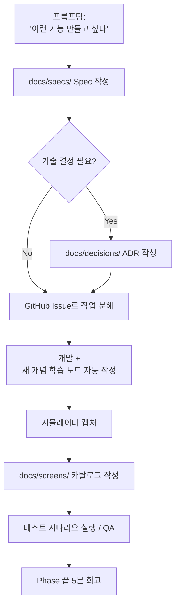

# Trailog — 프로젝트 루트 문서

> **Trailog** = Trail(발자취) + Log(기록)
> 여행 사진 지도 아카이브 모바일 앱
> 학습 + 취미 + 실무 학습 포트폴리오를 위한 사이드 프로젝트

---

## 0. 이 문서의 목적

이 문서는 프로젝트 전체의 **북극성(North Star)** 역할을 한다. 개발 도중 길을 잃거나, 새로운 기능을 추가할지 고민될 때, 또는 "내가 왜 이걸 만들고 있지?" 라는 생각이 들 때 돌아와서 읽는다.

- **언제 업데이트하는가**: 큰 방향 전환이 있을 때만 (예: 스택 변경, 우선순위 재조정). 자잘한 기능 추가는 별도 문서/이슈에서 관리.
- **언제 읽는가**: 매 Phase 시작 전, 그리고 흥미가 떨어졌을 때.

---

## 1. 개발자 컨텍스트

| 항목        | 내용                                                                                         |
| ----------- | -------------------------------------------------------------------------------------------- |
| 학습        | 프론트엔드 2년차                                                                             |
| 현재 소속   | 어쳐브모먼트 / 참조 (HR AI 인재 플랫폼, 데스크탑 기반)                                    |
| 메인 스택   | React, Next.js, TypeScript, NestJS, RDB(Postgres/MySQL), 상태관리(Redux/Zustand/React Query) |
| 다뤄본 영역 | 웹뷰 개발 경험 있음                                                                          |
| 약한 영역   | 인프라 거의 모름                                                                             |
| 가용 시간   | 주 10시간 이상 (제대로 몰입)                                                                 |
| 목표        | 실무 학습 (프론트 개발자 포지션 유지) + 도메인/기술 역량 확장 + 취미                              |

---

## 2. 프로젝트의 진짜 목표

**"기능을 만드는 것이 아니라, 의도적으로 못 다뤄본 기술 영역을 채우는 것."**

도메인(여행 + 사진)은 동기부여용 껍데기이며, 본질적인 목표는 아래 영역의 실전 경험 확보다.

### 학습 목표 (우선순위 순)

1. **인프라 / 배포 / DevOps** — Docker, CI/CD, 클라우드 배포
2. **이미지 / 미디어 처리, 파일 스트리밍** — 사진 앱의 본질 영역
3. **지도 / 데이터 시각화** — 새로운 프론트 영역
4. **실시간 통신** — WebSocket, SSE
5. **성능 최적화 / 캐싱 전략** — Redis 등
6. **(보너스) 모바일 네이티브 + 앱 배포 경험** — React Native, 스토어 출시

이 6개 영역은 모두 "여행 사진 앱"이라는 도메인에 자연스럽게 녹아든다. 억지로 끼워맞춘 것이 아니며, 사진 앱 자체가 이 기술들을 요구한다.

---

## 3. 의사결정 기록 (Decision Log)

논의 과정에서 결정한 핵심 사항들. 흔들릴 때마다 돌아와서 확인한다.

### 결정 1: 도메인 — 여행 + 사진

- **선택**: 지도 기반 여행 사진 아카이브 + 동행자 공유 가능
- **이유**: 본인이 직접 쓸 수 있어 동기 유지에 유리. 학습 목표 6개가 모두 자연스럽게 들어맞음.

### 결정 2: 플랫폼 — 모바일 앱 (React Native + Expo)

- **선택**: Web(Next.js) 대신 **React Native (Expo)**
- **이유**:
  - 사진/여행 도메인은 본질적으로 모바일이 본진 (카메라, 위치, 오프라인, 사용 맥락)
  - 업무에서 데스크탑 웹만 다뤄왔으므로 모바일은 의도적 보강 영역
  - 포트폴리오/학습 차별화 가치 ("RN으로 직접 만든 앱" > "Next.js 사이드 하나 더")
- **트레이드오프 인식**: 첫 셋업 부담, 디버깅 사이클 길어짐, 스토어 배포 시 비용 발생. 감수 가능.

### 결정 3: 백엔드 — NestJS (Spring 채택 안 함)

- **선택**: NestJS 유지
- **이유**:
  - **실무 학습 목표가 프론트엔드 개발자**이므로 Spring을 굳이 사이드에서 배울 필요 없음
  - 학습 토픽에서 "프론트 지원자가 Spring 사이드"보다 "프론트 지원자가 풀스택 + 모바일 + 배포까지 직접"이 더 강한 시그널
  - Spring 어설프게 배워 학습 토픽에서 깊이 못 들어가면 오히려 마이너스
  - 사이드 프로젝트 규모에서는 Nest의 개발 속도, 모노레포 친화성, 실시간 친화성이 압도적으로 유리
- **단, Spring 학습 자체를 부정하지는 않음**: 본 프로젝트 완성 후, 같은 백엔드를 Spring(Kotlin) + JPA로 포팅하는 2차 프로젝트는 가능. 이때 "두 스택 모두 다뤄봤고 차이를 안다"가 강력한 셀링 포인트가 됨.

### 결정 4: 상용화 관점 — "확장 가능하게 설계하되, 처음부터 상용화를 목표로 두지 않음"

- **선택**: 학습 우선, 상용화는 옵션
- **이유**:
  - 처음부터 상용화 목표로 만들면 학습 흐름이 굳어짐
  - 6개월 정도 본인이 직접 써본 후, 진짜 가치 있는지 판단
  - 단, 구조는 처음부터 멀티유저/인증/권한/결제 끼울 자리를 비워두고 설계

### 결정 6: 프로젝트명 — Trailog

- **선택**: Trailog (Trail + Log)
- **이유**:
  - 의미가 도메인과 정확히 일치 (발자취 + 기록)
  - 발음 쉽고 외우기 좋음 ("트레일로그")
  - 앱스토어/구글플레이에 동명 정식 앱 없음
  - `.com`은 매물($2,995)이지만 `.app` 등 다른 TLD는 합리적 가격
- **도메인 잠정**: `trailog.app` 추천 (학습/베타 단계엔 도메인 구매 미뤄도 무방)

### 결정 5: 비용 — 무료 ~ 최소 비용으로 진행

- **개발 단계**: 0원 가능
- **스토어 출시 시점**: 첫해 약 18만원 (Apple $99 + Google $25 + 도메인 약 12,000원)
- **베타 운영 (~100명)**: 월 1만원 이하
- **본격 상용 (~1,000명)**: 월 7~10만원 수준
- **핵심 비용 절감 전략**: Cloudflare R2 사용 (무료 egress) — 사진 앱에서 트래픽 비용 폭발 방지

---

## 4. 기술 스택

### 클라이언트 (모바일)

| 항목       | 선택                                                  |
| ---------- | ----------------------------------------------------- |
| 프레임워크 | React Native (Expo SDK)                               |
| 언어       | TypeScript                                            |
| 상태관리   | Zustand 또는 Redux Toolkit + React Query              |
| 네비게이션 | Expo Router 또는 React Navigation                     |
| 지도       | react-native-maps (Google/Apple Maps) 또는 MapLibre   |
| 이미지     | expo-image, expo-image-picker, expo-image-manipulator |
| 위치       | expo-location                                         |
| 푸시       | Expo Push Notifications                               |
| 빌드/배포  | EAS Build, EAS Submit                                 |

### 서버 (백엔드)

| 항목        | 선택                                     |
| ----------- | ---------------------------------------- |
| 프레임워크  | NestJS                                   |
| 언어        | TypeScript                               |
| ORM         | Prisma 또는 TypeORM                      |
| DB          | PostgreSQL (PostGIS 확장으로 위치 쿼리)  |
| 작업 큐     | BullMQ                                   |
| 캐시        | Redis                                    |
| 이미지 처리 | sharp (썸네일/WebP 변환)                 |
| 실시간      | NestJS Gateway (Socket.io) 또는 SSE      |
| 인증        | JWT + Refresh Token (직접 구현하여 학습) |

### 인프라

| 항목                      | 무료 또는 저비용 선택지                                                |
| ------------------------- | ---------------------------------------------------------------------- |
| 패키지 매니저             | **pnpm 9.9.0** + `.npmrc node-linker=hoisted` (Expo/RN 호환, ADR-0003) |
| 모노레포 빌드 도구        | **Turborepo 2.x** (ADR-0001)                                           |
| 백엔드 호스팅 (Phase 1~3) | **Railway 또는 Fly.io** (PaaS, 빠른 출시. ADR-0004에서 정식 결정 예정) |
| 백엔드 호스팅 (Phase 4+)  | **AWS ECS Fargate** (마이그레이션, ADR-0002 참고)                      |
| DB                        | Supabase 또는 Neon (Postgres 무료 티어). Phase 4에 RDS로 전환 검토     |
| 이미지 저장               | **Cloudflare R2** (10GB 무료, egress 무료) ⭐                          |
| Redis                     | Upstash (무료 티어). Phase 4에 ElastiCache로 전환 검토                 |
| CI/CD                     | GitHub Actions                                                         |
| 모니터링                  | Sentry (무료 티어) + CloudWatch (Phase 4+)                             |
| 도메인                    | Cloudflare Registrar                                                   |
| IaC (Phase 4+)            | Terraform (선택, 참조 패턴 모방 학습)                                  |

### 인프라 배포 전략 (하이브리드, ADR-0002)

본 프로젝트는 **단계별 인프라 전환**을 채택. 자세한 사유와 트레이드오프는 [ADR-0002](./decisions/0002-hybrid-infra-paas-then-aws-ecs.md) 참고.

- **Phase 1~3**: PaaS (Railway 또는 Fly.io) — 본진(이미지 파이프라인/지도/모바일) 학습 가속, 빠른 출시
- **Phase 4**: AWS ECS Fargate로 마이그레이션 — 실무 표준 인프라 경험, 실무 환경(어쳐브모먼트)과 동일 스택
- **Phase 5+**: AWS 위에서 운영 안정화, 실시간/캐싱/AI 추가

#### 왜 하이브리드인가

1. **시간 분배**: Phase 1~3 = PaaS로 본진 가속. Phase 4 = 인프라 한 번에 본격 학습.
2. **실무 학습 시그널**: AWS ECS·Terraform·ECR·CloudWatch 직접 운영 경험 확보. 백엔드/인프라 직군 채용에 강한 시그널.
3. **실무 학습 직결**: 실무 환경가 ECS Fargate 운영 중 → 사이드 학습이 참조 코드 이해·동료 대화에 직접 활용.
4. **마이그레이션 스토리**: "PaaS로 빠르게 출시 → AWS로 옮긴 경험" = 학습 토픽에서 강력한 토픽.

#### 비용 통제

| 시점                    | 인프라                                    | 월 비용 (추정) |
| ----------------------- | ----------------------------------------- | -------------- |
| Phase 1~3               | PaaS 무료/저티어                          | $0~10          |
| Phase 4 마이그레이션 후 | AWS ECS Fargate 최소 사양 + RDS Single-AZ | $30~50         |
| Phase 5+                | 트래픽에 따라 조정                        | $30~80         |

- **CloudWatch Billing Alarm 필수** (Phase 4 진입 즉시 셋업)
- AWS 무료 티어 1년 활용 가능 (신규 계정 시)
- 보조 학습: 사내 AWS read-only 권한 요청 + LocalStack (로컬에서 AWS API 흉내)

---

## 5. 운영 방식 — 1인 풀팀 + 문서 자동화

### 5.1 1인 풀팀 운영

실무 환경에 기획자/디자이너/QA가 없는 상황을 사이드에서도 동일하게 가져간다. 단순 코딩 연습이 아니라 **풀팀 책임을 본인이 메우는 근육**을 키운다.

| 역할   | 산출물                                         | 깊이                             | 비고                                        |
| ------ | ---------------------------------------------- | -------------------------------- | ------------------------------------------- |
| 기획   | Spec/PRD 문서 (`docs/specs/`)                  | 1~2페이지, 매 기능마다 필수      | 사용자 스토리 + 수용 기준 + 비범위          |
| 디자인 | 화면 카탈로그 (`docs/screens/`)                | 와이어프레임 X, 실제 캡처 + 정책 | 본인 시간 투자 최소화                       |
| QA     | Spec 내 테스트 시나리오 + 핵심 흐름 E2E 자동화 | 시나리오 기반, 단위테스트 강박 X | "사용자 시나리오가 깨지면 알아챌 것"이 목표 |

### 5.2 문서 자동화 원칙

본인은 **문서를 직접 쓰지 않는다**. 모든 문서는 Claude와의 프롬프팅을 통해 자동으로 생성·갱신된다.

| 단계        | 본인이 하는 일                           | Claude가 하는 일                                     |
| ----------- | ---------------------------------------- | ---------------------------------------------------- |
| 기획        | "이런 기능 만들고 싶다" 프롬프팅         | Spec/PRD 마크다운 작성                               |
| 기술 결정   | 선택지 검토 + 최종 결정                  | ADR 작성                                             |
| 개발        | 실제 코드 작성                           | 새 개념 등장 시 학습 노트 자동 제안·작성             |
| 디자인 정리 | 시뮬레이터 캡처 → `docs/screens/images/` | 화면 카탈로그 작성 (Mermaid 유저 플로우 + 정책 정리) |
| QA          | 테스트 실행 + 결과 피드백                | 테스트 시나리오 작성, 회귀 체크리스트                |

**왜 Figma 와이어프레임 대신 캡처 카탈로그인가**

- Figma 무료 플랜의 MCP 한계 (월 6회 호출) — 자동화 사실상 불가능
- 와이어프레임은 디자이너 없는 환경에선 시간 대비 가치가 낮음
- 실제 화면이 그대로 디자인 도큐먼트가 되므로 sync 깨질 일이 없음
- GitHub 마크다운 + Mermaid로 충분한 시각화·플로우 표현 가능
- Figma 자체 학습은 유료 계정으로 별도로 익히는 게 효율적

### 5.3 문서 폴더 구조

```
docs/
├── PROJECT_ROOT.md          # 이 문서 (북극성)
├── specs/                   # 기획 PRD (Claude 작성)
├── decisions/               # ADR (Claude 작성)
├── learnings/               # 학습 노트 (Claude 작성)
├── screens/                 # 화면 카탈로그 + 캡처
│   └── images/              # 시뮬레이터 캡처
└── templates/               # 빈 템플릿 (spec/adr/learning-note/screen-catalog)
```

### 5.4 기능 단위 워크플로 사이클



본인은 **A, G, I, J**만 직접 수행. 나머지(B, D, F의 노트, H)는 모두 Claude가 작성한다.

### 5.5 외부 도구

| 도구            | 용도                                       | 비고                              |
| --------------- | ------------------------------------------ | --------------------------------- |
| GitHub Issues   | 작업 단위 트래킹                           | Spec 링크 + 작업 체크리스트       |
| GitHub Projects | 칸반 보드 (진행 시각화)                    | Phase 진행 한눈에 확인용          |
| Mermaid         | 유저 플로우 / 시퀀스 / 아키텍처 다이어그램 | 마크다운 안에서 자동 렌더링       |
| Figma (선택)    | 포트폴리오용 핵심 화면 정리만 가끔         | 일상 워크플로에서는 사용하지 않음 |

---

## 6. 단계별 로드맵

**전체 예상 기간**: 약 4~6개월 (주 10시간 기준)

> **진행 원칙 (2026-05-21 확정)**: **인프라 먼저**. 기능을 짓기 전에 "내 코드가 클라우드에서 돌아가는 상태"를 먼저 만든다. 이유: 1) 학습 우선순위 1번이 인프라/배포이고, 2) 배포 환경을 먼저 세워두면 이후 모든 기능이 "로컬→배포" 사이클을 자연스럽게 반복하게 됨.

### Phase 1: 기초 셋업 + 조기 배포 (1.5~2주)

**학습 영역: 인프라 / 배포 / DevOps (1차)**

- Expo + NestJS 모노레포 셋업 (Turborepo 또는 Nx)
- 로컬 Docker Compose (Nest + Postgres + Redis)
- 기본 폴더 구조 + 린팅/포매팅 + 커밋 컨벤션
- GitHub 저장소 생성, README 작성
- **GitHub Actions 기본 CI 파이프라인** (lint + build + test 단계만이라도)
- **Hello-World 수준의 백엔드를 Railway/Fly.io에 실배포** (`/health` 엔드포인트만 있어도 OK)
- **환경변수/시크릿 관리** 1차 정리 (로컬 `.env` ↔ 클라우드 시크릿)
- EAS Build로 빈 RN 앱 빌드해서 본인 폰에 한 번 설치까지

**산출물**: 로컬에서 `docker compose up` 한 번에 전체가 돌고, `main` 푸시하면 자동으로 클라우드에 배포되며, 빈 앱이 본인 폰에 깔려 있는 상태.

### Phase 2: 핵심 도메인 + 이미지 파이프라인 (3~4주)

**학습 영역: 이미지 처리, 파일 스트리밍, DB 모델링**

- DB 스키마: User, Trip, Photo (위경도, 촬영일, EXIF JSON)
- JWT 기반 인증 (직접 구현)
- 사진 업로드: **presigned URL** 방식으로 클라이언트 → R2 직접 업로드
- 백그라운드 워커 (BullMQ + Redis): EXIF 추출, 썸네일 3종 생성, WebP 변환
- 업로드 진행률 표시 (SSE)
- RN 측: 카메라/갤러리 선택, 업로드 UI

**산출물**: 사진을 찍거나 갤러리에서 골라 업로드하면, 자동으로 메타데이터 추출되고 썸네일이 생기는 파이프라인.

### Phase 3: 지도 + 시각화 (3~4주)

**학습 영역: 지도, 데이터 시각화**

- 지도에 사진 핀 표시
- 줌 레벨에 따른 클러스터링 (supercluster)
- 여행(Trip) 단위로 묶기, 시간순 polyline 루트 표시
- 타임라인 슬라이더로 시간대별 필터링
- 사진 상세 뷰, 갤러리 인터랙션

**산출물**: 지도 위에서 본인이 다녀온 여행이 핀과 루트로 한눈에 보임.

### Phase 4: 운영 강화 + AWS ECS 마이그레이션 (4~6주)

**학습 영역: 인프라 / DevOps (2차 — 운영 관점 + AWS 실무 스택)**

> Phase 1에서 PaaS로 기본 배포 완료. Phase 4에서는 운영 안정화 + **AWS ECS Fargate로 마이그레이션** ([ADR-0002](./decisions/0002-hybrid-infra-paas-then-aws-ecs.md)).

#### 4-1. 운영 안정화 (PaaS 또는 ECS 어느 쪽에서도 필요)

- CI/CD 파이프라인 고도화 (preview 환경, 마이그레이션 자동화, rollback 전략)
- 도메인 연결, HTTPS, 커스텀 도메인 정리
- **Sentry 연동** (백엔드 + 모바일 양쪽 에러 추적)
- 구조화 로깅 + 로그 집계
- 헬스체크, 알람 (Uptime monitoring)
- EAS Build/Submit로 **TestFlight + Google Play 내부 테스트 트랙** 업로드 1회 경험
- 비용 모니터링 셋업 (R2, DB, 호스팅 비용 확인 루틴)

#### 4-2. AWS ECS Fargate 마이그레이션 (ADR-0002)

선후행 작업:

- [ ] AWS 계정 셋업 + IAM 사용자/역할 + **CloudWatch Billing Alarm 최우선 설정**
- [ ] 백엔드 production용 **Dockerfile** 작성 (multi-stage build, 최소 이미지)
- [ ] **ECR repo** 생성 + 이미지 push (GitHub Actions 자동화)
- [ ] **VPC 셋업** (간소화: 단일 AZ + Public subnet, 비용 ↓)
- [ ] **ECS Cluster** + **Task Definition** + **Service** (Fargate, 0.25 vCPU/0.5GB부터)
- [ ] **ALB** + Target Group + **Route 53** + **ACM 인증서**
- [ ] **CloudWatch Log Group** 연결, 구조화 로그 전송
- [ ] (선택) **Terraform IaC**로 위 모든 리소스 코드화 (참조 패턴 모방 학습)
- [ ] 트래픽 컷오버 (PaaS → ECS) + 모니터링
- [ ] ADR-0004 마이그레이션 후일담 작성 (트러블슈팅·비용 실측·학습 정리)

**산출물**:

- PaaS → AWS ECS Fargate로 운영 환경 이전 완료
- Sentry로 장애 모니터링, IaC로 인프라 관리
- 실무 환경(어쳐브모먼트)과 동일 스택 경험 확보 → 참조 코드 읽기·동료 대화 가속
- "마이그레이션 했던 이유" 학습 토픽 스토리 확보

### Phase 5: 실시간 + 캐싱 (3~4주)

**학습 영역: 실시간 통신, 캐싱 전략**

- 실시간 시나리오 미확정 (논의 사항):
  - **옵션 A**: 동행자 공유 모드 (같은 Trip의 새 사진 실시간 push, presence)
  - **옵션 B**: SSE로 백그라운드 작업 진행률만 (더 자연스러움)
  - **옵션 C**: 멀티 디바이스 동기화
- Redis 캐싱: 지도 영역별 사진 조회, 인기 여행
- Cache invalidation 전략 (사진 업로드 시 무효화)
- 푸시 알림 (Expo Push)

**산출물**: 동행자가 사진 올리면 실시간 반영, 또는 멀티 디바이스 동기화.

### Phase 6 (선택): AI 통합 또는 SNS 확장

- **옵션 A — AI 통합**:
  - 오픈소스 CLIP으로 사진 임베딩 생성 (비용 거의 0)
  - pgvector로 벡터 검색
  - 자연어 검색 ("바다 보이는 카페에서 찍은 사진")
- **옵션 B — SNS 확장**:
  - 공개 여행 둘러보기, 팔로우, 좋아요
- **옵션 C — 상용화 준비**:
  - RevenueCat으로 인앱 결제
  - 프리미엄 요금제 설계
  - 개인정보 처리방침, 이용약관

---

## 7. 결정 사항 (구 Open Questions)

2026-05-21 기준 6개 모두 결정. 일부는 특정 시점에 재확인 예약.

| 번호 | 사안                                              | 결정 (2026-05-21)                 | 비고                                                      |
| ---- | ------------------------------------------------- | --------------------------------- | --------------------------------------------------------- |
| Q1   | Phase 1~2 순서 — 인프라 먼저 vs 기능 먼저 vs 절충 | ✅ **인프라 먼저** (확정)         | Phase 1에 조기 배포까지 포함하도록 로드맵 재구성          |
| Q2   | 실시간 통신 시나리오                              | ⏳ **Phase 5 진입 시점에 재논의** | 기능 구현 진행 후 옵션 A/B/C 선택. 지금 미리 정하지 않음. |
| Q3   | 학습 범위 — 6개 모두 vs 3개로 축소 vs MVP 후 확장 | ✅ **6개 영역 전부** (확정)       | Phase 3 종료 시점에 부담 재확인은 유지                    |
| Q4   | AI 기능 포함 여부                                 | ⏳ **Phase 6 진입 시점에 재확인** | 상용화 판단과 함께 결정                                   |
| Q5   | iOS 우선 vs Android 우선 vs 동시                  | ✅ **iOS + Android 동시** (확정)  | Expo로 동시 개발. 테스트 디바이스 양쪽 확보 필요          |
| Q6   | 인증 — NextAuth/Auth0 vs JWT 직접 구현            | ✅ **JWT 직접 구현** (확정)       | 학습 목적 + RN 환경 적합성                                |

---

## 8. 안티 패턴 — 하지 말아야 할 것

사이드 프로젝트 실패의 흔한 원인. 의식적으로 피한다.

1. **새 언어/프레임워크 욕심**: Spring, Flutter, Go 등 호기심으로 추가 X. 학습 영역 6개로도 충분히 많다.
2. **완벽한 디자인 시스템 만들기**: 디자인은 최소한으로. 기본 컴포넌트로 동작 위주.
3. **처음부터 마이크로서비스**: 모놀리스로 시작. 분리는 필요해질 때.
4. **테스트 100% 커버리지**: 핵심 로직만 테스트. 시간 낭비 X.
5. **유저 0명일 때 스케일 걱정**: 최적화는 측정 후. Phase 5 전엔 캐싱조차 미루기.
6. **포기하지 말 것의 함정**: 3개월 해보고 정말 안 맞으면 갈아엎거나 접는 것도 옵션. 침몰 비용 함정에 빠지지 말 것.

---

## 9. 성공 기준

이 프로젝트는 어떤 상태가 되었을 때 "성공"인가?

### 최소 성공 (Must)

- 본인 폰에 깔고 실제 여행 가서 1번 이상 사용
- 학습 영역 6개 중 4개 이상 실전 경험 확보
- GitHub에 정리된 코드 + 작성된 README

### 중간 성공 (Should)

- 학습 영역 6개 모두 경험
- 지인 베타 5명 이상 사용
- 기술 블로그 글 3편 이상 작성 (인프라, 이미지 파이프라인, 실시간 등)
- 실무 학습 학습 토픽에서 이 프로젝트로 30분 이상 깊이 있게 대화 가능

### 추가 성공 (Could)

- 스토어 정식 출시
- 유료 사용자 발생
- 또는 같은 백엔드를 Spring(Kotlin)으로 포팅하여 비교 글 작성

---

## 10. 실무 학습 어필 포인트 (예상)

학습 토픽에서 이 프로젝트로 무엇을 말할 수 있는가? (지속 업데이트)

- **풀스택 + 모바일 + 인프라까지 직접 운영**: 프론트 2년차 중 보기 드문 폭
- **이미지 파이프라인 직접 설계 및 구현**: presigned URL, 백그라운드 처리, 썸네일/포맷 변환
- **실시간 시스템 설계**: 단순 채팅이 아닌, 이벤트 기반 동기화
- **캐시 무효화 전략**: 실무에서 어려운 문제를 작은 스케일로 경험
- **클라우드 비용 최적화 의사결정**: S3 대신 R2 선택 등 실용적 판단
- **(가능 시) AI 통합**: 오픈소스 모델 직접 운용 경험

---

## 11. 문서 변경 이력

| 날짜       | 변경 내용                                                                                                                                                                                                                                                                                                                                                                                                                                                                                                 |
| ---------- | --------------------------------------------------------------------------------------------------------------------------------------------------------------------------------------------------------------------------------------------------------------------------------------------------------------------------------------------------------------------------------------------------------------------------------------------------------------------------------------------------------- |
| 2026-05-21 | 최초 작성 (Claude와의 논의를 기반으로 정리)                                                                                                                                                                                                                                                                                                                                                                                                                                                               |
| 2026-05-21 | Open Questions 6건 일괄 결정 (Q1 인프라 먼저 / Q3 6영역 전체 / Q5 iOS+Android 동시 / Q6 JWT 직접 / Q2·Q4는 해당 Phase에 재논의). Phase 1·4 로드맵을 "인프라 먼저"에 맞춰 재구성.                                                                                                                                                                                                                                                                                                                          |
| 2026-05-22 | Section 5 "운영 방식 (1인 풀팀 + 문서 자동화)" 신규 추가. 와이어프레임 폐기 → 개발 후 화면 캡처 카탈로그 방식 채택. 모든 문서를 Claude가 작성, 본인은 프롬프팅·리뷰만 수행하는 워크플로 확정. 기존 5~10장을 6~11장으로 번호 이동.                                                                                                                                                                                                                                                                         |
| 2026-05-24 | 인프라 배포 전략 변경 ([ADR-0002](./decisions/0002-hybrid-infra-paas-then-aws-ecs.md)): PaaS 전체 운영 → **하이브리드** (Phase 1~3 PaaS, Phase 4에 AWS ECS Fargate 마이그레이션). 사유: 본인 우려 "보편적 스택 학습 필요" 반영, 회사(어쳐브모먼트) 환경과 일치, 마이그레이션 스토리 자체가 강한 학습. 4장 인프라 표/AWS 학습 전략 + 6장 Phase 4 로드맵 갱신.                                                                                                                                              |
| 2026-05-24 | 패키지 매니저 재검토 후 **pnpm 유지** 확정 ([ADR-0003](./decisions/0003-package-manager-pnpm-keep.md)). npm/Yarn Berry 실제 마이그레이션 두 번 시도(npm: 동작 OK이나 모노레포 기능 약함, Yarn Berry: Expo SDK 56 quarantine 이슈로 실패) 후, 본인 학습 영역 6개에 패키지 매니저가 없는 점 + 본진 시간 우선 원칙으로 pnpm + `.npmrc node-linker=hoisted` 트릭 유지. 패키지 매니저는 나중에 바꾸기 비교적 쉬워 첫 결정에 100% 무게 X. 4장 인프라 표에 패키지 매니저 명시. PaaS 도구 결정은 ADR-0004로 미룸. |
