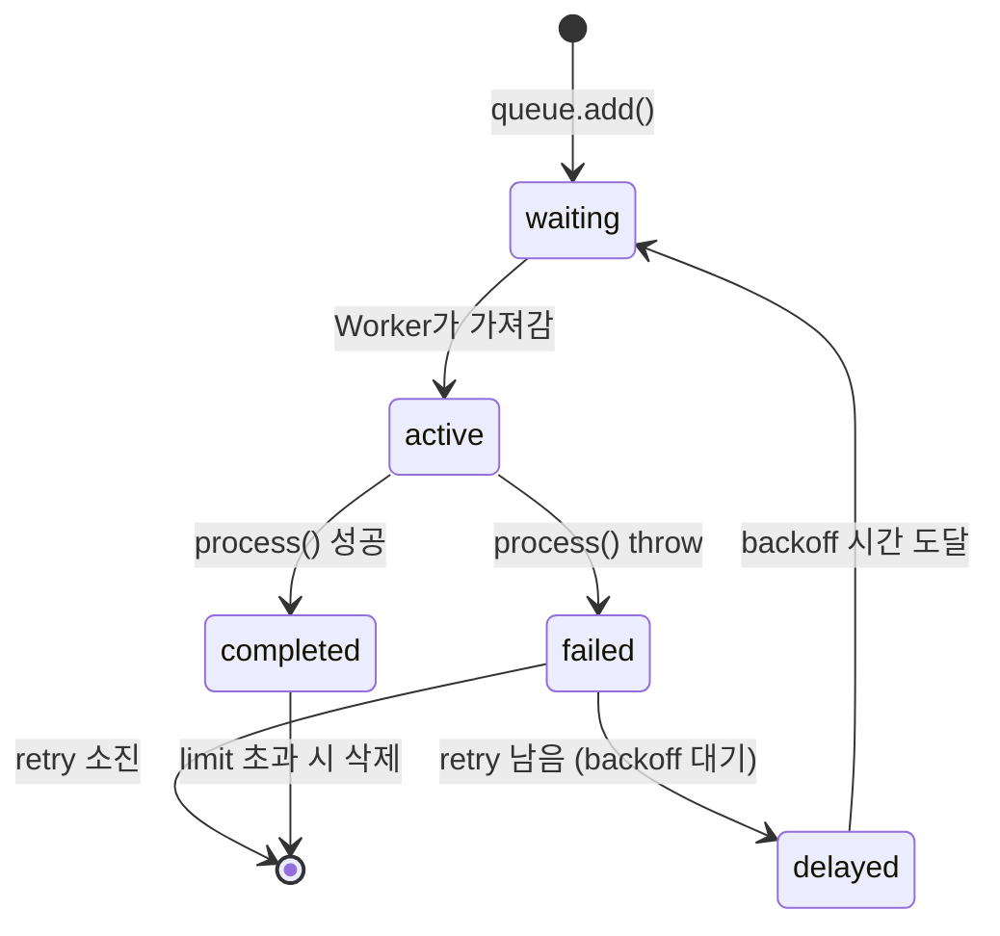
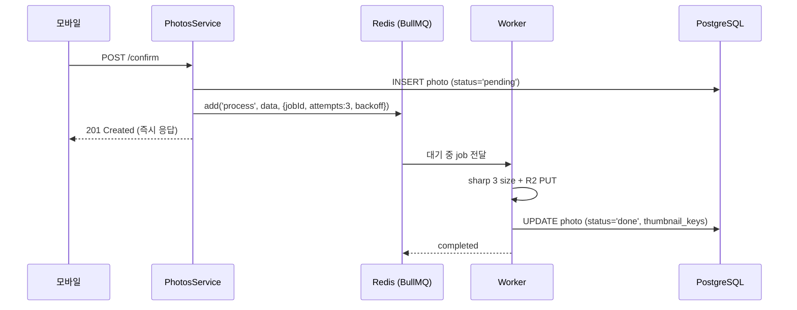

# BullMQ + Redis 백그라운드 큐

> **작성일**: 2026-06-01
> **작성**: Claude (프롬프팅: @sikkzz)
> **학습 영역**: #5 성능 최적화/캐싱 (Redis 활용) + 백그라운드 작업 패턴 (PROJECT_ROOT 2장)
> **관련 문서**: [Phase 2 Spec 4.4](../specs/phase-02-core-features.md), [sharp 이미지 처리](sharp-image-processing.md), [R2 Presigned URL 기초](r2-presigned-url-basics.md)

---

## 한 줄 요약

**BullMQ** = Redis를 백엔드로 쓰는 Node.js 분산 큐. HTTP 요청에서 "느린 작업" (사진 변환, 이메일 발송, EXIF 추출)을 떼어내 **백그라운드 워커**에 넘김. **Producer (queue.add)** → **Redis (영속)** → **Worker (process)** 패턴. Retry / 멱등성 / lifecycle event 다 무료.

## 우리 프로젝트에서 어디에 쓰이는가

- **Phase 2 4.4 사진 처리**: 모바일 confirm 호출 시 백엔드가 photo row 저장 + BullMQ에 `process` job enqueue. Worker가 R2 GET → sharp 3 size WebP → R2 PUT → DB `processing_status='done'`. 모바일은 즉시 응답 받음 (변환 끝 대기 X).
- **Phase 2 4.5 EXIF 추출**: 같은 worker 안에서 (`process` job 안에) EXIF metadata 추출 → DB `takenAt`/`location` 업데이트
- **Phase 후속 확장 후보** (메모리 `bullmq-domain-vs-root-revisit`):
  - 이메일 발송 (회원가입 환영, 비밀번호 reset)
  - 알림/푸시
  - 정기 정리 cron (orphan 사진, 만료 token cleanup)

## 어떻게 동작하는가

### 왜 큐가 필요한가 — 동기 vs 비동기

```
[동기 방식]
모바일 → confirm → 백엔드 → R2 GET (200ms) → sharp 3 size (600ms) → R2 PUT × 3 (600ms) → 응답
↑ 모바일이 1.4초 대기 + 변환 실패하면 confirm 자체 실패 (사진은 R2에 있는데)

[비동기 방식 — BullMQ]
모바일 → confirm → 백엔드 → DB 저장 + 큐 enqueue → 응답 (50ms)
                                       │
                                       └→ Worker가 background에서 변환 (실패해도 모바일 영향 X)
```

**큐의 가치**: 응답 시간 ↓ + 실패 격리 + retry 가능 + worker 별도 확장 가능 (CPU heavy 작업을 다른 컨테이너로).

### Redis는 단순 자료구조 db — 그게 왜 큐로 적합한가

Redis는 메모리 기반 + 단일 스레드 + 풍부한 자료구조 (list, sorted set, hash, set). BullMQ는 이걸 영리하게 조합해 큐를 구현:

```
bull:photo-processing:waiting      list (LPUSH/RPOP)  — 대기 중 job ID
bull:photo-processing:active       list               — 처리 중 job ID
bull:photo-processing:delayed      sorted set         — 시간 후 실행 (retry용, score=timestamp)
bull:photo-processing:completed    sorted set         — 완료 (기본 1000개 limit)
bull:photo-processing:failed       sorted set         — 실패
bull:photo-processing:{jobId}      hash               — payload + state + attempts 등
```

**원자성 보장**: BullMQ는 모든 상태 전이를 **Lua script로 작성**해 Redis가 단일 명령으로 실행 → race condition X (worker 여러 개 같은 job 처리 X).

### Job lifecycle



### Trailog 사용 흐름 (실제 코드)

**Producer — `PhotosService.confirmPhotoUpload`**:

```typescript
await this.photoProcessingQueue.add(
  'process',
  { photoId, userId, momentId, originalKey },
  {
    jobId: photoId, // 멱등성 — 같은 photoId 두 번 enqueue 시 무시
    attempts: 3, // retry 3회
    backoff: { type: 'exponential', delay: 5000 }, // 5s, 10s, 20s
  },
);
```

**Worker — `PhotoProcessingProcessor`**:

```typescript
@Processor(PHOTO_PROCESSING_QUEUE)
export class PhotoProcessingProcessor extends WorkerHost {
  async process(job: Job<PhotoProcessingJobData>) {
    // 1. R2 GET → sharp 3 size → R2 PUT
    // 2. photoRepo.update({thumbnailKeys, processingStatus: 'done'})
  }

  @OnWorkerEvent('failed')
  async onFailed(job: Job) {
    if (job.attemptsMade >= job.opts.attempts) {
      // 최종 실패 시 DB 'failed' 마킹
    }
  }
}
```



## 핵심 개념

### Queue (Producer) vs Worker (Consumer)

| 컴포넌트   | 역할                   | NestJS API                                                            |
| ---------- | ---------------------- | --------------------------------------------------------------------- |
| **Queue**  | Job 추가 (Producer 측) | `@InjectQueue(NAME)` → `queue.add(name, data, opts)`                  |
| **Worker** | Job 처리 (Consumer 측) | `@Processor(NAME)` + `extends WorkerHost` + `process(job)`            |
| **Job**    | 큐에 들어간 작업 1개   | `Job<TData, TResult>` — data + opts + attempts + failedReason 등 메타 |

같은 프로세스 안에서 둘 다 가능 (Trailog 현재) — 백엔드 인스턴스가 producer + worker 동시. 미래 worker 별도 컨테이너 분리 가능 (NestJS app을 worker-only로 부팅).

### Job ID 멱등성

`opts.jobId` 명시 → 같은 ID로 두 번 `add` 호출되면 **두 번째는 무시**. 중복 enqueue 방지.

Trailog는 `jobId: photoId` (UUID v4 백엔드 생성) — confirm API 재시도해도 같은 photo는 큐에 한 번만:

```
1차 confirm → photoId=abc-123 → 큐에 enqueue ✅
모바일 timeout으로 재시도 → photoId=abc-123 → 큐가 이미 있음 → 무시 (멱등)
```

`jobId` 미지정 시 BullMQ가 자동 증가 ID 발급 → 중복 enqueue 가능.

### Retry + Exponential Backoff

- `attempts: 3` → 최초 1회 + retry 2회 = 총 3회 시도
- `backoff: { type: 'exponential', delay: 5000 }` → 5s → 10s → 20s (2배수 증가)
- `linear`도 가능 (5s → 5s → 5s)

**왜 exponential**: 일시 장애 (R2 throttle, Redis 순간 disconnect)는 잠깐 후 회복 가능성 ↑. 첫 retry는 빠르게, 그래도 안 되면 시스템에 시간 줌. 너무 빨리 재시도하면 같은 장애에 다시 부딪힘.

**dlq (dead letter queue)**: BullMQ에는 별도 dlq 개념 없음. `failed` 상태로 영구 보존 → 모니터링/수동 재처리. Trailog는 `processing_status='failed'` 컬럼이 사실상 dlq 역할.

### Concurrency

기본 worker 1개당 동시 job 1개 처리 (sequential). 늘리려면:

```typescript
@Processor(PHOTO_PROCESSING_QUEUE, { concurrency: 4 })
```

**Trailog는 default 1** — sharp가 CPU bound + 한 job이 메모리 100MB 쓰는데 4 parallel = 400MB → Fly.io 256MB VM 즉사. 운영 후 측정해서 결정 ([thumbnail-sizes-revisit 메모리]).

### Lifecycle Events

`@OnWorkerEvent` 데코레이터로 worker 안에서 listen:

```typescript
@OnWorkerEvent('completed') onCompleted(job) { ... }
@OnWorkerEvent('failed')    onFailed(job) { ... }
@OnWorkerEvent('progress')  onProgress(job, progress) { ... }
@OnWorkerEvent('active')    onActive(job) { ... }
```

**Trailog는 `failed`만 listen** — 최종 실패 시 DB `failed` 마킹. `completed`는 `process()`가 return 직전에 직접 update하므로 별도 listen 불필요.

**중요**: `failed` 이벤트는 **매 실패 시도마다 호출** (retry 중간 포함). 최종 실패 판단은 `job.attemptsMade >= job.opts.attempts`로 직접 비교 필요.

### 큐 이름 = Redis namespace

`PHOTO_PROCESSING_QUEUE = 'photo-processing'` → Redis 모든 key가 `bull:photo-processing:*`. 다른 도메인이 BullMQ 도입해도 namespace 충돌 X. 큐 이름은 상수로 분리 (오타 방지 + IDE 자동완성).

## 참조 패턴 비교

- **외부 NestJS 코드베이스 참고**: BullMQ를 **도메인 모듈 안에 `BullModule.forRootAsync` + `registerQueue`** 둠 (사용처가 단일 도메인일 때). AppModule에 두지 않음.
- **Trailog 채택**: 참조 패턴 일관 (`PhotosModule`에 둠). 사유: 현재 BullMQ 사용 도메인이 Photos 단일 — 모듈 응집도 ↑ + 다른 모듈에 BullModule 누수 X.
- **재검토 트리거** (메모리 `bullmq-domain-vs-root-revisit`): Phase 3+ 이메일/알림/cron 등 **사용 도메인 2개 이상** 되는 시점 → 공통 `BullInfraModule` 또는 `AppModule.forRootAsync` 분리 검토.

## 왜 BullMQ인가 — 대안 비교

| 라이브러리 | 기반        | 특징                                                                    |
| ---------- | ----------- | ----------------------------------------------------------------------- |
| **BullMQ** | Redis       | Node 표준 (사실상) + TS first + NestJS 통합 모듈 + 활발히 유지보수      |
| Bull (1.x) | Redis       | BullMQ의 전 세대. 신규 프로젝트는 BullMQ 권장 (작성자가 직접 후속 작성) |
| Bee-queue  | Redis       | 작고 빠름 (BullMQ보다 throughput ↑) — 기능 적음, retry/delayed 제한     |
| Agenda     | MongoDB     | Mongo 쓰는 프로젝트에 자연. Redis 없을 때                               |
| RabbitMQ   | AMQP 브로커 | 멀티 서비스 분산 (마이크로서비스), routing/fan-out 복잡 패턴            |
| AWS SQS    | 관리형      | 운영 부담 ↓, lock-in. 1초 단위 polling 비용                             |
| Sidekiq    | Ruby        | (참고만)                                                                |

**Trailog는 BullMQ 채택** — 이미 Redis 캐시 후속 도입 예정 + NestJS 공식 모듈 + 참조 패턴 일관.

## 흔한 함정

1. **`jobId` 누락 → 중복 enqueue** — confirm 재시도 시 같은 사진 변환 N번. 항상 멱등 ID 명시.
2. **`failed` 이벤트 = 최종 실패 X** — 매 시도마다 호출됨. `attemptsMade >= attempts` 직접 비교해야 true 최종 실패.
3. **Worker가 process() 중 throw → retry 시 같은 job 다시** — process()는 **idempotent** 작성 필수. R2 PUT은 같은 key에 다시 PUT 안전 (덮어씀) → idempotent. DB update도 멱등 (`UPDATE WHERE id=`).
4. **Redis 끊김 → BullMQ 자동 reconnect** — ioredis가 자동 재연결. 단 중간 active 상태 job은 worker가 stalled 처리 후 다시 active로.
5. **Concurrency를 함부로 늘림** — CPU bound 작업은 메모리/CPU 한계 우선 (위 sharp 노트 참조).
6. **`@OnWorkerEvent`는 같은 worker 인스턴스에서만 수신** — 분산 worker 환경에서 모든 worker가 이벤트 듣고 싶으면 `QueueEvents` 별도 사용.
7. **큐 이름을 string literal로 직접 박음** → 오타 시 prod에 도달해야 발견. 상수로 분리 필수.
8. **Job data가 너무 큼** (예: 사진 buffer 자체) → Redis 메모리 ↓ + 직렬화 비용 ↑. **참조만 박고** (R2 key) worker가 다시 fetch.
9. **Long-running job 중 worker 죽음** — Stalled 처리되어 다른 worker가 다시 시도. Sharp는 atomic이라 무방, 외부 API 호출은 idempotent 보장 필요.
10. **`BullModule.forRoot`를 여러 모듈에서 호출** → 같은 Redis 인스턴스에 중복 connection. 단일 위치 (AppModule 또는 공통 InfraModule)로.

## 더 파볼 거리

- **Worker 별도 컨테이너 분리** — 백엔드 인스턴스가 API + worker 동시 하는 게 단순하지만, sharp 같은 CPU heavy 작업은 worker-only 컨테이너로 분리하면 API 응답 latency 안정. Phase 4 운영 진입 시 측정 후 결정.
- **`QueueEvents` (분산 이벤트)** — 여러 worker가 같은 이벤트 listen 가능. Worker 분리 후 필요.
- **Job priority** — `opts.priority` (낮을수록 먼저). 즉시 처리 vs 배치 처리 분리.
- **Rate limiter** — `limiter: { max: 10, duration: 1000 }` — 외부 API throttle 대응 (R2 throttle, SES rate 등).
- **Repeated jobs (cron)** — `opts.repeat: { cron: '0 * * * *' }` — 정기 job. 후속 cleanup 작업 도입 시.
- **Sandboxed processor (별도 process)** — `new Worker(name, '/path/to/processor.js')` — process() 자체를 별도 Node process에서. 메모리 격리 + crash 격리.
- **BullMQ flow** — Job 의존성 그래프 (parent job 완료 후 child job). 복잡한 multi-step workflow에.
- **Bull Board / BullMQ UI** — 큐 상태 GUI 모니터링. Phase 4 운영 진입 시 도입.

## 참고 링크

- [BullMQ 공식 문서](https://docs.bullmq.io/)
- [BullMQ Patterns](https://docs.bullmq.io/patterns/idempotent-jobs)
- [@nestjs/bullmq 모듈](https://docs.nestjs.com/techniques/queues)
- [ioredis (Redis client)](https://github.com/redis/ioredis)
- [Redis 자료구조 docs](https://redis.io/docs/data-types/)

## 추가 학습 기록

> 같은 토픽으로 추가 학습한 내용은 아래에 날짜 헤더로 누적.
