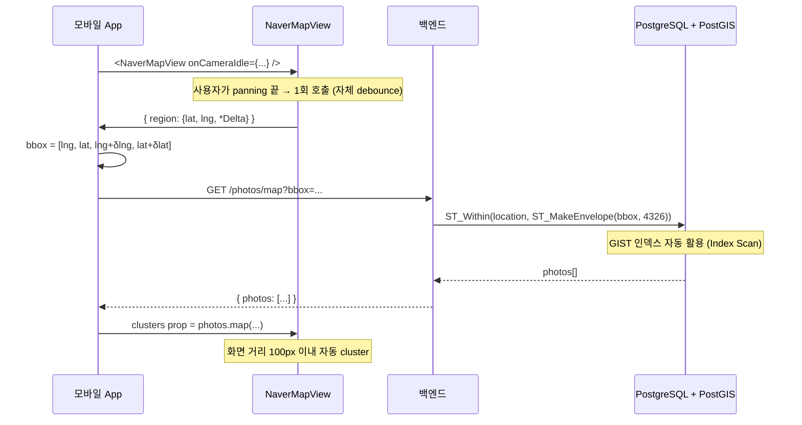

# Cluster 알고리즘 + 공간 쿼리 (지도 데이터 시각화)

> **작성일**: 2026-06-07
> **작성**: Claude (프롬프팅: @sikkzz)
> **학습 영역**: #3 지도 / 데이터 시각화 (PROJECT_ROOT 2장) + 부수 #2 (PostGIS 활용)
> **관련 문서**: [Phase 2 Spec 4.7](../specs/phase-02-core-features.md), [PostGIS 기초](postgis-basics.md), [모바일 지도 lib 비교](mobile-map-libraries-comparison.md)

---

## 한 줄 요약

지도에 marker 수천+개를 그대로 표시하면 **성능 저하 + 시인성 ↓**. **Cluster 알고리즘**으로 가까운 marker를 묶고 줌 인하면 풀리는 방식이 표준. 알고리즘은 grid / DBSCAN / Supercluster 등 — 도메인 + 데이터 크기에 따라 선택. **공간 쿼리(PostGIS bbox)** 와 결합해 viewport 단위로 데이터를 가져오면 N+1 호출 회피 + 클라이언트 cluster 효율 ↑.

## 우리 프로젝트에서 어디에 쓰이는가

- **Phase 2 4.7 D3 백엔드**: `GET /photos/map?bbox=minLng,minLat,maxLng,maxLat` PostGIS `ST_Within` + GIST 인덱스로 viewport 안 사진만 가져옴
- **Phase 2 4.7 D5 클라이언트**: NaverMap 자체 `clusters` prop으로 marker 자동 cluster + leaf tap → photo detail
- **Phase 후속**: 사진 1000+ 시점부터 cluster 효과 ↑. 본인 사진 적은 현재는 시각 효과 ↓이지만 코드 구조는 미리 박혀있음

## 어떻게 동작하는가

### bbox 쿼리 흐름



### Cluster 알고리즘 4종 비교

| 알고리즘                     | 동작                                                | 장점                                              | 단점                                                    |
| ---------------------------- | --------------------------------------------------- | ------------------------------------------------- | ------------------------------------------------------- |
| **Grid**                     | 화면을 격자로 나눠 같은 cell 안 marker 묶음         | 가장 단순, O(n)                                   | 격자 경계에 marker 분산되면 cluster 안 됨 (시각적 한계) |
| **DBSCAN**                   | 밀도 기반 — 일정 거리 안에 N개+ 있으면 cluster      | 노이즈 거름, 시각 자연                            | O(n²) 또는 인덱스 필요 (R-tree 등), 큰 데이터엔 느림    |
| **Supercluster (Mapbox)**    | KD-tree + 줌 레벨별 사전 계산                       | 1M+ marker도 60fps, 줌 변화 빠름                  | 메모리 사전 계산 — 데이터 변경 시 재계산                |
| **NaverMap `clusters` prop** | 내부 native 구현 (Grid + screen distance 기반 추정) | RN/native bridge 없이 직접 native에서 처리 → 빠름 | 알고리즘 detail 미공개, 외부 lib 대비 커스터마이징 ↓    |

### Trailog 선택 — NaverMap 자체 `clusters` props

```typescript
<NaverMapView
  clusters={[
    {
      markers: photos.map((p) => ({
        identifier: p.id,         // tap 콜백에서 식별
        latitude: p.location.latitude,
        longitude: p.location.longitude,
        image: { symbol: 'red' },
        width: 28,
        height: 36,
      })),
      screenDistance: 100,   // 화면상 100px 이내 marker 묶음
      minZoom: 0,            // zoom 0~16에서 cluster 적용
      maxZoom: 16,           // 17+에서 풀려서 단일 marker
      animate: true,         // 줌 변화 시 cluster 펼침/합침 애니메이션
    },
  ]}
  onTapClusterLeaf={({ markerIdentifier }) => {
    const photo = photos.find((p) => p.id === markerIdentifier);
    router.push(`/photos/${photo.id}?momentId=${photo.momentId}`);
  }}
/>
```

### PostGIS bbox 쿼리 — `ST_Within` + `ST_MakeEnvelope`

```typescript
// apps/server/src/photos/photos.service.ts
.where('p.userId = :userId', { userId })
.andWhere('p.processingStatus = :status', { status: 'done' })
.andWhere(
  `ST_Within(p.location, ST_MakeEnvelope(:minLng, :minLat, :maxLng, :maxLat, 4326))`,
  { minLng, minLat, maxLng, maxLat },
)
.orderBy('p.takenAt', 'DESC')
```

```sql
EXPLAIN ANALYZE
SELECT id FROM photos
WHERE processing_status = 'done'
  AND ST_Within(location, ST_MakeEnvelope(125, 33, 132, 39, 4326));

--                                    QUERY PLAN
-- Index Scan using "IDX_..._location" on photos  (cost=0.13..20.65 rows=1)
--   Index Cond: (location @ '01...'::geometry)
--   Filter: ((processing_status = 'done') AND st_within(...))
-- Planning Time: 29.760 ms
-- Execution Time: 4.568 ms
```

→ **`@`** 연산자 = bounding box 후보 추출 (GIST 인덱스). 후보들에 대해서만 정확한 `ST_Within` 검증 → O(log n).

## 핵심 개념

### GIST 인덱스가 왜 빠른가

- B-tree는 1차원 순서 (1, 2, 3) 기반 — 2D 좌표엔 무력
- GIST는 R-tree 변종 — **2D bounding box 계층** 구조
- 한 노드가 자식 noden들의 bbox를 모두 포함 → 검색 시 영역 안 들어오는 자식만 탐색
- 100만 row → log₂(1M) ≈ 20 노드만 비교 → O(log n)

### viewport 단위 fetch — N+1 회피

- 전체 사진 한 번에 fetch → 데이터 양 ↑ + 메모리 ↑
- viewport bbox 변경할 때만 fetch → 필요한 만큼만 + cache 활용 (React Query `keepPreviousData`)
- 단 viewport 빈번 변경 시 부담 — `onCameraIdle` 자체 debounce로 완화

### Cluster 줌 레벨 정책

- `minZoom: 0` → 가장 멀리서 시작 (전국 view에서도 cluster)
- `maxZoom: 16` → 도심 한 블록 단위에서 풀림 — 사진 위치 분간 가능
- `screenDistance: 100px` → 화면상 100px 이내면 cluster — 손가락 hit area 친화
- 사진 1000+ 시점에 minZoom/maxZoom 조정 검토

### onCameraIdle vs onCameraChanged

| 콜백              | 발생 시점                                    | bbox 쿼리에 |
| ----------------- | -------------------------------------------- | ----------- |
| `onCameraChanged` | 카메라 좌표 변화마다 (panning 중 60fps 가능) | ❌ 과호출   |
| `onCameraIdle`    | 카메라 멈춤 후 1회 (자체 debounce)           | ✅          |

→ `onCameraIdle` 사용 시 별도 `setTimeout` debounce 불필요.

## 왜 다른 선택지가 아닌 이걸 골랐나

| 대안                                                            | 거부 사유                                                             |
| --------------------------------------------------------------- | --------------------------------------------------------------------- |
| react-native-map-clustering (외부 lib + react-native-maps 의존) | ADR-0010 네이버맵 채택과 충돌                                         |
| Supercluster.js 직접 사용 + NaverMap에 marker 박기              | NaverMap 자체 props 우월 (native 처리 빠름) — 외부 lib 도입 사유 약함 |
| 백엔드에서 PostGIS `ST_ClusterDBSCAN` 사전 계산                 | 사용자별/줌별 cluster 캐시 복잡. 사진 10000+ 시점 검토                |
| viewport bbox 없이 전체 fetch + 클라 cluster                    | 데이터 1000+ 시 메모리 ↑ + 첫 fetch 느림                              |

## 흔한 함정 / 주의할 점

1. **GeoJSON 좌표 순서 [lng, lat]** — 일반 GPS [lat, lng] 와 반대. ST_MakeEnvelope도 `(minLng, minLat, maxLng, maxLat)`. 헷갈리면 한국 좌표가 인도양 어딘가로 박힘.
2. **GIST 인덱스 없으면 전체 스캔** — `CREATE INDEX ... USING GIST (location)` 필수. 사진 적을 땐 표시 안 나지만 1000+ 부터 차이 ↑.
3. **`@` vs `ST_Within`** — `@` 는 bbox 후보만 (GIST 활용), `ST_Within`은 정확한 geometry 검증. 같이 써야 빠르고 정확 (PostGIS가 자동).
4. **SRID 일관성** — bbox query도 SRID 4326. 저장 SRID와 다르면 결과 0건.
5. **cluster screenDistance가 너무 크면** — 도시 전체가 1개 cluster로 묶임. 너무 작으면 cluster 효과 ↓. 100~150px 권장.
6. **`maxZoom`이 너무 낮으면** 줌 in해도 풀리지 X → 단일 marker 못 봄. 17 이상이 자연.
7. **`identifier` 중복 X** — cluster `markerIdentifier` 콜백에서 photo find 못 함.
8. **bbox empty (위경도 같은 좌표 minLng == maxLng)** → ST_MakeEnvelope error 또는 빈 결과. 검증 필요.
9. **viewport 매번 변경 시 fetch** — `placeholderData=keepPreviousData`로 이전 결과 유지 (flicker 방지).
10. **cluster animation 비활성** (`animate: false`) → 줌 변화 시 cluster 갑자기 펼침/합침. 사용자 헷갈림. true 권장.

## 더 파볼 거리

- **Supercluster.js 직접 사용** — KD-tree 알고리즘 깊이 정복 (`mapbox/supercluster`)
- **PostGIS `ST_ClusterDBSCAN`** — 백엔드에서 cluster 사전 계산, viewport별/zoom별 캐싱
- **H3 / S2 / Geohash** — 6각형/사각형 grid 기반 공간 indexing. Uber/Airbnb 패턴
- **Vector tile + cluster** — Mapbox GL Style Spec의 cluster expressions (브라우저 cluster)
- **Edge case: 동일 좌표 marker 다수** — Trailog는 같은 위치 사진 여러 개 가능. cluster 풀려도 겹침 → spread 알고리즘 (kakao 의 spreadMarker)
- **Heatmap vs Cluster** — 데이터 density 시각화 다른 옵션 (사진 분포 hot spot)
- **Realtime cluster 갱신** — WebSocket으로 신규 사진 cluster 자동 추가 (Phase 후속 실시간 통신)
- **PostGIS 거리 쿼리 + Geocoding 통합** — "본인 위치 1km 안 사진" 같은 거리 기반 쿼리 (`ST_DWithin`)

## 참고 링크

- [PostGIS — Spatial Queries](https://postgis.net/workshops/postgis-intro/spatial_relationships.html)
- [Supercluster (Mapbox)](https://github.com/mapbox/supercluster)
- [DBSCAN 알고리즘 (Wikipedia)](https://en.wikipedia.org/wiki/DBSCAN)
- [@mj-studio NaverMapView clusters prop](https://rnnavermap.mjstudio.net/docs/api/components/naver-map-view) (공식 docs)
- [Uber H3 Indexing](https://h3geo.org/)
- [PostGIS basics 학습 노트](postgis-basics.md) — Trailog의 PostGIS 기초

## 추가 학습 기록

> 같은 토픽으로 추가 학습한 내용은 아래에 날짜 헤더로 누적.
