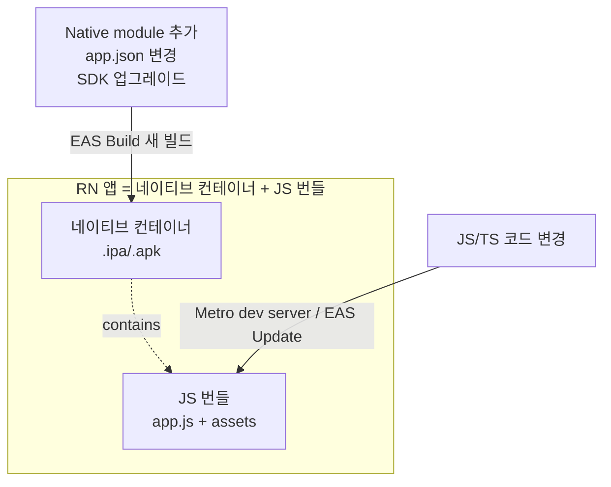
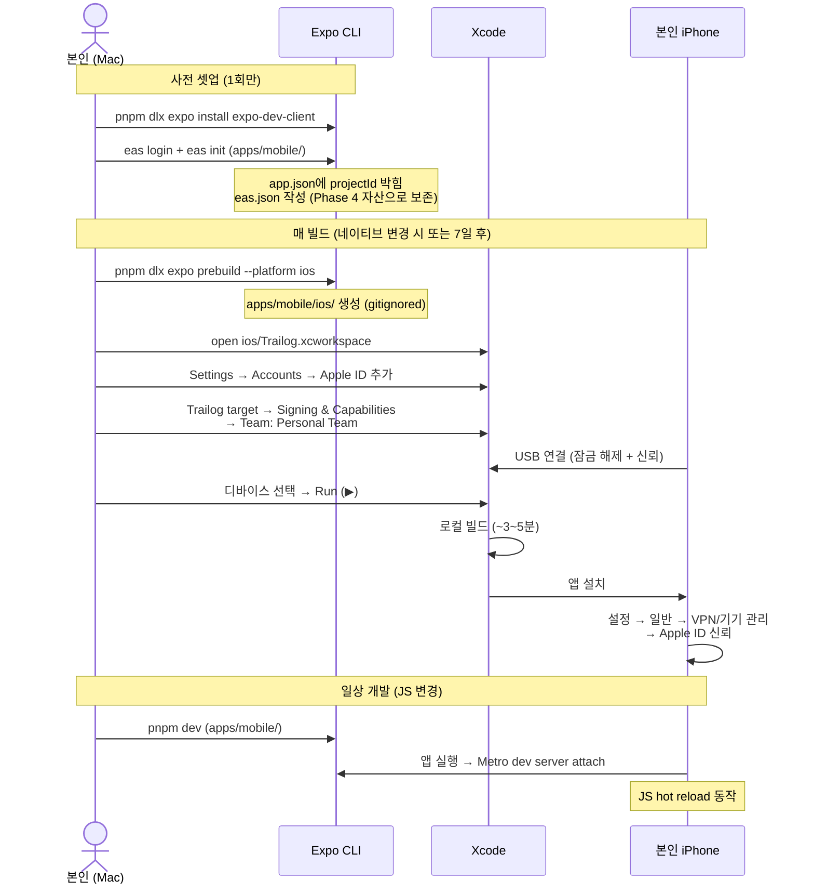
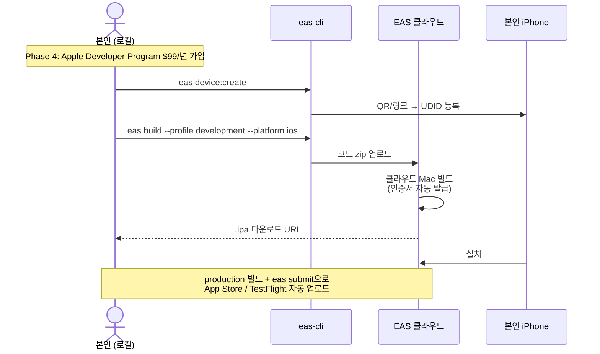

# EAS Build와 모바일 빌드 모델

> **작성일**: 2026-05-25
> **작성**: Claude (프롬프팅: @sikkzz)
> **학습 영역**: 6번 모바일 네이티브 / 앱 배포
> **관련 문서**: [Phase 1 Spec 4.5](../specs/phase-01-bootstrap.md), [학습 노트: Expo+RN 기본](./expo-and-react-native-basics.md)

---

## 한 줄 요약

**EAS Build** = Expo가 운영하는 클라우드 네이티브 빌드 서비스. 본인 Mac에 Xcode 안 깔아도 클라우드에서 `.ipa`(iOS) / `.apk`(Android) 산출물을 만들어주고, 본인 폰에 설치 가능한 development build를 셋업한다.

## 우리 프로젝트에서 어디에 쓰이는가

- **Phase 1 4.5**: 본인 iPhone에 development build를 1회 설치해서 빌드 사이클 학습 완료
- **Phase 4 출시**: 같은 EAS로 production build → 스토어 자동 업로드
- **운영 중**: 네이티브 모듈 추가 시점에만 빌드. JS 변경은 EAS Update (별개)

## RN 빌드 모델 — 웹과 가장 큰 차이

웹은 빌드 1종 (Next.js의 `next build`). 모바일은 **두 층 분리**:



**핵심**: JS 변경이 빌드를 안 부르는 게 RN의 강점. 사이드의 99% 작업은 JS만이라 빌드 빈도 매우 낮음.

| 변경 종류                               | 새 native 빌드?    |
| --------------------------------------- | ------------------ |
| JS/TS 코드, UI, 라우트, 상태관리 등     | ❌ 즉시 hot reload |
| 새 native module (expo-camera 등)       | ✅ 1회             |
| `app.json` 변경 (아이콘, 권한, 번들 ID) | ✅ 1회             |
| Expo SDK 메이저 업그레이드              | ✅ 1회             |
| `app.config.js`의 `plugins` 변경        | ✅ 1회             |

## EAS = "Expo Application Services" (3종 묶음)

| 서비스         | 역할                                      | 우리 사용 시점  |
| -------------- | ----------------------------------------- | --------------- |
| **EAS Build**  | 네이티브 앱 빌드 (`.ipa`/`.apk`/`.aab`)   | Phase 1 4.5부터 |
| **EAS Submit** | 빌드를 App Store/Play Store에 자동 업로드 | Phase 4 출시    |
| **EAS Update** | JS 코드 OTA 핫 업데이트 (앱 재설치 X)     | Phase 3+        |

## Build profile 3종

`eas.json`에 정의. 각각 다른 인증서/빌드 옵션:

```jsonc
{
  "build": {
    "development": {
      "developmentClient": true,
      "distribution": "internal",
      "ios": { "simulator": false },
    },
    "preview": {
      "distribution": "internal",
      "ios": { "simulator": false },
    },
    "production": {
      "distribution": "store",
    },
  },
}
```

| Profile         | 용도                    | 특징                                                             |
| --------------- | ----------------------- | ---------------------------------------------------------------- |
| **development** | 디버깅용 (Phase 1~3)    | `expo-dev-client` 포함, Metro dev server에 attach, JS hot reload |
| **preview**     | 내부 테스트 (지인 배포) | dev mode X, production-like, TestFlight/직접 배포                |
| **production**  | 스토어 출시             | 최적화 + production 인증서                                       |

## Apple Developer 계정 — 무료 vs 유료 (중요 정정)

**처음 적었던 내용에 오류**가 있어서 본인이 EAS device:create에서 막혔음. 정정:

| 시나리오                            | 무료 Apple ID                                             | Apple Developer Program ($99/년) |
| ----------------------------------- | --------------------------------------------------------- | -------------------------------- |
| **로컬 Xcode 빌드** (Personal Team) | ✅ 가능 (7일 만료)                                        | ✅                               |
| **EAS Cloud Build + 실기기 설치**   | ❌ device:create 차단 (Apple Developer Portal API 접근 X) | ✅                               |
| **EAS Cloud Build + iOS Simulator** | ✅ 가능 (실기기 X)                                        | ✅                               |
| **TestFlight / App Store 출시**     | ❌                                                        | ✅                               |

핵심:

- **EAS Cloud는 Apple Developer Portal API**를 호출해서 인증서·디바이스 등록을 자동화. 무료 ID는 그 API 접근 권한 없음 → `eas device:create` 시 `You are not registered as an Apple Developer` 에러.
- **로컬 Xcode는 Apple ID로 직접 로그인** → "Personal Team" provisioning을 그대로 사용 → 본인 폰에 직접 설치 가능. **7일 만료** 후 재빌드 필요.

→ **Phase 1엔 비용 0 원칙 유지를 위해 로컬 Xcode + Personal Team** 경로 채택. EAS Cloud Build는 Phase 4 Apple Developer 가입 후 본격 사용.

## 사이드 빌드 빈도 (현실)

웹 개발자 멘탈 모델로 "기능 추가마다 빌드 = 30회/월 부족" 우려는 잘못된 가정. 본 프로젝트 페이스 예측:

| Phase            | 빌드 경로                               | 빌드 사유                             | 횟수     |
| ---------------- | --------------------------------------- | ------------------------------------- | -------- |
| Phase 1 (지금)   | 로컬 Xcode                              | 첫 dev build (iOS)                    | 1~2회    |
| Phase 1 운영     | 로컬 Xcode                              | 7일 만료 갱신 (매주 1회)              | 4~8회/월 |
| Phase 2          | 로컬 Xcode                              | expo-image-picker, expo-location 추가 | 1회      |
| Phase 3          | 로컬 Xcode                              | react-native-maps, 실시간 모듈        | 1~2회    |
| Phase 4          | **EAS Cloud** (Apple Developer 가입 후) | Production 빌드 + 스토어 + TestFlight | 5~10회   |
| 일반 기능 (JS만) | n/a                                     | hot reload만                          | 0회      |

**Phase 4까지 EAS Cloud 사용 거의 X** → 무료 한도 30회/월에 닿을 일 없음. 로컬 Xcode 7일 갱신은 EAS 카운트와 무관.

## Phase 1 4.5 진행 흐름 (로컬 Xcode + Personal Team)



## Phase 4 진행 흐름 (EAS Cloud + Apple Developer)



## 흔한 함정

### 1. ⚠ 무료 Apple ID + EAS Cloud = 실기기 빌드 차단 (2026-05-25 정정)

본인이 처음 진행 시 막힌 함정:

```
Authentication with Apple Developer Portal failed!
Apple provided the following error info:
You are not registered as an Apple Developer.
```

- EAS Cloud의 `device:create` / `build`는 Apple Developer Portal API를 호출
- 무료 Apple ID는 그 API 접근 권한 X
- **해결 옵션**:
  1. **Apple Developer Program 가입** ($99/년) → EAS Cloud 정상 동작
  2. **로컬 Xcode + Personal Team** → 무료, 7일 만료 (Phase 1엔 이쪽 선택)
  3. **EAS Cloud + Simulator** → 무료, 실기기 X

### 2. ⚠ Personal Team의 7일 만료

- 무료 Apple ID로 Xcode가 발급하는 provisioning은 7일 후 만료
- 앱 아이콘은 남지만 실행 시 "이 앱을 더 이상 사용할 수 없음" 메시지
- 매주 Xcode에서 Run 한 번씩 → 7일 자동 갱신
- 학습 단계엔 부담 X. Phase 4 유료 가입 후 해소.

### 3. ⚠ "신뢰되지 않은 개발자" 에러 (첫 실행)

- Xcode 첫 빌드/설치 후 폰에서 앱 아이콘 탭하면 차단 메시지
- **설정 → 일반 → VPN 및 기기 관리 → 본인 Apple ID → 신뢰**
- 한 번 신뢰하면 같은 Apple ID 빌드는 계속 OK

### 4. ⚠ expo-dev-client 빠뜨림

- development build엔 **`expo-dev-client` 의존성 필수**
- 안 깔면 빌드는 되지만 Metro dev server 연결이 안 됨 (정적 빌드처럼 동작)
- `pnpm dlx expo install expo-dev-client`로 정확한 버전 자동 설치

### 5. ⚠ Expo Go vs Development Build 헷갈림

| Expo Go                                  | Development Build              |
| ---------------------------------------- | ------------------------------ |
| Expo가 미리 만든 앱 (App Store에서 받음) | 본인 프로젝트만의 dev 컨테이너 |
| 추가 native module 사용 시 작동 X        | 본인이 깐 모든 module 작동     |
| 빠른 프로토타이핑                        | 본격 개발                      |
| 우리는 ❌                                | 우리는 ✅ (Phase 1 4.5)        |

### 6. ⚠ Network — Metro dev server 접근

- 폰과 Mac이 **같은 Wi-Fi**에 있어야 dev server 접근 가능
- 사내 Wi-Fi처럼 디바이스 격리 ON이면 안 됨
- 안 될 시 `expo start --tunnel`로 우회 (ngrok 사용, 느림)

### 7. ⚠ EAS Build 큐 대기

- 무료 plan은 우선순위 낮아 빌드 큐 10~30분 대기 가능
- 첫 빌드 시 "기다림 → 실행 → 30분" 총 1시간 정도 예상
- 진행하면서 다른 작업 가능 (CLI는 빌드 완료까지 대기 또는 백그라운드)

### 8. ⚠ Apple Silicon Mac 호환

- ARM Mac에서 EAS Build는 클라우드 처리 → 영향 X
- 단 로컬 빌드(`eas build --local`) 사용 시 ARM 호환 이슈 가능

## 무료 한도 초과 대비책

### 1. EAS Update (JS hot push)

- JS-only 변경은 빌드 카운트와 무관
- `eas update --branch production` 한 줄
- Phase 3+에 활용 예정

### 2. 로컬 빌드 (eas build --local)

- 본인 Mac에서 직접 빌드 → EAS 한도 X
- 단 Xcode (~15GB) + 셋업 시간 비용
- 한도 도달 시 검토

### 3. 다음 달 reset

- 무료 한도는 매월 1일 reset
- 한도 도달 시 자동 결제 X (큐 정지 후 다음 달 대기)

## 더 파볼 거리 (선택)

- **EAS Update + Channels** — 환경별 OTA 업데이트 (production / staging)
- **EAS Submit** — 스토어 자동 업로드 (Phase 4)
- **App Store Connect API** — 메타데이터 자동화
- **Fastlane** — 빌드/배포 자동화의 ruby 진영 표준 (EAS의 대안)
- **로컬 prebuild** — `expo prebuild`로 ios/android/ 폴더 생성 → 본격 native 커스텀
- **TestFlight** — Apple 공식 내부 테스트 트랙 (Phase 4)

## 참고 링크

- [EAS Build 공식 docs](https://docs.expo.dev/build/introduction/)
- [Development Build 가이드](https://docs.expo.dev/develop/development-builds/introduction/)
- [eas.json 레퍼런스](https://docs.expo.dev/eas/json/)
- [Apple Developer Program](https://developer.apple.com/programs/)
- [Expo pricing](https://expo.dev/pricing)

## 추가 학습 기록

> 같은 토픽으로 추가 학습한 내용은 아래에 날짜 헤더로 누적.
