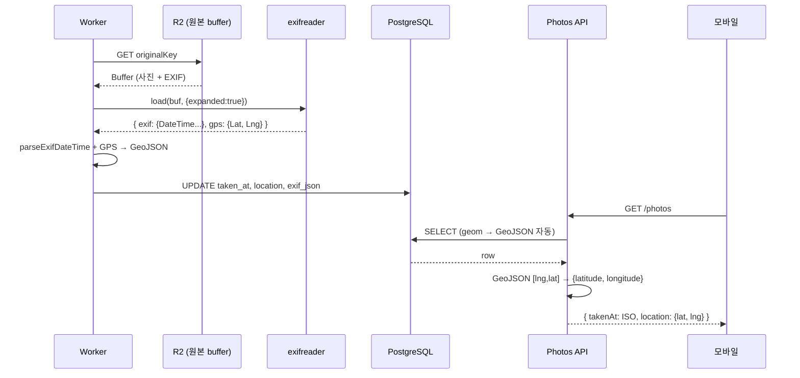

# EXIF 메타데이터 + 사진 시간/위치 추출

> **작성일**: 2026-06-03
> **작성**: Claude (프롬프팅: @sikkzz)
> **학습 영역**: #2 이미지/미디어 처리 (PROJECT_ROOT 2장) + 보안/프라이버시
> **관련 문서**: [Phase 2 Spec 4.5](../specs/phase-02-core-features.md), [sharp 이미지 처리](sharp-image-processing.md), [PostGIS 기초](postgis-basics.md)

---

## 한 줄 요약

**EXIF (Exchangeable Image File Format)** = 카메라/스마트폰이 사진 파일 안에 박는 **메타데이터 표준**. 촬영 시각/GPS/카메라 모델/렌즈/노출 등을 IFD(Image File Directory) 트리 구조로 저장. 사진 앱의 **시간순 정렬 + 지도 핀**의 원천 데이터. 동시에 **프라이버시 사고의 흔한 출처** — 무심코 공유한 사진의 GPS가 거주지 노출.

## 우리 프로젝트에서 어디에 쓰이는가

- **Phase 2 4.5 사진 metadata 추출**: BullMQ worker가 sharp 변환 끝나면 같은 buffer로 `exifreader.load(buf, { expanded: true })` → DB 박제
  - `taken_at` ← `DateTimeOriginal` (촬영 순 정렬용)
  - `location` ← GPS Lat/Lng → PostGIS Point (지도 핀 + 공간 쿼리)
  - `exif_json` ← 원본 EXIF 통째 보존 (미래 활용 + 디버깅)
- **Phase 2 4.6 모바일 표시**: 사진 상세에 "촬영 시각" + "지도 위치" 노출
- **Phase 2 4.7 지도 탭**: `location` 인덱스(GIST) 기반 공간 쿼리 — "내 사진 모두 지도에", "이 동네 가본 사진들"
- **Phase 3 공유 흐름 (예정)**: 외부 공유 시 EXIF strip — 프라이버시 보호

## 어떻게 동작하는가

### EXIF 표준 구조 — IFD 트리

EXIF는 단순 key-value가 아닌 **계층적 IFD (Image File Directory)** 트리:

```
JPEG file
└── APP1 marker
    └── EXIF segment
        ├── IFD0 (메인 — 이미지 자체 정보)
        │   ├── Make: "Apple"
        │   ├── Model: "iPhone 15 Pro"
        │   ├── DateTime: "2024:03:15 14:30:00"  ← 파일 마지막 수정
        │   └── ExifIFDPointer → SubIFD
        ├── IFD1 (썸네일 이미지)
        ├── SubIFD (Exif IFD)
        │   ├── DateTimeOriginal: "2024:03:15 14:30:00"  ← 실제 촬영 시각
        │   ├── DateTimeDigitized: "..."  ← 디지털화 시각 (스캔 등)
        │   ├── ExposureTime, FNumber, ISO, FocalLength, ...
        │   └── OffsetTimeOriginal: "+09:00"  ← timezone (iPhone 12+)
        └── GPS IFD
            ├── GPSLatitude: [37, 33, 59.4]  ← rational (degree, minute, second)
            ├── GPSLatitudeRef: "N"
            ├── GPSLongitude: [126, 58, 40.8]
            ├── GPSLongitudeRef: "E"
            └── GPSAltitude: ...
```

이 구조를 직접 파싱하면 복잡 → 라이브러리(exifreader)가 IFD 순회 + decimal 변환 다 해줌.

### Trailog 사용 흐름 (실제 코드)

```typescript
// apps/server/src/photos/photo-processing.processor.ts
const tags = ExifReader.load(buffer, { expanded: true, async: false });

// DateTime: 'YYYY:MM:DD HH:MM:SS' (':' 구분자, ISO 아님)
const dateTimeString =
  tags.exif?.DateTimeOriginal?.description ?? tags.exif?.DateTime?.description ?? null;
const takenAt = dateTimeString ? this.parseExifDateTime(dateTimeString) : null;

// GPS: exifreader가 expanded mode에서 decimal로 변환
const lat = tags.gps?.Latitude; // number (e.g. 37.5665)
const lng = tags.gps?.Longitude; // number (e.g. 126.978)
const location =
  lat != null && lng != null
    ? { type: 'Point', coordinates: [lng, lat] } // GeoJSON: [lng, lat] 순서!
    : null;
```



## 핵심 개념

### DateTime 3종 — DateTime / DateTimeOriginal / DateTimeDigitized

| 필드                   | 의미                                                           | Trailog가 쓰는 것           |
| ---------------------- | -------------------------------------------------------------- | --------------------------- |
| **`DateTimeOriginal`** | 셔터 누른 순간                                                 | ⭐ **우선 사용**            |
| `DateTimeDigitized`    | 디지털 파일로 만들어진 순간 (스캔 등 — 대부분 Original과 동일) | —                           |
| `DateTime`             | 파일 마지막 수정 시각 (편집/저장 시 갱신)                      | fallback (Original 없을 때) |

촬영 시각 의미상 `DateTimeOriginal`이 정확. `DateTime`은 누군가 사진을 편집해 저장하면 그 시각으로 덮어씀 → 회상 의도와 불일치.

### EXIF DateTime 파싱 함정 — `:` 구분자

EXIF 표준은 `'YYYY:MM:DD HH:MM:SS'` 형식 — **콜론 구분자**.

```typescript
new Date('2024:03:15 14:30:00'); // ❌ Invalid Date
```

→ `'-'`로 변환 후 ISO-like 만들어야:

```typescript
const isoLike = s.replace(/^(\d{4}):(\d{2}):(\d{2})/, '$1-$2-$3').replace(' ', 'T');
new Date(isoLike); // ✅
```

### Timezone 함정 — OffsetTime의 부재

EXIF `DateTimeOriginal`엔 **timezone 정보 없음** (구형 폰 + 안드로이드 일부).
→ `new Date('2024-03-15T14:30:00')`는 **local time 해석** (서버 timezone 기준).

| 상황                           | 결과                              |
| ------------------------------ | --------------------------------- |
| 서버 KST + 사진 KST 촬영       | ✅ 정확                           |
| 서버 KST + 사진 일본(JST) 촬영 | ⚠️ 1시간 차이로 박힘 (KST로 해석) |
| 서버 UTC + 사진 KST 촬영       | ⚠️ 9시간 차이                     |

**해결**: iPhone 12+ 부터 `OffsetTimeOriginal` 필드 박힘 (`"+09:00"` 형식). 이걸 함께 읽으면 정확.

Trailog는 **단순화** 채택 — local time 해석 + 함정 학습 노트 박제. Phase 후속 정확도 ↑ 시점에 OffsetTime 활용.

### GPS rational triplet → decimal

EXIF GPS는 rational 3쌍:

- `GPSLatitude: [37, 33, 59.4]` — degree(37) + minute(33) + second(59.4)
- `GPSLatitudeRef: "N"` — 북위 (S면 음수)

decimal 변환 공식:

```
decimal = degree + minute/60 + second/3600
실제 = decimal × (N/E면 +1, S/W면 -1)
```

예시: `[37, 33, 59.4] + "N"` → `37 + 33/60 + 59.4/3600 = 37.5665 (북위)`

**exifreader expanded mode** 이 변환을 자동 처리 → `tags.gps.Latitude: 37.5665` 바로 decimal.

직접 파싱하려면 학습 가치 있지만 라이브러리가 안전 (S/W 부호 처리, edge case).

### GeoJSON 좌표 순서 — `[longitude, latitude]`

**가장 흔한 버그**: GeoJSON 표준은 `[lng, lat]` 순서. `[lat, lng]` 아님.

```typescript
// ❌ 자주 하는 실수 (서울 좌표지만 인도양 어딘가로 박힘)
{ type: 'Point', coordinates: [37.5665, 126.978] }

// ✅ 올바른 GeoJSON
{ type: 'Point', coordinates: [126.978, 37.5665] }
```

사유: GeoJSON RFC 7946 — `(x, y)` 수학 좌표 컨벤션 따름 (x=경도, y=위도).
**모바일 라이브러리 (react-native-maps)는 `{latitude, longitude}`** — 헷갈리기 쉬움.

Trailog는 **DB는 GeoJSON 표준 `[lng,lat]` / API는 모바일 친화 `{latitude, longitude}`** — Service mapping layer가 변환.

### PostGIS Point + SRID 4326

```sql
CREATE TABLE photos (
  ...
  location geometry(Point, 4326) NULL  -- 4326 = WGS84
);
CREATE INDEX ON photos USING GIST (location);
```

- **SRID 4326 = WGS84** — 일반 GPS 표준. 모든 위경도 호환
- **`geometry` vs `geography`**: geometry는 평면(faster), geography는 구면(정확한 거리). Trailog는 핀 표시/대략 클러스터 정도라 geometry 충분
- **GIST 인덱스** — 공간 쿼리 (ST_DWithin, ST_Intersects 등) 가속

공간 쿼리 예시 (Phase 4.7 지도 탭):

```sql
SELECT * FROM photos
WHERE ST_DWithin(
  location::geography,
  ST_MakePoint(126.978, 37.5665)::geography,
  1000  -- 1km 반경
);
```

### exifreader expanded mode vs flat

```typescript
// flat (기본)
const tags = ExifReader.load(buf);
// tags['DateTimeOriginal']: { description: '2024:03:15 14:30:00', value: ... }
// tags['GPSLatitude']: { description: 37.5665, value: rational... }

// expanded (추천)
const tags = ExifReader.load(buf, { expanded: true });
// tags.exif.DateTimeOriginal: { description: '2024:03:15 14:30:00' }
// tags.gps.Latitude: 37.5665  ← 바로 number
```

expanded가 IFD 구조 그대로 노출 + GPS decimal 자동 — Trailog 채택.

## 왜 exifreader인가 — 대안 비교

| 라이브러리                 | 기반                  | 장점                                                                      | 단점                                              |
| -------------------------- | --------------------- | ------------------------------------------------------------------------- | ------------------------------------------------- |
| **exifreader**             | pure JS               | GPS decimal 자동, expanded mode, JPEG/PNG/HEIC/TIFF 모두, native 의존성 X | EXIF + 일부 IPTC/XMP만 (RAW 미지원)               |
| `sharp(buf).metadata()`    | libvips               | sharp 흐름 자연, 의존성 0                                                 | EXIF raw buffer만 — GPS IFD 직접 파싱 필요        |
| `exiftool-vendored`        | Perl ExifTool wrapper | 가장 강력 (RAW 등 모든 포맷)                                              | native 의존성 + worker별 process spawn (메모리 ↑) |
| `piexifjs` / `exif` (Node) | pure JS               | 가벼움                                                                    | JPEG only — Trailog는 HEIC/PNG도 받음             |

**Trailog는 exifreader 채택** — GPS decimal 자동 + HEIC 지원 + Fly.io 256MB VM 안전 (pure JS).

## 흔한 함정

1. **GeoJSON 좌표 순서** `[lng, lat]` ≠ `[lat, lng]` — 잘못 박으면 지구 반대편 표시 (지도가 인도양)
2. **EXIF DateTime ':' 구분자** — `new Date('2024:03:15 ...')`는 Invalid Date. `-`로 변환 필수
3. **timezone 없는 EXIF** — local time 해석되므로 해외 여행 사진 시각이 서버 기준으로 박힘. iPhone 12+의 `OffsetTimeOriginal` 활용 시 정확도 ↑
4. **DateTime vs DateTimeOriginal** — `DateTime`은 편집 시 갱신. 회상 의도면 Original 우선
5. **EXIF 없는 사진 throw** — 스크린샷/메신저 캡처는 EXIF 없음. 정상 케이스 → throw X, null로 박고 진행
6. **HEIC EXIF 지원** — exifreader 4.0+ HEIC 지원. 구버전은 JPEG/PNG/TIFF만
7. **GPS S/W 부호** — `GPSLatitudeRef: "S"`면 음수. 라이브러리가 처리해주지만 직접 파싱 시 빠뜨리기 쉬움
8. **`.rotate()` 누락 (sharp)** — EXIF orientation 적용 안 한 채 resize → 모바일에서 사진 옆으로 누움
9. **프라이버시 — GPS 노출** — SNS 업로드 시 자동 strip 안 하면 거주지 추적 가능 (실세계 사고 사례 ↓)
10. **exif_json 사이즈** — 사진 100만장에 ~5GB. PostgreSQL TOAST가 자동 압축이지만 SELECT 시점에 직렬화 비용 — 리스트 endpoint에선 `SELECT id, taken_at, ...` 명시적으로 빼는 게 좋음

### 9번 — 프라이버시 함정 깊이

실세계 사고 사례:

- **2012 John McAfee 추적** — 도주 중 인터뷰 사진에 GPS EXIF 박혀있어 위치 노출 → 체포
- **연예인/인플루언서 — 거주지 노출** — 자택 사진에 GPS 박힌 채 SNS 업로드 → 스토킹
- **저널리스트/취재원 보호** — 취재 장소가 EXIF에 박히면 source 노출

방어 패턴:

- **SNS (인스타/페북/X)**: 업로드 시 EXIF 자동 strip
- **Trailog 현재**: 본인만 보는 앱 — 보존 OK
- **Trailog Phase 3+ 공유 흐름**: 외부 공유 시 EXIF strip — `sharp().withMetadata({})` 또는 별도 strip 헬퍼

## 더 파볼 거리

- **IPTC + XMP** — 사진 metadata 다른 표준. IPTC는 사진 기자 워크플로 (caption, copyright), XMP는 Adobe 시작 → 통합 표준화
- **OffsetTimeOriginal 정확성** — iPhone 12+ / 일부 Android. 활용하면 해외 여행 시각 정확
- **PostGIS 공간 쿼리 깊이** — ST_DWithin, ST_ClusterDBSCAN, ST_Buffer. 4.7 지도 탭에 필요
- **EXIF strip 시점 설계** — 공유 흐름 전체에서 어디서 strip할지 (서버 vs 모바일)
- **사진 검색 인덱스** — `taken_at` B-tree + 텍스트 검색 결합 ("2024년 3월 도쿄" 같은 쿼리)
- **카메라/렌즈 통계** — exif_json에서 Make/Model/LensModel 추출 → 사용 패턴 분석
- **고도 활용** — GPSAltitude → 등산 도메인 확장 시 사용

## 참고 링크

- [EXIF 표준 (CIPA DC-008)](https://www.cipa.jp/std/documents/e/DC-008-Translation-2019-E.pdf)
- [exifreader GitHub](https://github.com/mattiasw/ExifReader)
- [GeoJSON RFC 7946 — coordinates 순서](https://datatracker.ietf.org/doc/html/rfc7946#section-3.1.1)
- [PostGIS Point + SRID](https://postgis.net/docs/manual-3.4/using_postgis_dbmanagement.html)
- [Privacy: EXIF GPS 사고 사례](https://en.wikipedia.org/wiki/Exif#Privacy_and_security)

## 추가 학습 기록

> 같은 토픽으로 추가 학습한 내용은 아래에 날짜 헤더로 누적.
