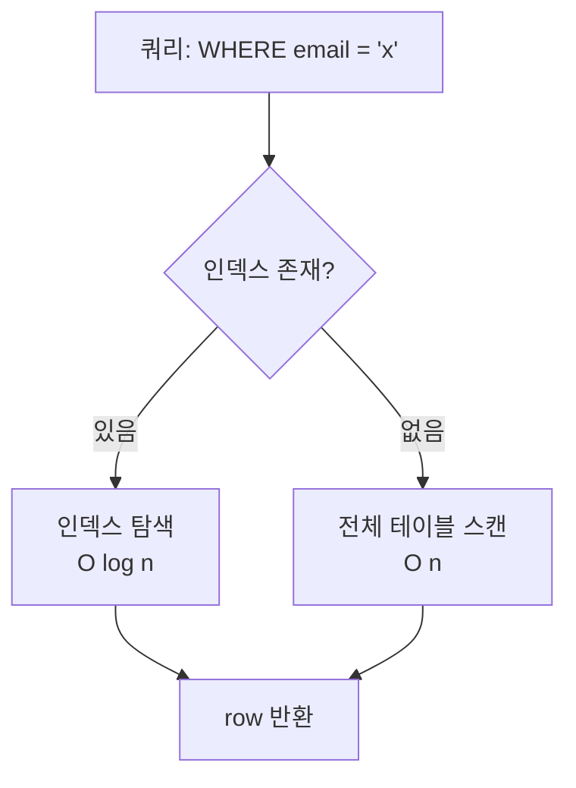

# DB 인덱스 전략

> **작성일**: 2026-05-30
> **작성**: Claude (프롬프팅: @sikkzz)
> **학습 영역**: #1 인프라/DevOps + #5 성능 최적화 (PROJECT_ROOT 2장)
> **관련 문서**: [Phase 2 Spec](../specs/phase-02-core-features.md), [PostGIS 기초](./postgis-basics.md), [TypeORM 깊이 정복](./typeorm-deep-dive.md)

---

## 한 줄 요약

**인덱스는 read 가속용 자료구조** — 쓰기는 느려지고 디스크 차지. **모든 컬럼에 박지 말 것**, 실제 쿼리 패턴 기반으로 선택. PostgreSQL은 B-tree(default), GIST(공간), GIN(배열/jsonb/풀텍스트), BRIN(시계열) 등 종류별 선택.

## 우리 프로젝트에서 어디에 쓰이는가

- **User.email** (Phase 2 4.1): unique B-tree — 로그인 시 매번 lookup
- **Photo.tripId** (Phase 2 4.3): B-tree — "이 여행의 사진들" 쿼리
- **Photo.takenAt** (Phase 2 4.5): B-tree — 시간 정렬
- **Photo.location** (Phase 2 4.5): **GIST** — 공간 쿼리 (지도 영역, 반경)
- **Photo.thumbnailUrls** (Phase 2 4.4, jsonb): **GIN** — JSON 키 검색 필요 시 (현재는 컬럼 자체 lookup만이라 인덱스 X)

## 어떻게 동작하는가

DB는 인덱스 없으면 **전체 테이블 스캔** (full table scan). row 100만 개면 100만 번 비교. 인덱스는 정렬된 자료구조 → 검색을 O(log n)로 단축.

### 인덱스 비용

인덱스는 **공짜 아님**:

1. **쓰기 느려짐**: INSERT/UPDATE/DELETE 마다 모든 인덱스 갱신. 인덱스 5개면 5번 갱신.
2. **디스크 차지**: 인덱스 자체가 별도 자료구조 → table 크기의 10~50% 추가 디스크.
3. **메모리 압박**: PostgreSQL은 자주 쓰는 인덱스를 메모리(`shared_buffers`)에 캐싱 → 메모리 한정적.

→ **선택적으로 박기**. "이 컬럼으로 자주 검색/정렬/조인?" 자문 후.

### 인덱스 종류 (PostgreSQL)

| 종류       | 자료구조          | 적용                                            | 사용처                                                       |
| ---------- | ----------------- | ----------------------------------------------- | ------------------------------------------------------------ |
| **B-tree** | 균형 이진 트리    | 모든 비교 가능 자료형 (number/string/date/uuid) | 기본. `=`, `<`, `>`, `BETWEEN`, `ORDER BY`, unique           |
| **GIST**   | R-tree 변종       | geometry/geography, range, tsvector             | 공간 쿼리 (`ST_Within`, `&&` overlap), 범위 검색             |
| **GIN**    | Inverted index    | array, jsonb, tsvector                          | 배열 element 검색, JSON 키 lookup, 풀텍스트 검색             |
| **BRIN**   | Block Range Index | 정렬된 시계열 데이터                            | 거대 테이블 + 시간 순 입력 (로그 등) — 인덱스 자체 매우 작음 |
| **Hash**   | 해시 테이블       | 동등 비교만                                     | `=` 만 — B-tree 대안인데 거의 안 씀 (B-tree가 충분)          |

### 핵심 개념

- **단일 컬럼 인덱스**: 가장 흔함. `CREATE INDEX idx_photos_trip_id ON photos(trip_id)`
- **복합 인덱스 (composite)**: 여러 컬럼. **순서 중요** — `(a, b, c)` 인덱스는 `WHERE a = ?` / `WHERE a = ? AND b = ?` 사용 가능, `WHERE b = ?` 단독은 못 씀.
- **Unique 인덱스**: 데이터 무결성 + 검색 가속. `CREATE UNIQUE INDEX ... ON users(email)`
- **Partial 인덱스**: `WHERE` 조건 박힌 인덱스. `CREATE INDEX ... ON photos(taken_at) WHERE location IS NOT NULL` — NULL 다수 컬럼에 디스크 절약
- **Expression 인덱스**: 함수 결과 인덱싱. `CREATE INDEX ... ON users(LOWER(email))` — 대소문자 무관 검색
- **Covering 인덱스 (`INCLUDE`)**: 인덱스에 추가 컬럼 포함 → table 접근 없이 결과 반환 (Index Only Scan)

### Mermaid — 인덱스 동작 흐름



## 코드 예시 — TypeORM 데코레이터

### 1. Unique 인덱스 (`@Index({ unique: true })`)

```typescript
@Entity('users')
export class User {
  @Index({ unique: true })
  @Column()
  email!: string;
}
```

마이그레이션 자동 생성:

```sql
CREATE UNIQUE INDEX "IDX_..." ON "users"("email")
```

### 2. 일반 B-tree (FK / 정렬 컬럼)

```typescript
@Entity('photos')
export class Photo {
  @Index() // FK는 거의 항상 인덱스
  @Column({ name: 'trip_id' })
  tripId!: string;

  @Index()
  @Column({ type: 'timestamptz' })
  takenAt!: Date | null;
}
```

### 3. GIST (PostGIS — TypeORM 자동 생성 안 함)

```typescript
@Entity('photos')
export class Photo {
  @Column({ type: 'geometry', spatialFeatureType: 'Point', srid: 4326, nullable: true })
  location!: { type: 'Point'; coordinates: [number, number] } | null;
}
```

GIST 인덱스는 마이그레이션에 raw SQL로:

```typescript
public async up(queryRunner: QueryRunner): Promise<void> {
  await queryRunner.query(
    `CREATE INDEX "IDX_photos_location_gist" ON "photos" USING GIST("location")`,
  );
}
```

### 4. 복합 인덱스

```typescript
@Index(['tripId', 'takenAt'])  // (trip_id, taken_at) 복합
@Entity('photos')
export class Photo { ... }
```

쿼리 `WHERE trip_id = ? ORDER BY taken_at DESC`에 강력.
단 `WHERE taken_at > ?` 단독엔 못 씀 (B-tree 순서 규칙).

### 5. Partial 인덱스

```typescript
public async up(queryRunner: QueryRunner): Promise<void> {
  await queryRunner.query(
    `CREATE INDEX "IDX_photos_processing_pending"
     ON "photos"("created_at")
     WHERE "processing_status" = 'pending'`,
  );
}
```

"처리 대기 중 사진" 쿼리만 가속. 처리 완료 row는 인덱스에 안 들어가 디스크 절약.

## Trailog 인덱스 전략 (Phase 2 전체)

| 컬럼                              | 인덱스                           | 사유                              | 도입 시점                |
| --------------------------------- | -------------------------------- | --------------------------------- | ------------------------ |
| `users.email`                     | UNIQUE B-tree                    | 로그인 lookup + 중복 차단         | 4.1 ✅                   |
| `trips.user_id`                   | B-tree                           | "내 여행 리스트" 쿼리             | 4.3                      |
| `photos.trip_id`                  | B-tree (FK 표준)                 | "이 여행 사진들"                  | 4.3                      |
| `photos.user_id`                  | B-tree (FK 표준)                 | "내 모든 사진"                    | 4.3                      |
| `photos.taken_at`                 | B-tree                           | 시간 정렬                         | 4.5                      |
| `photos.location`                 | **GIST**                         | 지도 영역/반경 쿼리               | 4.5                      |
| `photos.processing_status` (단독) | ❌ enum 카디널리티 낮음 → 효과 X | —                                 | —                        |
| `photos(trip_id, taken_at)`       | 복합 B-tree                      | 여행 내 시간 정렬 (단일보다 빠름) | 4.5+ (실제 쿼리 측정 후) |

**원칙**: 처음엔 단일 컬럼 인덱스 + FK 위주. 복합/partial은 실제 쿼리 EXPLAIN ANALYZE 결과로 추가.

## 흔한 함정 / 주의할 점

1. **모든 컬럼에 인덱스 박기**: write 폭망. 인덱스는 read 빈도 높은 컬럼에만.

2. **FK 인덱스 누락**: TypeORM은 PK 인덱스만 자동, **FK는 명시 필요**. `@Index()` 안 박으면 join 쿼리 느림.

3. **NULL 다수 컬럼 인덱스**: NULL row가 인덱스 자체에 들어가지만 검색 효과 X. Partial로 NULL 제외 권장.

4. **복합 인덱스 순서 잘못 잡기**: `(a, b)` 인덱스에 `WHERE b = ?`는 못 씀. 자주 쓰는 컬럼이 앞.

5. **`LIKE '%search%'` 패턴**: B-tree로는 인덱스 못 씀. prefix(`'search%'`)만 가능. 풀텍스트는 GIN + tsvector.

6. **인덱스가 안 쓰이는 이유 모름**: `EXPLAIN ANALYZE` 항상 확인. PostgreSQL planner는 row 수 작으면 seq scan 선택 (의도된 동작).

7. **`ORDER BY ... LIMIT` 인덱스 활용**: 정렬 컬럼에 B-tree + LIMIT 작으면 인덱스 첫 N개만 읽음 (Index Scan + LIMIT 빠름).

8. **인덱스 크기 점검 안 함**: 거대 테이블에선 인덱스가 테이블 크기 50%+ 차지. `\di+` (psql) 또는 `pg_indexes_size()` 모니터링.

9. **`BRIN` 잘못 쓰면 GIN/GIST보다 느림**: 데이터가 입력 순서로 정렬되어 있을 때만 효과적. 시계열 (로그/이벤트) 외엔 비추.

10. **인덱스 reindex 무시**: 대량 update 후 인덱스 fragmentation. `REINDEX CONCURRENTLY` 정기.

## 더 파볼 거리

- **EXPLAIN ANALYZE 읽는 법** — Seq Scan / Index Scan / Bitmap Heap Scan 차이, cost 추정 vs 실측
- **pg_stat_statements** — 느린 쿼리 추적 + 인덱스 미스 발견
- **HypoPG** — 가상 인덱스 시뮬레이션 ("이 인덱스 박으면 빨라질까?" 안전 검증)
- **부분 인덱스 / 함수 인덱스 / Generated column 인덱스**
- **인덱스 only scan** (covering index — `INCLUDE`)
- **Index Bloat 모니터링** + `pg_repack` (운영 단계)
- **PostgreSQL 16+ 새 기능** — parallel index build, B-tree dedup 등

## 참고 링크

- [PostgreSQL Indexes 공식 문서](https://www.postgresql.org/docs/current/indexes.html)
- [Use The Index, Luke!](https://use-the-index-luke.com/) — SQL 인덱스 깊이 책 (무료)
- [PostgreSQL EXPLAIN 시각화](https://explain.depesz.com/)
- [TypeORM Indices](https://typeorm.io/indices)

## 추가 학습 기록

> 같은 토픽으로 추가 학습한 내용은 아래에 날짜 헤더로 누적.

### 2026-05-30 초안 — Trailog 인덱스 전략 + 일반 가이드

- 5종 인덱스 (B-tree/GIST/GIN/BRIN/Hash) 비교 + 사용 처
- TypeORM 데코레이터로 인덱스 박는 패턴
- Trailog Phase 2 인덱스 도입 시점 표
- Phase 2 4.5+ 실제 EXPLAIN ANALYZE 결과 + 복합 인덱스 결정 시 추가 학습 누적 예정
