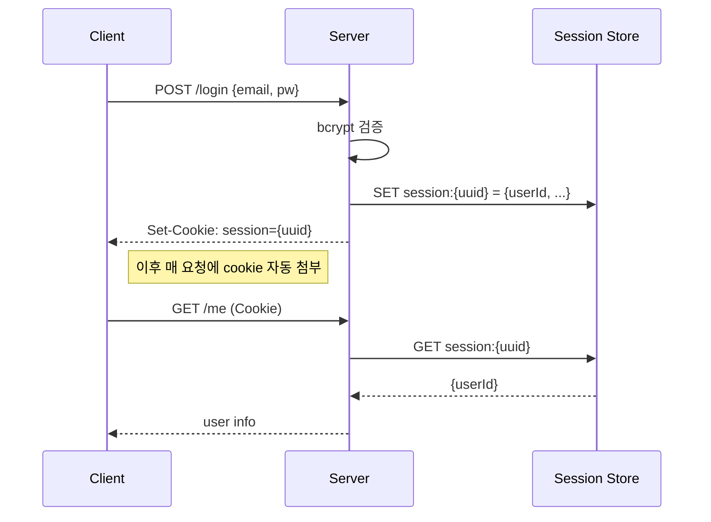
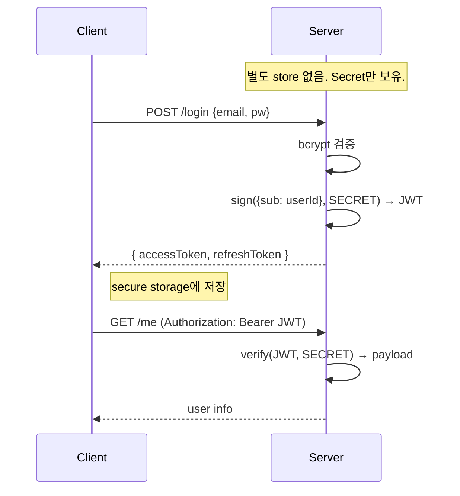

# JWT 인증 + Refresh 회전 패턴

> **작성일**: 2026-05-30
> **작성**: Claude (프롬프팅: @sikkzz)
> **학습 영역**: 인증/보안
> **관련 문서**: [Phase 2 Spec 4.1](../specs/phase-02-core-features.md), [ADR-0006 ORM](../decisions/0006-orm-typeorm.md), [메모리 auth-deep-dive-revisit](Phase 3/4/5 자동 인지)
>
> Phase 2 4.1 인증 본격 정복. 단순 시작 + 참조 패턴 비교 + Phase 후속 확장 시점 박제.

---

## 한 줄 요약

**JWT(Bearer header) + bcrypt + Stateless logout**로 Trailog 인증 시작. 모바일 only라 XSS/CSRF 위험 없는 컨텍스트 활용. 엔터프라이즈 패턴(3 token + 2FA + OAuth + 다층 캐싱 + service 11개)은 Phase 후속 자연 확장.

## 우리 프로젝트에서 어디에 쓰이는가

- **Phase 2 4.1**: 인증 본체 (회원가입/로그인/refresh/logout/me)
- Phase 2 4.3+ 모든 protected route (사진 업로드, 여행 조회 등)에서 JwtAuthGuard로 보호
- Phase 4 출시 시 Stateful 전환 검토 (Redis blacklist 또는 token rotation — `auth-deep-dive-revisit` 메모리)

---

## 1. JWT vs Session — 동작 메커니즘

### Session (Stateful)



### JWT (Stateless)



### 비교 표

| 항목                 | Session                             | JWT                                        |
| -------------------- | ----------------------------------- | ------------------------------------------ |
| 서버 상태            | Redis/DB 필요                       | **Secret만**                               |
| 확장성 (수평 스케일) | session sticky 또는 공유 store 필요 | **stateless — 어디서나 검증**              |
| 즉시 무효화 (logout) | ✅ store에서 삭제                   | ❌ 만료까지 유효 (Stateless 한정)          |
| 페이로드 사이즈      | session ID만 (짧음)                 | payload + signature (긴 편)                |
| 모바일 친화성        | cookie 다루기 복잡                  | **Bearer header가 표준**                   |
| 마이크로서비스       | 공유 store + 네트워크 비용          | **각 service가 secret만 알면 검증**        |
| 도난 위험 시         | store에서 즉시 삭제 가능            | 만료까지 유효 (회피책: rotation/blacklist) |

### Trailog 채택 사유

✅ **JWT (Stateless)** —

1. 모바일 only → cookie 이점 무용 (XSS/CSRF 위험 X)
2. 사이드 인프라 단순 (Redis session store 추가 부담 X)
3. Phase 4 출시 후 즉시 무효화 필요 시 Redis blacklist로 확장 (`auth-deep-dive-revisit`)

---

## 2. Token 구성 — Header / Payload / Signature

JWT는 `xxx.yyy.zzz` 세 부분.

```
eyJhbGciOiJIUzI1NiIsInR5cCI6IkpXVCJ9 . eyJzdWIiOiJhYmMxMjMiLCJleHAiOjE3...} . SflKxwR...
└─── Header (base64) ────┘ └────── Payload (base64) ─────────┘ └── Signature
```

**Header**: 알고리즘 명시 — `{ "alg": "HS256", "typ": "JWT" }`

**Payload (Claims)**:

- 표준: `sub` (subject), `iat` (issued at), `exp` (expiration), `jti` (JWT ID)
- 우리 패턴: `{ sub: user.id, email: user.email, iat, exp }`
- ⚠️ **base64는 암호화 X — 평문 디코딩 가능**. 비밀번호/민감 정보 절대 X.

**Signature**: `HMAC-SHA256(base64(Header) + "." + base64(Payload), SECRET)` — secret 모르면 위조 불가.

### 디코딩 도구

[jwt.io](https://jwt.io) — token 붙여넣으면 Header/Payload 디코딩 + Signature 검증 시도. **단 secret 입력 X** (외부 사이트에 secret 노출 X).

### Secret이 유출되면

→ 누구나 signature 위조 가능 → 누구나 임의 user로 가장 → **즉시 secret 회전** (env 갱신 + 모든 user 재로그인 강제).

→ 그래서 **access secret + refresh secret 분리**: 한쪽 유출 시 다른 쪽으로 발급된 token은 안전 + 회전이 쉬움.

---

## 3. Access vs Refresh — 분리 이유

| Token       | 만료     | 사용처                      | 도난 위험          |
| ----------- | -------- | --------------------------- | ------------------ |
| **Access**  | **15분** | 매 API 요청 (Bearer header) | 노출 빈도 ↑ — 짧게 |
| **Refresh** | **7일**  | `/auth/refresh`에서만       | 노출 빈도 ↓ — 길게 |

### 왜 짧/긴 분리?

- **Access를 14일 이상**: 도난 시 14일+ 위험. ❌
- **Refresh를 15분**: 사용자 매 15분 재로그인. ❌
- **분리** ⭐: 평소엔 access 사용(매 요청), refresh는 access 갱신 때만 → refresh 노출 최소화.

### Secret 분리 — 우리 패턴

```typescript
JWT_SECRET=                    // access용
JWT_REFRESH_SECRET=            // refresh용 (반드시 다른 값)
```

→ 한쪽 유출 시 다른 쪽 안전 + 각각 독립적 회전.

### Payload 최소화

```typescript
// Access
{ sub: user.id, email: user.email }   // email은 편의 (UI에서 사용)

// Refresh
{ sub: user.id }                       // email 없음 — 최소 노출 원칙
```

Refresh는 access 재발급 외 용도 없으므로 sub만으로 충분.

---

## 4. 저장 + 전송 — Bearer header vs Cookie

[Phase 2 Q2 결정 박제](../specs/phase-02-core-features.md#9-미정-사안-open-questions) 참고. 요약:

| 항목             | Bearer header (Trailog 채택)          | Cookie                         |
| ---------------- | ------------------------------------- | ------------------------------ |
| 저장 위치        | expo-secure-store (Keychain/Keystore) | 브라우저 cookie jar            |
| XSS 취약성 (웹)  | localStorage 노출 시 도난             | httpOnly면 JS 접근 X           |
| CSRF 취약성 (웹) | 자동 첨부 X → 안전                    | 자동 첨부 → CSRF token 필수    |
| 모바일 적합도    | **표준**                              | 드뭄 (RN cookie jar 보안 약함) |
| 명시적 제어      | 명시적 header                         | 자동 첨부 (개발자 제어 ↓)      |

### 결정: Bearer header (Trailog)

- Trailog 모바일 only → XSS/CSRF 위험 자체 X
- Keychain/Keystore가 OS 레벨 암호화로 안전
- 참조 (실무 웹) CSRF token 도입 사유 모바일엔 무용

### 참조 패턴 비교

회사는 **3 token (access + refresh + CSRF)** — cookie 패턴 추측. 자세히는 참조 코드의 cookie 설정 부분 확인 가능.

---

## 5. Refresh 패턴 3종

### Stateless (Trailog 채택) ⭐

```typescript
// logout
async logout(): Promise<void> {
  // no-op. 클라이언트가 secure storage에서 삭제.
}
```

|             |                  |
| ----------- | ---------------- |
| 동작        | 만료까지 유효    |
| 도난 시     | 7일까지 위험     |
| 인프라      | 0 — secret만     |
| 즉시 무효화 | ❌               |
| 사이드 학습 | ⭐⭐⭐ 단순 시작 |

### Blacklist (Redis 또는 DB)

```typescript
// logout
await redis.set(`bl:${jti}`, '1', 'EX', refreshExpiresSec);

// verify
if (await redis.get(`bl:${jti}`)) throw new UnauthorizedException();
```

|           |                             |
| --------- | --------------------------- |
| 동작      | 매 verify 시 blacklist 확인 |
| 도난 시   | **즉시 무효화 가능**        |
| 인프라    | Redis 필요                  |
| 비용      | 매 요청 Redis 1 hop         |
| 참조 적용 | ✅ (메모리상 추정)          |

### Token Rotation (참조 변형)

```typescript
// refresh 사용 시
const oldRefresh = decode(refreshToken);
if (oldRefresh.tokenVersion !== user.tokenVersion) {
  // 이미 사용된 refresh 또는 회전됨 — 도난 의심
  throw new UnauthorizedException('refresh token 재사용 감지');
}
user.tokenVersion += 1;  // 새 버전
await save(user);
return { accessToken: new, refreshToken: new };  // 새 refresh
```

|           |                                             |
| --------- | ------------------------------------------- |
| 동작      | refresh 사용 시 새 refresh 발급 + 기존 무효 |
| 도난 시   | **재사용 시도하면 즉시 감지** → 강제 logout |
| 인프라    | DB에 tokenVersion 컬럼                      |
| 비용      | refresh 시 DB write                         |
| 학습 가치 | ⭐⭐⭐ (보안 모델 정복)                     |

### Phase 전환 시점 (메모리 박제 연동)

`auth-deep-dive-revisit` 메모리 박제 기준:

```
Phase 4 출시 직전 → Stateful logout (Redis blacklist) + Token rotation
Phase 4 운영 부하 → 다층 캐싱 (Request + Redis + DB)
```

Phase 3까진 Stateless 유지.

---

## 6. bcrypt 깊이 정복

### 동작 메커니즘

```
hash = bcrypt.hash(password, cost=10)
     = $2b$10$<22자salt><31자hash>
     // $2b = 알고리즘 식별
     // 10 = cost factor (2^10 = 1024 rounds)
     // salt와 hash가 하나의 string에 통합
```

### Salt 자동 + 저장 통합

```typescript
const hash = await bcrypt.hash('mypassword', 10);
// $2b$10$nOUIs5kJ7naTuTFkBy1veu2g5l4..o0LZj.l4MUNZi...

// salt가 hash 결과에 포함됨 → 별도 컬럼 저장 X
const isValid = await bcrypt.compare('mypassword', hash);
// → bcrypt가 hash에서 salt 추출 + 같은 알고리즘으로 재계산 + 비교
```

### Cost Factor

| Cost              | Rounds | 시간 (2026 일반 서버) |
| ----------------- | ------ | --------------------- |
| 8                 | 256    | ~10ms                 |
| **10** ⭐ Trailog | 1,024  | ~80ms                 |
| 12                | 4,096  | ~250ms                |
| 14                | 16,384 | ~1s                   |

권장: **2026 OWASP는 12+** 권장. 사이드는 10도 OK (학습 단계).

→ Phase 4 출시 직전 12로 상향 검토 (`auth-deep-dive-revisit` 메모리에 추가할만).

### Time-constant Compare

`bcrypt.compare`는 byte-by-byte 비교가 아니라 **timing attack 방어** 알고리즘. 일반 `===`는 typo 위치에 따라 응답 시간 미세 차이 → 공격자가 brute-force 추론 가능.

### 72 byte 한계

bcrypt는 **input의 72 byte 이후 무시**. 그래서 우리 DTO:

```typescript
@MaxLength(72)  // 안 막으면 73+ 비밀번호의 뒷부분이 검증에서 무시됨
```

ASCII 영어는 1자 = 1 byte. 한글 UTF-8은 1자 = 3 byte → 한글 24자 = 72 byte. 안전한 max는 charset 따라 다름.

### 참조 패턴

참조 코드의 cost factor는 별도 확인 필요. 보통 10~12 범위.

---

## 7. 참조 인증 시스템 본격 비교

### 참조 패턴 한 줄 요약

**3 token (access + refresh + CSRF) + 2FA 4종 (SMS/Email/App/Authenticator) + OAuth 2종 (카카오/네이버) + IP whitelist + 다층 캐싱 (3단계) + 로그 중요도별 알림 + Service 11개 + Guard 9개**.

자세한 분석: 메모리 `auth-deep-dive-revisit` + `project-참조 백엔드-context` 참고.

### Trailog 채택 / 거부 / Phase 후속 표

| 참조 패턴                              | Trailog 시점 | 사유                       |
| -------------------------------------- | ------------ | -------------------------- |
| **Bearer header JWT**                  | ✅ Phase 2   | 모바일 표준                |
| **bcrypt password hash**               | ✅ Phase 2   | NestJS 표준                |
| **3 token (CSRF 추가)**                | ❌ 영구      | 모바일 only — CSRF 위험 X  |
| **JwtAuthGuard + @CurrentUser**        | ✅ Phase 2   | 401 throw 안전망까지 채택  |
| **OptionalAuth Guard / decorator**     | ⏳ Phase 3   | 선택적 인증 route 등장 시  |
| **PasswordService 분리**               | ⏳ Phase 3   | 비밀번호 변경/리셋 도입 시 |
| **last_login_at + failed_login_count** | ⏳ Phase 3   | 운영 흔한 요구             |
| **2FA 4종**                            | ⏳ Phase 5   | B2C 옵션                   |
| **OAuth (카카오/구글)**                | ⏳ Phase 5   | 한국 사용자 친화           |
| **Stateful logout (Redis blacklist)**  | ⏳ Phase 4   | 즉시 무효화                |
| **Token Rotation**                     | ⏳ Phase 4   | 도난 감지                  |
| **다층 캐싱 (3단계)**                  | ⏳ Phase 4   | DB 부하 발생 시            |
| **IP whitelist**                       | ❌ 영구      | B2B 전용                   |
| **Service 11개 분리**                  | ⏳ 점진      | SRP 자연 적용              |
| **Log 중요도별 알림**                  | ⏳ Phase 4   | 보안 분석/감사             |

---

## 8. NestJS 통합 — Passport / Guard / Decorator

### 구조

```
@nestjs/passport       — Passport와 NestJS DI 통합 helper
passport               — Node.js 인증 미들웨어 (500+ strategy)
passport-jwt           — JWT strategy 구현체

apps/server/src/auth/
├── strategies/jwt.strategy.ts  — PassportStrategy(Strategy) 상속
├── guards/jwt-auth.guard.ts    — AuthGuard('jwt') 상속
└── decorators/current-user.decorator.ts  — createParamDecorator
```

### JwtStrategy.validate() — DB 조회 + req.user 박제

```typescript
async validate(payload: JwtPayload): Promise<User> {
  const user = await this.usersService.findById(payload.sub);
  if (!user) throw new UnauthorizedException();
  return user;
}
```

Strategy가 signature/expiration 검증 후 호출. 반환된 user → `req.user`에 박힘 → controller에서 `@CurrentUser()`로 접근.

### @CurrentUser 안전망 (참조 패턴 채택)

```typescript
export const CurrentUser = createParamDecorator((_data: unknown, ctx: ExecutionContext): User => {
  const request = ctx.switchToHttp().getRequest<{ user?: User }>();
  if (!request.user) {
    // @UseGuards(JwtAuthGuard) 빠진 route 방어
    throw new UnauthorizedException('인증 정보가 없습니다');
  }
  return request.user;
});
```

참조의 `@UserParam`과 동일 패턴. 새 dev가 `@UseGuards` 깜빡한 시나리오 방어.

---

## 9. Swagger 통합 — addBearerAuth + @ApiBearerAuth

```typescript
// main.ts
.addBearerAuth({ type: 'http', scheme: 'bearer', bearerFormat: 'JWT' }, 'access-token')

// auth.controller.ts
@Get('me')
@UseGuards(JwtAuthGuard)
@ApiBearerAuth('access-token')  // ← Swagger UI에서 Authorize 버튼 표시
```

→ Q2 결정(Bearer header)과 1:1 일치. Swagger UI에서 인터랙티브 테스트 시 token 박제 후 자동 사용.

참조 패턴: 동일 + `@ApiOkResponse({ type: RestResponse })` wrapper. Trailog는 단순 시작.

---

## 10. 흔한 함정 8종

### 1. ⚠️ Secret 약하게

`JWT_SECRET=secret` 같은 값 → brute-force 즉시 뚫림.

→ `openssl rand -hex 32` (256-bit) 권장. 운영은 fly secrets로 주입.

### 2. ⚠️ Access/Refresh secret 동일 사용

```typescript
// 잘못
JWT_SECRET = JWT_REFRESH_SECRET = 'abc';
```

→ access secret 유출 시 refresh도 동시 유출. 키 회전 시 두 종 모두 영향.

→ **반드시 별개 secret**.

### 3. ⚠️ 웹에서 localStorage 저장 — XSS 위험

```javascript
localStorage.setItem('access', accessToken); // ❌ 외부 JS 도난 가능
```

→ httpOnly cookie 또는 in-memory 저장 + refresh로 갱신. 모바일엔 해당 X.

### 4. ⚠️ Refresh를 access와 같은 secret/payload

```typescript
// 잘못
const refresh = jwt.sign({ sub, email, role }, ACCESS_SECRET, { expiresIn: '7d' });
```

→ refresh가 access로 사용될 수 있음. role/email 노출 7일.

→ **별개 secret + 최소 payload (sub만)**.

### 5. ⚠️ 만료 검증 안 함

```typescript
// 잘못
jwt.verify(token, SECRET, { ignoreExpiration: true });
```

→ 만료된 token 그대로 통과 → 영구 사용 가능.

→ **default false 유지**.

### 6. ⚠️ user.password 응답에 포함

```typescript
return await this.userRepo.findOne({ where: { id } });
// → User entity의 password 컬럼이 응답에 포함될 수 있음
```

→ Trailog는 entity에 `@Column({ select: false })`로 기본 조회에서 제외. 인증 시만 `addSelect('user.password')`로 명시적 가져옴.

### 7. ⚠️ bcrypt 동기 함수 사용

```typescript
// 잘못 — 이벤트 루프 차단
bcrypt.hashSync(password, 10);
```

→ 80ms 동안 다른 요청 처리 X.

→ **항상 `hash` (async)**.

### 8. ⚠️ logout 후에도 token 유효 — Stateless 한계 인지

Trailog의 logout은 stateless (no-op). **logout 후에도 token이 만료 전엔 유효**. 사용자가 logout했다고 100% 믿으면 위험.

→ Phase 4에 Redis blacklist 도입 (`auth-deep-dive-revisit` 메모리).

---

## 11. 더 파볼 거리 (Phase 후속)

- **JWE (encrypted JWT)** — Payload도 암호화. 민감 정보 박을 때.
- **PASETO** — JWT 대안. 더 안전한 default + 헤더 변조 불가.
- **회원 탈퇴 후 모든 token 무효화** — User에 `tokenVersion` 컬럼 + payload에 박제. 탈퇴 시 ++. (Token Rotation의 변형)
- **OAuth 2.0 PKCE flow** — 모바일 앱이 직접 OAuth 시 PKCE로 client secret 노출 방어.
- **Apple/Google Sign In with JWT** — Phase 5+ 한국 사용자 친화 OAuth 변형.
- **Sliding session** — refresh 시 만료 7일 자동 연장 (활성 사용자 안 잘림).
- **Device fingerprinting** — 한 user의 token이 다른 device에서 사용 시 감지.

---

## 12. 참고 링크

- [JWT 공식](https://jwt.io/)
- [JWT RFC 7519](https://datatracker.ietf.org/doc/html/rfc7519)
- [OWASP JWT Cheat Sheet](https://cheatsheetseries.owasp.org/cheatsheets/JSON_Web_Token_for_Java_Cheat_Sheet.html)
- [bcrypt 알고리즘 분석](https://en.wikipedia.org/wiki/Bcrypt)
- [@nestjs/passport docs](https://docs.nestjs.com/recipes/passport)
- [PASETO (JWT 대안)](https://paseto.io/)
- 관련 메모리: `auth-deep-dive-revisit`, `error-handling-revisit`, `관련 메모리`

## 13. 추가 학습 기록

> 같은 토픽으로 추가 학습한 내용은 아래에 날짜 헤더로 누적.
