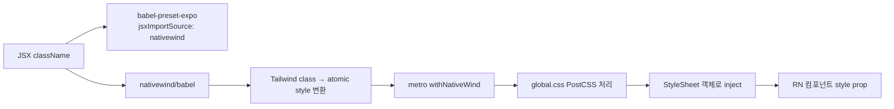

# 모바일 디자인 시스템 + NativeWind v4 (Tailwind for RN)

> **작성일**: 2026-06-08
> **작성**: Claude (프롬프팅: @sikkzz)
> **학습 영역**: #6 모바일 네이티브 (PROJECT_ROOT 2장) + UI/UX 고도화
> **관련 문서**: [Phase 2 Spec 4.8](../specs/phase-02-core-features.md), [ADR-0011 NativeWind](../decisions/0011-mobile-design-system-nativewind.md)

---

## 한 줄 요약

React Native에서 **디자인 시스템 lib**는 **iOS+Android 일관된 경험 + 다크모드 + 디자인 토큰 단일 출처**가 본질. 옵션은 크게 **NativeWind (Tailwind for RN)** / **Tamagui (자체 컴포넌트 + theme)** / **Restyle (TS theme)** / **자체 StyleSheet + Context** 4가지. 도메인 + 참조 패턴 친숙도 + 팀 규모에 따라 선택. **Trailog는 NativeWind 채택** — 참조 Web Tailwind 친숙도 transfer + `className` API + `dark:` prefix 자동 다크모드 + 점진 마이그레이션 자유.

## 우리 프로젝트에서 어디에 쓰이는가

- **Phase 2 4.8 D2-1**: NativeWind v4 셋업 (babel + metro + tailwind.config + global.css)
- **Phase 2 4.8 D3**: 8개 화면 `StyleSheet.create({...})` → `className="..."` 점진 마이그레이션
- **Phase 후속**: 새 화면 + 컴포넌트는 처음부터 className, 디자인 토큰 추가는 `tailwind.config.js` 한 곳

## 어떻게 동작하는가

### NativeWind v4 빌드 파이프라인



→ 결국 runtime엔 `StyleSheet.create` 와 동일한 결과. className은 **빌드 타임 변환**.

### 설정 파일 4종

```js
// babel.config.js
module.exports = function (api) {
  api.cache(true);
  return {
    presets: [['babel-preset-expo', { jsxImportSource: 'nativewind' }], 'nativewind/babel'],
  };
};

// metro.config.js
const { withNativeWind } = require('nativewind/metro');
const config = getDefaultConfig(projectRoot);
module.exports = withNativeWind(config, { input: './global.css' });

// global.css
@tailwind base;
@tailwind components;
@tailwind utilities;

// tailwind.config.js — 디자인 토큰 단일 출처
module.exports = {
  content: ['./src/**/*.{js,jsx,ts,tsx}'],
  presets: [require('nativewind/preset')],
  darkMode: 'media', // useColorScheme() 자동 인지
  theme: { extend: { colors, fontFamily, fontSize, spacing, borderRadius } },
};
```

### 사용 패턴

```tsx
// Before (StyleSheet)
<View style={styles.container}>
  <Text style={styles.title}>Trailog</Text>
</View>;
const styles = StyleSheet.create({
  container: { flex: 1, backgroundColor: '#fff', padding: 24 },
  title: { fontSize: 32, fontWeight: '700', color: '#1a1a1a' },
});

// After (NativeWind)
<View className="flex-1 bg-background dark:bg-background-dark p-6">
  <Text className="font-pretendard-bold text-4xl text-text-primary dark:text-text-primary-dark">
    Trailog
  </Text>
</View>;
```

### dark: prefix 자동 분기

```tsx
<Text className="text-text-primary dark:text-text-primary-dark">
  자동으로 시스템 라이트/다크 따라감
</Text>
```

→ `darkMode: 'media'` strategy로 `useColorScheme()` 결과를 자동 인지. **별도 `useColorScheme` import / theme provider 불필요**.

## 핵심 개념

### 디자인 토큰 단일 출처

**Trailog `tailwind.config.js`의 theme.extend**:

- **colors**:
  - `primary` (earthy brown 50~900 scale) — 발자취 정체성
  - `background` / `surface` / `border` / `text-*` — light + dark 각각 (light는 토큰명 그대로, dark는 `-dark` suffix)
  - `success` / `danger` / `warning` / `info` — semantic
- **fontFamily**: `pretendard` / `pretendard-medium` / `pretendard-semibold` / `pretendard-bold`
- **fontSize**: `2xs ~ 5xl` — 한국어 가독성 고려 (영문 14 → 한국 15가 자연)
- **borderRadius**: `sm` 6 / `DEFAULT` 12 / `lg` 16 / `full` 9999 — 토스/당근 표준

### 4개 lib 비교

| lib               | 채택 사유            | 패턴                 | 다크모드              | 학습 곡선            |
| ----------------- | -------------------- | -------------------- | --------------------- | -------------------- |
| **NativeWind**    | Web Tailwind 친숙    | className            | `dark:` prefix 자동   | ↓ (Tailwind 알면 끝) |
| Tamagui           | 성능 + 자체 컴포넌트 | `<Stack>` + variants | theme switch + tokens | ↑                    |
| Restyle (Shopify) | TS theme 안정        | StyleSheet 기반      | useTheme + props      | 중                   |
| 자체 + Context    | 학습 가치            | 직접 구현            | useColorScheme + 분기 | —                    |

### NativeWind v4 vs v2/v3

- **v2/v3**: runtime style processor — 빌드 시 변환 못 한 일부 클래스 runtime에서 처리, 성능 ↓
- **v4** (Trailog 채택): **build time만** — atomic class 사전 생성, runtime cost 0
- **v4의 reanimated 의존**: animation class 처리 — `react-native-reanimated` peerDep

### 참조 (Web) Tailwind ↔ Mobile NativeWind transfer

| 영역                 | Web Tailwind                          | Mobile NativeWind                    |
| -------------------- | ------------------------------------- | ------------------------------------ |
| class 문법           | 동일 (`bg-blue-500`, `flex`, `gap-4`) | 동일                                 |
| hover/focus          | ✅ 지원                               | ❌ (모바일은 active 상태만)          |
| container query      | ✅ (Tailwind 3.4+)                    | ❌                                   |
| 다크모드             | `class` / `media` strategy            | `media` strategy 활용                |
| `dark:` prefix       | ✅                                    | ✅                                   |
| font family          | `font-sans`                           | **fontFamily 토큰 등록 + className** |
| 반응형 (`sm:`/`md:`) | ✅                                    | ✅ (Dimensions 기반)                 |
| inline `style={}`    | 가능 (탈출구)                         | 가능 (Pressable의 함수 style 등)     |

→ **80% transfer**. Web Tailwind 자산 그대로 모바일.

## 왜 다른 선택지가 아닌 이걸 골랐나

| 대안              | 거부 사유                                                         |
| ----------------- | ----------------------------------------------------------------- |
| Tamagui           | 학습 곡선 ↑ + 참조 패턴(Tailwind)과 불일치 → transfer 가치 ↓      |
| Restyle           | className API 없음 + theme switch 수동 → 다크모드 prefix 편리함 ↓ |
| 자체 + Context    | 1인 사이드 + 1주 호흡 unfit + 일관성 강제 X (개발자 자율)         |
| StyleSheet 그대로 | 폴리시 wave 목적과 정면 충돌 — 디자인 토큰 단일 출처 X            |

자세한 트레이드오프는 [ADR-0011](../decisions/0011-mobile-design-system-nativewind.md) 참고.

## 흔한 함정

1. **Metro cache 함정** — babel/tailwind config 변경 후엔 `pnpm dev:clear`로 cache invalidate 필수. 안 하면 className 무시되고 시각 변화 없음.
2. **Reanimated 추가 = native rebuild** — `pnpm expo prebuild --clean` + `expo run:ios/android` 필요.
3. **NativeWind v3 → v4 마이그레이션 시 setup 변경** — babel `jsxImportSource` 옵션, metro `withNativeWind`, global.css 필수. 구버전 docs 따라가면 깨짐.
4. **expo-system-ui 누락** — `app.json` `"userInterfaceStyle": "automatic"` 박혀도 `expo-system-ui` 없으면 OS native에 전달 X → dark: prefix 적용 X. 함정 박제.
5. **dark mode 토큰 명명** — `dark:bg-background-dark` 같이 별도 토큰 만들면 길어짐. Tailwind v4의 CSS 변수 + `darkMode: 'class'` 활용 시 단축 가능 (NativeWind v4 추후 검토).
6. **Pressable + className 충돌** — `style={({ pressed }) => ...}` 함수 형식 + className 동시 사용 시 함수 style이 className override. 둘 다 쓰지 말 것 (또는 `active:opacity-80` className으로 대체).
7. **TextInput placeholderTextColor** — className 아닌 prop. 다크모드 자동 X — 직접 분기 필요.
8. **gap 클래스** — Tailwind `gap-2` (8px) 등 RN 0.71+에서 지원. 구버전이면 마진으로 대체.
9. **inset-0 등 일부 한정 클래스** — RN web 한정. 사용 시 모바일에선 무시 가능.
10. **typed routes typegen 지연** — Expo Router의 className은 영향 X but `as never` cast는 typegen 안정 후 제거 — NativeWind와 무관.

## 더 파볼 거리

- **NativeWind v4의 CSS 변수 + Tailwind v4 통합** — 토큰을 CSS 변수로 박아 컬러 동적 전환
- **Tamagui 깊이 정복** — 의도적 다양화 영역. Trailog 다른 사이드 또는 Phase 후속에 도입 검토
- **Reanimated 3 + NativeWind v4** — atomic class 애니메이션 처리 (worklet 기반 60fps)
- **NativeWind plugins** — `tailwindcss-animate` 같은 third-party plugin 호환성
- **shadcn-ui RN 대응** — 참조 shadcn 패턴을 mobile에서 어떻게 — `@gluestack-ui` / `nativewindui.com` 같은 component lib 등장
- **디자인 토큰 도구화** — Figma → Tailwind 토큰 자동 sync (Figma Tokens, Style Dictionary)
- **다크모드 + dynamic theming** — 사용자가 light/dark 외 custom theme 선택

## 참고 링크

- [NativeWind v4 docs](https://www.nativewind.dev/)
- [Tailwind CSS](https://tailwindcss.com/)
- [ADR-0011 NativeWind](../decisions/0011-mobile-design-system-nativewind.md)
- [Tamagui](https://tamagui.dev/)
- [Restyle (Shopify)](https://github.com/Shopify/restyle)
- [NativeWindUI (shadcn 대응)](https://nativewindui.com/)

## 추가 학습 기록

> 같은 토픽으로 추가 학습한 내용은 아래에 날짜 헤더로 누적.
