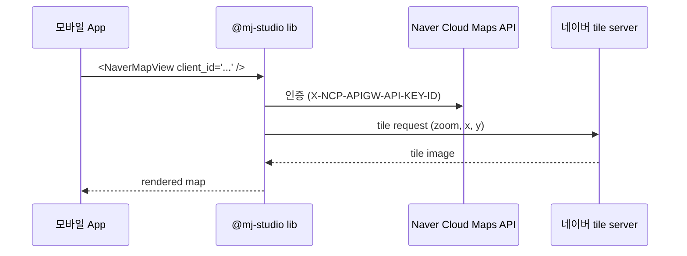

# 모바일 지도 라이브러리 비교 (RN 생태계 + 한국 시장)

> **작성일**: 2026-06-07
> **작성**: Claude (프롬프팅: @sikkzz)
> **학습 영역**: #3 지도 / 데이터 시각화 (PROJECT_ROOT 2장)
> **관련 문서**: [Phase 2 Spec 4.7](../specs/phase-02-core-features.md), [ADR-0009 (superseded)](../decisions/0009-mobile-map-library-react-native-maps.md), [ADR-0010 (네이버맵 채택)](../decisions/0010-mobile-map-library-naver-map.md)

---

## 한 줄 요약

React Native 모바일 지도 lib는 **글로벌 표준 (react-native-maps / expo-maps / MapLibre)** 과 **한국 시장 SDK (네이버맵 / 카카오맵)** 두 갈래로 나뉜다. **Trailog는 도메인을 한국 사용자 중심으로 재정의 ([ADR-0010](../decisions/0010-mobile-map-library-naver-map.md))** 한 후 `@mj-studio/react-native-naver-map` 채택. 글로벌 lib은 한국 데이터 약점, 한국 lib은 글로벌 데이터 약점이라 **도메인 우선순위가 lib 선택을 결정**.

## 우리 프로젝트에서 어디에 쓰이는가

- **Phase 2 4.7 지도 표시**: `(tabs)/map` 화면에서 본인 사진 위치 marker + bbox 쿼리 + cluster
- **Phase 2 4.7 사진 상세 미니맵**: photo detail 화면의 정적 미니맵 (gesture X) + 단일 marker
- **Phase 후속 글로벌 출시 검토 시점**: 해외 사진 지원 위해 multi-provider 또는 글로벌 lib 추가 ([ADR-0010 재검토 트리거](../decisions/0010-mobile-map-library-naver-map.md#재검토-트리거))

## 어떻게 동작하는가

### 라이브러리 4분류

```mermaid
graph TD
    A[모바일 지도 lib] --> B[글로벌 표준]
    A --> C[한국 시장]
    B --> B1[react-native-maps<br/>Airbnb, 8.5k★]
    B --> B2[expo-maps<br/>Expo 공식 SDK 53+]
    B --> B3[MapLibre RN<br/>Mapbox GL fork OSS]
    C --> C1[@mj-studio/react-native-naver-map<br/>v2.9.0, MIT]
    C --> C2[react-native-kakao-maps<br/>community lib]
```

### react-native-maps (글로벌 표준)

```typescript
<MapView
  initialRegion={{ latitude, longitude, latitudeDelta, longitudeDelta }}
  provider={PROVIDER_GOOGLE}  // iOS는 Apple Maps default
>
  <Marker coordinate={{ latitude, longitude }} />
</MapView>
```

- **iOS = Apple Maps (한국 카카오 tile 자동), Android = Google Maps** (provider 옵션)
- delta(위경도 차이) 기반 region 모델
- `<Marker>` 직접 자식 + Heatmap/Polyline/Polygon 풍부
- Expo config plugin 통합 안정

### `@mj-studio/react-native-naver-map` (한국)

```typescript
<NaverMapView
  initialCamera={{ latitude, longitude, zoom: 14 }}
  onCameraIdle={({ region }) => /* bbox 변환 */}
>
  <NaverMapMarkerOverlay latitude={...} longitude={...} image={{ symbol: 'red' }} />
</NaverMapView>
```

- **양쪽 OS 동일 네이버 tile** (한국 데이터)
- `camera{latitude,longitude,zoom}` zoom 단위 좌표 모델 (구글지도/카카오 API와 일관)
- `<NaverMapMarkerOverlay>` overlay 시스템 + `clusters` prop 자체 cluster 지원
- New Architecture (Fabric) 호환 명시
- NCP Application 등록 필요 (Client ID + bundle ID 제한)

### NCP Maps 사용 흐름



## 6가지 lib 비교

| 항목                   | react-native-maps | expo-maps       | MapLibre   | **네이버맵**    | 카카오 RN    | Google Maps SDK |
| ---------------------- | ----------------- | --------------- | ---------- | --------------- | ------------ | --------------- |
| 한국 도로/지명         | ⭐⭐              | ⭐⭐            | ⭐         | ⭐⭐⭐          | ⭐⭐⭐       | ⭐⭐            |
| 해외 데이터            | ⭐⭐⭐            | ⭐⭐⭐          | ⭐⭐       | ❌              | ❌           | ⭐⭐⭐          |
| RN/Expo 통합 안정      | ✅                | ✅✅ (공식)     | ⚠️         | ✅              | ⚠️ community | ❌ direct X     |
| Cluster                | 외부 lib          | 직접 구현       | 외부 lib   | ✅ 자체 props   | 비공식       | 외부 lib        |
| 비용                   | Google Maps key   | Google Maps key | 무료 (OSM) | 무료 (NCP 한도) | 무료 (한도)  | 유료            |
| 한국어 reverse geocode | OS별 차이         | OS별 차이       | 외부 API   | ✅ 한국어       | ✅ 한국어    | API key         |
| 학습 자료              | 가장 풍부         | Expo docs       | 적음       | 한국어 풍부     | 한국어 풍부  | 영어 풍부       |

## 왜 다른 선택지가 아닌 이걸 골랐나

### Trailog 채택 흐름


**supersede 핵심 사유**:

1. **Google/Apple Maps 한국 사용자 UX 거부감** — 본인 + 한국 사용자가 일상에서 카카오/네이버 사용 → 친숙도 ↓
2. **도메인 한국 사용자 중심 재정의** — 해외 사진은 Phase 후속(글로벌 출시 시점)으로 미룸
3. **카카오 vs 네이버** — RN/Expo 통합 안정성으로 네이버 우위 (`@mj-studio/react-native-naver-map`은 New Arch 호환 명시 + 공식 config plugin)

### 글로벌 lib 보류 사유

- **react-native-maps**: Android = Google Maps 강제. iOS Apple Maps는 한국 카카오 tile이지만 본인 UX 거부감 명시.
- **expo-maps**: 동일 (Apple + Google wrapper). Cluster 자체 미지원.
- **MapLibre**: 한국 도로 데이터 OSM 약함. 학습 곡선 ↑로 1주 호흡 부담.

### 카카오 비교 — 네이버가 우위인 부분

- **공식 RN SDK 부재** — 카카오는 native iOS/Android SDK만 공식. RN community lib은 유지보수 변동성 ↑
- **Expo config plugin 비공식** — `@mj-studio` 처럼 안정 + 공식 형태 X
- **인증** — 카카오 디벨로퍼스 가입은 쉽지만 RN 통합 안정성 검증 부담

## 흔한 함정 / 주의할 점

1. **react-native-maps Android는 Google Maps API key 필수** — 없으면 회색 지도만. 비용 임계 도달 시점 검토 트리거.
2. **NaverMap 좌표 순서**: `camera={latitude, longitude}` vs NCP API `coords=lng,lat` (GeoJSON 순서) — 헷갈리기 쉬움.
3. **네이버맵 Android 빌드 시 Maven repository 주입** 필수 — `expo-build-properties`의 `extraMavenRepos`에 `https://repository.map.naver.com/archive/maven` 박기.
4. **NCP Client Secret은 백엔드 only** — 모바일 bundle에 박으면 노출. 모바일에는 Client ID만 (bundle ID 제한).
5. **네이버맵 Application 등록 시 bundle ID 일관** — `com.trailog.app` 등 정확히. 다르면 인증 실패.
6. **`onCameraIdle` vs `onCameraChanged`** — Idle은 카메라 멈춤 후 1회 호출 (자체 debounce). Changed는 panning 중 매번. bbox 쿼리에는 Idle 권장.
7. **iOS Simulator Custom Location** — 영구 저장 (Simulator preferences). Android Emulator는 fused provider cache 한계로 영구 박기 어려움 (별도 학습 노트 `react-native-fundamentals-for-web-devs.md` 2026-06-07 추가).
8. **NCP는 신규 게이트웨이 (`maps.apigw.ntruss.com`)** — 구 `naveropenapi.apigw.ntruss.com`은 마이그레이션 진행 중이라 신규 Application은 신규 게이트웨이만 권한.
9. **클러스터 marker overlay vs children marker overlay 중복** — `clusters` props 박으면 children `<NaverMapMarkerOverlay>` 자식과 충돌 가능. 하나만 사용.
10. **react-native-maps의 cluster는 외부 lib** (`react-native-map-clustering`) — 네이버맵은 자체 `clusters` props 지원 → 의존성 ↓.

## 더 파볼 거리

- **MapLibre Vector Tile + Style Spec** — Mapbox GL 호환 OSS 스타일 시스템. 커스텀 디자인 깊이 정복 시점
- **NaverMap Custom Style Editor** — `customStyleId` prop으로 NCP Style Editor 생성 ID 적용. Trailog 브랜드 색상 정착 시점
- **Indoor Maps** — NaverMap 실내지도 (`isIndoorEnabled`) — 백화점/공항 등 도메인 확장 시
- **Offline Maps** — 글로벌 출시 검토 시 사용자 데이터 절약 패턴 (MapLibre + 로컬 tile cache)
- **OS native SDK 직접 통합** — `@mj-studio` 없이 iOS/Android native module 직접 작성 (학습 가치 ↑↑, ROI ↓)
- **react-native-maps vs MapLibre 성능 벤치마크** — 사진 10000+ marker rendering 비교
- **Mapbox SDK 유료 vs 무료** — Trailog 글로벌 출시 시점에 비용 모델 검토

## 참고 링크

- [@mj-studio/react-native-naver-map](https://www.npmjs.com/package/@mj-studio/react-native-naver-map)
- [React Native Naver Map docs](https://rnnavermap.mjstudio.net/)
- [Naver Cloud Platform — Maps](https://www.ncloud.com/product/applicationService/maps)
- [react-native-maps](https://github.com/react-native-maps/react-native-maps)
- [expo-maps](https://docs.expo.dev/versions/latest/sdk/maps/)
- [MapLibre RN](https://github.com/maplibre/maplibre-react-native)
- [Kakao Map SDK (native)](https://apis.map.kakao.com/web/guide/) — RN 공식 X
- [ADR-0009 (react-native-maps, superseded)](../decisions/0009-mobile-map-library-react-native-maps.md)
- [ADR-0010 (네이버맵, accepted)](../decisions/0010-mobile-map-library-naver-map.md)

## 추가 학습 기록

> 같은 토픽으로 추가 학습한 내용은 아래에 날짜 헤더로 누적.
