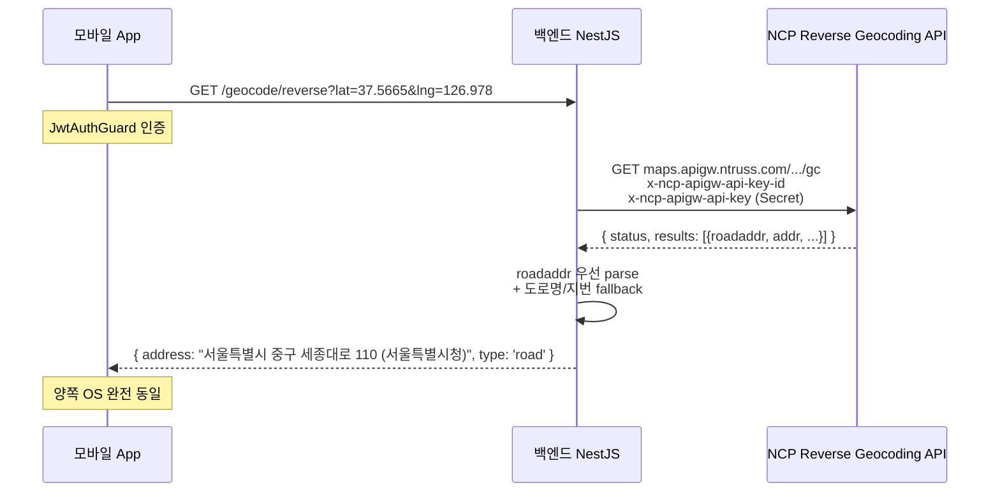

# NCP Reverse Geocoding + OS별 Geocoding 통일 (백엔드 proxy 패턴)

> **작성일**: 2026-06-07
> **작성**: Claude (프롬프팅: @sikkzz)
> **학습 영역**: #3 지도 / 데이터 시각화 + #1 인프라/배포 (외부 API 통합 패턴)
> **관련 문서**: [Phase 2 Spec 4.7](../specs/phase-02-core-features.md), [ADR-0010 네이버맵](../decisions/0010-mobile-map-library-naver-map.md), [모바일 지도 lib 비교](mobile-map-libraries-comparison.md)

---

## 한 줄 요약

좌표 → 주소 변환(reverse geocoding)을 **OS native (iOS Apple CLGeocoder, Android Google Geocoder)** 로 직접 호출하면 같은 좌표여도 결과 form이 달라 **UX 통일 X**. 단일 외부 API(NCP Reverse Geocoding)를 **백엔드 proxy** 로 호출해 한국어 통일 + Client Secret 보안 보호. 이건 외부 API 통합의 보편적 패턴 — 단일 source-of-truth + 인증 secret 백엔드 격리.

## 우리 프로젝트에서 어디에 쓰이는가

- **Phase 2 4.7 D6 사진 상세 화면**: 미니맵 + 한국어 주소 표시 ("서울특별시 중구 세종대로 110 (서울특별시청)")
- **Phase 후속 검색**: 도메인 명 검색 → 좌표 (Geocoding API — `apidocs.ncloud.com/.../map-geocoding`)
- **Phase 후속 공유 흐름**: 사진 공유 시 위치 텍스트 표시 (Phase 3+)

## 어떻게 동작하는가

### OS native Geocoding의 한계 — 시각

같은 좌표 (서울 시청, 37.5665, 126.978)를 iOS / Android에서 `expo-location.reverseGeocodeAsync` 호출:

```
iOS Apple CLGeocoder:
  { region: "서울특별시", street: "태평로1가, 세종대로", name: "서울특별시청" }
  → format: "서울특별시 태평로1가 세종대로 서울특별시청"

Android Google Geocoder:
  { region: "서울특별시", city: "중구", district: null,
    street: "태평로1가", streetNumber: "31" }
  → format: "서울특별시 중구 태평로1가 31"
```

→ **OS별 채워지는 field와 form이 본질적으로 다름**. `formatAddress` 노력만으로는 동일 form 만들 수 없음.

### 백엔드 proxy 흐름



### 백엔드 핵심 코드 (`apps/server/src/geocoding/geocoding.service.ts`)

```typescript
const NCP_REVERSE_GEOCODE_ENDPOINT = 'https://maps.apigw.ntruss.com/map-reversegeocode/v2/gc';

const url = new URL(NCP_REVERSE_GEOCODE_ENDPOINT);
// 헷갈리기 쉬움 — coords는 GeoJSON 순서 (lng, lat)
url.searchParams.set('coords', `${lng},${lat}`);
url.searchParams.set('orders', 'roadaddr,addr');
url.searchParams.set('output', 'json');

const response = await fetch(url, {
  headers: {
    'x-ncp-apigw-api-key-id': this.clientId,
    'x-ncp-apigw-api-key': this.clientSecret, // 백엔드 only
  },
});
```

### 응답 파싱 — 도로명 우선

NCP 응답 `results`는 order별 배열 (`roadaddr`, `addr`, `admcode`):

```typescript
// 도로명 (한국 주소 표준) — area1 + area2 + 도로명 + 번호 + 건물명
function buildRoadAddress(result): string {
  const { region, land } = result;
  const base = [region.area1?.name, region.area2?.name, land.name, land.number1]
    .filter(Boolean)
    .join(' ');
  const building = land.addition0?.type === 'building' ? ` (${land.addition0.value})` : '';
  return base + building;
}

// 지번 fallback — area1 + area2 + area3(동) + 번호
function buildJibunAddress(result): string {
  const { region, land } = result;
  return [region.area1?.name, region.area2?.name, region.area3?.name, land.number1]
    .filter(Boolean)
    .join(' ');
}
```

### 모바일 — React Query staleTime Infinity

```typescript
// apps/mobile/src/lib/geocoding/geocoding-queries.ts
export function useReverseGeocode(location: { latitude, longitude } | null) {
  return useQuery({
    queryKey: location ? geocodingKeys.reverse(location.latitude, location.longitude) : ...,
    queryFn: () => fetchReverseGeocode(location.latitude, location.longitude),
    enabled: location !== null,
    staleTime: Infinity,  // 좌표 주소는 영구 불변 — 한 번 받으면 재호출 X
    gcTime: 1000 * 60 * 60 * 24,
  });
}
```

→ 같은 좌표는 24시간 캐시 + 다른 화면에서도 hit.

## 핵심 개념

### 백엔드 proxy 패턴의 4가지 이점

1. **단일 source-of-truth** — OS 무관 동일 응답
2. **Client Secret 보안** — 모바일 bundle에 박으면 noopener 디컴파일 시 노출. 백엔드 `.env`만.
3. **응답 가공 자유** — 도로명/지번 우선순위, 건물명 부착, fallback 등 백엔드 정책
4. **사용량 관제** — Rate limiting / 인증 / 모니터링 한 곳

### Client ID vs Client Secret 보안 모델

| 자산                         | 노출 위험                                                    | 격리                                         |
| ---------------------------- | ------------------------------------------------------------ | -------------------------------------------- |
| **Client ID** (`p3qy2ctdv1`) | 모바일 bundle 박혀도 OK — bundle ID 제한 (`com.trailog.app`) | git 박혀도 OK                                |
| **Client Secret**            | 노출 시 사용자 도용 (다른 앱에서 사용 가능)                  | 백엔드 `.env` (.gitignored) 또는 EAS Secrets |

→ 모바일 `app.json`에 Client ID만, 백엔드 `.env`에 Client Secret만.

### Phase 4 prod 진입 시 추가 작업

- `app.json` → `app.config.js` 변환 + `process.env.NCP_CLIENT_ID` 동적 박기
- **EAS Secrets** 활용 — `eas secret:create --name NCP_CLIENT_ID --value=...`
- Fly.io 백엔드 — `fly secrets set NCP_CLIENT_SECRET=...`
- dev/prod 별도 Application 발급 검토 (현재는 같은 NCP Application 사용)

### NCP 게이트웨이 마이그레이션 함정

- **구**: `naveropenapi.apigw.ntruss.com` (NAVER OpenAPI — 2024+ 단종)
- **신**: `maps.apigw.ntruss.com` (NCP Maps — 신규 Application은 여기만 권한)

→ NCP 콘솔에서 신규 Application 등록 후 구 endpoint 호출하면 `errorCode: 210, message: Permission Denied`. 디버깅 시 endpoint URL부터 확인.

## 왜 다른 선택지가 아닌 이걸 골랐나

| 대안                                         | 거부 사유                                                          |
| -------------------------------------------- | ------------------------------------------------------------------ |
| **expo-location.reverseGeocodeAsync 그대로** | OS별 결과 form 다름 → UX 통일 X. iOS/Android 사용자 다른 경험      |
| **Google Geocoding API**                     | 한국 도로/지명 약함 + 유료 + Trailog는 한국 우선 도메인            |
| **Kakao Map API**                            | 사용 가능하지만 ADR-0010 네이버맵 채택 흐름과 일관성 ↓ (인증 별도) |
| **OSM Nominatim**                            | 무료지만 한국 데이터 약함                                          |
| **클라이언트에서 NCP 직접 호출**             | Client Secret 모바일 bundle 노출 위험 — 정석 X                     |

## 흔한 함정 / 주의할 점

1. **NCP coords 순서 [lng, lat]** — 일반 GPS [lat, lng]와 반대. GeoJSON 일관성이지만 일반 mental 모델과 충돌
2. **Client Secret git 박으면 봉인** — `.gitignore` 확인 필수. 한 번 git에 박힌 secret은 git history 전체에서 제거해야 (BFG Repo Cleaner 등)
3. **신규 게이트웨이 사용** — 구 URL은 신규 Application 권한 X
4. **헤더 case** — `x-ncp-apigw-api-key-id` 소문자가 표준 (HTTP 헤더 case-insensitive지만 일관성 ↑)
5. **응답 `status.code !== 0`** — 권한/한도 초과 등. `body.error` 같이 체크
6. **한국 외 좌표** — `results` 빈 배열 가능. address: null 반환 + 클라 fallback (raw 좌표)
7. **`address` 길이** — 도로명 + 건물명까지 박으면 한 줄 너무 길 수 있음. `numberOfLines={2}` 모바일 UI 박제
8. **rate limit** — NCP Maps 한도 3,000,000/월 (무료) — Trailog는 충분하지만 monitoring 필요
9. **`useReverseGeocode` staleTime Infinity** — 좌표 주소 영구 불변 가정. 행정구역 개편(드물지만) 시 cache invalidate 검토
10. **`fetch` Node.js global** — NestJS는 Node 18+ global fetch 사용. polyfill 불필요

## 더 파볼 거리

- **NCP Geocoding API** — 주소 → 좌표 (검색 기능 시점)
- **NCP Static Map API** — 미니맵 대신 정적 이미지 (data usage ↓)
- **NCP Directions API** — 길찾기 (Trailog 도메인엔 적용 X but 학습 가치)
- **Caching layer 추가** — Redis로 좌표→주소 24h 캐시 (백엔드 NCP 호출 절감)
- **NCP Maps Studio Style Editor** — 커스텀 지도 스타일 (Trailog 브랜드 색)
- **카카오 Local API 통합 비교** — 카카오 좌표→주소 API와 결과 비교
- **외부 API 의존성 fallback 패턴** — NCP 다운 시 expo-location fallback 등 다층 전략
- **API 호출 모니터링 / 로깅** — Datadog / Sentry 통합 패턴

## 참고 링크

- [NCP Reverse Geocoding API docs](https://api.ncloud-docs.com/docs/en/ai-naver-mapsreversegeocoding-gc)
- [NCP Geocoding API docs](https://api.ncloud-docs.com/docs/en/ai-naver-mapsgeocoding-geocode)
- [NCP Maps overview](https://guide.ncloud-docs.com/docs/en/maps-overview)
- [Naver Cloud Console — Maps Application](https://console.ncloud.com/naver-service/application)
- [Expo Location reverseGeocodeAsync (OS native — Trailog 사용 X)](https://docs.expo.dev/versions/latest/sdk/location/#locationreversegeocodeasynclocation-options)
- [ADR-0010 (네이버맵)](../decisions/0010-mobile-map-library-naver-map.md)

## 추가 학습 기록

> 같은 토픽으로 추가 학습한 내용은 아래에 날짜 헤더로 누적.
