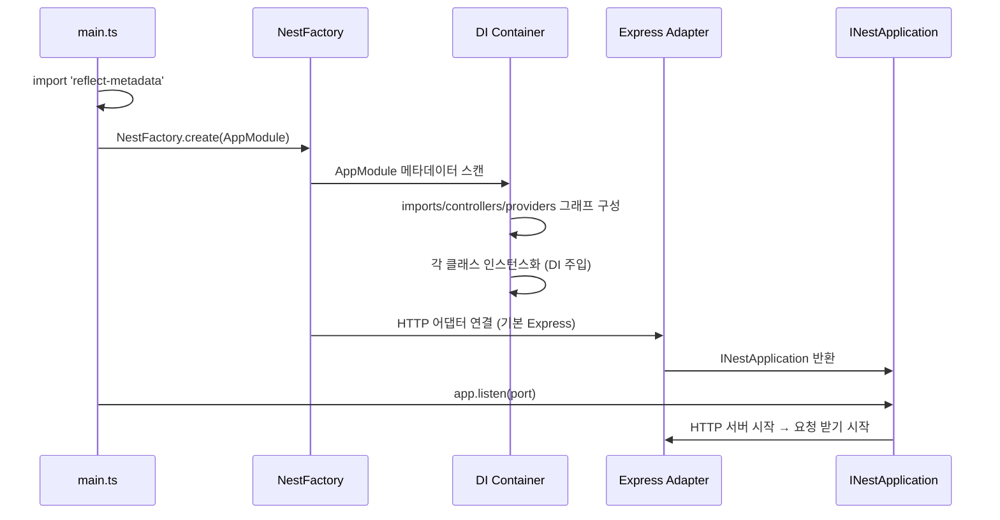

# NestJS 부트스트랩 + 데코레이터 메타데이터

> **작성일**: 2026-05-22
> **작성**: Claude (프롬프팅: @sikkzz)
> **학습 영역**: 인프라 / DevOps + 백엔드 기반
> **관련 문서**: [Phase 1 Spec](../specs/phase-01-bootstrap.md), [pnpm workspaces 노트](./pnpm-workspaces.md)

---

## 한 줄 요약

NestJS는 **데코레이터 + 메타데이터 + 의존성 주입(DI)**으로 모듈 그래프를 만들고, `NestFactory.create(AppModule)` 한 줄로 그 그래프를 인스턴스화 + HTTP 어댑터에 연결한다.

## 우리 프로젝트에서 어디에 쓰이는가

- `apps/server/src/main.ts` — 부트스트랩 진입점
- `apps/server/src/app.module.ts` — 루트 모듈 (이후 모든 feature 모듈을 imports)
- `apps/server/src/health/` — 첫 feature 모듈 (`/health` 엔드포인트, 운영 시 헬스체크용)
- Phase 4 운영 강화 단계에서 `/health`를 Railway/Fly.io 의 liveness probe로 연결 예정

## 어떻게 동작하는가

### 부트스트랩 흐름 (main.ts → AppModule → HTTP)



### 핵심 개념 5가지

**1. `reflect-metadata` import는 왜 main.ts 맨 위에 있어야 하나**

데코레이터(`@Module`, `@Controller`, `@Get`)는 런타임에 클래스/메서드에 **메타데이터**를 붙임. 그 메타데이터를 읽으려면 전역 `Reflect` 객체에 metadata API가 패치되어 있어야 함. `reflect-metadata`가 그 패치를 함.

```typescript
import 'reflect-metadata'; // 최상단 — 다른 import보다 먼저!
import { NestFactory } from '@nestjs/core';
```

빼면? 런타임에 "Cannot read properties of undefined (reading 'getMetadata')" 같은 에러 발생.

**2. 데코레이터가 실제로 하는 일**

`@Controller('health')`는 마법이 아니라 함수 호출:

```typescript
// 컴파일 후 대략 이렇게 됨
Reflect.defineMetadata('path', 'health', HealthController);
```

- NestJS는 부트스트랩 시 모든 클래스를 스캔하고
- `Reflect.getMetadata('path', SomeClass)` 로 메타데이터를 읽어
- 라우트 테이블, DI 그래프 등을 구성

→ 그래서 `tsconfig.json` 에 `emitDecoratorMetadata: true` 와 `experimentalDecorators: true` 둘 다 필수.

**3. 의존성 주입 (DI) — 컨스트럭터로 주입**

```typescript
@Controller()
export class HealthController {
  constructor(private readonly someService: SomeService) {} // 자동 주입
}
```

- NestJS는 컨스트럭터의 **타입 정보**를 메타데이터에서 읽어 어떤 클래스를 주입할지 판단
- 그래서 `SomeService` 가 같은 모듈 (또는 imports된 모듈)의 `providers` 에 등록되어 있어야 함
- 우리 health 모듈은 아직 service 없이 controller만 있어서 DI 사용 안 함 (가장 단순한 형태)

**4. Module은 "범위(scope)" 단위**

```typescript
@Module({
  imports: [OtherModule],        // 다른 모듈을 끌어다 씀 (그 exports만 사용 가능)
  controllers: [SomeController], // HTTP 진입점
  providers: [SomeService],      // DI 컨테이너에 등록될 클래스
  exports: [SomeService],        // 외부 모듈에 공개할 것
})
```

- providers 가 export 안 되면 다른 모듈에서 못 씀 → 캡슐화
- 처음엔 다 root module(AppModule)에 박고 싶을 수 있는데, feature 단위 모듈 분리가 NestJS의 핵심 가치

**5. HTTP 어댑터 — 기본은 Express, 갈아끼울 수 있음**

`NestFactory.create(AppModule)` 는 기본적으로 `@nestjs/platform-express` 사용. Fastify로 바꾸려면:

```typescript
import { FastifyAdapter, NestFastifyApplication } from '@nestjs/platform-fastify';
const app = await NestFactory.create<NestFastifyApplication>(AppModule, new FastifyAdapter());
```

- 우리는 Express 유지 (생태계 풍부, 거의 모든 미들웨어 호환)
- Fastify는 성능 우위 있지만 Phase 4쯤 측정 후 바꿔도 늦지 않음 ([PROJECT_ROOT 8장](../PROJECT_ROOT.md#8-안티-패턴--하지-말아야-할-것) "측정 전 최적화 X")

## 흔한 함정 / 주의할 점

1. **`import 'reflect-metadata'` 누락** — main.ts 최상단 필수. 안 그러면 런타임 폭발.
2. **`emitDecoratorMetadata: false`** — tsconfig에서 false면 DI가 타입 정보를 못 읽음.
3. **순환 의존성** — `ModuleA imports ModuleB`, `ModuleB imports ModuleA` 같은 그래프는 부트스트랩에서 에러. `forwardRef()` 로 우회 가능하지만 구조 재설계가 더 나음.
4. **`export` 안 한 provider를 다른 모듈에서 inject 시도** — "Nest can't resolve dependencies" 에러. 모듈 `exports` 배열에 추가해야.
5. **`@Injectable()` 빠진 클래스를 provider로 등록** — 클래스 자체는 동작하지만 DI 인식 안 됨. service 클래스엔 항상 `@Injectable()`.

## 더 파볼 거리 (선택)

- **DI 컨테이너의 내부 동작** — `ModuleRef`, scope (DEFAULT vs REQUEST vs TRANSIENT)
- **Lifecycle hooks** — `OnModuleInit`, `OnApplicationBootstrap`, `OnModuleDestroy` 등 (Phase 4에서 graceful shutdown 다룰 때 다시 봄)
- **Interceptor / Guard / Pipe / Filter** — 요청 흐름의 각 단계 hook (Phase 2 인증 도입 시 본격)
- **NestJS 11 변경점** — ESM 지원 강화, Express 5 기본 등 ([공식 마이그레이션](https://docs.nestjs.com/migration-guide))

## 참고 링크

- [NestJS 공식 docs - First steps](https://docs.nestjs.com/first-steps)
- [reflect-metadata 라이브러리](https://github.com/rbuckton/reflect-metadata)
- [TypeScript decorators (stable)](https://www.typescriptlang.org/docs/handbook/decorators.html)
- 관련 코드: `apps/server/src/main.ts`, `apps/server/src/app.module.ts`

## 추가 학습 기록

> 같은 토픽으로 추가 학습한 내용은 아래에 날짜 헤더로 누적.

(아직 없음)
