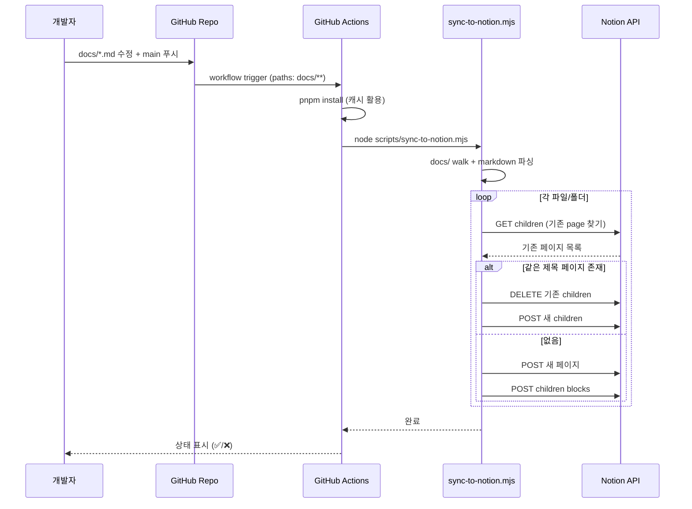

# Notion sync 자동화 (Markdown → Notion publish)

> **작성일**: 2026-05-24
> **작성**: Claude (프롬프팅: @sikkzz)
> **학습 영역**: 1번 인프라/DevOps (외부 API 통합 + GitHub Actions 운영)
> **관련 문서**: [ADR-0005 docs publishing](../decisions/0005-docs-publishing-notion-sync.md), [Phase 1 Spec](../specs/phase-01-bootstrap.md)

---

## 한 줄 요약

레포의 `docs/*.md`를 GitHub Actions가 자동으로 Notion 워크스페이스의 sub-page들로 publish하는 단방향 sync 시스템. **사내 위키 자동화 prototype** 겸 **외부 API 통합 학습** 1차 실전.

## 우리 프로젝트에서 어디에 쓰이는가

- **Phase 1** 마지막 인프라 항목 — PROJECT_ROOT 5장 "1인 풀팀 + 문서 자동화" 운영 방식의 두 번째 축
- Trailog `docs/` 의 ADR / Specs / Learning Notes / PROJECT_ROOT를 Notion에 자동 mirror
- 트리거: main 브랜치에 `docs/**` 변경 푸시 + 수동 trigger (Actions 탭)
- **2차 목표**: 검증된 패턴을 실무 환경 Notion 위키에 도입 제안

## 어떻게 동작하는가



### 핵심 개념

#### 1. Notion 데이터 모델 (Page vs Block vs Database)

Notion API는 세 종류의 객체로 모든 콘텐츠를 표현:

- **Page**: 페이지 자체. URL, 제목, 메타데이터, 부모 등 보유
- **Block**: 페이지 안의 요소 (단락, 제목, 리스트, 표, 코드 등). 페이지의 콘텐츠는 사실상 "블록의 리스트".
- **Database**: 구조화된 컬렉션 (테이블). 우리 publish엔 사용 X (단순 페이지 트리만).

이 프로젝트는 **Page + Block** 두 가지만 사용. Database는 추후 "Activity feed", "ADR index" 같은 정형 데이터 publish 시 검토.

#### 2. Integration 인증 모델 (Internal vs OAuth)

Notion API는 두 가지 인증:

- **Internal Integration**: 단일 워크스페이스 내 사용. 토큰(secret) 발급 후 페이지에 명시적으로 invite. **우리가 사용하는 방식.**
- **OAuth**: 마켓플레이스 앱용. 다른 사용자 워크스페이스 접근 시.

**중요 함정**: Integration이 만들어졌다고 모든 페이지에 접근 가능한 게 아님. **각 페이지에 명시적으로 invite** 해야 함 (`...` → 연결 → integration 선택). 안 하면 API 호출 시 `object_not_found` 404.

#### 3. 단방향 sync (Repo → Notion)

선택지:

- **단방향 (Repo → Notion)**: 우리가 선택. Repo는 source of truth, Notion은 read-only mirror.
- **양방향**: Notion 수정 → Git에 반영. 충돌 해결 복잡, 학습 가치 크지만 MVP엔 과함.

장점:

- 충돌 X, 로직 단순
- "Notion에서 수정하지 말 것"이라는 일관성 있는 규칙

단점:

- Notion 댓글/협업 결과가 코드로 안 옴
- 향후 사내 도입 시엔 양방향 필요할 수도 (별도 ADR로)

#### 4. Idempotent upsert

같은 입력으로 여러 번 실행해도 결과가 동일해야 함.

전략:

```typescript
for (const file of docs) {
  const existing = await findPageByTitle(parent, file.title);
  if (existing) {
    await deleteAllChildren(existing.id); // 기존 content 비움
    await appendBlocks(existing.id, newBlocks); // 새 content 추가
  } else {
    const page = await createPage(parent, file.title);
    await appendBlocks(page.id, newBlocks);
  }
}
```

**왜 update가 아니라 delete-then-append**?

- Notion API에 "페이지 콘텐츠 전체 교체" 단일 호출이 없음
- block 단위 update는 type 변경 불가 (paragraph → heading 같은)
- delete-then-append가 가장 일관성 보장

**부작용**:

- block ID가 매번 새로워짐 → Notion 내부 백링크/북마크 깨질 수 있음
- 페이지 ID 자체는 보존 (제목 기준 매칭) → 외부 링크는 안전

#### 5. Notion API rate limit

- **3 requests/second** 평균
- 초과 시 `rate_limited` 429
- 대응: 요청 간 350ms 대기 (`sleep`)
- 더 정교한 방식: 토큰 버킷, exponential backoff. 우리 sync는 가벼워 단순 sleep으로 충분.

#### 6. 100 block batch 제약

- 한 번의 `blocks.children.append` 요청에 최대 100개 child block
- 우리 파일 중 PROJECT_ROOT 같이 큰 건 100+ block — batch 분할 필요

```typescript
for (let i = 0; i < blocks.length; i += 100) {
  const batch = blocks.slice(i, i + 100);
  await notion.blocks.children.append({ block_id: pageId, children: batch });
}
```

#### 7. Markdown → Notion blocks 변환

표준 마크다운엔 있는데 Notion엔 없는 것 / 그 반대:

| 마크다운                | Notion                 | 매핑 방식                                    |
| ----------------------- | ---------------------- | -------------------------------------------- | ----------------- | ---------------------------- |
| `# H1` ~ `### H3`       | heading_1/2/3          | 직접 매핑                                    |
| `#### H4+`              | **없음**               | bold paragraph로 fallback                    |
| `- item`                | bulleted_list_item     | 직접                                         |
| `1. item`               | numbered_list_item     | 직접                                         |
| `- [ ] task`            | to_do                  | 직접                                         |
| `> quote`               | quote                  | 직접                                         |
| `---`                   | divider                | 직접                                         |
| <code>\`\`\`lang</code> | code                   | 언어 매핑 + plain text fallback              |
| `                       | table                  | `                                            | table + table_row | parse 후 cell 단위 rich_text |
| `**bold**`              | annotation.bold        | rich_text 안 annotation                      |
| `*italic*`              | annotation.italic      | 동일                                         |
| `` `code` ``            | annotation.code        | 동일                                         |
| `[link](url)`           | rich_text + link       | 동일                                         |
| Mermaid 다이어그램      | code(language=mermaid) | Notion이 mermaid 지원 (최근)                 |
| 이미지 ``       | image block (외부 URL) | repo-local 이미지는 안 됨 (별도 호스팅 필요) |

### 코드 예시 (핵심 부분만)

```typescript
// scripts/sync-to-notion.mjs

const notion = new Client({ auth: NOTION_TOKEN });

// Idempotent upsert
async function upsertLeafPage(parentId, title, blocks) {
  const existing = await listChildPages(parentId);
  const found = existing.find((p) => p.title === title);

  let pageId;
  if (found) {
    pageId = found.id;
    await clearPageContent(pageId); // 기존 콘텐츠 비움
  } else {
    const res = await notion.pages.create({
      parent: { page_id: parentId },
      properties: { title: { title: [{ type: 'text', text: { content: title } }] } },
    });
    pageId = res.id;
  }

  // 100개씩 batch로 children 추가
  for (let i = 0; i < blocks.length; i += 100) {
    await notion.blocks.children.append({
      block_id: pageId,
      children: blocks.slice(i, i + 100),
    });
  }
}
```

## 왜 다른 선택지가 아닌 이걸 골랐나

자세한 비교는 [ADR-0005](../decisions/0005-docs-publishing-notion-sync.md). 요약:

| 대안                      | 제외 이유                                               |
| ------------------------- | ------------------------------------------------------- |
| `@tryfabric/martian`      | 학습 가치 단절 (마크다운→블록 변환을 라이브러리에 위임) |
| GitHub Pages (Docusaurus) | 사내 도입 가치 X (실무가 Docusaurus 안 씀)              |
| GitBook                   | 무료 plan 제약 + 참조 미사용                            |
| Confluence                | 실무가 Notion 기반이라 prototype 가치 X                 |

**선택: Notion + 자체 스크립트** = 사내 도입 직결 + 학습 가치 + 비용 0

## 흔한 함정 / 주의할 점

### 1. ⚠ Integration 페이지 invite 빠뜨림

가장 흔한 실패. Integration 만들었어도 페이지에 invite 안 하면:

```
NotionAPIResponseError: Could not find block with ID: xxx. Make sure the
relevant pages and databases are shared with your integration.
```

→ Notion 페이지 → `...` → 연결 → integration 선택

### 2. ⚠ NOTION_PARENT_PAGE_ID 형식

- URL 끝의 32자리. 하이픈 포함/제외 둘 다 작동.
- workspace prefix 잘못 복사하면 안 됨.
  - `https://www.notion.so/My-Workspace/Trailog-abc123...` 에서 마지막 32자리만.
- workspace ID(다른 페이지의 ID) 와 헷갈리기 쉬움 — Trailog 페이지 자체 URL에서 추출해야.

### 3. ⚠ Rate limit (3 req/s)

- sync 중 갑자기 `rate_limited` 429 뜨면 sleep 늘리기
- 큰 문서가 많으면 sync 시간 길어짐 (~30초 ~ 몇 분)
- 더 빠르게 하려면 병렬 호출 + 토큰 버킷 알고리즘 필요 (이 prototype은 안 함)

### 4. ⚠ block 길이 제약 (2000자)

- 한 rich_text 객체 최대 2000자. 초과하면 `validation_error`
- 우리 코드는 chunk 분할로 대응. paragraph 본문 자체가 2000자 넘으면 잘림.
- 일반적으로 문제 없음 (한 문단이 2000자는 드뭄)

### 5. ⚠ child_page 삭제 시 영구 삭제 X

- API의 `blocks.delete`는 휴지통(Trash)으로 이동만 함
- 영구 삭제는 별도 호출 필요
- 우리는 update 시 child를 삭제하는데, 휴지통이 점차 쌓일 수 있음 (월 1회 수동 비우기 또는 무시)

### 6. ⚠ block 종류 변경 안 됨

- 기존 paragraph block을 heading으로 update 불가
- 그래서 우리는 delete + create 패턴 사용 (block 단위 in-place update X)

### 7. ⚠ 빈 rich_text 배열

- 일부 block type은 `rich_text: []` 비어있으면 validation_error
- 안전 패턴: 빈 텍스트라도 `[{ type: 'text', text: { content: '' } }]` 하나 넣기

## 더 파볼 거리 (선택)

지금은 안 다루지만 나중에 깊이 갈 만한 주제:

- **양방향 sync** — Notion API webhook (Enterprise plan만) 또는 polling으로 Notion 변경을 git으로
- **Notion AST 처리** — 우리는 정규식 기반 단순 파서. 본격은 [remark](https://github.com/remarkjs/remark) AST → Notion blocks 매퍼.
- **Database publish** — ADR/Spec을 properties (Status, Date, Author) 있는 Notion database로
- **이미지 publish** — `docs/screens/images/` 의 캡처를 Cloudflare R2 / S3에 업로드 후 Notion에 image block으로
- **변경 감지 (incremental sync)** — 매번 전체 sync X, 변경된 파일만 (git diff + timestamp 비교)
- **사내 도입 시 양방향 충돌 해결** — last-write-wins / 사람 개입 / Git의 변경을 우선

## 참고 링크

- [Notion API 공식 docs](https://developers.notion.com/)
- [Notion API reference (blocks)](https://developers.notion.com/reference/block)
- [Notion API rate limits](https://developers.notion.com/reference/request-limits)
- [@notionhq/client GitHub](https://github.com/makenotion/notion-sdk-js)
- [gray-matter (frontmatter 파싱)](https://github.com/jonschlinkert/gray-matter)

## 추가 학습 기록

> 같은 토픽으로 추가 학습한 내용은 아래에 날짜 헤더로 누적.
