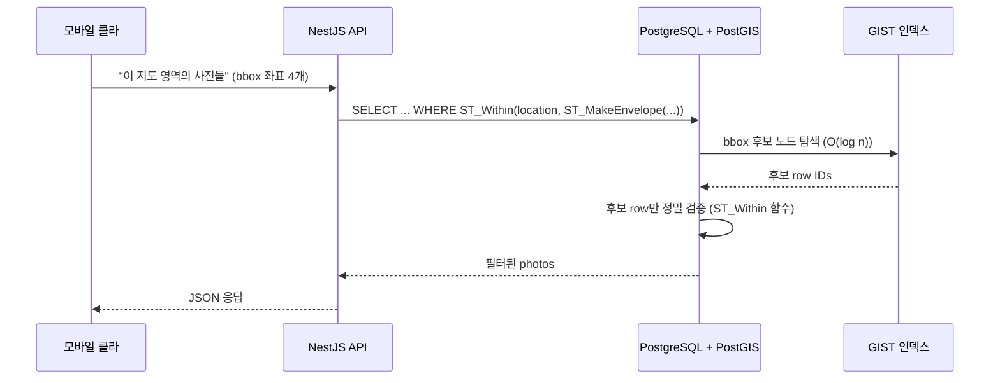

# PostGIS 기초

> **작성일**: 2026-05-30
> **작성**: Claude (프롬프팅: @sikkzz)
> **학습 영역**: #3 지도 / 데이터 시각화 (PROJECT_ROOT 2장)
> **관련 문서**: [Phase 2 Spec](../specs/phase-02-core-features.md) (4.2 인프라 / 4.5 EXIF / 4.7 지도)

---

## 한 줄 요약

**PostgreSQL의 공간(geospatial) 데이터 확장** — 위도/경도를 단순 number 컬럼이 아닌 `Point`/`Polygon`/`LineString` 같은 공간 자료형으로 저장하고, GIST 인덱스 + 100개+ 공간 함수(`ST_*`)로 빠른 공간 쿼리 가능.

## 우리 프로젝트에서 어디에 쓰이는가

- **Phase 2 4.2**: PostGIS 확장 enable 마이그레이션 (인프라 준비)
- **Phase 2 4.5 (EXIF 추출)**: `photos.location geometry(Point, 4326)` 컬럼 추가 — EXIF GPS → PostGIS Point 변환
- **Phase 2 4.7 (지도 표시)**: 지도 영역(bbox) 안 사진 조회, 사진 cluster, 반경 검색

PostGIS 없이 `lat double precision` + `lng double precision` 두 컬럼만으로도 위치 저장은 가능. 그러나 **공간 쿼리**가 본질인 앱(사진 지도 아카이브)엔 PostGIS가 합리.

## 어떻게 동작하는가

PostgreSQL에 `CREATE EXTENSION postgis;` 한 줄로 활성화. 그 후:

1. **공간 자료형 추가**: `geometry`, `geography`, `Point`, `Polygon`, `LineString` 등
2. **공간 함수 100+**: `ST_*` prefix — `ST_MakePoint`, `ST_Within`, `ST_DWithin`, `ST_Distance` 등
3. **공간 인덱스**: GIST(Generalized Search Tree) — 2D/3D 공간 데이터 구조 인덱싱

### 핵심 개념

- **`geometry` vs `geography`**:
  - `geometry`: 평면 좌표 (X, Y) — 빠르지만 지구 곡률 무시
  - `geography`: 회전 타원체(지구) 기반 — 거리/면적 정확, 느림
  - **Trailog 선택**: `geometry(Point, 4326)` — 빠른 인덱스 + 표시(지도)/검색 정확도 충분. 정밀 거리 필요 시 함수에서 변환

- **SRID 4326 (WGS84)**:
  - **Spatial Reference System Identifier 4326** = WGS84 좌표계 (GPS 표준)
  - lat/lng 그대로 박을 수 있는 좌표계 (다른 좌표계 변환 불필요)
  - 모든 모바일/지도 API(Google Maps, Apple Maps, Mapbox)가 4326 사용
  - 다른 SRID 예: 3857(Web Mercator — 지도 타일), 5174(한국 중부원점)

- **GIST 인덱스**:
  - B-tree(일반 컬럼)는 1차원 순서 기반 → 2D 공간 쿼리에 무력
  - GIST는 R-tree 변종 — 2D bounding box 계층 — 공간 쿼리 O(log n)
  - 인덱스 생성: `CREATE INDEX idx_photos_location ON photos USING GIST(location)`

### Mermaid — 공간 쿼리 흐름



### 코드 예시

#### 1. EXIF GPS → PostGIS Point 박제

```typescript
// Phase 2 4.5 EXIF 워커 안에서
const { latitude, longitude } = extractGpsFromExif(buffer);

// raw SQL 또는 TypeORM
await photoRepo.query(
  `UPDATE photos SET location = ST_SetSRID(ST_MakePoint($1, $2), 4326) WHERE id = $3`,
  [longitude, latitude, photoId], // 주의: longitude 먼저, latitude 다음 (X, Y)
);
```

⚠️ **함정**: PostGIS의 `ST_MakePoint(x, y)`는 `(longitude, latitude)` 순서. GPS는 보통 `(latitude, longitude)`. **순서 헷갈리면 한국 위치가 적도 어딘가로 박힘**.

#### 2. 지도 영역(bbox) 안 사진 조회

```sql
SELECT id, takenAt
FROM photos
WHERE ST_Within(
  location,
  ST_MakeEnvelope(126.97, 37.55, 127.05, 37.60, 4326)  -- minLng, minLat, maxLng, maxLat
)
ORDER BY takenAt DESC
LIMIT 100;
```

bbox 검색에 GIST 인덱스가 자동 활용됨 (EXPLAIN ANALYZE로 확인 가능).

#### 3. 특정 지점 반경 N km 내 사진

```sql
SELECT id, ST_Distance(location::geography, ST_SetSRID(ST_MakePoint(126.978, 37.566), 4326)::geography) AS distance_m
FROM photos
WHERE ST_DWithin(
  location::geography,
  ST_SetSRID(ST_MakePoint(126.978, 37.566), 4326)::geography,
  1000  -- 1km
);
```

`::geography` 캐스트 — 평면(geometry)에선 4326 단위가 degree(부정확) → geography 캐스트로 미터 단위 정확 계산.

#### 4. TypeORM 엔티티 (Phase 2 4.5 시점)

```typescript
@Entity('photos')
export class Photo {
  // ...
  @Column({
    type: 'geometry',
    spatialFeatureType: 'Point',
    srid: 4326,
    nullable: true,
  })
  location!: { type: 'Point'; coordinates: [number, number] } | null;

  // TypeORM이 GeoJSON 형식으로 자동 변환 (입출력)
}
```

TypeORM 1.0+엔 PostGIS 자료형 지원 내장. 데코레이터에 `type: 'geometry'` + `srid` 박으면 끝.

## 왜 다른 선택지가 아닌 이걸 골랐나

| 대안                                                    | 거부 사유                                                                                          |
| ------------------------------------------------------- | -------------------------------------------------------------------------------------------------- |
| `lat double precision` + `lng double precision` 두 컬럼 | 공간 쿼리 (bbox/반경) 직접 구현 — Haversine 공식 + 전체 스캔. GIST 인덱스 X → 사진 1000+ 부터 느림 |
| `MongoDB GeoJSON`                                       | DB 자체 교체 — 본 ADR(Postgres) 결정과 충돌. 별도 학습 부담                                        |
| 외부 GIS 서비스 (Mapbox Datasets / Google Places)       | 비용 + 의존성 + 데이터 lock-in. Trailog는 자체 데이터 컨트롤 우선                                  |
| GeoServer / QGIS server                                 | 서버 1대 추가 운영 부담. Trailog 규모엔 over                                                       |

**채택 사유**:

- 1인 사이드 + 학습 — PostGIS는 한국/글로벌 위치 기반 서비스 (배달의민족/쏘카/카카오맵 등)의 사실상 표준. 실무 직결.
- Postgres + PostGIS는 한 시스템 안 — 운영 단순.
- Fly.io / Supabase / Neon 모두 PostGIS 지원.

## 흔한 함정 / 주의할 점

1. **lat/lng 순서**: `ST_MakePoint(longitude, latitude)`. GPS 라이브러리는 보통 `(latitude, longitude)` 순서로 반환 → 변환 시 주의.

2. **geometry vs geography 캐스트 까먹기**: `ST_Distance(p1, p2)` 평면(geometry)이면 단위가 degree. 한국에선 1 degree ≈ 88km. 실제 거리 원하면 `::geography` 캐스트 필수.

3. **GIST 인덱스 누락**: 컬럼만 추가하고 인덱스 안 만들면 공간 쿼리 == 전체 스캔. `CREATE INDEX ... USING GIST(location)` 마이그레이션 필수.

4. **NULL 처리**: `location` NULL인 사진(EXIF GPS 없음) 다수 — 쿼리에서 `WHERE location IS NOT NULL` 명시 또는 partial index 활용.

5. **SRID mismatch**: 데이터는 4326으로 박는데 쿼리에선 3857(Web Mercator) 비교 시도 → 결과 0 row. 일관 4326 유지.

6. **CREATE EXTENSION 권한**: superuser 권한 필요. Supabase는 대시보드 토글로 해결, Fly Postgres는 default user(postgres)가 superuser라 OK. RDS/Cloud SQL은 별도 권한 부여 필요.

7. **PostGIS 자체 학습 곡선**: 일반 PostgreSQL보다 진입 장벽 ↑. 처음엔 `ST_MakePoint`/`ST_Within`/`ST_DWithin` 3개만 익혀도 90% 사용 사례 커버.

## 더 파볼 거리

- **공간 인덱스 종류**: GIST 외에 SP-GIST, BRIN — 데이터 분포에 따라 선택. 대량 데이터에서 BRIN이 storage 효율 ↑
- **Tile generation**: zoom level별 사진 cluster — `ST_ClusterDBSCAN`, `ST_SimplifyPreserveTopology` 등 활용
- **Vector tile serving**: PostGIS → PG Tileserv → Mapbox GL 같은 파이프라인 (대규모 지도 표시)
- **공간 조인 (`ST_Intersects`)**: 행정구역 polygon과 사진 point 조인 → "서울에서 찍은 사진" 분류
- **Geohash / S2 cell**: cluster ID 빠른 계산 (PostGIS 없이도 일부 가능)
- **PostGIS 3.5+ 새 함수**: `ST_3DDistance`, raster 지원 등

## 참고 링크

- [PostGIS 공식 문서](https://postgis.net/documentation/)
- [PostGIS Workshop (intro)](https://postgis.net/workshops/postgis-intro/)
- [PostGIS in Action 책 (Manning)](https://www.manning.com/books/postgis-in-action-third-edition)
- [Cracking the GIS Career — 한국 GIS 실무 입문](https://github.com/zonebuilders) (예시)
- [TypeORM Spatial Columns](https://typeorm.io/entities#spatial-columns)

## 추가 학습 기록

> 같은 토픽으로 추가 학습한 내용은 아래에 날짜 헤더로 누적.

### 2026-05-30 초안 — 기초 + Trailog 적용 컨텍스트

- 공간 자료형 / SRID 4326 / GIST 인덱스 / ST\_\* 함수 / TypeORM 통합 기본

---

### 2026-06-03 — PostGIS 컬럼 SELECT 시 함정 + 디버깅 패턴

#### 1. `geometry` 컬럼 raw SELECT는 hex (사람이 못 읽음)

GUI(DataGrip) 또는 psql에서 `SELECT location FROM photos`로 그냥 조회하면:

```
0101000020E61000000000000000C05F40CAC342AD697D4240
```

이건 **EWKB(Extended Well-Known Binary) hex 인코딩** — PostGIS의 내부 표현. 사람이 읽으려면 변환 함수 사용 필수:

| 함수                               | 출력                                               | 언제 쓰나                         |
| ---------------------------------- | -------------------------------------------------- | --------------------------------- |
| `ST_AsText(location)`              | `POINT(126.978 37.5665)` (WKT)                     | 빠른 눈 확인                      |
| `ST_AsGeoJSON(location)`           | `{"type":"Point","coordinates":[126.978,37.5665]}` | JSON으로 봐서 [lng,lat] 순서 확인 |
| `ST_X(location)`, `ST_Y(location)` | `126.978` / `37.5665`                              | 컬럼 분리 (필터/정렬에 활용)      |

→ **검증/디버깅 SQL은 항상 변환 함수 감싸기**:

```sql
SELECT
  id,
  ST_AsText(location) AS location_wkt,
  ST_AsGeoJSON(location) AS location_geojson,
  ST_X(location) AS lng,
  ST_Y(location) AS lat
FROM photos
WHERE location IS NOT NULL;
```

#### 2. `POINT(0 0)` 함정 — null GeoJSON이 PostGIS Point가 될 때

TypeORM이 GeoJSON 객체를 PostGIS geometry로 변환 시 `coordinates: [null, null]` 같은 잘못된 입력이 들어오면 **에러 throw 대신 `POINT(0 0)` fallback**으로 박힐 수 있음. (0, 0)은 대서양 가나 앞바다라 실제 데이터일 가능성 거의 X — 발견 시 source 추적:

1. 값 추적: `SELECT ST_AsText(location) WHERE ...`
2. application 코드 추적: GeoJSON 만드는 부분에 null/NaN guard 있나 — `Number.isFinite()` 권장
3. JSON 직렬화 추적: JS의 `NaN`/`Infinity`는 `JSON.stringify` 시 `null`로 변환됨

자세한 디버깅 흐름은 [EXIF 학습 노트 2026-06-03 추가분](exif-and-photo-metadata.md) 참고.

#### 3. PostGIS 디버깅 자주 쓰는 패턴

```sql
-- 모든 사진 영역 (min/max bbox)
SELECT ST_AsText(ST_Extent(location)) FROM photos;

-- 특정 위치 반경 1km 안 사진
SELECT id, ST_Distance(location::geography, ST_MakePoint(126.978, 37.5665)::geography) AS dist_m
FROM photos
WHERE ST_DWithin(location::geography, ST_MakePoint(126.978, 37.5665)::geography, 1000)
ORDER BY dist_m;

-- (0,0)에 잘못 박힌 사진 찾기
SELECT id, created_at FROM photos WHERE ST_X(location) = 0 AND ST_Y(location) = 0;

-- 두 사진 사이 거리 (m)
SELECT ST_Distance(
  (SELECT location::geography FROM photos WHERE id = 'A'),
  (SELECT location::geography FROM photos WHERE id = 'B')
);
```

→ raw SELECT만 보고 "버그 없다" 판단 X. 항상 `ST_*` 변환으로 사람 읽기 가능한 형식 확인.

- Phase 2 4.5 (EXIF) / 4.7 (지도) 진입 시 실제 코드와 함께 추가 학습 노트 누적 예정 (`ST_ClusterDBSCAN` 등)
