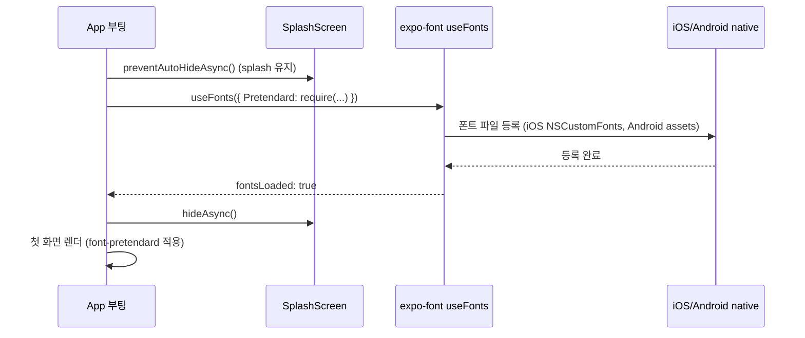

# Pretendard + RN에서 한국어 폰트 사용 (expo-font + SplashScreen)

> **작성일**: 2026-06-08
> **작성**: Claude (프롬프팅: @sikkzz)
> **학습 영역**: #6 모바일 네이티브 (PROJECT_ROOT 2장) + 한국어 사용자 경험
> **관련 문서**: [Phase 2 Spec 4.8](../specs/phase-02-core-features.md), [모바일 디자인 시스템](mobile-design-system-and-nativewind.md)

---

## 한 줄 요약

iOS와 Android의 **기본 시스템 폰트는 다름** — iOS는 SF Pro / SD Gothic, Android는 Roboto / Noto Sans CJK. 한국 사용자 친화 + 양쪽 OS 동일 경험 위해 **Pretendard 같은 통일 폰트**를 앱 자체에 임베드. `expo-font` `useFonts` hook으로 로드 + `expo-splash-screen`으로 로드 완료까지 splash 유지 + Tailwind `fontFamily` 토큰에 등록. **토스/당근/노션 한국판이 다 채택한 표준 패턴**.

## 우리 프로젝트에서 어디에 쓰이는가

- **Phase 2 4.8 D2-2**: Pretendard 4 weight (Regular 400 / Medium 500 / SemiBold 600 / Bold 700) 임베드 + Tailwind `font-pretendard*` 토큰
- **Phase 2 4.8 D3**: 모든 화면 텍스트에 `className="font-pretendard*"` 적용
- **Phase 후속**: 사이드 폰트(영문 강조용, 숫자용 등) 검토 시 같은 패턴

## 어떻게 동작하는가

### 폰트 로드 흐름



### 실제 코드 (`_layout.tsx`)

```tsx
import { useFonts } from 'expo-font';
import * as SplashScreen from 'expo-splash-screen';

// 폰트 로드 완료까지 splash 유지 — 빈 화면 깜빡임 방지
SplashScreen.preventAutoHideAsync().catch(() => {});

export default function RootLayout() {
  const [fontsLoaded, fontError] = useFonts({
    Pretendard: require('../../assets/fonts/Pretendard-Regular.otf'),
    'Pretendard-Medium': require('../../assets/fonts/Pretendard-Medium.otf'),
    'Pretendard-SemiBold': require('../../assets/fonts/Pretendard-SemiBold.otf'),
    'Pretendard-Bold': require('../../assets/fonts/Pretendard-Bold.otf'),
  });

  useEffect(() => {
    if (fontsLoaded || fontError) {
      SplashScreen.hideAsync().catch(() => {});
    }
  }, [fontsLoaded, fontError]);

  if (!fontsLoaded && !fontError) return null;
  return <Stack />;
}
```

### Tailwind fontFamily 토큰

```js
// tailwind.config.js
theme: {
  extend: {
    fontFamily: {
      pretendard: ['Pretendard'],
      'pretendard-medium': ['Pretendard-Medium'],
      'pretendard-semibold': ['Pretendard-SemiBold'],
      'pretendard-bold': ['Pretendard-Bold'],
    },
  },
},
```

### 화면에서 사용

```tsx
<Text className="font-pretendard text-base">본문 텍스트</Text>
<Text className="font-pretendard-medium text-sm">레이블</Text>
<Text className="font-pretendard-semibold text-base">버튼</Text>
<Text className="font-pretendard-bold text-4xl">제목</Text>
```

## 핵심 개념

### iOS / Android 기본 폰트 차이

| OS      | 기본 폰트 (영문) | 기본 폰트 (한국어)       |
| ------- | ---------------- | ------------------------ |
| iOS     | SF Pro           | Apple SD 산돌고딕 Neo    |
| Android | Roboto           | Noto Sans CJK / 산세리프 |

→ 같은 텍스트인데 **양쪽 OS에서 시각 차이 명확**. 디자인 일관성 ↓.

### Pretendard 채택 사유

- **iOS+Android 양쪽 동일** — 임베드 폰트라 OS 무관
- **한국어 가독성 ↑** — 한국어 디자인 검증 (토스/당근/노션/카카오엔터프라이즈 다 사용)
- **무료 + SIL OFL 라이선스** — 상업 사용 OK
- **Variable + Static 둘 다 제공** — Trailog는 static 4 weight (Regular/Medium/SemiBold/Bold) 임베드
- **숫자 균등 폭** — 가격/시간 표시에 안정적

### Weight 선택 정책

| Weight             | 사용              |
| ------------------ | ----------------- |
| **Regular (400)**  | 본문, 부가 설명   |
| **Medium (500)**   | 레이블, 강조 본문 |
| **SemiBold (600)** | 버튼, 카드 제목   |
| **Bold (700)**     | 화면 제목, 강조   |

→ ExtraBold(800) / Black(900)은 광고 / 큰 강조 — Trailog 단순함 위해 제외 (사이즈 ↓).

### Splash Screen 패턴

```tsx
SplashScreen.preventAutoHideAsync().catch(() => {});
// ...
if (!fontsLoaded && !fontError) return null; // splash 그대로
// fontsLoaded 후 hideAsync()
```

→ **빈 화면 깜빡임 방지**. Expo 표준 패턴.

`.catch(() => {})`는 **이미 hide된 경우 race condition 방어** — preventAutoHide / hide 둘 다 idempotent해야 함.

### 폰트 파일 형식 — otf vs ttf

| 형식       | 압축           | iOS | Android | 추천               |
| ---------- | -------------- | --- | ------- | ------------------ |
| **otf**    | CFF/PostScript | ✅  | ✅      | ⭐ Pretendard 공식 |
| ttf        | TrueType       | ✅  | ✅      | OK but otf 우선    |
| woff/woff2 | 웹 전용        | ❌  | ❌      | 모바일 X           |

→ `assets/fonts/*.otf`가 Trailog 표준.

## 왜 다른 선택지가 아닌 이걸 골랐나

| 대안                                    | 거부 사유                                                                          |
| --------------------------------------- | ---------------------------------------------------------------------------------- |
| 시스템 폰트 (SF Pro / Roboto)           | iOS/Android 시각 차이 ↑ + 한국어 친화도 ↓                                          |
| Noto Sans KR                            | 한국어 OK but 토스/당근 패턴 일관성 ↓                                              |
| Spoqa Han Sans Neo                      | 카카오 폰트 — 라이선스 + Pretendard 대비 가독성 ↓                                  |
| Google Fonts CDN 로드                   | 모바일은 오프라인 동작 — 폰트 임베드가 자연                                        |
| Variable Font (Pretendard Variable.otf) | weight 부드러운 보간 가능. 단 파일 사이즈 ↑ + RN 호환성 일부 lib 한계 — Phase 후속 |

## 흔한 함정

1. **`require()` import — ESLint rule 충돌** — `@typescript-eslint/no-require-imports` 룰. expo-font 표준 패턴이라 `eslint-disable-next-line` 또는 block disable 필요.
2. **폰트 파일이 native asset이라 dev build 재빌드 필요** — `expo prebuild --clean` + `expo run:ios/android`. Metro reload만으론 X.
3. **fontFamily 키 = require'd 파일의 PostScript name** — iOS는 PostScript name 정확히 매칭. Pretendard의 경우 'Pretendard' / 'Pretendard-Medium' 등 (파일명 일부와 동일).
4. **Tailwind fontFamily 배열** — `['Pretendard']` 배열로 박는 게 표준 (fallback 추가 가능).
5. **fontWeight prop vs font-pretendard-bold className** — RN의 `fontWeight: '700'` 박으면 시스템 폰트 bold로 렌더 (Pretendard 임베드 X). **fontFamily로 weight 분리**가 정석.
6. **expo-splash-screen race condition** — `.catch(() => {})` 없으면 두 번 호출 시 throw. iOS 빠른 boot에서 발생.
7. **다크모드 + 폰트 무관** — Pretendard는 다크모드 영향 X. 단 두께가 가벼울수록 다크 배경 + 가독성 ↓ — Medium 이상 권장.
8. **줄 간격 (line-height)** — 한국어는 영문보다 line-height 1.4~1.5 권장. Tailwind `leading-5` (20px) / `leading-6` (24px) 활용.
9. **iOS 시뮬레이터에 폰트 cache** — 가끔 폰트 변경 후 시뮬에 반영 안 됨 — 시뮬 reset 또는 앱 다시 install.
10. **Static fonts 4종 = 약 6MB** — 앱 사이즈 ↑. Variable font 도입 시 단일 파일 ~1.5MB로 절감.

## 더 파볼 거리

- **Pretendard Variable** — weight 100~900 부드러운 보간 + 단일 파일. RN 호환성 검증 필요
- **expo-font dynamic load** — 폰트를 런타임에 URL/CDN에서 로드 (큰 폰트 절감)
- **Subset font** — 한국어 + 영문 + 숫자만 추출해 사이즈 절감 (광고/금융 앱 패턴)
- **Font variation settings** — Variable font에서 `width`/`slant` 등 axis 활용
- **i18n 폰트 분기** — 영문은 Inter, 한국어는 Pretendard 분기 (현재 Pretendard만)
- **OpenType features** — `font-feature-settings` for tabular numbers (`tnum`), small caps 등. RN의 한계 검증
- **Performance benchmarks** — 임베드 폰트 vs 시스템 폰트 첫 렌더 속도 + 메모리

## 참고 링크

- [Pretendard GitHub (orioncactus)](https://github.com/orioncactus/pretendard)
- [Pretendard 공식 사이트](https://cactus.tistory.com/306) — 디자인 의도
- [expo-font docs](https://docs.expo.dev/versions/latest/sdk/font/)
- [expo-splash-screen docs](https://docs.expo.dev/versions/latest/sdk/splash-screen/)
- [Tailwind fontFamily 설정](https://tailwindcss.com/docs/font-family)
- [한국형 모바일 폰트 비교 (Pretendard / Spoqa / Noto)](https://github.com/orioncactus/pretendard/blob/main/README.md)

## 추가 학습 기록

> 같은 토픽으로 추가 학습한 내용은 아래에 날짜 헤더로 누적.
