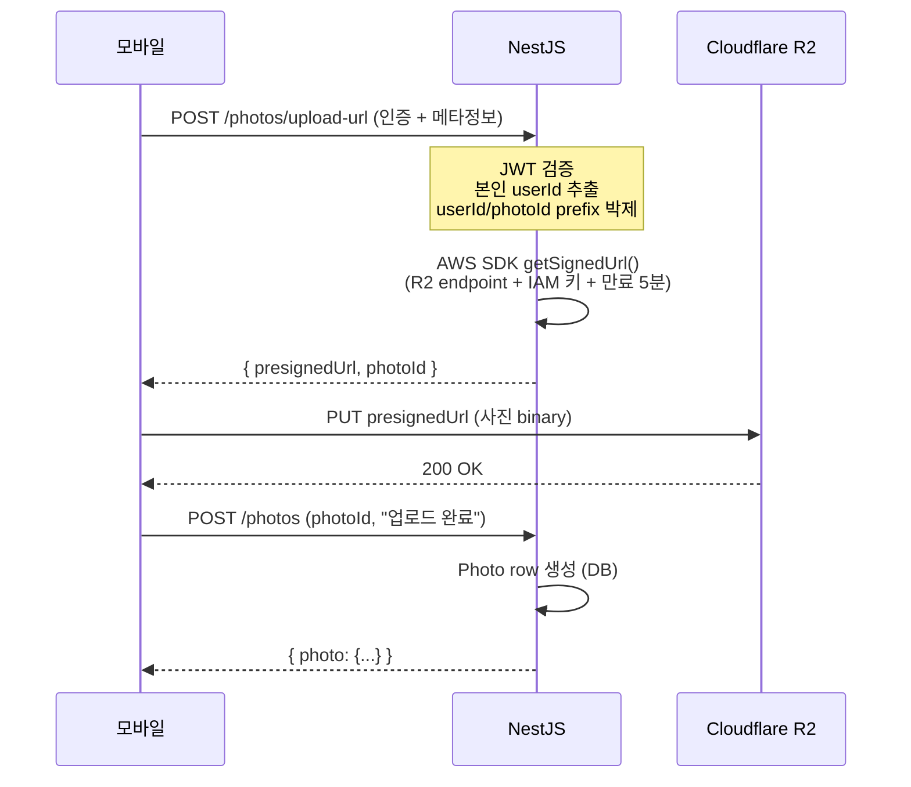

# R2 Presigned URL 기초 (S3 호환 객체 저장소)

> **작성일**: 2026-05-31
> **작성**: Claude (프롬프팅: @sikkzz)
> **학습 영역**: #2 이미지/미디어/파일 스트리밍 (PROJECT_ROOT 2장)
> **관련 문서**: [ADR-0007 R2 채택](../decisions/0007-image-storage-r2.md), [Phase 2 Spec 4.3](../specs/phase-02-core-features.md)

---

## 한 줄 요약

**Presigned URL** = 백엔드가 발급한 **시간 제한 + 권한 박힌 1회용 URL**. 모바일 클라가 백엔드 안 거치고 R2(객체 저장소)에 **직접 PUT/GET** — 백엔드 트래픽 0 + 보안 유지. R2는 AWS S3 호환 API라 같은 SDK + 패턴.

## 우리 프로젝트에서 어디에 쓰이는가

- **Phase 2 4.3 사진 업로드 흐름**:
  1. 모바일 → 백엔드: "이 사진 올리고 싶어" 요청 (메타정보 + 본인 인증)
  2. 백엔드 → R2 SDK: presigned PUT URL 생성 (5분 만료)
  3. 백엔드 → 모바일: presigned URL 반환
  4. 모바일 → R2: 직접 PUT (사진 binary 업로드, 백엔드 안 거침)
  5. 모바일 → 백엔드: "업로드 완료" 알림 → Photo row 생성
- **Phase 2 4.4 썸네일 + 4.5 EXIF**: 백엔드 워커가 R2에서 GET (presigned GET 또는 IAM 직접)
- **Phase 2 4.6 사진 표시**: 모바일이 R2에서 직접 GET (presigned GET URL — 짧은 만료)

## 어떻게 동작하는가

### 객체 저장소 + S3 호환 API

객체 저장소(Object Storage)는 "파일 = 객체, 폴더 = prefix" 단순 key-value 형태:

```
bucket/
├── user/abc-123/photos/photo-1.jpg
├── user/abc-123/photos/photo-2.png
└── user/def-456/photos/photo-3.heic
```

**S3 호환 API** = AWS S3가 정의한 REST API spec을 다른 저장소도 구현. R2 / MinIO / Backblaze B2 / DigitalOcean Spaces 모두 호환 → **같은 SDK + 같은 코드** 사용.

### Presigned URL 흐름



### 핵심 개념

#### Signature V4

AWS 표준 서명 알고리즘. presigned URL에 박히는 long query string의 정체:

```
https://{r2-endpoint}/user/abc/photo.jpg?
  X-Amz-Algorithm=AWS4-HMAC-SHA256&
  X-Amz-Credential={access-key}/20260531/auto/s3/aws4_request&
  X-Amz-Date=20260531T120000Z&
  X-Amz-Expires=300&            ← 만료 (초)
  X-Amz-SignedHeaders=host&
  X-Amz-Signature={hmac-sha256-hash}
```

알고리즘 요약:

1. canonical request 구성 (method + path + query + headers + body hash)
2. signing key 생성 (date + region + service)
3. HMAC-SHA256으로 서명
4. URL query string에 박음

→ **R2 SDK가 자동 처리**. 직접 구현 X. 단 원리 이해는 디버깅 시점에 가치.

#### IAM Token (Access Key + Secret)

R2 대시보드에서 발급:

```
R2_ACCOUNT_ID         (계정 식별자, URL에 박힘)
R2_ACCESS_KEY_ID      (공개 부분)
R2_SECRET_ACCESS_KEY  (비밀 부분, Fly secrets에 박제)
R2_BUCKET_NAME
```

**Bucket 별 토큰 발급** — 한 토큰이 한 bucket만 접근. 최소 권한 원칙.

#### Endpoint URL

```
https://{R2_ACCOUNT_ID}.r2.cloudflarestorage.com
```

S3는 `https://s3.{region}.amazonaws.com` — Endpoint만 다르면 코드 그대로.

### 코드 예시 — NestJS (Phase 2 4.3 D4 시점에 작성)

#### 1. S3 Client 설정

```typescript
// apps/server/src/photos/r2.client.ts (Phase 2 4.3 D3)
import { S3Client } from '@aws-sdk/client-s3';
import { ConfigService } from '@nestjs/config';

export function createR2Client(configService: ConfigService): S3Client {
  return new S3Client({
    region: 'auto', // R2는 region 무관 — 'auto' 박음
    endpoint: `https://${configService.getOrThrow('R2_ACCOUNT_ID')}.r2.cloudflarestorage.com`,
    credentials: {
      accessKeyId: configService.getOrThrow('R2_ACCESS_KEY_ID'),
      secretAccessKey: configService.getOrThrow('R2_SECRET_ACCESS_KEY'),
    },
  });
}
```

#### 2. Presigned PUT URL 발급

```typescript
// apps/server/src/photos/photos.service.ts
import { PutObjectCommand } from '@aws-sdk/client-s3';
import { getSignedUrl } from '@aws-sdk/s3-request-presigner';

async createPresignedUploadUrl(userId: string, photoId: string, ext: string) {
  const key = `user/${userId}/photos/${photoId}.${ext}`;  // 사용자별 prefix

  const command = new PutObjectCommand({
    Bucket: this.bucketName,
    Key: key,
    ContentType: this.guessMimeType(ext),  // image/jpeg, image/png 등
  });

  const presignedUrl = await getSignedUrl(this.r2, command, {
    expiresIn: 300,  // 5분 만료
  });

  return { presignedUrl, key };
}
```

#### 3. 모바일 client에서 직접 PUT

```typescript
// apps/mobile/src/lib/photos/upload.ts (Phase 2 4.3 D5)
async function uploadPhotoToR2(presignedUrl: string, photoFile: Blob) {
  const response = await fetch(presignedUrl, {
    method: 'PUT',
    headers: {
      'Content-Type': 'image/jpeg', // presigned 발급 시 박은 것과 정확히 일치
    },
    body: photoFile,
  });

  if (!response.ok) {
    throw new Error(`R2 업로드 실패: ${response.status}`);
  }
}
```

## 왜 다른 선택지가 아닌 이걸 골랐나

ADR-0007 참고. 요약:

- **R2 채택 사유**: egress 무료, S3 호환, 10GB 무료 티어
- **거부 — S3**: egress $0.09/GB 폭증
- **거부 — Supabase Storage**: 무료 1GB 작음, Supabase 종속
- **거부 — B2**: R2와 큰 차이 없고 인지도 낮음

## 흔한 함정 / 주의할 점

### 1. ContentType mismatch

presigned 발급 시 `ContentType: 'image/jpeg'` 박았는데 모바일이 다른 Content-Type 헤더로 PUT 시도 → **서명 불일치로 403**.

**해결**: 발급 시 + 업로드 시 같은 Content-Type 박기. 또는 발급 시 ContentType 옵션 제외 (모든 타입 허용).

### 2. CORS

브라우저에서 R2 직접 호출 시 CORS 정책 필요. **모바일 RN은 CORS 영향 X** (네이티브 fetch). 단 모바일 web build(Expo web) 사용 시 R2 버킷 CORS 설정 필요.

```json
[
  {
    "AllowedOrigins": ["https://trailog.app", "exp://*"],
    "AllowedMethods": ["GET", "PUT"],
    "AllowedHeaders": ["*"],
    "MaxAgeSeconds": 3600
  }
]
```

### 3. 만료 시간 너무 짧음 / 너무 김

- 너무 짧으면(예: 30초) — 사용자 사진 선택 + 압축 + 네트워크 느림 시 만료 → 업로드 실패
- 너무 길면(예: 1시간) — URL 탈취 시 영향 시간 큼

**권장**: PUT 5~10분, GET (썸네일 표시) 1~24시간. Trailog는 PUT 5분 채택.

### 4. 사용자별 prefix 안 박기 → 권한 escalation

```
❌ bucket/photo-{photoId}.jpg          # photoId만 알면 누구든 GET 가능
✅ bucket/user/{userId}/photos/{photoId}.jpg  # IAM 정책으로 cross-user 차단
```

IAM 정책에서 `user/${aws:userid}/*`만 허용 같은 fine-grained 권한 → 다른 사용자 파일 접근 차단. R2 IAM은 token 단위 권한이라 backend가 prefix 강제.

### 5. presigned URL 노출 위험

URL 자체에 서명 박혀있어 **공유 가능**. 짧은 만료 + 사용자별 prefix + HTTPS 강제로 완화.

### 6. R2 객체 URL은 public 아님 default

```
https://{bucket}.{account}.r2.cloudflarestorage.com/user/abc/photo.jpg
```

직접 접근하면 403 (default). public read 필요하면 별도 R2 Custom Domain 설정 or 매번 presigned GET URL 발급. **Trailog는 후자 — private 유지 + 매 GET 시 presigned**.

### 7. 모바일 업로드 진행률(progress) 표시

fetch는 progress 이벤트 미지원. `XMLHttpRequest` 직접 사용 또는 `react-native-blob-util` 같은 라이브러리. Phase 2 4.3 D5 시점에 결정.

### 8. multipart upload (5GB+)

R2/S3는 단일 PUT 5GB 한도. 큰 파일은 multipart upload (분할 + 합치기). 사진은 보통 5~20MB → multipart 불필요. 동영상(Phase 4+) 도입 시 검토.

## 더 파볼 거리

- **Signature V4 직접 구현** — SDK 없이 raw HTTP로 PUT. 보안/암호학 깊이.
- **Cloudflare Workers + R2** — edge에서 이미지 리사이즈 (sharp 없이 Workers + R2 Object API).
- **R2 Bucket Lifecycle** — N일 후 자동 삭제 (Phase 후속 임시 파일 정리).
- **R2 Custom Domain** — `cdn.trailog.app`로 public CDN처럼. (Phase 후속, 공유 기능 도입 시).
- **S3 Transfer Acceleration** — AWS S3 빠른 전송. 한국 ↔ S3 region.
- **Pre-signed POST** (PUT 외 대안) — 더 풍부한 정책 박을 수 있음 (max size 등).
- **Resumable Upload** — 큰 파일 끊겼다 재개 (multipart upload 활용).

## 참고 링크

- [Cloudflare R2 공식 문서](https://developers.cloudflare.com/r2/)
- [R2 API — Use S3-compatible API](https://developers.cloudflare.com/r2/api/s3/api/)
- [@aws-sdk/s3-request-presigner npm](https://www.npmjs.com/package/@aws-sdk/s3-request-presigner)
- [AWS Signature V4 spec](https://docs.aws.amazon.com/general/latest/gr/sigv4_signing.html) (학습 가치)
- [Presigned URL 패턴 깊이 — AWS docs](https://docs.aws.amazon.com/AmazonS3/latest/userguide/ShareObjectPreSignedURL.html)

## 추가 학습 기록

> 같은 토픽으로 추가 학습한 내용은 아래에 날짜 헤더로 누적.

### 2026-05-31 초안 — R2 채택 + presigned URL 기초

- ADR-0007과 동시 작성
- Phase 2 4.3 D3 (R2 셋업) + D4 (Photo entity + presigned endpoint) 시점에 실제 코드 + 디버깅 경험 추가 학습 누적 예정
