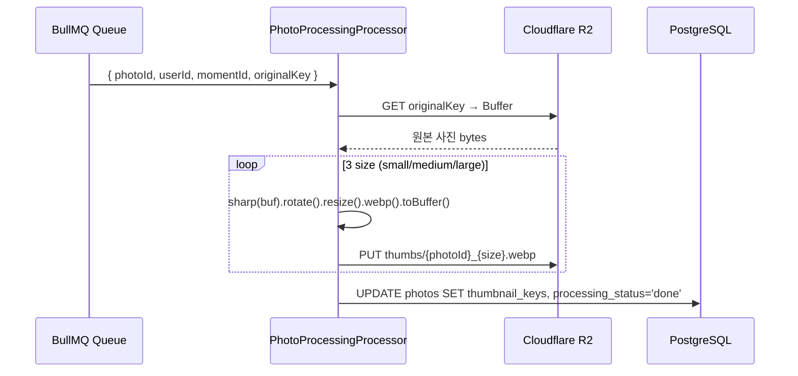

# sharp 이미지 처리 + WebP 변환

> **작성일**: 2026-06-01
> **작성**: Claude (프롬프팅: @sikkzz)
> **학습 영역**: #2 이미지/미디어 처리/파일 스트리밍 (PROJECT_ROOT 2장)
> **관련 문서**: [Phase 2 Spec 4.4](../specs/phase-02-core-features.md), [R2 Presigned URL 기초](r2-presigned-url-basics.md), [BullMQ + Redis 큐 (작성 예정)](bullmq-and-redis-queues.md)

---

## 한 줄 요약

**sharp** = Node.js의 사실상 표준 이미지 처리 라이브러리. **libvips C 라이브러리** 위에 얇은 JS 래퍼만 얹어 ImageMagick 대비 **4~5배 빠르고 메모리도 절반**. 체이닝 API로 `read → 변환 → write` 파이프라인 표현. JPEG/PNG/HEIC → **WebP** 변환 + 리사이즈 + EXIF orientation 보정이 한 줄.

## 우리 프로젝트에서 어디에 쓰이는가

- **Phase 2 4.4 썸네일 생성**: 모바일이 R2에 원본 PUT → BullMQ worker가 sharp로 3 size WebP 변환:
  - `small` 320px width — Moment 상세 grid 카드
  - `medium` 800px width — 단일 사진 preview
  - `large` 1600px width — full-screen 표시
- **Phase 2 4.5 EXIF 추출** (예정): `sharp(buffer).metadata()`로 촬영 시간/GPS 좌표 추출 → DB `takenAt` + PostGIS `location` 저장
- **Phase 후속**: 사진 회전/필터/워터마크 (필요해질 때)

## 어떻게 동작하는가

### libvips 기반 — 왜 빠른가

ImageMagick 같은 전통 라이브러리는 **이미지 전체를 메모리에 올린 후** 변환. 큰 사진이면 메모리 spike + 디스크 swap.

**libvips는 "demand-driven pipeline"** — 이미지를 작은 타일로 쪼개 **streaming 처리**. 출력 픽셀 1개 만들 때 필요한 입력 픽셀만 메모리에. → 6000x4000 사진도 RAM 100MB 이하로 처리.

```
ImageMagick: [입력 전체 메모리] → [변환] → [출력 전체 메모리]
libvips:     [타일] → [변환] → [출력 타일] → ...반복...
```

### 체이닝 파이프라인

sharp는 method chaining으로 변환 단계 누적 → `.toBuffer()` / `.toFile()` 호출 시점에 **한 번에 실행**:

```typescript
await sharp(inputBuffer)
  .rotate() // 1. EXIF orientation 자동 적용
  .resize({ width: 800 }) // 2. 리사이즈 (aspect ratio 유지)
  .webp({ quality: 85 }) // 3. WebP 인코딩
  .toBuffer(); // 4. 실행 → Buffer 반환
```

`.rotate()` 다음에 `.resize()`를 두는 게 중요 — orientation 적용 후 width/height가 정해지기 때문.

### Trailog 사용 흐름 (실제 코드)

```typescript
// apps/server/src/photos/photo-processing.processor.ts
const originalBuffer = await this.r2Service.getObjectBuffer(originalKey);

for (const sizeKey of ['small', 'medium', 'large']) {
  const { width, quality } = THUMBNAIL_SIZES[sizeKey];
  const thumbBuffer = await sharp(originalBuffer)
    .rotate()
    .resize({ width, withoutEnlargement: true })
    .webp({ quality })
    .toBuffer();
  const key = buildThumbnailKey(userId, momentId, photoId, sizeKey);
  await this.r2Service.putObjectBuffer(key, thumbBuffer, 'image/webp');
}
```



## 핵심 개념

### WebP — 왜 JPEG/PNG 대신

| 포맷          | 같은 화질 기준 사이즈 | 투명도 | 손실/무손실    | 모바일 지원                            |
| ------------- | --------------------- | ------ | -------------- | -------------------------------------- |
| JPEG          | 100% (기준)           | ❌     | 손실만         | 모두                                   |
| PNG           | 큼 (사진엔 비효율)    | ✅     | 무손실만       | 모두                                   |
| **WebP**      | **~25~35% 작음**      | ✅     | **둘 다 지원** | iOS 14+ / Android 4.0+                 |
| AVIF (차세대) | ~50% 작음             | ✅     | 둘 다          | iOS 16+ / Android 12+ — 지원 아직 좁음 |

**Trailog는 WebP 채택** 사유:

- 같은 화질에 사이즈 30% 작음 → R2 저장 비용 ↓ + CDN egress ↓ + 모바일 다운로드 시간 ↓
- iOS 14+ / Android 4.0+ 모두 native 지원 (현재 Expo SDK 56 타겟과 일치)
- AVIF는 더 작지만 디코딩 CPU 비싸고 지원 좁아 아직 위험

### `.rotate()` — EXIF orientation 자동 보정

스마트폰 사진은 **센서 자체가 가로**라 세로로 찍어도 파일은 가로로 저장 + EXIF의 `Orientation` 태그(1~8)로 "회전해서 봐라" 명시. 브라우저/뷰어가 EXIF 읽고 회전.

**문제**: 백엔드가 그 사진을 resize 하면 EXIF는 그대로지만 **픽셀 크기가 바뀌어** 회전 결과가 깨짐 — 가로 800x600인데 EXIF가 "90도 회전" 박혀있으면 표시 시 600x800으로 보임 → 의도와 다름.

**해결**: `.rotate()` (인자 없이 호출) — EXIF orientation 읽어 **픽셀 자체를 회전** + EXIF 태그는 1(정상)로 reset. 이후 `.resize()`가 회전된 픽셀 기준으로 동작.

```typescript
sharp(buffer)
  .rotate() // <- EXIF orientation 적용 (필수)
  .resize({ width: 800 })
  .webp()
  .toBuffer();
```

이걸 빠뜨리면 모바일에서 사진이 옆으로 누워있는 흔한 버그 발생.

### `.resize({ withoutEnlargement: true })`

- 기본 동작: width 800 지정 → 원본이 500이어도 강제 확대 800
- `withoutEnlargement: true`: 원본 < 지정 size면 **확대 안 함** (원본 그대로)
- 이유: 원본보다 큰 size로 보간 확대해도 화질은 못 살림 → R2 저장 + CDN 트래픽 낭비

### `.webp({ quality })` — 화질 vs 사이즈 트레이드오프

| quality   | 사이즈    | 시각적 차이                                                      |
| --------- | --------- | ---------------------------------------------------------------- |
| 60        | 매우 작음 | 압축 artifact 명확 (그라데이션/얼굴)                             |
| 75~80     | 작음      | 평범한 사진은 거의 인지 불가                                     |
| **85~90** | **중간**  | **거의 무손실 — Trailog 채택 (small 80 / medium 85 / large 90)** |
| 95+       | 큼        | 무손실에 가깝지만 사이즈 큰 폭 증가                              |

**Trailog 결정**: size가 클수록 (사용자 자세히 봄) quality 높임 → small 80 / medium 85 / large 90.

### Buffer vs Stream

sharp는 input/output을 **Buffer / 파일 경로 / Stream** 셋 중 하나로 지원.

| 방식                                  | 메모리                     | 적합 케이스                       |
| ------------------------------------- | -------------------------- | --------------------------------- |
| `sharp(buffer)` → `.toBuffer()`       | 입력+출력 모두 메모리      | **작~중간 (10MB 이하)** ← Trailog |
| `sharp(filePath)` → `.toFile()`       | libvips가 디스크 streaming | 파일 시스템 쓸 수 있는 환경       |
| `sharp(readStream).pipe(writeStream)` | streaming                  | 큰 파일 + Lambda 같은 환경        |

Trailog는 R2 → R2 흐름이라 파일 시스템 안 거치고 **Buffer in/out**가 가장 자연. 단 100MB 사진 업로드되면 메모리 spike 가능 → confirm endpoint에서 size limit 검증 + Fly.io VM RAM 모니터링 (Phase 4 운영 진입 시).

### 3 size — Sequential vs Parallel

`Promise.all`로 3 size를 동시에 돌리면 **wall-clock 시간 ↓**, 하지만 **메모리 3배 spike**:

- 원본 Buffer 30MB + 각 size 변환 중 임시 Buffer = 한 순간 ~100MB
- Fly.io 256MB VM에선 OOM risk

Trailog는 **sequential** (for-loop reduce) — 메모리 한 size씩만:

- 원본 30MB + 한 size 변환 중 10MB = 안전
- wall-clock은 3배 (3 size × 200ms ≈ 600ms) — 사용자가 직접 대기 X (BullMQ 백그라운드)

**경험 룰**: CPU-bound 작업에 무한 parallel은 잘못된 직관. 동시성보다 메모리 + CPU 한계 우선.

## 왜 sharp인가 — 대안 비교

| 라이브러리       | 기반                 | 속도            | 메모리   | 활용도                                  |
| ---------------- | -------------------- | --------------- | -------- | --------------------------------------- |
| **sharp**        | libvips (C)          | **빠름 (기준)** | **작음** | **Node 이미지의 사실상 표준**           |
| jimp             | 순수 JS              | 1/5 ~ 1/10      | 큼       | 의존성 0 가치 (Lambda layer 안 만들 때) |
| imagemagick / gm | ImageMagick CLI 래퍼 | sharp의 1/4     | 큼       | 기능 풍부 (드물게 필요한 변환)          |
| node-canvas      | Cairo                | 빠름            | 작음     | 이미지보다 도형 그리기/SVG 변환에 적합  |

**Trailog는 sharp 채택** — 빠르고 메모리 작음 + Node 생태계 압도적 표준 (월 3000만+ 다운로드).

**리스크**: libvips C 의존성 = native binary. `pnpm install` 시 환경에 맞는 prebuilt binary 자동 다운. Docker multi-platform build / M1 Mac에서 가끔 실패 → `pnpm install --force` 또는 platform 명시.

## 흔한 함정

1. **`.rotate()` 누락** → 모바일에서 사진 옆으로 누움 (위에서 설명)
2. **`.resize()` 전에 `.toBuffer()`** → 원본 그대로 인코딩만 됨 (메서드 순서 중요)
3. **같은 `Buffer`를 여러 size에 재사용** → ✅ 안전 (sharp는 input을 mutate 안 함, 새 파이프라인마다 fresh state)
4. **`quality` 너무 낮음** → 그라데이션/얼굴 그림자에 visible artifact. 85 이상 권장
5. **HEIC 입력** → libvips 빌드에 `libheif` 포함 안 됐을 수 있음 → sharp 0.32+ 자동 지원이지만 Lambda layer에선 별도 확인 필요. R2에 그대로 두고 변환 실패 처리 (Trailog는 모바일이 jpg/png/heic/webp 허용 → confirm 시점 ext 검증)
6. **EXIF 이중 회전** → `.rotate()` 호출 후 별도로 `.rotate(90)` 같은 명시적 호출 하면 이중 적용 — `.rotate()`는 한 번만
7. **`withoutEnlargement` 미지정** → 작은 사진을 큰 size로 확대 → 흐릿 + 사이즈 낭비
8. **Lambda 같은 read-only fs**에서 `.toFile()` 호출 → write 실패. Buffer/Stream 출력 사용
9. **메모리 spike OOM** — 256MB VM에서 5000x5000 사진 3 size parallel 변환 시 → sequential 필수
10. **EXIF orientation 8(좌측 회전) 사진 — 회전 후 width/height 바뀜**: 가로 4000 사진이 세로 4000 → `.resize({ width: 1600 })`가 의도대로 동작 (rotate 먼저 했으므로)

## 더 파볼 거리

- **컬러 프로파일 (ICC)**: 디스플레이가 다른 색공간 (sRGB / P3 / Adobe RGB) 사이 변환. 사진 앱이 색 정확성 중요해지면 학습.
- **AVIF 마이그레이션**: 모바일 OS 점유율이 충분히 올라오는 시점 검토. WebP 대비 사이즈 50% 더 작음.
- **동적 image transformation (Cloudinary/Imgix)**: 사용자 화면 크기에 맞춰 매번 다른 size 발급. CDN edge에서 변환. Trailog는 사전 변환 (3 size 고정) — 단순함 우선.
- **libvips 내부**: demand-driven pipeline 구조 깊게 → 메모리 한계 + 병렬 처리 가능 부분 (`limitInputPixels`)
- **HEIC 직접 디코딩** vs 변환: iOS 기본 포맷이라 모바일에서 직접 표시 가능 → 백엔드 변환 안 하고 R2에 HEIC 그대로 두는 옵션도 검토

## 참고 링크

- [sharp 공식 문서](https://sharp.pixelplumbing.com/)
- [sharp API reference](https://sharp.pixelplumbing.com/api-constructor)
- [libvips why-is-libvips-quick](https://github.com/libvips/libvips/wiki/Why-is-libvips-quick)
- [WebP 공식 사이트 (Google)](https://developers.google.com/speed/webp)
- [Can I use WebP](https://caniuse.com/webp)

## 추가 학습 기록

> 같은 토픽으로 추가 학습한 내용은 아래에 날짜 헤더로 누적.
