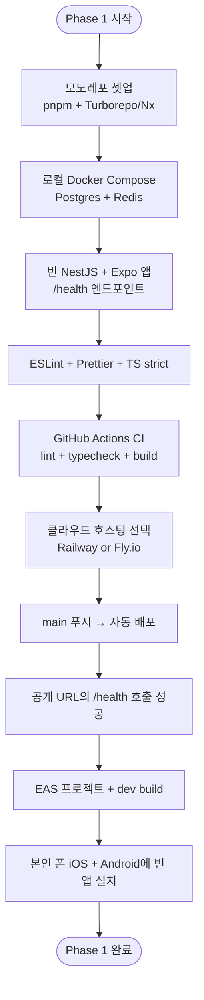

# Phase 1: 기초 셋업 + 조기 배포 Spec

> **상태**: Draft
> **작성일**: 2026-05-22
> **작성**: Claude (프롬프팅: @sikkzz)
> **기간 목표**: 1.5~2주
> **관련 문서**: [PROJECT_ROOT 6장 Phase 1](../PROJECT_ROOT.md#6-단계별-로드맵), [ADR-0001 모노레포 도구](../decisions/0001-monorepo-tool.md)

---

## 1. 한 줄 요약

기능을 짓기 전에 **"내 코드가 클라우드에서 자동 배포되어 돌아가는 상태"**를 먼저 만든다. 학습 영역 #1 (인프라/DevOps)의 1차 실전.

## 2. 배경 / 왜 만드는가

- PROJECT_ROOT 7장 Q1에서 **"인프라 먼저"**가 확정됨. 이 spec은 그 결정의 실행 계획.
- 인프라가 깔려 있어야 이후 모든 기능이 자연스럽게 "로컬 → 푸시 → 배포" 사이클을 반복하게 됨.
- "Hello-World가 클라우드에서 도는 상태"는 사이드의 가장 큰 동기 부여 마일스톤 중 하나.

**학습 영역 연결**: PROJECT_ROOT 2장 학습 우선순위 1번 (인프라 / 배포 / DevOps).

## 3. 사용자 스토리

이 Phase의 "사용자"는 개발자 본인.

- **As a** 개발자, **I want to** 로컬에서 `docker compose up` 한 번에 전체 의존 서비스가 뜨기를, **so that** 매번 환경 셋업하느라 시간 안 뺏기게.
- **As a** 개발자, **I want to** `git push origin main` 한 번에 CI가 돌고 클라우드에 자동 배포되기를, **so that** 이후 기능 개발 시 "배포 어떻게 하지"를 다시 고민할 필요 없게.
- **As a** 개발자, **I want to** 본인 폰에 빈 RN 앱이 깔려 있기를, **so that** 모바일 빌드/배포 사이클을 일찍 한 번 끝내두고 첫 빌드의 부담을 분리.

## 4. 수용 기준 (Acceptance Criteria)

### 4.1 로컬 환경

- [ ] pnpm 모노레포가 구성되어 있음 (`apps/mobile`, `apps/server`, `packages/shared-types`, `packages/eslint-config`)
- [ ] 모노레포 빌드 도구가 셋업되어 있음 (ADR-0001로 결정)
- [ ] `docker compose up` 한 번에 Postgres + Redis가 동시에 뜸
- [ ] 백엔드(`apps/server`)가 로컬에서 `pnpm dev` 로 실행되고, `/health` 가 200 반환
- [ ] 모바일(`apps/mobile`)이 `pnpm start` 로 Expo 개발 서버 실행됨

### 4.2 코드 품질 기본

- [ ] ESLint + Prettier 공통 설정이 `packages/eslint-config` 에 있고 양쪽 앱에서 사용
- [ ] TypeScript strict 모드 활성화 (양쪽 앱)
- [ ] 커밋 컨벤션 합의됨 (Conventional Commits 권장)
- [ ] `.gitignore`, `.env.example` 정리됨

### 4.3 CI (GitHub Actions)

- [ ] PR 생성 시 lint + typecheck + build가 자동 실행
- [ ] main 브랜치 머지 시 백엔드 자동 배포 트리거
- [ ] 시크릿은 GitHub Secrets로 관리 (`.env` 절대 커밋 X)

### 4.4 백엔드 배포

- [ ] 백엔드가 Railway 또는 Fly.io에 배포되어 공개 URL로 접근 가능
- [ ] `https://<공개주소>/health` 가 200 반환
- [ ] 환경변수가 클라우드 콘솔에서 관리되고 있음

### 4.5 모바일 빌드

- [ ] EAS 프로젝트 생성 + `eas.json` 설정
- [ ] development build를 본인 iPhone에 1회 설치 성공
- [ ] development build를 본인 Android 디바이스/에뮬레이터에 1회 설치 성공

### 4.6 문서

- [ ] 첫 ADR (`0001-monorepo-tool.md`) 작성 + Accepted
- [ ] 만난 새 개념별 학습 노트 작성 (예상: pnpm workspaces, Docker Compose, GitHub Actions, EAS, presigned URL 개념 일부 등)
- [ ] README.md 가 "처음 보는 사람이 5분 안에 셋업 가능" 수준으로 작성
- [ ] **docs publish 자동화** — Notion + 자체 sync 스크립트 + GitHub Actions ([ADR-0005](../decisions/0005-docs-publishing-notion-sync.md))

## 5. 비범위 (Out of Scope)

이번 Phase에는 안 함:

- ❌ 실제 도메인 기능 (사진 업로드, 지도, 인증 등) — Phase 2 이후
- ❌ DB 스키마 설계 — Phase 2
- ❌ 프로덕션 수준의 모니터링/로깅 (Sentry 등) — Phase 4
- ❌ TestFlight/Play 내부 테스트 트랙 — Phase 4
- ❌ 도메인 구매 + 커스텀 도메인 연결 — Phase 4
- ❌ 단위/E2E 테스트 프레임워크 셋업 — 필요 시점에 (Phase 2 또는 늦게)

## 6. 사용자 플로우 (개발자 본인 관점)

## 7. 테스트 시나리오 (QA)

| #   | 시나리오                                                              | 예상 결과                                | 자동화 여부        |
| --- | --------------------------------------------------------------------- | ---------------------------------------- | ------------------ |
| 1   | 새로 clone한 환경에서 `pnpm install && docker compose up && pnpm dev` | 양쪽 앱 정상 기동, /health 200           | 수동 (README 검증) |
| 2   | feature 브랜치에서 의도적으로 타입 에러 PR                            | CI가 typecheck 단계에서 실패             | CI                 |
| 3   | feature 브랜치에서 lint 에러 PR                                       | CI가 lint 단계에서 실패                  | CI                 |
| 4   | main 브랜치 머지                                                      | 클라우드 자동 배포 + 새 버전 /health 200 | CI + 수동 curl     |
| 5   | 환경변수 누락 상태로 배포                                             | 서버가 명확한 에러 메시지로 종료         | 수동               |
| 6   | iOS dev build 설치                                                    | 빈 화면 + Expo 로고 표시                 | 수동               |
| 7   | Android dev build 설치                                                | 빈 화면 + Expo 로고 표시                 | 수동               |

## 8. 성공 지표

- **시간**: 2주 이내 완료. 3주 넘어가면 스코프 폭발 의심 → 검토.
- **체크리스트**: 위 수용 기준 25개 모두 통과.
- **느낌 지표**: "이제 기능만 추가하면 되는 상태"라는 본인의 체감.

## 9. 미정 사안 (Open Questions)

작성 중 결정 안 된 사항. 결정되면 ADR로 옮기거나 본문에 반영.

| #   | 사안                                           | 현재 상태                                                                                      | 결정 시점                                          |
| --- | ---------------------------------------------- | ---------------------------------------------------------------------------------------------- | -------------------------------------------------- |
| Q1  | 모노레포 도구 (Turborepo vs Nx)                | ✅ ADR-0001 Accepted (Turborepo)                                                               | 2026-05-22 확정                                    |
| Q2  | 백엔드 호스팅 (Railway vs Fly.io)              | ✅ ADR-0004 Accepted (Fly.io, region=nrt)                                                      | 2026-05-24 확정                                    |
| Q3  | Node 버전 + pnpm 버전 고정 정책                | 미정                                                                                           | 4.1 모노레포 셋업 시                               |
| Q4  | 커밋 컨벤션 (형식 + 강제 도구)                 | ✅ 형식: prefix(영어) + 본문(한글). ✅ husky + commitlint + lint-staged 도입 확정 (2026-05-24) | 4계층 안전망 일부 (husky 로컬 + GitHub Actions CI) |
| Q5  | 모노레포 패키지명 prefix (`@trailog/*`)        | 미정                                                                                           | 4.1 모노레포 셋업 시                               |
| Q6  | Android 테스트 디바이스 (실기기 vs 에뮬레이터) | 미정                                                                                           | 4.5 모바일 빌드 직전                               |
| Q7  | docs publish 자동화 도구                       | ✅ ADR-0005 Accepted (Notion + 자체 sync 스크립트, 2026-05-24)                                 | 2026-05-24 확정                                    |

## 10. 학습 노트 작성 예상 토픽

이번 Phase에서 자동으로 작성될 학습 노트 후보 (Claude가 등장 시점에 제안):

- `pnpm-workspaces.md` — 모노레포 워크스페이스 기본
- `turborepo-basics.md` 또는 `nx-basics.md` — 선택된 도구 정리
- `docker-compose-essentials.md` — 로컬 의존 서비스 띄우기
- `github-actions-ci-basics.md` — CI 파이프라인 기초
- `expo-eas-build.md` — EAS Build 흐름과 개념
- `nestjs-bootstrapping.md` — NestJS 최소 부트스트랩
- `(호스팅 결정 후)` — `railway-or-fly-deployment.md`

## 11. 변경 이력

| 날짜       | 변경 내용                                                                                                                               |
| ---------- | --------------------------------------------------------------------------------------------------------------------------------------- |
| 2026-05-22 | 최초 작성. ADR-0001(모노레포 도구) Proposed 상태로 동반.                                                                                |
| 2026-05-22 | ADR-0001 Accepted (Turborepo). Q4 커밋 컨벤션 형식 확정 (prefix 영어 + 본문 한글). 강제 도구는 여전히 미정.                             |
| 2026-05-24 | Q7 추가 + ADR-0005 Accepted (Notion + 자체 sync 스크립트로 docs publish 자동화). 4.6 문서 섹션에 항목 추가. 사내 위키 자동화 prototype. |
