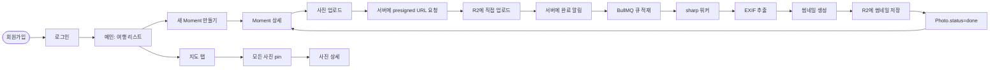

# Phase 2: 핵심 기능 — 사진 업로드 + 이미지 처리 + 지도 표시

> **상태**: Draft
> **작성일**: 2026-05-28
> **작성**: Claude (프롬프팅: @sikkzz)
> **기간 목표**: 6주 (sub-phase 단위로 호흡 분할)
> **범위 결정**: 옵션 C (B + 지도, 2026-05-28 확정)
> **관련 문서**: [PROJECT_ROOT 6장 Phase 2](../PROJECT_ROOT.md#6-단계별-로드맵), [Phase 1 Spec](./phase-01-bootstrap.md)

---

## 1. 한 줄 요약

도메인 본격 시작. 사용자가 **회원가입 → Moment 만들기 → 사진 업로드 → 지도에서 보기**까지 한 호흡에. 학습 영역 #2 (이미지/미디어) + #3 (지도/데이터 시각화)를 동시에 충족.

## 2. 배경 / 왜 만드는가

- Phase 1 인프라 완료 → 이제 "도메인 기능"이라는 본진 진입.
- 학습 영역 우선순위 2번 (이미지/미디어, 파일 스트리밍) + 3번 (지도/데이터 시각화)이 모두 들어감 — 가장 큰 학습 청크.
- 옵션 C 선택 이유: 한 번에 "앱 모양 갖춤"이 본인 동기 부여에 좋고, 사진 업로드만 있고 지도 없으면 도메인 정체성이 약함. 다만 **sub-phase 단위로 호흡 분할**해서 6주가 부담스럽지 않게.
- 사이드의 **첫 출시 가능한 MVP** 후보가 이 Phase 끝나면 만들어짐.

**학습 영역 연결**:

- #2 이미지/미디어/파일 스트리밍 → 4.3 R2 presigned URL + 4.4 sharp 처리 + 4.5 EXIF
- #3 지도/데이터 시각화 → 4.7 지도 표시
- 부수: 인증(보안), DB 설계(PostGIS), BullMQ(큐 패턴)

## 3. 사용자 스토리

| As a      | I want to                                             | So that                              |
| --------- | ----------------------------------------------------- | ------------------------------------ |
| 첫 사용자 | 회원가입하고 로그인                                   | 내 데이터를 가질 수 있다             |
| 사용자    | Moment(여행/카페/산책/단발 외출)을 만들고 사진을 올림 | 사진이 어떤 순간에 속하는지 정리됨   |
| 사용자    | 사진을 올리면 자동으로 촬영 시간/위치가 추출됨        | 일일이 메타데이터 입력 안 해도 됨    |
| 사용자    | 지도에서 내 사진들 보기                               | 어디를 다녔는지 시각적으로 확인/회상 |
| 사용자    | 사진 썸네일이 빨리 로드됨                             | 모바일 데이터/배터리 절약            |

## 4. 수용 기준 (Acceptance Criteria) — sub-phase별

### 4.1 인증 (1주) — ✅ 완료 (2026-05-30)

- [x] DB User 엔티티 (TypeORM, [ADR-0006](../decisions/0006-orm-typeorm.md))
- [x] `POST /auth/sign-up` — 이메일/비밀번호 회원가입, bcrypt hash (cost factor 10)
- [x] `POST /auth/sign-in` — access token(15분) + refresh token(7일) 발급
- [x] `POST /auth/refresh` — refresh로 새 token pair 재발급
- [x] `POST /auth/sign-out` — Stateless (no-op). Phase 4에 Redis blacklist 전환 검토 (메모리 `auth-deep-dive-revisit`)
- [x] 모바일 secure storage (expo-secure-store) — iOS Keychain + Android Keystore
- [x] HTTP interceptor 자동 갱신 (fetch wrapper + refreshPromise 단일화 + \_retried flag — 참조 RestAPIInstance 패턴 채택)
- [x] 인증 학습 노트 작성 ([jwt-auth-and-refresh-rotation.md](../learnings/jwt-auth-and-refresh-rotation.md) — JWT vs Session, Bearer vs Cookie, Refresh 회전 3 패턴, bcrypt 깊이, 참조 코드 비교, Swagger 통합, 함정 8종)
- [x] (추가) NestJS Swagger 인터랙티브 API 문서 + Bearer auth (참조 패턴 채택)
- [x] (추가) JwtStrategy + JwtAuthGuard + `@CurrentUser` 401 안전망 (참조 `@UserParam` 패턴 채택)

검증: Swagger UI(/api/docs)로 백엔드 8 단계 흐름 검증 완료. 모바일 인증 client는 Phase 2 4.6 모바일 첫 화면 진입 시 자연 검증 (dev build 재빌드는 expo-image-picker 등 native module 추가 시점에 한 번에).

### 4.2 DB 인프라 준비 (PostGIS + 자동 migration + 학습) — ✅ 완료 (2026-05-30)

> **방식 변경 (2026-05-30 메모리 `feedback-feature-first-schema` 박제)**:
> Entity 미리 다 설계 X. Moment/Photo 등 도메인 entity는 **각 feature sub-phase 진입 시점**에 점진 작성.
> 4.2엔 인프라 준비 (PostGIS 확장 enable + 자동 migration CI + 일반 학습)만.

- [x] ORM 선택 (Q1) + 도입 — TypeORM ([ADR-0006](../decisions/0006-orm-typeorm.md))
- [x] 마이그레이션 도구 — TypeORM Migration (4.1에서 셋업 완료)
- [x] Node 20 → 22 LTS 업그레이드 (보안 패치 + TypeORM yargs ESM 호환 해결)
- [x] PostGIS 확장 enable 마이그레이션 (`CREATE EXTENSION IF NOT EXISTS postgis;`) — 로컬 적용 완료
- [x] GitHub Actions deploy 단계에 자동 migration 실행 (Fly `release_command` 패턴 — 컨테이너 부팅 직전 단일 인스턴스 실행)
- [x] 학습 노트: [postgis-basics.md](../learnings/postgis-basics.md) (공간 자료형, ST\_\* 함수, GIST 인덱스, SRID 4326, 함정 7종)
- [x] 학습 노트: [indexes-strategy.md](../learnings/indexes-strategy.md) (B-tree/GIST/GIN/BRIN, Trailog 인덱스 전략 표, 함정 10종)

검증: 로컬 Postgres에서 마이그레이션 적용 + `migrations` 테이블 record 확인. 운영(Fly Postgres)은 Q11 결정 + 운영 DB 생성 시점에 자동 적용 (release_command).

**4.2에서 entity 작성 X**:

- Moment entity → 4.3 진입 시 (사진 업로드 흐름에 Moment 만들기 포함)
- Photo entity → 4.3 진입 시 (최소 컬럼 — id, momentId, userId, originalUrl 등)
- Photo.thumbnailUrls / processingStatus → 4.4 sharp 작업 진입 시 추가
- Photo.takenAt / location (PostGIS Point) / exifJson → 4.5 EXIF 진입 시 추가
- User 보강 (displayName, lastLoginAt 등) → 4.6 모바일 화면 디자인 시점에 필요분만

### 4.3 사진 업로드 인프라 (R2 presigned URL) — ✅ 완료 (2026-05-31)

- [x] **Moment entity 초안** + 마이그레이션 (id, userId FK, title, startedAt, endedAt). 도메인: 여행/카페/산책/단발 무관.
- [x] **Photo entity 초안** + 마이그레이션 (id, momentId FK CASCADE, userId FK CASCADE denorm, originalKey varchar(512))
- [x] Cloudflare R2 버킷 생성 + IAM 토큰 (`trailog-photos-dev`, APAC, Object R/W)
- [x] `POST /moments/:momentId/photos/upload-url` → presigned PUT URL 발급 (5분 만료)
- [x] 클라이언트가 R2에 **직접 업로드** (모바일 lib `uploadPhotoToR2` — `apps/mobile/src/lib/photos/`)
- [x] `POST /moments/:momentId/photos` → 업로드 완료 알림 + Photo row 생성 + key prefix 재검증
- [x] `GET /moments/:momentId/photos` → 사진 리스트 + presigned GET URL 동봉 (1시간 만료)
- [x] 보안: 사용자별 prefix (`user/{userId}/moments/{momentId}/{photoId}.{ext}`), 5단 보안 layer
- [x] R2 presigned URL 학습 노트 ([r2-presigned-url-basics.md](../learnings/r2-presigned-url-basics.md))
- [x] **ADR Q3 확정**: 이미지 저장소 — Cloudflare R2 ([ADR-0007](../decisions/0007-image-storage-r2.md))
- [x] (추가) 모바일 client lib (`apps/mobile/src/lib/photos/`) — 4 helper + uploadPhoto high-level 헬퍼

검증: Swagger UI(/api/docs) + 백엔드 40 tests 통과. R2 검증 스크립트(`pnpm verify:r2`) PUT/GET/Presigned/DELETE 4단계. 모바일 lib 실 검증은 Phase 2 4.6 (expo-image-picker 추가 + dev build 재빌드).

### 4.4 sharp 이미지 처리 + BullMQ — ✅ 완료 (2026-06-01)

- [x] **Photo entity 보강 마이그레이션**: `thumbnail_keys jsonb NULL`, `processing_status varchar(20) NOT NULL DEFAULT 'pending'`
  - 명칭 정정: `thumbnailUrls` → `thumbnailKeys` (URL은 매번 동적 발급, DB엔 영구 key만)
  - PG enum X → varchar — enum 변경 시 마이그레이션 비싸고 NestJS 패턴 일관
- [x] BullMQ 워커 — `apps/server/src/photos/photo-processing.processor.ts`
  - 위치 정정: jobs/ → photos/ (참조 패턴 일관 — 도메인 모듈 응집)
  - `BullModule.forRootAsync` + `registerQueue`를 `PhotosModule` 안에 박음 (메모리 `bullmq-domain-vs-root-revisit`)
- [x] Trigger: `confirmPhotoUpload`에서 `queue.add('process', data, { jobId: photoId, attempts: 3, backoff: exponential 5s })`
  - `jobId: photoId` 멱등 — confirm 재시도 시 중복 enqueue 차단
- [x] sharp로 썸네일 3 size + WebP 변환 — `small 320px / medium 800px / large 1600px`
  - 명칭 정정: `s/m/l` → `small/medium/large` (API 응답 contract 가독성)
  - Sequential reduce (Promise.all X) — 메모리 spike 회피 (Fly.io 256MB VM 안전)
  - `.rotate()` (EXIF orientation 자동) + `.resize({ withoutEnlargement })` + `.webp({ quality 80/85/90 })`
- [x] R2에 별도 prefix — `user/{userId}/moments/{momentId}/thumbs/{photoId}_{size}.webp`
  - Hierarchy 추가: moments/{momentId}/thumbs/ (사용자 prefix 안에 moment 별도 분리)
- [x] 실패 시 retry (BullMQ 3회 + exponential backoff) + `@OnWorkerEvent('failed')` 최종 실패 DB 마킹
  - 중간 실패는 warn 로그만, `attemptsMade >= attempts` 시점에만 `processing_status='failed'`
- [x] **D3b — Processor 결과 DB 반영**: `process()` 끝에 `photoRepo.update({thumbnailKeys, processingStatus:'done'})`
- [x] **D3c — Photos API 응답 노출**: `PhotoListItemDto`에 `thumbnailUrls(small/medium/large)` + `processingStatus` 추가. `buildThumbnailUrls` private helper로 3 size presigned GET URL 병렬 발급
- [x] sharp 학습 노트 ([sharp-image-processing.md](../learnings/sharp-image-processing.md)) — libvips demand-driven pipeline, WebP, `.rotate()` EXIF, sequential vs parallel, 함정 10종
- [x] BullMQ 학습 노트 ([bullmq-and-redis-queues.md](../learnings/bullmq-and-redis-queues.md)) — Redis 자료구조 활용, job lifecycle, jobId 멱등성, exponential backoff, lifecycle events, 대안 비교, 함정 10종
- [x] (추가) **Entity DB COMMENT 룰 정착** — 인수인계 패턴 채택. user/moment/photo 모든 entity `@Entity({ comment })` + `@Column({ comment })` 한국어 일괄 적용 + nest-backend.md 룰 박제. 미래 entity 자동 적용
- [x] (추가) **photos.service.spec BullQueue mock fix** — D2 commit 시 spec 업데이트 누락 회귀 (40/40 통과 복구)

검증: typecheck/build/lint + 40/40 tests pass + 마이그레이션 2건 적용(local DB COMMENT + thumbnail_keys/processing_status). BullMQ 워커 실 검증은 Phase 2 4.6 모바일 통합 시 자연 검증 (사진 선택 → upload-url → R2 PUT → confirm → 큐 → 워커 → API GET 흐름).

### 4.5 EXIF 추출 — ✅ 완료 (2026-06-03)

- [x] **Photo entity 보강 마이그레이션**: `taken_at timestamptz NULL`, `location geometry(Point, 4326) NULL`, `exif_json jsonb NULL` + GIST 인덱스 on `location` + B-tree on `taken_at`
  - 명칭 정정: snake_case 컬럼명 (TypeORM `name:` 옵션 박제)
  - DB COMMENT 룰 일관 적용 (4.4 정착)
- [x] **Q5 EXIF 라이브러리 확정** — `exifreader` (pure JS, GPS decimal 자동 변환, HEIC/PNG/TIFF 모두, Fly.io 256MB VM 안전)
  - 대안 비교: `sharp.metadata()` (GPS IFD 직접 파싱 필요) / `exiftool-vendored` (worker별 process spawn) / `piexifjs` (JPEG only)
- [x] BullMQ 워커에 EXIF 추출 단계 추가 — sharp 변환 끝난 후 같은 originalBuffer로 `ExifReader.load(buf, { expanded: true, async: false })`
- [x] `Photo.takenAt` ← EXIF DateTimeOriginal (DateTime fallback)
  - 파싱: `'YYYY:MM:DD HH:MM:SS'` → `'YYYY-MM-DDTHH:MM:SS'` ISO-like → `new Date()` (local time 해석)
  - timezone 함정 인지 — OffsetTimeOriginal 미사용 (단순화 채택, 학습 노트 박제)
- [x] `Photo.location` ← EXIF GPS Lat/Lng → PostGIS Point GeoJSON
  - GeoJSON 좌표 순서 `[longitude, latitude]` 함정 인지 (가장 흔한 버그)
  - DB는 GeoJSON 표준 / API는 모바일 친화 `{latitude, longitude}` — Service mapping layer가 변환
- [x] (추가) **`exif_json` 원본 보존** — 미래 새 필드 추출 시 reprocess 없이 DB만 update (디버깅 + 카메라/렌즈 통계 등 미래 활용)
- [x] (추가) **D3 — Photos API 응답 노출**: `PhotoListItemDto`에 `takenAt(ISO\|null)` + `location({latitude, longitude}\|null)` 추가. `PhotoLocationDto` nested class + `toLocationDto` private helper로 GeoJSON → DTO 변환
- [x] (추가) **EXIF 추출 실패 fault tolerance** — `extractExif` try/catch로 throw X. 스크린샷/깨진 메타데이터는 null 박고 사진 자체는 `processing_status='done'`
- [ ] EXIF 없는 사진: 클라이언트에서 수동 입력 fallback UI — **Phase 2 4.6 모바일 화면 작업으로 이동**
- [x] 학습 노트 ([exif-and-photo-metadata.md](../learnings/exif-and-photo-metadata.md)) — EXIF IFD 트리, DateTime 3종, `:` 구분자 파싱 함정, timezone 함정, GPS rational→decimal, GeoJSON 순서 함정, PostGIS Point + SRID 4326, 프라이버시 깊이(John McAfee 사고), 함정 10종

검증: typecheck/lint + 40/40 tests pass + 마이그레이션 1건 적용(local — `1780409731442-AddPhotoExifColumns`). 실 EXIF 추출 검증은 Phase 2 4.6 모바일 통합 시 자연 검증 (사진 선택 → upload → confirm → 워커 → EXIF 박힘 → API GET 흐름).

### 4.6 모바일 첫 화면 — ✅ 완료 (2026-06-03)

- [x] **D1 — Expo Router 라우트 골격** ((auth)/login,signup + (tabs)/\_layout,moments,map + moments/[momentId] + moments/create + photos/[photoId]) + 의존성 6개(react-hook-form + zod + @hookform/resolvers + @tanstack/react-query + expo-image-picker + expo-image) + QueryClient 글로벌 설정
- [x] **D2 — 로그인/회원가입** (RHF + zodResolver + RN Controller) + index 인증 분기 redirect + `setOnUnauthorized` 콜백 (API 401 자동 redirect layer)
- [x] **D3 — Moments lib + 리스트/생성/상세** (Schema + API + React Query hooks) + (tabs)/moments FlatList + create RHF mutation + [momentId] 캐시 활용
- [x] **D4a — Photos lib Schema 정정** + 4.4/4.5 누락 필드 추가 (thumbnailUrls/processingStatus/takenAt/location) + React Query hooks (useMomentPhotos + useUploadPhoto)
- [x] **D4b — Moment 상세 사진 grid** (FlatList numColumns=3 + expo-image + processingStatus 분기 overlay)
- [x] **D4c — 사진 업로드 흐름** (expo-image-picker + FileSystem.uploadAsync BINARY_CONTENT + per-photo progress UI + refetchInterval polling + manual refresh state)
- [x] **D4d — 사진 상세 화면** (full-screen expo-image + takenAt/location/processingStatus + 리스트 query 캐시 활용)
- [x] **Zod 응답 검증 도입** ([ADR-0008](../decisions/0008-zod-response-validation.md)) — 모든 모바일 lib (auth/moments/photos)에 `Schema.parse` + `z.infer` 단일 출처
- [x] **기존 lib 정정** — auth/photos 모두 interface → z.infer
- [x] **Q9 결정 — 글로벌 상태 lib 미도입** (React Query만 + 로컬 useState/Context로 충분, 메모리 `client-state-mgmt-revisit` — 추후 트리거 시 Zustand 우선 검토)
- [x] **D5 학습 노트 5건** — expo-router-patterns / expo-image-picker-and-uploadasync / react-query-usage-and-polling / zod-runtime-validation-ux / react-native-fundamentals-for-web-devs
- [x] (추가) 백엔드 fix 2건 — `RestResponse.toJSON()` 4.1~4.5 회귀 + photo-processing `exif_json` sanitize (PostgreSQL jsonb null char 거부)
- [x] (추가) dev CORS 활성화 (모바일 web/native 검증 + 미래 web 출시 대응)

검증: typecheck/lint pass + iOS Simulator 회원가입/리스트/생성/업로드/상세 전체 흐름 + Android Emulator 동일 흐름. **HEIC libheif HEVC 코덱 미지원** 발견 — 4.8 폴리시 wave에 박제 (모바일 변환 또는 백엔드 코덱 추가).

> **UI/UX 폴리시 정책 (2026-06-03 박제)** — 4.6 진행 중 발견된 UX 디테일(raw input, 색상, spacing, animation, HEIC 변환 등)은 **즉시 정정 X**. 코드 주석 + 4.8 항목 누적 박제 → Phase 2 4.7 종료 후 별도 wave에서 일괄 정정 + 학습. 메모리 `ui-ux-polish-wave-revisit` 참조.

### 4.7 지도 표시 (1주)

> **D1 결정 박제 (2026-06-07)**: Q6 지도 라이브러리 — **네이버맵 `@mj-studio/react-native-naver-map`** ([ADR-0010](../decisions/0010-mobile-map-library-naver-map.md), supersedes [ADR-0009](../decisions/0009-mobile-map-library-react-native-maps.md) react-native-maps).
> **도메인 정의 정정 박제 (2026-06-07)**: Trailog 사용자 우선순위 **한국 중심 + 해외는 Phase 후속** ([PROJECT_ROOT 결정 1](../PROJECT_ROOT.md#결정-1-도메인--개인-메모리-아카이브-광의--한국-사용자-중심)).

- [x] **D1 — Q6 라이브러리 결정 + 의존성 셋업** — ADR-0009(react-native-maps) → ADR-0010(네이버맵) supersede. `@mj-studio/react-native-naver-map` v2.9.0 + `expo-build-properties` + `expo-location` install. app.json plugin object 형식 (client_id + Naver Maven repository). NCP Client ID 발급 + 박제 + dev build 재빌드.
- [ ] **D2 — `(tabs)/map` 골격 + 위치 권한 + 기본 지도 표시** (NaverMap 컴포넌트 mount + 초기 center 좌표 + 현재 위치 핀)
- [ ] **D3 — 백엔드 bbox 쿼리 API** — `GET /photos?bbox=...` 또는 `GET /photos/with-location`. PostGIS `ST_Within` + `ST_MakeEnvelope` 또는 `WHERE location IS NOT NULL` 자연 검증
- [ ] **D4 — 사진 pin + popup** — 본인 사진 location → NaverMap Marker. pin 클릭 → photo detail navigation
- [ ] **D5 — Cluster** — 네이버맵 자체 cluster 지원 확인 또는 외부 lib/직접 구현. 사진 많아질 때 묶음
- [ ] **D6 — 사진 상세 미니맵 + reverse geocoding** (4.6 D4d 박제) — 현재 raw lat/lng(`63.5314, -19.5112`) → NaverMap 미니맵 + 주소 텍스트 (네이버 Geocoding API 또는 `expo-location.reverseGeocodeAsync`)
- [ ] **D7 — 학습 노트 3건** — (1) 한국 vs 글로벌 모바일 지도 SDK 비교 (네이버/카카오/Google/Apple/MapLibre/expo-maps + ADR-0009 supersede 흐름), (2) cluster 알고리즘 (DBSCAN/Supercluster 등), (3) PostGIS 공간 쿼리 실 사용 (ST_Within/ST_MakeEnvelope/bbox query)

**해외 사진 GPS 제한 (Phase 후속)**: 네이버맵은 한국 데이터 우위 + 해외 데이터 약점. 본인 일본/유럽 등 EXIF GPS 사진은 핀 표시 부정확 또는 데이터 부족 가능. **Phase 후속 (글로벌 출시 시점)**에 multi-provider 또는 글로벌 lib 추가 검토 ([ADR-0010 재검토 트리거](../decisions/0010-mobile-map-library-naver-map.md#재검토-트리거)).

### 4.8 UI/UX 폴리시 + 고도화 학습 (별도 wave, 본인 결정 2026-06-03)

> **트리거**: Phase 2 4.7 (지도) 종료 후 진입. Phase 3 (공유) 진입 전엔 반드시 1번 수행.
> **사유**: 매 sub-phase마다 디자인 디테일까지 폴리시하면 기능 진행 속도 ↓. 핵심 기능 모두 동작 후 본인이 직접 써보면서 발견된 UX 문제 일괄 정정. 동시에 UI/UX 고도화 학습 영역 진입.

**누적 폴리시 항목 (4.6 D3 기준)**:

- [ ] `moments/create.tsx` 시작/종료 raw ISO input → DatePicker (`@react-native-community/datetimepicker`)
- [ ] 색상/spacing/typography design system 정착 (현재 각 화면 별도 hardcode)
- [ ] Login/Signup/Moments/Create 전체 시각 디자인 일관성
- [ ] 빈 상태 / 에러 / loading UI 통일 (재사용 컴포넌트화)
- (이후 wave 진행 중 발견 시 누적 박제)

**학습 노트 (예상)**:

- RN 디자인 system 패턴 비교 (Restyle / Tamagui / 자체 theme)
- NativeWind 도입 (Tailwind RN 적용 — 참조 Tailwind 패턴 정복)
- 접근성 (`accessibilityLabel/Role/Hint`) 깊이
- Reanimated 3 기초 + Gesture Handler
- 다크모드 + theming 패턴
- iOS/Android Human Interface Guidelines 핵심

**작업 기간**: 1주 잠정 (실측 후 조정)

## 5. 비범위 (Out of Scope)

이번 Phase엔 안 함:

- ❌ 사진 공유 / 동행자 초대 → Phase 3
- ❌ 푸시 알림 → Phase 4
- ❌ 검색 / 필터 / 태그 → Phase 3
- ❌ 정밀 권한 모델 (public/private/공유 링크) → Phase 3
- ❌ 통계 / 인사이트 (월별 사진 수, 자주 간 곳) → Phase 4
- ❌ 결제 / 구독 → Phase 5+ (필요 시)
- ❌ Live Photos / 동영상 → Phase 4+
- ❌ AI 자동 태깅 → Phase 5+
- ❌ AWS ECS 마이그레이션 → Phase 4 ([ADR-0002](../decisions/0002-hybrid-infra-paas-then-aws-ecs.md))

## 6. 사용자 플로우 (전체)

## 7. 테스트 시나리오 (QA)

| #   | 시나리오                      | 예상 결과                                               | 자동화            |
| --- | ----------------------------- | ------------------------------------------------------- | ----------------- |
| 1   | 새 사용자 가입 + 로그인       | access + refresh token 받음, 모바일 secure storage 저장 | 수동 + E2E (선택) |
| 2   | access token 만료 후 API 호출 | interceptor가 refresh → 재시도 → 성공                   | 수동              |
| 3   | 사진 1개 업로드               | R2 직접 PUT → 서버 알림 → 30초 안에 썸네일 3종 생성     | 수동              |
| 4   | EXIF 있는 사진 업로드         | takenAt + location 자동 박제                            | 수동              |
| 5   | EXIF 없는 사진                | 수동 입력 fallback UI 노출                              | 수동              |
| 6   | 사진 10개 동시 업로드         | 큐가 직렬/병렬 처리, 진행 상태 정확 표시                | 수동              |
| 7   | 지도 탭 진입                  | 본인 사진 pin 표시, cluster 동작                        | 수동              |
| 8   | 토큰 없이 API 호출            | 401 + 로그인 화면 redirect                              | 수동              |
| 9   | 다른 사용자의 사진 접근 시도  | 403 / 404                                               | 통합 테스트       |

## 8. 성공 지표

- **시간**: 6주 이내. 8주 넘어가면 스코프 축소 또는 sub-phase 일부 deferred 검토.
- **느낌 지표**: 본인이 자기 폰에서 "여행 하나 만들고 사진 업로드 → 지도에서 본다"가 자연스럽게 동작.
- **수용 기준 통과**: 위 4.1~4.7 항목 모두 ✅.
- **MVP 출시 가능 상태**: Phase 2 끝나면 친한 친구에게 베타 권유 가능 수준.

## 9. 미정 사안 (Open Questions)

각 Q는 해당 sub-phase 직전에 결정 + 큰 건 ADR. 모두 Phase 2 진입 후 결정.

| #   | 사안                                                             | 후보                                                                                                                                                                         | 결정 시점       |
| --- | ---------------------------------------------------------------- | ---------------------------------------------------------------------------------------------------------------------------------------------------------------------------- | --------------- |
| Q1  | ORM (Prisma vs TypeORM)                                          | ✅ ADR-0006 Accepted (TypeORM, 2026-05-28) — 친숙도 정복 + 본진 시간 보호.                                                                                              | 2026-05-28 확정 |
| Q2  | JWT 저장 + 전송 방식 (모바일)                                    | ✅ 확정 (2026-05-29): expo-secure-store(OS Keychain/Keystore) + Bearer header. Trailog 모바일 only라 XSS/CSRF 위험 X → cookie 이점 무용. 참조 (실무 웹)와 의도적 다른 선택.    | 2026-05-29 확정 |
| Q3  | 이미지 저장소 (R2 vs Supabase Storage vs S3)                     | R2 잠정 (egress 0) / Supabase (DB와 함께)                                                                                                                                    | 4.3 (ADR 후보)  |
| Q4  | 큐 도구 (BullMQ vs setImmediate vs cron)                         | BullMQ 잠정 (학습 + 표준 패턴)                                                                                                                                               | 4.4             |
| Q5  | EXIF 라이브러리 (exifr vs piexifjs vs sharp 내장)                | exifr 잠정 (가벼움)                                                                                                                                                          | 4.5             |
| Q6  | 지도 라이브러리 (네이버맵 vs 카카오 vs Google/Apple vs MapLibre) | ✅ ADR-0010 Accepted (네이버맵 `@mj-studio/react-native-naver-map`, 2026-06-07) supersedes ADR-0009(react-native-maps). 본인 Google/Apple UX 거부감 + 도메인 한국 우선 정의. | 2026-06-07 확정 |
| Q7  | 사진 카탈로그 UI (Moment-first vs Photo-first)                   | Moment-first 잠정 (사용자 멘탈 모델 — 순간 단위 그루핑)                                                                                                                      | 4.6             |
| Q8  | 상태관리 (Zustand vs Redux Toolkit + RQ)                         | Zustand 잠정 (사이드 규모, 단순)                                                                                                                                             | 4.6             |
| Q9  | 사진 form (react-hook-form 도입?)                                | 도입 잠정 (모바일 form 표준)                                                                                                                                                 | 4.6             |
| Q10 | 사용자 위치 권한 UX                                              | 첫 진입 X, 지도 탭 클릭 시 요청                                                                                                                                              | 4.7             |
| Q11 | DB 호스팅 (Supabase vs Neon vs 로컬 docker)                      | Supabase 잠정 (무료 + Postgres + Auth는 X)                                                                                                                                   | 4.2 (ADR 후보)  |

## 10. 학습 노트 작성 예상 토픽

| 토픽                                                                  | sub-phase |
| --------------------------------------------------------------------- | --------- |
| `jwt-auth-and-refresh-rotation.md`                                    | 4.1       |
| `prisma-or-typeorm.md` (선택 후 정리)                                 | 4.2       |
| `postgis-basics.md`                                                   | 4.2       |
| `r2-presigned-url-uploads.md`                                         | 4.3       |
| `bullmq-redis-queue-patterns.md`                                      | 4.4       |
| `sharp-image-processing.md`                                           | 4.4       |
| `exif-and-privacy.md`                                                 | 4.5       |
| `expo-router-and-mobile-state.md`                                     | 4.6       |
| `mobile-map-libraries-comparison.md` (네이버맵 채택 + supersede 박제) | 4.7       |
| `cluster-algorithms-and-spatial-queries.md` (cluster + PostGIS bbox)  | 4.7       |

## 11. 변경 이력

| 날짜       | 변경 내용                                                                                                                                                                                                                                                                                                                                                                                                                                                                                                                                                                                                                                                                                                                                                                                                                                                                                                                                                                                                                                                                                                                                                                                                                                                                                                                                                                                                                                                                                                                                                                                                                                                           |
| ---------- | ------------------------------------------------------------------------------------------------------------------------------------------------------------------------------------------------------------------------------------------------------------------------------------------------------------------------------------------------------------------------------------------------------------------------------------------------------------------------------------------------------------------------------------------------------------------------------------------------------------------------------------------------------------------------------------------------------------------------------------------------------------------------------------------------------------------------------------------------------------------------------------------------------------------------------------------------------------------------------------------------------------------------------------------------------------------------------------------------------------------------------------------------------------------------------------------------------------------------------------------------------------------------------------------------------------------------------------------------------------------------------------------------------------------------------------------------------------------------------------------------------------------------------------------------------------------------------------------------------------------------------------------------------------------- |
| 2026-05-28 | 최초 작성. 옵션 C (B + 지도) 범위 확정. 6주 호흡, sub-phase 7개로 분할. Open Questions 11건 — 각 sub-phase 직전에 결정 + ADR 후보 3건 (Q3 R2, Q6 지도, Q11 DB 호스팅).                                                                                                                                                                                                                                                                                                                                                                                                                                                                                                                                                                                                                                                                                                                                                                                                                                                                                                                                                                                                                                                                                                                                                                                                                                                                                                                                                                                                                                                                                              |
| 2026-05-28 | Q1 ORM 확정 (TypeORM, [ADR-0006](../decisions/0006-orm-typeorm.md)). 실무 환경 친숙도를 사이드에서 "제대로 학습"으로 정복 + 본진(이미지/미디어/지도) 시간 보호 + NestJS 정석. Prisma는 사이드 후속 또는 별도 프로젝트로 미룸. 4.1 인증 진행 시작.                                                                                                                                                                                                                                                                                                                                                                                                                                                                                                                                                                                                                                                                                                                                                                                                                                                                                                                                                                                                                                                                                                                                                                                                                                                                                                                                                                                                                   |
| 2026-05-29 | Q2 JWT 저장+전송 방식 확정 — expo-secure-store + Bearer header. 참조 인증 패턴(실무 웹, CSRF token, 2FA 4종, 다층 캐싱, service 11개+guard 9개) 본격 분석 후 모바일 컨텍스트엔 단순한 Bearer가 적합 결정. 참조 패턴 중 Phase 후속 채택 가치 있는 항목들(PasswordService 분리, last_login_at, Stateful logout, Redis blacklist, Token rotation, 다층 캐싱, OAuth, 2FA 등)은 메모리 `auth-deep-dive-revisit`에 박제 — Phase 3/4/5 시점에 자동 인지.                                                                                                                                                                                                                                                                                                                                                                                                                                                                                                                                                                                                                                                                                                                                                                                                                                                                                                                                                                                                                                                                                                                                                                                                                    |
| 2026-05-30 | 4.1 인증 코드 본격 완성 — Commit 1~6 (의존성 + UsersService + AuthService + Controller/DTO + JwtStrategy/Guard + Swagger). 참조 패턴 채택(401 throw 안전망, Swagger). 학습 노트 `jwt-auth-and-refresh-rotation.md` 작성 — JWT vs Session, Bearer vs Cookie, Stateless/Blacklist/Rotation 3 패턴, bcrypt 깊이, 참조 코드 비교, 함정 8종, Phase 후속 정복 항목 13 섹션. 4.1 인증 학습 노트 항목 ✅.                                                                                                                                                                                                                                                                                                                                                                                                                                                                                                                                                                                                                                                                                                                                                                                                                                                                                                                                                                                                                                                                                                                                                                                                                                                                        |
| 2026-05-30 | 4.1 인증 **완료** — Commit 8 (모바일 인증 client). 참조 프론트 `RestAPIInstance` 실측 후 채택/거부 결정: 채택 5건(refreshPromise 단일화, `_retried` flag, isRefreshEndpoint, `x-client-platform`, ApiError class) / 거부 4건(class 2단계 wrapper, setAPIErrorCallback 전역, APIError.method, Cookie+CSRF). 의도적 다양화 — 참조 axios → 사이드 fetch wrapper로 interceptor 직접 정복. 검증은 Phase 2 4.6 모바일 첫 화면 진입 시 자연 검증. 다음 단계: Phase 2 4.2 DB 스키마 + 마이그레이션.                                                                                                                                                                                                                                                                                                                                                                                                                                                                                                                                                                                                                                                                                                                                                                                                                                                                                                                                                                                                                                                                                                                                                                         |
| 2026-05-30 | 4.1 정정 commit — DTO 명명 정정(Request/Response 명시, `Dto` Pascal suffix), RestResponse class 도입(code 9개 + method 4개 enum), AuthService throw → RestResponse.error() 반환 패턴, AuthController endpoint sign-up/sign-in/sign-out, 모바일 client RestResponse 자동 unwrap + method 자동 액션(LOG_OUT → clear+callback). 백엔드 Jest 셋업 + 4.1 인증 단위 테스트 29 케이스(UsersService 5/AuthService 10/RestResponse 12/JwtStrategy 2). CI에 Test 단계 추가.                                                                                                                                                                                                                                                                                                                                                                                                                                                                                                                                                                                                                                                                                                                                                                                                                                                                                                                                                                                                                                                                                                                                                                                                   |
| 2026-05-30 | **방식 전환 — 4.2 Feature-first incremental schema**. 본인 entity 설계 방식(feature 작업 시작 시 초안 → 기능 개발하면서 점진 추가) 박제(메모리 `feedback-feature-first-schema`). Phase 2 4.2 항목 재정의 — entity 미리 설계 X, 인프라(PostGIS 확장 enable + 자동 migration CI + 학습 노트)만. Trip entity → 4.3 진입 시점, Photo 초안 → 4.3 / 보강 → 4.4 / 4.5 점진. 4.2 기간 3일 → 2일 단축.                                                                                                                                                                                                                                                                                                                                                                                                                                                                                                                                                                                                                                                                                                                                                                                                                                                                                                                                                                                                                                                                                                                                                                                                                                                                       |
| 2026-05-30 | 4.2 인프라 **완료** — Node 20 → 22 LTS 업그레이드(보안 패치 + TypeORM yargs ESM 호환), PostGIS 확장 enable 마이그레이션(`CREATE EXTENSION IF NOT EXISTS postgis`) + Fly `release_command`로 자동 migration 박제, 학습 노트 2건(`postgis-basics.md` + `indexes-strategy.md`). 마이그레이션 검수 룰 메모리 박제(`feedback-migration-confirmation` — 본인 OK 후 실행). 다음: 4.3 사진 업로드 인프라 진입 (Trip entity 초안 + R2 presigned URL + Photo entity 초안 + 모바일 client 통합).                                                                                                                                                                                                                                                                                                                                                                                                                                                                                                                                                                                                                                                                                                                                                                                                                                                                                                                                                                                                                                                                                                                                                                               |
| 2026-05-31 | **도메인 광의 재정의 + Moment 명명 확정**. 처음 "여행 사진 아카이브"로 그렸으나 본인 의도가 "여행 + 일상 모든 순간(카페/산책/단발 외출 포함) 아카이브"임 확인. 기록 단위를 `Trip` → `Moment`로 변경. Trailog 어휘(Trail + Log)는 광의에도 충분 — "a trail of moments". PROJECT_ROOT 도메인 정의 + 결정 1 + 사용자 스토리 + 4.3 항목 + Mermaid 흐름 정정. 4.3 D1 코드(entity/dto/service/controller/module/spec/migration) 모두 Moment 명명으로 작성. Controller/Service 메서드명 룰(동사 + 도메인 명사 명시) 추가 박제 — UsersService + AuthService + AuthController 일관 정정 별도 commit.                                                                                                                                                                                                                                                                                                                                                                                                                                                                                                                                                                                                                                                                                                                                                                                                                                                                                                                                                                                                                                                                         |
| 2026-05-31 | **4.3 D2 — Q3 이미지 저장소 R2 확정 ([ADR-0007](../decisions/0007-image-storage-r2.md))** + 학습 노트 [r2-presigned-url-basics.md](../learnings/r2-presigned-url-basics.md) 작성. R2 vs S3 vs Supabase Storage vs B2 4 비교 — R2 채택 (egress 무료, S3 호환 API, 10GB 무료, 글로벌 anycast). 학습 노트엔 Signature V4, IAM token, presigned URL 흐름, NestJS @aws-sdk 사용 패턴, 함정 8종(ContentType mismatch, CORS, 만료 시간, prefix, public X 등). 다음: 4.3 D3 R2 셋업(버킷 + IAM + Fly secrets) + D4 Photo entity + presigned endpoint.                                                                                                                                                                                                                                                                                                                                                                                                                                                                                                                                                                                                                                                                                                                                                                                                                                                                                                                                                                                                                                                                                                                       |
| 2026-05-31 | **4.3 D3 — Cloudflare R2 셋업 완료**. Cloudflare 가입 + R2 활성화 + 버킷 `trailog-photos-dev` (APAC) + Object R/W IAM token. 로컬 `apps/server/.env` 박제 + `pnpm verify:r2` 통과 (PUT/GET/Presigned/DELETE 4단계). `@aws-sdk/client-s3` + `@aws-sdk/s3-request-presigner` 의존성. 운영(Fly) 박제는 Q11 + prod 버킷 생성 시점.                                                                                                                                                                                                                                                                                                                                                                                                                                                                                                                                                                                                                                                                                                                                                                                                                                                                                                                                                                                                                                                                                                                                                                                                                                                                                                                                      |
| 2026-05-31 | **학습 노트** [typescript-strict-mode.md](../learnings/typescript-strict-mode.md) 작성 — DTO `!:` 질문에서 파생. strict 모드 7+ 옵션 비교 + Trailog `strict: true` vs 다른 NestJS 점진 enabling 패턴. ValidationPipe/TypeORM 신뢰 layer로 `!:` 안전성 박제. 함정 6종 (`!:` 남용, `as` 우회, `@ts-ignore`, catch unknown, interface 불일치 등) + 더 파볼 거리 7건 (점진 마이그레이션 PR, discriminated union, brand types, satisfies, zod 등).                                                                                                                                                                                                                                                                                                                                                                                                                                                                                                                                                                                                                                                                                                                                                                                                                                                                                                                                                                                                                                                                                                                                                                                                                       |
| 2026-05-31 | **🎉 4.3 사진 업로드 인프라 완료** — D4(R2Module + Photos 도메인 + presigned endpoints 3종 + 5단 보안 layer + 마이그레이션 4번째) + D5(모바일 client lib `apps/mobile/src/lib/photos/` — createPresignedUploadUrl/uploadPhotoToR2/confirmPhotoUpload/getMomentPhotos + uploadPhoto high-level 헬퍼). Web↔Mobile 비교 주석 박제(blob 생성, progress, CORS, timeout 차이). 모바일 단위 테스트는 4.6 RNTL+jest-expo 셋업과 함께. 다음: 4.4 sharp 이미지 처리 + BullMQ (썸네일 3 size + WebP).                                                                                                                                                                                                                                                                                                                                                                                                                                                                                                                                                                                                                                                                                                                                                                                                                                                                                                                                                                                                                                                                                                                                                                          |
| 2026-05-31 | **학습 노트** [api-client-patterns.md](../learnings/api-client-patterns.md) + **ADR-0008** [Zod 응답 검증 도입](../decisions/0008-zod-response-validation.md) — 참조 Class+Zod 패턴 vs Trailog 함수+TS interface 비교. Class vs 함수는 트렌드(함수형) 따름. Zod 응답 검증은 Phase 2 4.6에 react-hook-form + zodResolver + React Query 자연 통합 시점 도입 결정. 기존 4.1 auth + 4.3 photos lib는 4.6 시점에 Schema 정정 (interface → z.infer 단일 출처). 함정 6종(Singleton import, apiRequest 암묵 의존, parse 비용, ZodError 처리, 타입+Schema 중복, Class vs 함수 실제 차이 작음).                                                                                                                                                                                                                                                                                                                                                                                                                                                                                                                                                                                                                                                                                                                                                                                                                                                                                                                                                                                                                                                                               |
| 2026-06-01 | **🎉 4.4 sharp 이미지 처리 + BullMQ 완료** — D1(BullMQ + Redis 셋업, PhotosModule 안에 forRoot + registerQueue, 참조 패턴 도메인 모듈 응집) + D2(sharp processor + photo-processing 큐 enqueue, sequential 3 size WebP, jobId=photoId 멱등) + D3a(Photo entity 보강 — thumbnail_keys jsonb + processing_status varchar) + D3b(processor 결과 DB 반영 + `@OnWorkerEvent('failed')` 최종 실패 마킹) + D3c(Photos API 응답에 thumbnailUrls small/medium/large + processingStatus 노출, buildThumbnailUrls helper 분리). **추가 박제**: Entity DB COMMENT 룰 정착(인수인계 패턴, nest-backend.md 보강) + photos.service.spec BullQueue mock fix(D2 회귀). 학습 노트 2건(sharp-image-processing.md + bullmq-and-redis-queues.md, 함정 각 10종). 메모리 박제 4건(thumbnail-sizes-revisit, bullmq-domain-vs-root-revisit, feedback-entity-comment-pattern, feedback-skip-artificial-verification-when-natural-coming). 다음: 4.5 EXIF 추출 (takenAt + PostGIS location).                                                                                                                                                                                                                                                                                                                                                                                                                                                                                                                                                                                                                                                                                              |
| 2026-06-03 | **🎉 4.5 EXIF 추출 완료** — D1(Q5 exifreader 확정 + Photo entity 보강 `taken_at`/`location geometry(Point,4326)`/`exif_json` + GIST/B-tree 인덱스 + 마이그레이션 적용) + D2(Worker에 EXIF 추출 단계 — DateTimeOriginal 파싱 `:` 구분자 함정 처리, GPS GeoJSON `[lng,lat]` 변환, EXIF 추출 실패 fault tolerance — throw X) + D3(Photos API 응답에 takenAt + location 노출, `PhotoLocationDto` nested class, DB GeoJSON ↔ API friendly `{latitude, longitude}` Service mapping). **추가 박제**: `exif_json` 원본 보존(미래 새 필드 추출 시 reprocess 없이 DB만 update) + jsonb update의 TypeORM type 한계 회피(`as never` cast 한 줄 + 주석). 학습 노트 [exif-and-photo-metadata.md](../learnings/exif-and-photo-metadata.md) — EXIF IFD 트리, DateTime 3종, timezone 함정(OffsetTimeOriginal 단순화 채택), GPS rational→decimal, GeoJSON 좌표 순서 함정(가장 흔한 버그), PostGIS Point + SRID 4326, **프라이버시 깊이**(John McAfee 사고 + SNS strip 패턴 + Phase 3 공유 시 strip 정책). 참조 EXIF 미사용 — 보편 Node 패턴 채택. EXIF 없는 사진 수동 입력 fallback UI는 4.6 모바일로 이동. 다음: 4.6 모바일 첫 화면.                                                                                                                                                                                                                                                                                                                                                                                                                                                                                                                                         |
| 2026-06-03 | **🎉 4.6 모바일 첫 화면 완료** — D1(Expo Router 골격 + QueryClient + 의존성 6개) + D2(Login/Signup RHF + zodResolver + index 인증 분기 + setOnUnauthorized) + D3(Moments lib + 리스트/생성/상세 + React Query) + D4a-d(Photos lib Schema 정정 + 사진 grid + 업로드 흐름 expo-image-picker + FileSystem.uploadAsync + refetchInterval polling + 사진 상세) + D5(학습 노트 5건). **Q9 결정** — 글로벌 상태 lib 미도입(React Query + 로컬 state 충분). **ADR-0008 Zod 응답 검증 정착** — 모든 모바일 lib Schema.parse + z.infer 단일 출처. **추가 백엔드 fix 2건** — RestResponse.toJSON() 4.1~4.5 회귀 + photo-processing exif_json sanitize(PostgreSQL jsonb null char 거부). 학습 노트 5건(expo-router-patterns + expo-image-picker-and-uploadasync + react-query-usage-and-polling + zod-runtime-validation-ux + react-native-fundamentals-for-web-devs). **4.8 UI/UX 폴리시 wave 신설** — 4.6 진행 중 발견된 UX 디테일(raw ISO input, 색상/spacing, HEIC 변환 등) 즉시 정정 X, 별도 wave 일괄. iOS Simulator + Android Emulator 검증 완료. 다음: 4.7 지도 표시.                                                                                                                                                                                                                                                                                                                                                                                                                                                                                                                                                                                                   |
| 2026-06-03 | **4.6 Android 통합 검증 중 발견 4건 + fix 박제**. ① **백엔드 worker `POINT(0 0)` 버그 fix** — exifreader가 GPS Ref 없으면 capitalized `Latitude` 필드를 null로 반환하는데, worker의 `typeof === 'number'` guard는 통과시키지 않지만 NaN은 통과. JSON 직렬화 시 NaN → null → TypeORM이 PostGIS Point 변환 시 `POINT(0 0)` fallback. `Number.isFinite()` 일괄 guard로 fix. ② **Android Emulator localhost networking fix** — Android Emulator는 자체 network namespace이라 `localhost`로 host Mac 접근 불가. `Platform.OS === 'android'` 분기로 `10.0.2.2:3000` 자동 사용 (`api-client.ts` `getDefaultApiUrl()`). ③ **React state warning fix** — Android에서 `setChecking` state가 unmount 시점과 race → `Can't perform a React state update` 경고. `index.tsx`에서 state 자체 제거 + lifecycle 안전 패턴(`let cancelled` flag). ④ **Picker EXIF OS별 차이 발견** — sips + exiftool 합성 EXIF가 Android picker만 GPS Ref 손실. 진짜 카메라 EXIF는 양쪽 다 정상 — production 영향 X. 추후 인지 메모리 `picker-exif-preservation-revisit` 박제 (Phase 3 공유 흐름/사용자 손실 보고/Phase 4 production/picker 업그레이드 시 능동 알림). 학습 노트 3건 보강 — `exif-and-photo-metadata.md` (POINT(0 0) 디버깅 흐름 + EXIF Ref 결정적 역할 + R2 객체 직접 다운로드 검증 도구 + picker OS별 차이 + 검증용 사진 권장) + `postgis-basics.md` (geometry 컬럼 raw SELECT는 hex 함정 + `ST_AsText`/`ST_AsGeoJSON` 사용 패턴 + POINT(0 0) 추적법 + 자주 쓰는 디버깅 쿼리 4종) + `react-native-fundamentals-for-web-devs.md` (Android Emulator 사진 push 흐름 + 10.0.2.2 networking + iOS vs Android picker EXIF 차이 + React state warning lifecycle 패턴). 다음: 4.7 지도 표시. |
| 2026-06-07 | **🎯 4.7 D1 — Q6 지도 라이브러리 결정 흐름 + 도메인 한국 우선 정의 정정 (ADR-0009 → ADR-0010 supersede)**. 처음 react-native-maps 채택 ([ADR-0009](../decisions/0009-mobile-map-library-react-native-maps.md)) 직후 본인 검토 — ① **Google/Apple Maps 한국 사용자 UX 거부감** + ② **Trailog 도메인 사용자 우선순위를 한국 중심으로 재정의** 필요성 부각 → 글로벌 가정 lib을 fundamental 변경. **네이버맵 `@mj-studio/react-native-naver-map` v2.9.0 채택** ([ADR-0010](../decisions/0010-mobile-map-library-naver-map.md), MIT, New Architecture 호환 명시, Expo config plugin 공식). **얻는 것**: 한국 사용자 UX 친숙도(네이버맵 일상 사용) + 한국 도로/지명 정확도 + RN/Expo 안정 통합 + 무료 한도 ↑(NCP 모바일 dynamic map 사실상 무제한) + 한국 시장 모바일 지도 SDK 정복 실무 가치. **포기**: 해외 사진 정확도 → Phase 후속(글로벌 출시 검토 시점) / RN 표준 lib 베이스 정복 보류. **카카오는 RN community lib 안정성 검증 부담**으로 제외 — 네이버가 RN/Expo 통합 안정성 우위. **PROJECT_ROOT 결정 1 도메인 정의에 한국 우선 명시** + 학습 영역 #3 정복 관점 정정(RN 표준 → 한국 시장 실무 SDK). **의존성 swap**: `react-native-maps` 제거 + `@mj-studio/react-native-naver-map` + `expo-build-properties` install. **app.json**: plugin object 형식 (`client_id` + Naver Maven repository 주입). **NCP Client ID 발급** 완료 + 박제. 다음: dev build 재빌드 + D1 commit + D2(`(tabs)/map` 골격 + 위치 권한 + 기본 지도 표시).                                                                                                                                                                                                                                |
