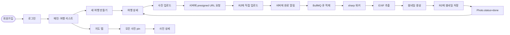

# Phase 2: 핵심 기능 — 사진 업로드 + 이미지 처리 + 지도 표시

> **상태**: Draft
> **작성일**: 2026-05-28
> **작성**: Claude (프롬프팅: @sikkzz)
> **기간 목표**: 6주 (sub-phase 단위로 호흡 분할)
> **범위 결정**: 옵션 C (B + 지도, 2026-05-28 확정)
> **관련 문서**: [PROJECT_ROOT 6장 Phase 2](../PROJECT_ROOT.md#6-단계별-로드맵), [Phase 1 Spec](./phase-01-bootstrap.md)

---

## 1. 한 줄 요약

도메인 본격 시작. 사용자가 **회원가입 → 여행 만들기 → 사진 업로드 → 지도에서 보기**까지 한 호흡에. 학습 영역 #2 (이미지/미디어) + #3 (지도/데이터 시각화)를 동시에 충족.

## 2. 배경 / 왜 만드는가

- Phase 1 인프라 완료 → 이제 "도메인 기능"이라는 본진 진입.
- 학습 영역 우선순위 2번 (이미지/미디어, 파일 스트리밍) + 3번 (지도/데이터 시각화)이 모두 들어감 — 가장 큰 학습 청크.
- 옵션 C 선택 이유: 한 번에 "앱 모양 갖춤"이 본인 동기 부여에 좋고, 사진 업로드만 있고 지도 없으면 도메인 정체성이 약함. 다만 **sub-phase 단위로 호흡 분할**해서 6주가 부담스럽지 않게.
- 사이드의 **첫 출시 가능한 MVP** 후보가 이 Phase 끝나면 만들어짐.

**학습 영역 연결**:

- #2 이미지/미디어/파일 스트리밍 → 4.3 R2 presigned URL + 4.4 sharp 처리 + 4.5 EXIF
- #3 지도/데이터 시각화 → 4.7 지도 표시
- 부수: 인증(보안), DB 설계(PostGIS), BullMQ(큐 패턴)

## 3. 사용자 스토리

| As a      | I want to                                      | So that                            |
| --------- | ---------------------------------------------- | ---------------------------------- |
| 첫 사용자 | 회원가입하고 로그인                            | 내 데이터를 가질 수 있다           |
| 여행자    | 여행을 만들고 사진을 올림                      | 사진이 어떤 여행에 속하는지 정리됨 |
| 여행자    | 사진을 올리면 자동으로 촬영 시간/위치가 추출됨 | 일일이 메타데이터 입력 안 해도 됨  |
| 여행자    | 지도에서 내 사진들 보기                        | 어디를 다녔는지 시각적으로 확인    |
| 여행자    | 사진 썸네일이 빨리 로드됨                      | 모바일 데이터/배터리 절약          |

## 4. 수용 기준 (Acceptance Criteria) — sub-phase별

### 4.1 인증 (1주)

- [ ] DB User 엔티티 (Prisma 또는 TypeORM — Q1)
- [ ] `POST /auth/signup` — 이메일/비밀번호 회원가입, bcrypt hash
- [ ] `POST /auth/login` — access token(15분) + refresh token(7일) 발급
- [ ] `POST /auth/refresh` — refresh로 access 재발급
- [ ] `POST /auth/logout` — refresh 무효화 (서버 측 blacklist 또는 회전)
- [ ] 모바일 secure storage (expo-secure-store)에 token 보관
- [ ] HTTP interceptor 자동 갱신 (axios 또는 fetch wrapper)
- [ ] 인증 학습 노트 작성 (JWT vs Session, refresh 회전 패턴, secure storage)

### 4.2 DB 스키마 + 마이그레이션 (3일)

- [ ] ORM 선택 (Q1) + 도입
- [ ] 엔티티: `User`, `Trip`, `Photo`
- [ ] PostGIS `geometry(Point, 4326)` for `Photo.location`
- [ ] 인덱스: `User.email` unique, `Photo.takenAt`, `Photo.tripId`, GIST on `Photo.location`
- [ ] 마이그레이션 도구 (Prisma Migrate 또는 TypeORM Migration)
- [ ] GitHub Actions deploy 단계에 자동 migration 실행
- [ ] DB 스키마 학습 노트 (정규화, PostGIS 기초, 인덱스 전략)

### 4.3 사진 업로드 인프라 (R2 presigned URL) (1주)

- [ ] Cloudflare R2 버킷 생성 + IAM 토큰
- [ ] `POST /photos/upload-url` → presigned PUT URL 발급 (5분 만료)
- [ ] 클라이언트가 R2에 **직접 업로드** (서버 안 거침, 트래픽 비용 절감)
- [ ] `POST /photos` → 업로드 완료 알림 + Photo row 생성
- [ ] 보안: 사용자별 prefix (`user/{userId}/photos/{photoId}.{ext}`), URL 만료
- [ ] R2 presigned URL 학습 노트 (S3 호환 API, presigned 흐름, egress 0)
- [ ] **ADR 후보**: 이미지 저장소 (R2 vs Supabase Storage vs S3) — Q3

### 4.4 sharp 이미지 처리 + BullMQ (5일)

- [ ] BullMQ 워커 (`apps/server/src/jobs/photo-processing.processor.ts`)
- [ ] Trigger: Photo 생성 시 → 큐에 작업 추가
- [ ] sharp로 썸네일 3 size (`s: 320px`, `m: 800px`, `l: 1600px`) + WebP 변환
- [ ] R2에 별도 prefix (`user/{userId}/thumbs/{photoId}_{size}.webp`)
- [ ] Photo 엔티티에 `thumbnailUrls` JSON 박제 + 처리 상태(`pending/processing/done/failed`)
- [ ] 실패 시 retry (BullMQ 3회 + exponential backoff)
- [ ] sharp 학습 노트 (이미지 변환 옵션, WebP vs AVIF, 메모리 관리)
- [ ] BullMQ 학습 노트 (Redis 기반 큐 패턴, worker concurrency, monitoring)

### 4.5 EXIF 추출 (3일)

- [ ] EXIF 라이브러리 선택 (Q5) + 도입
- [ ] BullMQ 워커에 EXIF 추출 단계 추가
- [ ] `Photo.takenAt` ← EXIF DateTimeOriginal
- [ ] `Photo.location` ← EXIF GPS lat/long → PostGIS Point
- [ ] EXIF 없는 사진: 클라이언트에서 수동 입력 fallback UI
- [ ] 학습 노트: EXIF 표준 + 프라이버시 (자동 메타데이터 노출 우려)

### 4.6 모바일 첫 화면 (3일)

- [ ] Expo Router 라우트 구조 (`(auth)/login`, `(auth)/signup`, `(tabs)/trips`, `(tabs)/map`, `photos/[id]`)
- [ ] 로그인/회원가입 화면 (react-hook-form + zod)
- [ ] 메인 — 본인 여행 리스트 (React Query 적용)
- [ ] 여행 상세 — 그 안의 사진들 grid
- [ ] 사진 업로드 화면 (`expo-image-picker` + `expo-image`)
- [ ] 업로드 진행 상태 표시 (per-photo progress bar)
- [ ] 상태관리 도입 (Q9: Zustand vs Redux Toolkit) + React Query 캐싱
- [ ] 학습 노트: Expo Router 패턴, expo-image-picker, React Query 사용

### 4.7 지도 표시 (1주)

- [ ] 지도 라이브러리 선택 (Q6: react-native-maps vs MapLibre)
- [ ] `(tabs)/map` 탭 추가
- [ ] 모든 본인 사진 → 지도 pin
- [ ] Cluster (사진 많을 때 묶음)
- [ ] pin 클릭 → 사진 상세 또는 dad popup
- [ ] 사용자 위치 동의 + 권한 (expo-location)
- [ ] 학습 노트: 지도 라이브러리 비교, cluster 알고리즘, PostGIS 공간 쿼리

## 5. 비범위 (Out of Scope)

이번 Phase엔 안 함:

- ❌ 사진 공유 / 동행자 초대 → Phase 3
- ❌ 푸시 알림 → Phase 4
- ❌ 검색 / 필터 / 태그 → Phase 3
- ❌ 정밀 권한 모델 (public/private/공유 링크) → Phase 3
- ❌ 통계 / 인사이트 (월별 사진 수, 자주 간 곳) → Phase 4
- ❌ 결제 / 구독 → Phase 5+ (필요 시)
- ❌ Live Photos / 동영상 → Phase 4+
- ❌ AI 자동 태깅 → Phase 5+
- ❌ AWS ECS 마이그레이션 → Phase 4 ([ADR-0002](../decisions/0002-hybrid-infra-paas-then-aws-ecs.md))

## 6. 사용자 플로우 (전체)

## 7. 테스트 시나리오 (QA)

| #   | 시나리오                      | 예상 결과                                               | 자동화            |
| --- | ----------------------------- | ------------------------------------------------------- | ----------------- |
| 1   | 새 사용자 가입 + 로그인       | access + refresh token 받음, 모바일 secure storage 저장 | 수동 + E2E (선택) |
| 2   | access token 만료 후 API 호출 | interceptor가 refresh → 재시도 → 성공                   | 수동              |
| 3   | 사진 1개 업로드               | R2 직접 PUT → 서버 알림 → 30초 안에 썸네일 3종 생성     | 수동              |
| 4   | EXIF 있는 사진 업로드         | takenAt + location 자동 박제                            | 수동              |
| 5   | EXIF 없는 사진                | 수동 입력 fallback UI 노출                              | 수동              |
| 6   | 사진 10개 동시 업로드         | 큐가 직렬/병렬 처리, 진행 상태 정확 표시                | 수동              |
| 7   | 지도 탭 진입                  | 본인 사진 pin 표시, cluster 동작                        | 수동              |
| 8   | 토큰 없이 API 호출            | 401 + 로그인 화면 redirect                              | 수동              |
| 9   | 다른 사용자의 사진 접근 시도  | 403 / 404                                               | 통합 테스트       |

## 8. 성공 지표

- **시간**: 6주 이내. 8주 넘어가면 스코프 축소 또는 sub-phase 일부 deferred 검토.
- **느낌 지표**: 본인이 자기 폰에서 "여행 하나 만들고 사진 업로드 → 지도에서 본다"가 자연스럽게 동작.
- **수용 기준 통과**: 위 4.1~4.7 항목 모두 ✅.
- **MVP 출시 가능 상태**: Phase 2 끝나면 친한 친구에게 베타 권유 가능 수준.

## 9. 미정 사안 (Open Questions)

각 Q는 해당 sub-phase 직전에 결정 + 큰 건 ADR. 모두 Phase 2 진입 후 결정.

| #   | 사안                                              | 후보                                                                            | 결정 시점       |
| --- | ------------------------------------------------- | ------------------------------------------------------------------------------- | --------------- |
| Q1  | ORM (Prisma vs TypeORM)                           | ✅ ADR-0006 Accepted (TypeORM, 2026-05-28) — 친숙도 정복 + 본진 시간 보호. | 2026-05-28 확정 |
| Q2  | JWT 저장 위치 (모바일)                            | secure storage (expo-secure-store) 잠정 / 다른 옵션?                            | 4.1             |
| Q3  | 이미지 저장소 (R2 vs Supabase Storage vs S3)      | R2 잠정 (egress 0) / Supabase (DB와 함께)                                       | 4.3 (ADR 후보)  |
| Q4  | 큐 도구 (BullMQ vs setImmediate vs cron)          | BullMQ 잠정 (학습 + 표준 패턴)                                                  | 4.4             |
| Q5  | EXIF 라이브러리 (exifr vs piexifjs vs sharp 내장) | exifr 잠정 (가벼움)                                                             | 4.5             |
| Q6  | 지도 라이브러리 (react-native-maps vs MapLibre)   | react-native-maps 잠정 (Expo 친화) / MapLibre (오픈)                            | 4.7 (ADR 후보)  |
| Q7  | 사진 카탈로그 UI (Trip-first vs Photo-first)      | Trip-first 잠정 (사용자 멘탈 모델)                                              | 4.6             |
| Q8  | 상태관리 (Zustand vs Redux Toolkit + RQ)          | Zustand 잠정 (사이드 규모, 단순)                                                | 4.6             |
| Q9  | 사진 form (react-hook-form 도입?)                 | 도입 잠정 (모바일 form 표준)                                                    | 4.6             |
| Q10 | 사용자 위치 권한 UX                               | 첫 진입 X, 지도 탭 클릭 시 요청                                                 | 4.7             |
| Q11 | DB 호스팅 (Supabase vs Neon vs 로컬 docker)       | Supabase 잠정 (무료 + Postgres + Auth는 X)                                      | 4.2 (ADR 후보)  |

## 10. 학습 노트 작성 예상 토픽

| 토픽                                  | sub-phase |
| ------------------------------------- | --------- |
| `jwt-auth-and-refresh-rotation.md`    | 4.1       |
| `prisma-or-typeorm.md` (선택 후 정리) | 4.2       |
| `postgis-basics.md`                   | 4.2       |
| `r2-presigned-url-uploads.md`         | 4.3       |
| `bullmq-redis-queue-patterns.md`      | 4.4       |
| `sharp-image-processing.md`           | 4.4       |
| `exif-and-privacy.md`                 | 4.5       |
| `expo-router-and-mobile-state.md`     | 4.6       |
| `react-native-maps-and-clusters.md`   | 4.7       |

## 11. 변경 이력

| 날짜       | 변경 내용                                                                                                                                                                                                                                         |
| ---------- | ------------------------------------------------------------------------------------------------------------------------------------------------------------------------------------------------------------------------------------------------- |
| 2026-05-28 | 최초 작성. 옵션 C (B + 지도) 범위 확정. 6주 호흡, sub-phase 7개로 분할. Open Questions 11건 — 각 sub-phase 직전에 결정 + ADR 후보 3건 (Q3 R2, Q6 지도, Q11 DB 호스팅).                                                                            |
| 2026-05-28 | Q1 ORM 확정 (TypeORM, [ADR-0006](../decisions/0006-orm-typeorm.md)). 실무 환경 친숙도를 사이드에서 "제대로 학습"으로 정복 + 본진(이미지/미디어/지도) 시간 보호 + NestJS 정석. Prisma는 사이드 후속 또는 별도 프로젝트로 미룸. 4.1 인증 진행 시작. |
