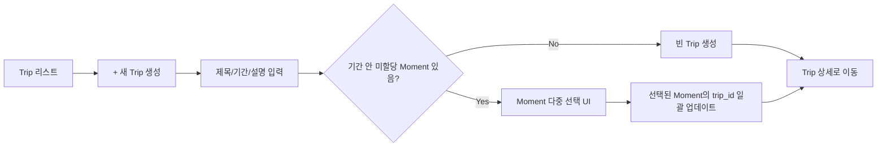
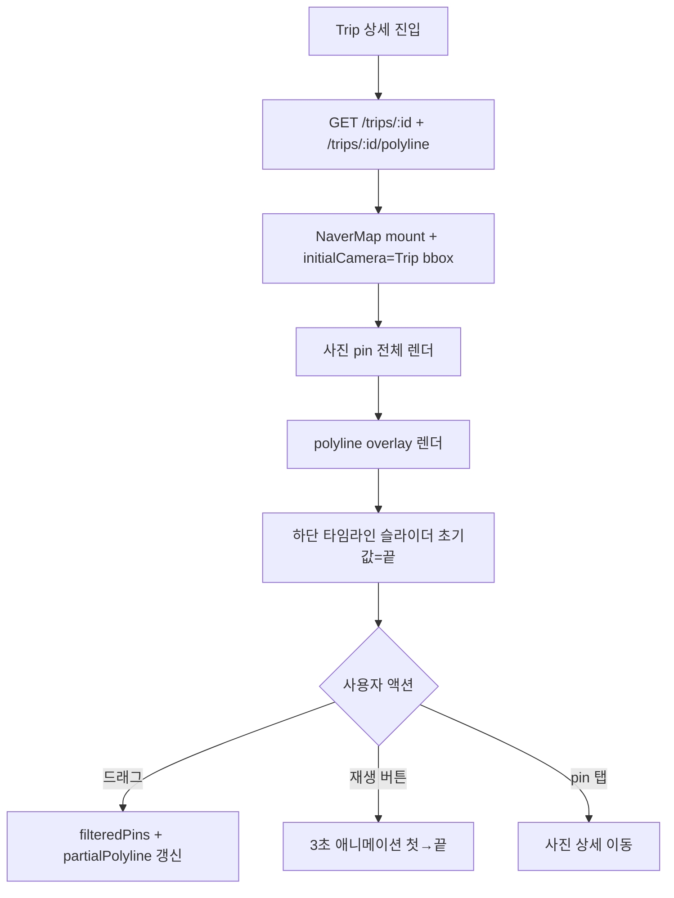

# Phase 3 확장: Trip + polyline + 타임라인 (보류 — 2차 확장 후보)

> **상태**: 🅿️ Deferred (2026-07-04 — 1차 마무리 스코프에서 제외 결정, 2차 확장 후보로 박제)
> **작성일**: 2026-07-04
> **작성**: Claude (프롬프팅: @sikkzz)
> **관련 문서**: [ADR-0017 1차 마무리 시점](../decisions/0017-first-milestone-scope.md), [PROJECT_ROOT 6장 Phase 3 로드맵](../PROJECT_ROOT.md#6-단계별-로드맵), [Phase 3 Spec](./phase-03-sharing.md) 5장 비범위, [Phase 2 4.7 지도 표시](./phase-02-core-features.md)
>
> **보류 사유**: 1차 마무리 결정 시점(2026-07-04) 개발 wave를 더 안 늘리기로 정직 판단. spec은 미래 재활성 시 참고 자산으로 보존. 재활성 트리거: 사용자 피드백에서 여행 단위 관리 필요성 노출 / 시각화 wow factor 요구 / 사이드 2차 wave 착수 결정.

---

## 1. 한 줄 요약

**Moment을 Trip 단위로 묶고, 지도에 경로 polyline + 타임라인 슬라이더로 시각화**. Phase 2 4.7에서 지도 표시만 하고 시각화 심화는 X 상태 — 이걸 완주해서 학습 영역 #3(지도/시각화) **100% 정복**. Phase 3 spec에 "종료 후 별도 wave"로 이미 분리 명시된 항목. **1차 마무리 A안의 마지막 개발 wave**.

## 2. 배경 / 왜 만드는가

### Phase 2 4.7 완주 시점의 자산 vs 이 wave의 확장

- ✅ Phase 2 4.7: NaverMap + 사진 pin + 클러스터링 + PostGIS bbox
- ❌ **경로 시각화 X** — 사진 pin이 흩어져있을 뿐, 여행 흐름 시각화 X
- ❌ **시간축 이동 UI X** — 특정 시점 데이터만 볼 수 없음
- ❌ **Moment 상위 개념 X** — Moment은 있지만 여러 Moment을 묶는 "여행" 단위 없음

### 목표 — 시각화 심화

1. **Trip 도메인** — Moment 상위 개념. "2026-06 도쿄 여행" = 여러 Moment(호텔 체크인 / 카페 방문 / 관광지 / 저녁 식사) 묶음
2. **Polyline** — 지도에 Trip 안 Moment/사진들의 좌표를 시간순으로 잇는 선. "여행 경로" 시각화
3. **타임라인 슬라이더** — 지도 위에 시간축 슬라이더. 드래그하면 그 시점까지의 pin+polyline만 표시. **애니메이션 재생** 옵션

### 학습 영역

- **#3 지도/데이터 시각화 100% 정복** — 표시(Phase 2) → 상호작용/시간축(이 wave)
- **PostGIS LineString** — Point에서 진화 (좌표 시퀀스 저장/조회 최적화)
- **React Native 제스처** — 타임라인 슬라이더 UX (`react-native-gesture-handler`)
- **NaverMap Polyline API** — `@mj-studio/react-native-naver-map` polyline overlay

### 1차 마무리 관점

이 wave 완주로 Trailog는:

- 도메인 완성도 ↑ (Trip → Moment → Photo 3-tier)
- 시각화 wow factor 완성 (지도 경로 + 시간 재생 = 강력한 시연 자산)
- 블로그 3편 소재 확보 (지도 시각화 심화 편 자연)

## 3. 사용자 스토리

- **As a** Trailog 사용자, **I want to** 여러 Moment을 Trip으로 묶기 **so that** 하나의 여행 단위로 관리.
- **As a** Trailog 사용자, **I want to** Trip 상세 지도에서 사진 좌표를 경로 선으로 확인 **so that** 어떻게 다녔는지 한눈에 파악.
- **As a** Trailog 사용자, **I want to** 지도 위 타임라인 슬라이더로 시간 이동 **so that** 여행 순서를 회상하며 재생.
- **As a** Trailog 사용자, **I want to** Trip 없는 Moment은 그대로 유지 **so that** 단발 방문(카페/산책)은 여행 단위 강제 X.

## 4. 수용 기준 (Acceptance Criteria)

### 4.1 Trip 도메인 (백엔드)

- [ ] `trips` 테이블 신규 — `id / userId / title / startedAt / endedAt / description / createdAt / updatedAt`
- [ ] `moments.trip_id` 컬럼 추가 (nullable, FK cascade set null) — Trip 삭제해도 Moment은 살아있음, Trip 소속만 해제
- [ ] `POST /trips` — 본인 Trip 생성
- [ ] `GET /trips` — 본인 Trip 리스트 (최근 생성순)
- [ ] `GET /trips/:id` — Trip 상세 + Moment 리스트 + 사진 좌표 시퀀스 (polyline 원본 데이터)
- [ ] `PATCH /trips/:id` — 제목/기간/설명 수정
- [ ] `DELETE /trips/:id` — Trip만 삭제 (Moment은 trip_id null로 잔존)
- [ ] `POST /trips/:id/moments/:momentId` — Moment을 Trip에 추가 (기존 trip_id 덮어씀)
- [ ] `DELETE /trips/:id/moments/:momentId` — Trip에서 Moment 제거

### 4.2 Polyline 계산 (백엔드)

- [ ] `GET /trips/:id/polyline` — Trip 안 사진들의 GPS 좌표를 `takenAt` 순으로 정렬 + GeoJSON `LineString` 반환
- [ ] GPS 없는 사진은 skip (경로에 안 박음)
- [ ] 사진 없는 Moment은 skip
- [ ] 좌표 2개 미만이면 빈 `LineString` 반환 (렌더링 안 함)
- [ ] PostGIS `ST_MakeLine` 활용 (`GROUP BY trip_id`로 한 번에 계산)

### 4.3 모바일 UI

- [ ] **Trip 리스트 화면** — `(tabs)/trips` 신규 (Moments 옆에 배치) 또는 Moments 화면 상단 필터로 통합
- [ ] **Trip 생성 화면** — 제목 + 시작일/종료일 + 설명 + 기간 안 미할당 Moment 리스트 선택
- [ ] **Trip 상세 지도 화면** — 지도 + 사진 pin + polyline + 타임라인 슬라이더
- [ ] **Moment 상세에서 Trip 배지** — 소속 Trip 표시 + 탭 시 Trip 상세 이동
- [ ] **모먼트 생성 시 Trip 선택 옵션** — 기존 활성 Trip 있으면 default 선택

### 4.4 타임라인 슬라이더

- [ ] 지도 화면 하단 fixed 슬라이더
- [ ] 좌우 끝 = Trip 시작/종료 시각
- [ ] 드래그하면 그 시점까지 촬영된 사진 pin만 표시 + polyline도 그 시점까지만
- [ ] 재생 버튼 — 3초에 걸쳐 처음 → 끝 자동 재생 (시각적 wow)
- [ ] 슬라이더 제스처 반응 60fps 목표

### 4.5 학습 노트

- [ ] `postgis-linestring-and-spatial-queries.md` 또는 기존 `postgis-basics.md`에 LineString 섹션 추가
- [ ] `map-polyline-and-timeline-ux.md` — NaverMap polyline overlay + timeline slider UX 패턴 + 함정

## 5. 비범위 (Out of Scope)

이 wave엔 안 함:

- ❌ **자동 Trip 생성** (지리적/시간적 클러스터링) → 사용자 액션 데이터 축적 후 검토
- ❌ **Trip 공유 링크** → 공유는 Phase 3 5.1에서 Moment/Photo 단위로 완성. Trip 공유는 자연 확장 지점이지만 스코프 밖
- ❌ **Trip 협업** (동행자와 함께 편집) → 동행자 시스템 자체 보류 상태
- ❌ **Trip 비용/일정 관리** → 여행 앱 아니라 사진 아카이브라 도메인 밖
- ❌ **경로 자체 편집** (사진 좌표 수동 이동) → EXIF는 사실 데이터라 편집 X 원칙

## 6. 사용자 플로우

### 6.1 Trip 생성 흐름

### 6.2 Trip 상세 지도 + 타임라인 흐름

## 7. 테스트 시나리오

| #   | 시나리오                               | 예상 결과                                               | 자동화                 |
| --- | -------------------------------------- | ------------------------------------------------------- | ---------------------- |
| 1   | Trip 생성 후 Moment 3개 추가           | 세 Moment의 trip_id 갱신 + Trip 상세에 3개 노출         | 수동                   |
| 2   | Trip 삭제                              | trips row 삭제 + moments.trip_id는 null로 (Moment 잔존) | 수동                   |
| 3   | GPS 있는 사진 5장 → Trip polyline 조회 | 5점 LineString (takenAt 순) 반환                        | 수동 + 자동 (SQL 검증) |
| 4   | GPS 없는 사진 포함 Trip                | GPS 없는 건 skip, 있는 것만 polyline                    | 수동                   |
| 5   | 사진 2개 미만 Trip                     | 빈 polyline 반환, 지도에 선 X                           | 수동                   |
| 6   | 타임라인 슬라이더 드래그               | 60fps 반응 + pin/polyline 실시간 filter                 | 실 디바이스            |
| 7   | 재생 버튼 → 3초 애니메이션             | 첫 시점부터 끝까지 순차 렌더                            | 실 디바이스            |
| 8   | 본인 X의 Trip 접근 시도                | 404 (403 대신 존재 자체 숨김)                           | 자동                   |

## 8. 성공 지표

Phase 3까진 측정 인프라 없음. 이 wave도 정성 지표만:

- Trip 상세 지도 렌더링 60fps 유지 (실 디바이스 iPhone + Galaxy 각 1대)
- 타임라인 슬라이더 반응 지연 100ms 이하
- 시연 자산으로 활용 가능한 시각화 완성도 (스크린 녹화 GIF 자산 확보)

## 9. 미정 사안 (Open Questions)

Wave 진입 전 결정 필요:

| Q      | 사안                     | 후보                                           | 정직 추천                                                   |
| ------ | ------------------------ | ---------------------------------------------- | ----------------------------------------------------------- |
| **Q1** | Moment ↔ Trip 관계       | 1:N vs N:M                                     | **1:N** (KISS. N:M은 카페 예외 케이스라 스코프 밖)          |
| **Q2** | Trip 자동/수동 생성      | 자동 클러스터링 vs 수동 선택                   | **수동** (자동은 학습 가치 있지만 UX 복잡 + 데이터 부족)    |
| **Q3** | Polyline 순서 기준       | `takenAt` vs Moment `startedAt` vs 사용자 지정 | **`takenAt`** (사진이 실제로 찍힌 순서 = 여행 흐름 정직)    |
| **Q4** | 타임라인 UI 위치         | 하단 fixed 슬라이더 vs 좌측 세로 리스트        | **하단 슬라이더** (지도 위 오버레이가 시각적 임팩트)        |
| **Q5** | 재생 애니메이션 속도     | 3초 고정 vs 조정 가능                          | **3초 고정** (KISS. 사용자 옵션은 폴리시 시점)              |
| **Q6** | Trip 리스트 위치         | `(tabs)/trips` 신규 vs Moments 화면 상단 필터  | **`(tabs)/trips` 신규** (도메인 상위 개념이라 탭 위계 정직) |
| **Q7** | 기간 안 Moment 자동 후보 | 생성 시 자동 표시 vs 검색으로만                | **자동 표시** (UX 자연)                                     |
| **Q8** | Polyline 스타일          | NaverMap default vs 커스텀 색상/굵기           | **커스텀 primary 색상 + 3px** (디자인 토큰 일관)            |

## 10. 진행 흐름

| Day    | 내용                                                            | 예상  |
| ------ | --------------------------------------------------------------- | ----- |
| **D0** | Q1~Q8 결정 (본인 추천 확인) + spec 확정                         | 0.5일 |
| **D1** | 백엔드 Trip entity + 마이그레이션 + CRUD API                    | 1일   |
| **D2** | Polyline endpoint (PostGIS `ST_MakeLine`) + Moment ↔ Trip 관리  | 1일   |
| **D3** | 모바일 Trip lib (Schema + API + React Query) + 리스트/생성 화면 | 1.5일 |
| **D4** | Trip 상세 지도 (polyline overlay + pin)                         | 1일   |
| **D5** | 타임라인 슬라이더 UI + 재생 애니메이션                          | 1.5일 |
| **D6** | Moment 상세 Trip 배지 + 생성 시 Trip 선택 옵션 + 폴리시         | 1일   |
| **D7** | 학습 노트 + 실 디바이스 시각 검증 + Phase 3 확장 종료 박제      | 1일   |

**작업 기간 잠정**: 1.5~2주 (D0~D7 = 8~9일, 정직 여유 포함)

**각 Day 진입 전 본인과 논의 X — Q 결정만 정확히 하고 D1부터는 정직 진행**.

## 11. 1차 마무리 다음 단계 (이 wave 완주 후)

Trip wave 종료 시점 = 1차 마무리 3주 스코프의 2/3 완주:

1. **기술 블로그 3편 초안** (5~7일) — 학습 자산 → 공개 콘텐츠
   - 1편: 인프라 (Fly.io + Docker + GitHub Actions + Notion sync)
   - 2편: 이미지 파이프라인 (presigned R2 + BullMQ sharp + EXIF)
   - 3편: 실시간 통신 (SSE + RxJS + react-native-sse) 또는 지도 시각화 (Trip polyline + 타임라인)
2. **README + PROJECT_ROOT "1차 마무리" 정리** (1일) — 완료 상태 명확 명시 + 2차 계획 박제 (스토어/AWS)
3. **[선택] Phase 3 미완 UX 폴리시 잔여** (있으면 2~3일)

## 12. 변경 이력

| 날짜       | 변경 내용                                                                                                                                                                                                                                                                                |
| ---------- | ---------------------------------------------------------------------------------------------------------------------------------------------------------------------------------------------------------------------------------------------------------------------------------------- |
| 2026-07-04 | 최초 작성 — 1차 마무리 A안(Trip wave + 블로그 + 정리 = 3~4주) 채택 후 Trip wave spec 착수. Phase 4(스토어/AWS)는 실비 트레이드오프 + 트래픽 미확보 사유로 1차 마무리 스코프에서 제외. 2차 확장 wave로 박제. 학습 영역 #3 100% 정복 목표. Q1~Q8 미정 사안 + D0~D7 진행 흐름 + 8~9일 호흡. |
