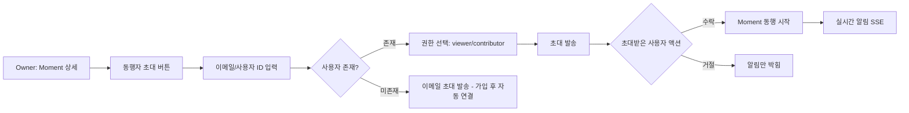
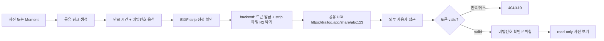
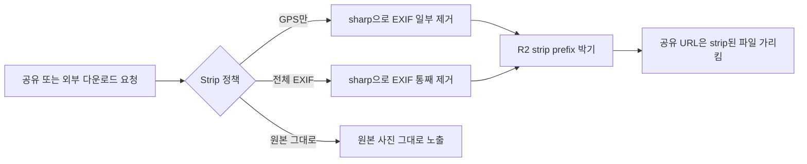

# Phase 3: 사진 공유 + 동행자 + 권한 모델 Spec

> **상태**: Draft (Q 단계 진입 전)
> **작성일**: 2026-06-09
> **작성**: Claude (프롬프팅: @sikkzz)
> **관련 문서**: [PROJECT_ROOT 6장 Phase 3 reshape](../PROJECT_ROOT.md#6-단계별-로드맵), [Phase 2 Spec](./phase-02-core-features.md)

---

## 1. 한 줄 요약

본인 혼자 박제하던 Moment를 **동행자와 공유**하고, **공유 링크**로 외부 사람에게도 보여주고, **EXIF GPS strip**으로 프라이버시를 지킬 수 있는 흐름. 동시에 **#4 실시간 통신 (SSE/WebSocket) 학습 영역** 본격 진입.

## 2. 배경 / 왜 만드는가

### 도메인 확장

Phase 2 종료 시점 — Trailog는 **혼자 박제하는 도구**. 사용자 박제한 Moment는 외부와 공유 불가.

실제 사용자 흐름:

- 여행 같이 간 사람과 사진 같이 보고 싶음
- 가족/친구에게 카페 방문 공유 (전체 Moment 또는 단일 사진)
- 외부 SNS에 공유 시 GPS 정보 누출 우려 — EXIF strip 필요

### 학습 영역 (PROJECT_ROOT 2장 #4)

- **실시간 통신 (WebSocket/SSE)** ← Phase 3 핵심 학습 영역
- 권한 모델 (RBAC, 공유 링크 기반 권한) — 참조 패턴(다층 가드 9개) 비교
- 이미지 보안 (EXIF strip) — 미디어 처리 영역 깊이 ↑

### 메모리 트리거 (Phase 3 진입 시점 활성화)

- `picker-exif-preservation-revisit` — 공유 흐름 시 EXIF picker 한계 + 사용자 손실 보고 검토
- `auth-deep-dive-revisit` — 다층 권한 + 참조 패턴 비교 시점
- `error-handling-revisit` — 공유 링크 / 외부 API 에러 시 layer 정착 시점

## 3. 사용자 스토리

- **As a** Trailog 사용자, **I want to** Moment에 동행자를 초대 **so that** 같이 갔던 사람과 사진 공유.
- **As a** Trailog 사용자, **I want to** 단일 사진/Moment에 공유 링크 생성 **so that** Trailog 미가입 사용자에게도 보여줌.
- **As a** Trailog 사용자, **I want to** 공유 시 GPS 정보를 자동/선택 strip **so that** 위치 누출 걱정 없이 SNS에 박음.
- **As a** Trailog 사용자, **I want to** 내 Moment가 누구에게 공유됐는지 확인/취소 **so that** 권한 관리.
- **As an** 동행자, **I want to** 초대받은 Moment를 푸시/실시간 알림으로 즉시 확인 **so that** 사진 공유 시점 놓치지 않음.

## 4. 수용 기준 (Acceptance Criteria)

### 4.1 동행자 초대 (Member)

- [ ] Moment에 다른 사용자 초대 가능 (이메일 또는 사용자 ID)
- [ ] 초대된 사용자는 본인의 Moment 리스트에 동행 Moment도 표시
- [ ] 동행자는 사진 추가 가능 (권한: contributor) 또는 viewer 권한만
- [ ] 초대 취소 시 동행자의 접근 즉시 차단
- [ ] 초대받은 사용자가 거절 가능 — 거절 시 본인 리스트에 안 보임

### 4.2 공유 링크 (외부 공유)

- [ ] 단일 사진 또는 Moment 단위로 공유 링크 생성
- [ ] 공유 링크는 **만료 시간** 설정 가능 (1시간 / 1일 / 1주 / 영구)
- [ ] 공유 링크는 **비밀번호 보호** 옵션
- [ ] 공유 링크 접근 시 Trailog 회원가입 없이 사진 보기 가능 (read-only)
- [ ] 공유 링크 취소 시 즉시 무효화

### 4.3 EXIF strip (프라이버시)

- [ ] 공유 시 **기본 EXIF strip** (GPS 좌표만 / 모든 EXIF 둘 다 옵션)
- [ ] 사용자가 사진 단위로 strip 여부 선택
- [ ] Moment 단위 default strip 정책 설정 (전체 strip / 선택 strip)
- [ ] strip된 파일은 R2 별도 prefix에 박힘 (원본 보존)
- [ ] 공유 받은 사람이 사진 다운로드 시 strip된 파일 받음

### 4.4 실시간 알림 (SSE 또는 WebSocket)

- [ ] 동행자 초대 시 초대받은 사용자에게 실시간 알림 (앱 열려있으면)
- [ ] Moment에 새 사진 추가 시 동행자에게 실시간 알림
- [ ] 앱 닫혀있을 때는 **푸시 알림** (Expo Notifications) — Q
- [ ] 알림 센터/뱃지 — 미확인 알림 개수 표시

### 4.5 권한 모델

- [ ] Moment 권한: **owner** (생성자) / **contributor** (사진 추가 OK) / **viewer** (보기만)
- [ ] 공유 링크는 viewer 권한만
- [ ] 백엔드 가드 — 모든 Moment/Photo API에 권한 체크
- [ ] 권한 변경 즉시 반영 (캐시 무효화)

## 5. 비범위 (Out of Scope)

이번 Phase엔 안 함:

- ❌ **검색 / 필터 / 태그** → Phase 4+ (다른 wave)
- ❌ **댓글 / 좋아요** → Phase 4+
- ❌ **Trip 단위 묶기 + polyline + 타임라인 슬라이더** → Phase 3 종료 후 별도 wave
- ❌ **공유 받은 사용자가 동행자로 자동 승격** → 명시적 초대만
- ❌ **공유 링크의 사용자 행동 분석** (조회수, 다운로드 수 등) → Phase 4+
- ❌ **OAuth 소셜 로그인** → 메모리 `auth-deep-dive-revisit` 별도 시점
- ❌ **2FA** → 참조 패턴 — Phase 5+
- ❌ **결제/구독** → Phase 5+

## 6. 사용자 플로우

### 6.1 동행자 초대 흐름

### 6.2 공유 링크 흐름

### 6.3 EXIF strip 흐름

## 7. 테스트 시나리오 (QA 관점)

| #   | 시나리오                                         | 예상 결과                             | 자동화             |
| --- | ------------------------------------------------ | ------------------------------------- | ------------------ |
| 1   | Owner가 동행자 초대 → 수락 → 사진 추가           | 동행자도 사진 보임 + 실시간 알림 도착 | E2E                |
| 2   | Owner가 초대 취소 → 동행자가 사진 접근           | 403 + 리스트에서 자동 제거            | E2E                |
| 3   | viewer 권한 사용자가 사진 추가 시도              | 403                                   | E2E                |
| 4   | 공유 링크 만료 후 접근                           | 410 Gone + "만료된 링크" 안내         | E2E                |
| 5   | 공유 링크에 비밀번호 박고 잘못 입력              | 401 + 재시도 가능                     | E2E                |
| 6   | GPS strip 공유 후 다운로드 → exiftool로 GPS 검증 | GPS 없음 확인                         | 수동 + 자동        |
| 7   | 동행자에게 푸시 알림 — 앱 닫힌 상태              | 푸시 도착 + 탭 시 Moment 진입         | 수동 (실 디바이스) |
| 8   | 동시 동행 — 여러 사용자 같이 사진 업로드         | 순서/중복 없이 정상 sync              | E2E                |

## 8. 성공 지표

- 동행자 초대 → 수락률 (이메일 초대 / 회원 초대 분리)
- 공유 링크 평균 조회수 / 만료 전 취소율
- EXIF strip 사용률 (default 채택 정도)
- 실시간 알림 latency (서버 → 클라이언트)

→ Phase 3에선 측정 인프라 없으므로 측정 X. **Phase 4 운영 진입 시점에 박제**.

## 9. 미정 사안 (Open Questions)

### 핵심 Q

- **Q1**: 실시간 통신 — **SSE vs WebSocket** 어느 쪽? → 학습 영역 ADR 박제 필요
- **Q2**: 푸시 알림 — Expo Notifications (FCM/APNS) 도입 시점? Phase 3 vs Phase 4
- **Q3**: 공유 링크 토큰 형식 — JWT vs random UUID vs HMAC?
- **Q4**: EXIF strip lib — sharp의 metadata strip 활용 vs exiftool spawn vs `piexifjs` 등 별도 lib?
- **Q5**: 권한 모델 — 백엔드 RBAC 어떻게? NestJS Guard 패턴 (단일 Guard + decorator vs 다층 Guard)?
- **Q6**: 동행자 초대 이메일 발송 — Phase 3 도입 vs in-app 알림만?
- **Q7**: 공유 링크 short URL 단축 (`trailog.app/s/abc`) — 신규 라우트 vs 별도 도메인?
- **Q8**: 비밀번호 보호 공유 링크 — 비밀번호 해시 저장 + bcrypt 비교? 또는 단순 비교?

### 추후 결정

- 메모리 트리거 `auth-deep-dive-revisit` 활성화 — 참조 다층 가드 9개 패턴 비교 후 본 Phase에 채택할 항목 결정

## 10. 진행 흐름 (잠정)

| Wave       | 내용                                                                                                 | ETA   |
| ---------- | ---------------------------------------------------------------------------------------------------- | ----- |
| **Q 단계** | Q1~Q8 결정 + ADR 작성 (실시간 통신 + 권한 모델 + EXIF strip lib)                                     | 2~3일 |
| **5.1**    | **동행자 초대** — Moment 권한 모델 백엔드 (entity + RBAC + invite API) + 모바일 초대 UI              | 3~4일 |
| **5.2**    | **공유 링크** — Share 토큰 entity + 만료/비밀번호 + 외부 read API + 모바일 공유 UI                   | 3~4일 |
| **5.3**    | **EXIF strip** — sharp 또는 외부 lib + R2 strip prefix + 사용자 옵션 UI                              | 2~3일 |
| **5.4**    | **실시간 알림 (SSE)** — 백엔드 SSE endpoint + 모바일 EventSource 통합 + 동행자 초대/사진 추가 이벤트 | 4~5일 |
| **5.5**    | **푸시 알림 (Expo Notifications)** — Q2 결정 따름 (Phase 3 또는 4로 이동)                            | 3~4일 |
| **5.6**    | **UI/UX 폴리시 + 학습 노트**                                                                         | 2~3일 |

**작업 기간 잠정**: 3~4주 (Phase 2 4주와 같은 규모)

## 11. 변경 이력

| 날짜       | 변경 내용                                                                                                                                                                                                               |
| ---------- | ----------------------------------------------------------------------------------------------------------------------------------------------------------------------------------------------------------------------- |
| 2026-06-09 | 최초 작성 — Phase 2 4.8 종료 후 Phase 3 reshape (PROJECT_ROOT 6장 outdated → 공유 흐름으로 정정). A 옵션 채택 (공유 흐름 + 실시간 통신 학습). Q1~Q8 미정 사안 박제. Trip + 타임라인은 Phase 3 종료 후 별도 wave로 분리. |
