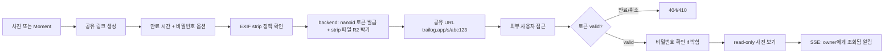
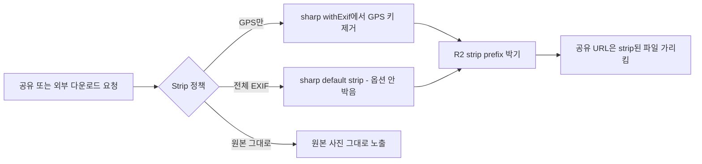
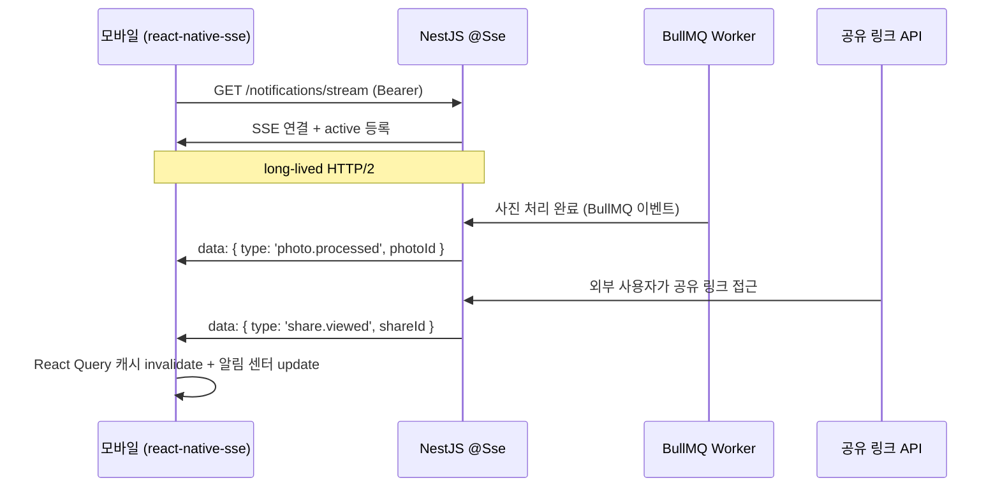

# Phase 3: 사진 공유 + EXIF strip + 실시간 통신 학습 Spec

> **상태**: ✅ Completed (2026-07-03) — 5.1~5.4 wave 전체 완료
> **작성일**: 2026-06-09
> **작성**: Claude (프롬프팅: @sikkzz)
> **관련 문서**: [PROJECT_ROOT 6장 Phase 3 reshape](../PROJECT_ROOT.md#6-단계별-로드맵), [Phase 2 Spec](./phase-02-core-features.md), [ADR-0012 SSE](../decisions/0012-realtime-communication-sse.md), [ADR-0013 RBAC 보류](../decisions/0013-rbac-single-guard-decorator.md), [ADR-0014 공유 토큰](../decisions/0014-share-link-token-uuid.md), [ADR-0015 EXIF strip](../decisions/0015-exif-strip-sharp.md)

---

## 1. 한 줄 요약

본인이 박제한 Moment/사진을 **공유 링크**로 외부 사람에게 보여주고, **EXIF GPS strip**으로 프라이버시를 지키고, **사진 처리 진행률 + 알림 센터**를 polling → SSE 마이그레이션으로 학습 영역 #4(실시간 통신) 진입.

## 2. 배경 / 왜 만드는가

### 도메인 확장 — 공유 링크만

Phase 2 종료 시점 — Trailog는 **혼자 박제하는 도구**. 사용자 박제한 Moment는 외부와 공유 불가.

**2026-06-09 reshape 결정**: 동행자 시스템(MomentMember + RBAC + 초대/수락)은 **Trailog 도메인 정의("본인 박제 본질") fit X**. Day One 패턴(혼자 일기 + 단방향 공유 링크)이 자연. 동행자는 서비스 고도화 단계(Phase 4+ 또는 사용자 피드백 기반)에 다시 검토.

실제 사용자 흐름:

- 친구/가족에게 단일 사진 또는 Moment 보여주기 → 공유 링크 전달
- 외부 SNS에 공유 시 GPS 누출 우려 → EXIF strip
- 본인 알림 (사진 처리 완료 / 공유 링크 조회됨) → 실시간 알림 센터

### 학습 영역 (PROJECT_ROOT 2장 #4)

- **실시간 통신 (SSE)** ← Phase 3 핵심 학습 영역
  - 사진 처리 진행률 polling([Phase 2 4.6 박힘](./phase-02-core-features.md)) → SSE 마이그레이션
  - 알림 센터 (자기 알림 — 사진 처리 완료, 공유 링크 조회 등)
- **이미지 보안 (EXIF strip)** — 미디어 처리 영역 깊이 ↑ + 프라이버시 정복

### 메모리 트리거 (Phase 3 진입 시점 활성화)

- `picker-exif-preservation-revisit` — 5.2 EXIF strip wave 진입 시점에 능동 알림 (picker 한계 + 사용자 손실 보고 검토)
- `error-handling-revisit` — 공유 링크 / 외부 API 에러 layer 정착 시점 권유 (5.1 wave 자연)

## 3. 사용자 스토리

- **As a** Trailog 사용자, **I want to** 단일 사진/Moment에 공유 링크 생성 **so that** Trailog 미가입 사용자에게도 보여줌.
- **As a** Trailog 사용자, **I want to** 공유 시 GPS 정보를 자동/선택 strip **so that** 위치 누출 걱정 없이 SNS에 박음.
- **As a** Trailog 사용자, **I want to** 공유 링크에 만료 시간 + 비밀번호 설정 **so that** 시간 지난 뒤 자동 무효 + 민감한 사진 보호.
- **As a** Trailog 사용자, **I want to** 사진 처리 진행률을 실시간 확인 **so that** 업로드 후 답답함 없이 즉시 결과 노출.
- **As a** Trailog 사용자, **I want to** 공유 링크가 조회될 때 알림 받음 **so that** 누가 봤는지 인지.

## 4. 수용 기준 (Acceptance Criteria)

### 4.1 공유 링크 (외부 공유)

- [ ] 단일 사진 또는 Moment 단위로 공유 링크 생성
- [ ] 공유 링크는 **만료 시간** 설정 가능 (1시간 / 1일 / 1주 / 영구)
- [ ] 공유 링크는 **비밀번호 보호** 옵션 (bcrypt 해시)
- [ ] 공유 링크 접근 시 Trailog 회원가입 없이 사진 보기 가능 (read-only)
- [ ] 공유 링크 취소 시 즉시 무효화 (DB row 삭제)
- [ ] 사용자가 본인의 활성 공유 링크 목록 확인 가능

### 4.2 EXIF strip (프라이버시)

- [ ] 공유 시 **기본 EXIF strip** (GPS 좌표만 / 모든 EXIF 둘 다 옵션)
- [ ] 사용자가 사진 단위로 strip 여부 선택
- [ ] Moment 단위 default strip 정책 설정 (전체 strip / 선택 strip / 원본 그대로)
- [ ] strip된 파일은 R2 별도 prefix에 박힘 (원본 보존)
- [ ] 공유 받은 사람이 사진 다운로드 시 strip된 파일 받음

### 4.3 실시간 통신 (SSE)

- [ ] 사진 처리 진행률 polling([Phase 2 4.6 박힘](./phase-02-core-features.md)) → **SSE 마이그레이션**
- [ ] 사용자별 SSE 연결 — 본인의 모든 알림 수신 (사진 처리 완료, 공유 링크 조회됨 등)
- [ ] 알림 센터 UI + 미확인 알림 뱃지
- [ ] 백엔드 NestJS `@Sse()` + RxJS Subject 패턴
- [ ] 모바일 `react-native-sse` mount + React Query 캐시 invalidation 트리거

### 4.4 권한 모델 — 단순

- [ ] Moment/Photo CRUD: **본인(`moment.userId === req.user.id`)만 접근** — 단순 검사
- [ ] 공유 링크 read: 인증 X (토큰만)
- [ ] 백엔드 가드 — 모든 Moment/Photo API에 owner 검사 (단일 `OwnerOnlyGuard` 또는 service 단 직접 검사)
- [ ] 참조 다층 RBAC + decorator 패턴은 [ADR-0013](../decisions/0013-rbac-single-guard-decorator.md) 보류 — 동행자 시스템 재검토 시점 활성

## 5. 비범위 (Out of Scope)

이번 Phase엔 안 함:

- ❌ **동행자 시스템** (MomentMember + 초대 + 수락/거절 + 협업) → **서비스 고도화 단계 재검토** (Phase 4+ 사용자 피드백 기반)
- ❌ **다층 RBAC + decorator 패턴** → 동행자 시스템과 함께 재검토
- ❌ **푸시 알림** (앱 닫힌 상태) → Phase 4 운영 안정화 wave
- ❌ **검색 / 필터 / 태그** → Phase 4+
- ❌ **댓글 / 좋아요** → Phase 4+
- ❌ **Trip 단위 묶기 + polyline + 타임라인** → Phase 3 종료 후 별도 wave (시각화 깊이)
- ❌ **공유 링크 통계** (조회수 누적, 다운로드 수 등) → Phase 4+ (운영 시점)
- ❌ **OAuth 소셜 로그인** → 메모리 `auth-deep-dive-revisit` 별도 시점
- ❌ **2FA** → Phase 5+
- ❌ **결제/구독** → Phase 5+

## 6. 사용자 플로우

### 6.1 공유 링크 흐름

### 6.2 EXIF strip 흐름

### 6.3 SSE 알림 흐름

## 7. 테스트 시나리오 (QA 관점)

| #   | 시나리오                                         | 예상 결과                             | 자동화      |
| --- | ------------------------------------------------ | ------------------------------------- | ----------- |
| 1   | 공유 링크 만들고 외부 브라우저 접근              | read-only 사진 보임 + 만료/비밀번호 X | E2E         |
| 2   | 공유 링크 만료 후 접근                           | 410 Gone + "만료된 링크" 안내         | E2E         |
| 3   | 공유 링크에 비밀번호 박고 잘못 입력              | 401 + 재시도 가능                     | E2E         |
| 4   | 공유 링크 취소 후 외부 접근                      | 404 Not Found                         | E2E         |
| 5   | GPS strip 공유 후 다운로드 → exiftool로 GPS 검증 | GPS 없음 확인                         | 수동 + 자동 |
| 6   | 사진 업로드 → SSE로 처리 진행률 실시간 도착      | pending → done 상태 즉시 노출         | E2E         |
| 7   | 공유 링크 외부 조회 → owner에게 SSE 알림         | 알림 센터에 즉시 표시                 | E2E         |
| 8   | 본인 X의 Moment에 접근 시도                      | 403                                   | E2E         |

## 8. 성공 지표

- 공유 링크 평균 조회수 / 만료 전 취소율
- EXIF strip 사용률 (default 채택 정도)
- SSE 알림 latency (서버 → 클라이언트)

→ Phase 3에선 측정 인프라 없으므로 측정 X. **Phase 4 운영 진입 시점에 박제**.

## 9. 결정 사항 (2026-06-09 Q 단계 완료 + reshape)

| Q                    | 결정                                                                                           | 박제                                                              |
| -------------------- | ---------------------------------------------------------------------------------------------- | ----------------------------------------------------------------- |
| **Q1 실시간 통신**   | **SSE** (NestJS `@Sse` + `react-native-sse`) — 동행자 알림 X / 사진 처리 + 알림 센터 학습 흐름 | [ADR-0012](../decisions/0012-realtime-communication-sse.md)       |
| **Q2 푸시 알림**     | **Phase 4** (4-1 운영 안정화 wave)                                                             | PROJECT_ROOT 6장 Phase 4                                          |
| **Q3 공유 토큰**     | **nanoid 21자 + DB `Share` entity**                                                            | [ADR-0014](../decisions/0014-share-link-token-uuid.md)            |
| **Q4 EXIF strip**    | **sharp `withMetadata()` strip** — default가 strip                                             | [ADR-0015](../decisions/0015-exif-strip-sharp.md)                 |
| **Q5 권한 모델**     | **단순 `moment.userId === req.user.id` 검사** — 다층 RBAC + decorator 패턴 보류                | [ADR-0013 보류](../decisions/0013-rbac-single-guard-decorator.md) |
| **Q6 초대 이메일**   | **N/A** — 동행자 시스템 보류로 의미 X                                                          | —                                                                 |
| **Q7 short URL**     | **신규 라우트** (`trailog.app/s/{nanoid}`)                                                     | spec 본문 (5.1 wave)                                              |
| **Q8 비밀번호 해시** | **bcrypt** (회원가입 + 일관)                                                                   | ADR-0014 본문                                                     |

### 추후 인지 — 서비스 고도화 단계 재검토

- **동행자 시스템** — Trailog 도메인 "본인 박제 본질" fit X로 Phase 3 진입 시 제외. **사용자 피드백 + 운영 진입(Phase 4+) + 협업 가치 검증 시점**에 재검토. ADR-0013 RBAC + MomentMember entity + 초대/수락 흐름 그대로 활용 가능.

## 10. 진행 흐름

| Wave       | 내용                                                                                                                                                                                                                                 | ETA   | 상태               |
| ---------- | ------------------------------------------------------------------------------------------------------------------------------------------------------------------------------------------------------------------------------------ | ----- | ------------------ |
| **Q 단계** | Q1~Q8 결정 + ADR 4건 (SSE / RBAC 보류 / 공유 토큰 / EXIF strip)                                                                                                                                                                      | 1일   | ✅ 2026-06-09 완료 |
| **5.1**    | **공유 링크** — Share entity (nanoid + 만료 + bcrypt) + `POST/GET/DELETE /shares` + 모바일 공유 UI + **공유 페이지 Next 16 사이드** ([ADR-0016](../decisions/0016-share-page-next16-sidecar.md) `apps/web` 신규 — 풍부 모바일 웹 UX) | 6~7일 | ✅ 2026-06-13 완료 |
| **5.2**    | **EXIF strip** — sharp/piexifjs 정책별 strip + Lazy 캐싱 + 백엔드 proxy 다운로드 (R2 CORS 우회) + 모바일 링크 복사 버튼                                                                                                              | 2~3일 | ✅ 2026-06-14 완료 |
| **5.3**    | **실시간 통신 (SSE)** — NestJS `@Sse()` + RxJS Subject + `react-native-sse` + Phase 2 4.6 사진 처리 polling 제거 + 공유 조회됨 알림 (5분 throttle) + 알림 센터 화면 + 뱃지 + 학습 노트 `sse-vs-websocket-and-realtime.md`            | 4~5일 | ✅ 2026-07-03 완료 |
| **5.4**    | **UI/UX 폴리시 + 학습 노트 + Phase 3 종료** — 학습 노트 4건 신규(nanoid/Next 16/piexifjs/Content-Disposition) + PROJECT_ROOT 이력 정리 + Phase 4 준비                                                                                | 2~3일 | ✅ 2026-07-03 완료 |

**작업 기간 잠정**: 2.5~3주 (5.1에 Next 16 사이드 공유 페이지 확장 — [ADR-0016](../decisions/0016-share-page-next16-sidecar.md) 채택으로 D6 1일 → D6abc 4일 추가)

## 12. 변경 이력 (추가)

| 날짜       | 변경 내용                                                                                                                                                                                                                                                                                                                                                                                                                                                                                                                                                                                                                                                                                                                                                                                                                                                                                                                                                                 |
| ---------- | ------------------------------------------------------------------------------------------------------------------------------------------------------------------------------------------------------------------------------------------------------------------------------------------------------------------------------------------------------------------------------------------------------------------------------------------------------------------------------------------------------------------------------------------------------------------------------------------------------------------------------------------------------------------------------------------------------------------------------------------------------------------------------------------------------------------------------------------------------------------------------------------------------------------------------------------------------------------------- |
| 2026-06-13 | **D6 외부 페이지 — Next 16 사이드로 확장**. 원안 NestJS 인라인 HTML SSR(빈약 UX) → 본인 의도 "모바일 웹으로 풍부 정보 + 아카이빙" 채택. [ADR-0016](../decisions/0016-share-page-next16-sidecar.md) `apps/web` 신규 (Next 16 App Router + shadcn/ui + Tailwind + react-query + Vercel 배포). 참조 stack(Next 14) 한 단계 앞 정복 학습 + 디자인 토큰(Earthy Brown + Pretendard) 모바일 mirror. 5.1 작업 기간 3~4일 → 6~7일.                                                                                                                                                                                                                                                                                                                                                                                                                                                                                                                                                 |
| 2026-07-03 | **🎉 Wave 5.3 SSE 완료** — D1 백엔드 골격(`notifications/` 모듈 + `@Sse('stream')` + RxJS `Subject` + `JwtAuthGuard`) + D2 publish 발행(PhotosProcessor `photo.processed done/failed` + SharesService `share.viewed` 5분 in-memory throttle) + D2 모바일(`react-native-sse` + Zod discriminatedUnion payload schema + `useNotificationsStream` mount + `useMomentPhotos` polling 제거) + D3 알림 센터 화면(`(tabs)/notifications` + tabBarBadge + FlatList + read/unread 시각 위계 + 상대 시간). 참조 코드(blaybus sse.controller) 비교 후 **RxJS `finalize()` 채택** + Heartbeat/Redis/APM은 Phase 4 이월(메모리 `sse-phase4-enhancements-revisit`). 학습 노트 [sse-vs-websocket-and-realtime.md](../learnings/sse-vs-websocket-and-realtime.md) — SSE/WebSocket/Polling 3종 비교 + NestJS `@Sse` + RxJS Subject 패턴 + 참조 비교 + 함정 10종 + Phase 후속 정복 항목.                                                                                                    |
| 2026-07-03 | **🎉 Wave 5.4 Phase 3 종료** — 학습 노트 4건 신규: [nanoid-and-share-tokens.md](../learnings/nanoid-and-share-tokens.md)(nanoid vs UUID/base62 + 충돌 확률 + URL 설계 + 함정 10종) + [nextjs-16-app-router-sidecar.md](../learnings/nextjs-16-app-router-sidecar.md)(Next 14→16 변화 + Server/Client Component + Turbopack + next-lint 제거 + shadcn/ui + Vercel 배포 + 함정 10종) + [piexifjs-and-jpeg-exif-manipulation.md](../learnings/piexifjs-and-jpeg-exif-manipulation.md)(JPEG APP1 IFD 구조 + GPS SubIFD 부분 삭제 + sharp/exifreader 역할 분리 + Lazy 캐싱 조합) + [content-disposition-and-backend-proxy-download.md](../learnings/content-disposition-and-backend-proxy-download.md)(RFC 5987 UTF-8 한글 파일명 + attachment 강제 + `<a download>` cross-origin 제약 + R2 CORS 우회 백엔드 proxy 패턴). Phase 3 spec 상태 In Progress → ✅ Completed. Phase 3 전체 5.1~5.4 4개 wave 완료(공유 링크 + EXIF strip + SSE + 학습 노트). 다음: Phase 4 진입 준비. |

**각 wave 진입 전 본인과 논의 — spec/동작 정밀 확정 후 구현**.

## 11. 변경 이력

| 날짜       | 변경 내용                                                                                                                                                                                                                                                                                                                                                                                                                                                                                                                                                              |
| ---------- | ---------------------------------------------------------------------------------------------------------------------------------------------------------------------------------------------------------------------------------------------------------------------------------------------------------------------------------------------------------------------------------------------------------------------------------------------------------------------------------------------------------------------------------------------------------------------- |
| 2026-06-09 | 최초 작성 — Phase 2 4.8 종료 후 Phase 3 reshape (PROJECT_ROOT 6장 outdated → 공유 흐름으로 정정). A 옵션 채택 (공유 흐름 + 실시간 통신 학습). Q1~Q8 미정 사안 박제. Trip + 타임라인은 Phase 3 종료 후 별도 wave로 분리.                                                                                                                                                                                                                                                                                                                                                |
| 2026-06-09 | **Q 단계 완료 — ADR 4건 + 결정 박제**. Q1~Q8 8개 결정: SSE + 푸시 Phase 4 + nanoid 공유 토큰 + sharp EXIF strip + 단일 MomentRoleGuard + in-app 초대만 + 신규 라우트 short URL + bcrypt 비밀번호. wave 5.5 푸시 알림 제거 (Phase 4로 이동).                                                                                                                                                                                                                                                                                                                            |
| 2026-06-09 | **🔄 reshape — 동행자 시스템 제거 + 공유 링크 중심**. 본인 의문 — Trailog 도메인 "본인 박제 본질"에 동행자 시스템 fit X. Day One 패턴(혼자 일기 + 단방향 공유) 자연. 동행자는 서비스 고도화 단계(Phase 4+ 또는 사용자 피드백 기반) 재검토. **변경**: wave 5.1 동행자 → 공유 링크로 교체, ADR-0013 RBAC + MomentMember entity **보류**(supersede X), 권한 모델 단순화(`moment.userId === req.user.id`만), 학습 영역 #4 SSE 흐름 변경(동행자 알림 X → 사진 처리 polling 마이그레이션 + 알림 센터). wave 4개 + 작업 기간 1.5~2주로 단축. 다음: wave 5.1 진입 (공유 링크). |
