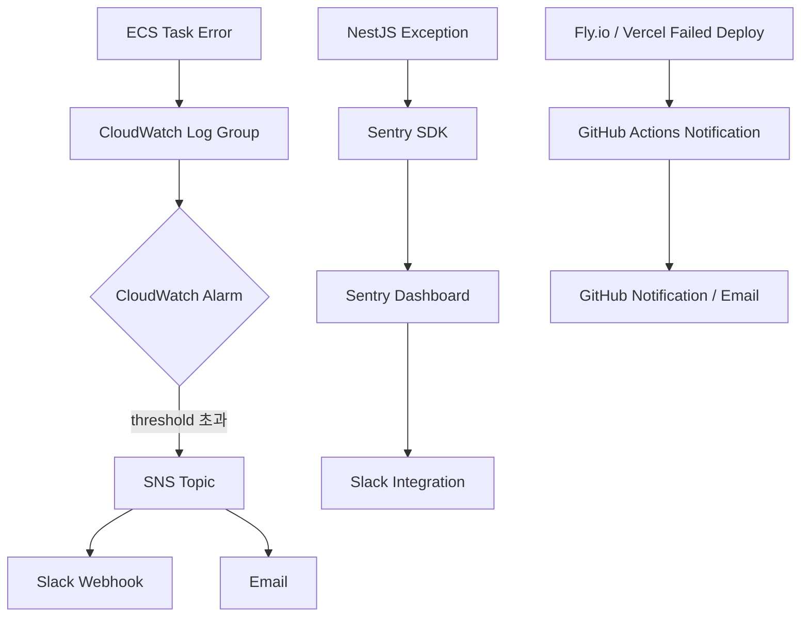
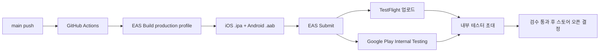
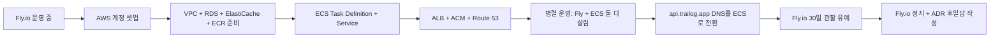

# Phase 4: 운영 강화 + AWS ECS 마이그레이션 Spec

> **상태**: Draft (2026-07-03 작성 — Phase 3 종료 직후 진입 준비)
> **작성일**: 2026-07-03
> **작성**: Claude (프롬프팅: @sikkzz)
> **관련 문서**: [PROJECT_ROOT 6장 Phase 4 로드맵](../PROJECT_ROOT.md#6-단계별-로드맵), [ADR-0002 하이브리드 인프라](../decisions/0002-hybrid-infra-paas-then-aws-ecs.md), [ADR-0004 Fly.io PaaS](../decisions/0004-paas-tool-flyio.md), [Phase 3 Spec](./phase-03-sharing.md)

---

## 1. 한 줄 요약

Phase 1~3에서 만든 **로컬 개발 → PaaS 배포** 흐름을, 실무 표준인 **운영 안정화(모니터링/로그/알람/스토어 배포) + AWS ECS Fargate 마이그레이션**으로 진화. Trailog가 "동작하는 사이드"에서 "**운영 가능한 서비스**"로 넘어가는 wave. 학습 영역 #1(인프라/DevOps) 2차 정복 + #5(성능 최적화/캐싱) 부분 진입.

## 2. 배경 / 왜 만드는가

### Phase 3 종료 시점의 자산 정리

- ✅ 로컬 개발 흐름: `pnpm dev` + docker compose (Postgres/Redis) — 완전 안정
- ✅ PaaS 배포: Fly.io 백엔드 + Vercel 웹 + GitHub Actions 자동 배포
- ✅ 모바일 dev build: iOS Personal Team + Android EAS dev build
- ✅ 문서 자동화: Notion sync + 학습 노트 34건 + ADR 16건
- ❌ **운영 관측 X**: 에러 발생해도 로그 뒤져야 알아냄, Uptime 모니터링 X, 비용 알람 X
- ❌ **스토어 배포 X**: EAS Build/Submit 흐름 미실행, TestFlight/Play 내부 트랙 미경험
- ❌ **AWS 실무 스택 X**: Terraform/ECR/CloudWatch/RDS/ALB 등 미경험

### Phase 4 목표 — 3축

1. **관측 가능성 (Observability)** — 문제가 생기면 즉시 안다
2. **스토어 배포 흐름** — 실 사용자 손에 앱 도달 가능한 상태
3. **AWS 실무 스택 정복** — Fly.io → ECS Fargate 마이그레이션으로 실무 표준 학습

### 학습 영역 (PROJECT_ROOT 2장)

- **#1 인프라/DevOps** — 2차 정복 (운영 관점 + AWS 실무 스택)
- **#5 성능 최적화/캐싱** — 부분 진입 (Sentry 성능 tracing / CloudWatch metrics / Redis 캐싱 도입 검토)
- **#6 모바일 네이티브 + 앱 배포** — 스토어 배포 흐름 완주

### 메모리 트리거 (Phase 4 진입 시점 활성화)

- `sse-phase4-enhancements-revisit` — 5.3에서 이월된 Heartbeat / Redis Pub-Sub / APM 메트릭 / 알림 영속화
- `auth-deep-dive-revisit` — Stateful logout(Redis blacklist) / Token rotation / 다층 캐싱 검토 시점
- `error-handling-revisit` — RestResponse + builder + code/method enum + 전역 Filter 도입 시점
- `mobile-map-library-revisit` — NCP Client ID env variable 분리 (git 박힘 해제)
- `bullmq-domain-vs-root-revisit` — BullMQ 사용 도메인 2+ 시점에 공통 InfraModule 검토
- `notion-sync-rearchitect-revisit` — @tryfabric/martian 정착 후 frontmatter notion_page_id 도입

## 3. 사용자 스토리

### 개발자/운영자 관점 (사이드 소유자 = 본인)

- **As a** 사이드 운영자, **I want to** 에러 발생 시 즉시 슬랙/이메일 알림 **so that** 사용자보다 먼저 대응.
- **As a** 사이드 운영자, **I want to** 사용 현황(DAU, 사진 업로드 수, 공유 링크 조회수)을 대시보드로 확인 **so that** 서비스 상태 파악.
- **As a** 사이드 운영자, **I want to** AWS 인프라를 코드(Terraform)로 관리 **so that** 재현 가능 + 변경 이력 추적.
- **As a** 사이드 운영자, **I want to** 비용을 임계치 넘으면 알람 **so that** 요금 폭탄 방지.

### 사용자 관점 (베타 5명 이상)

- **As a** 실 사용자, **I want to** 앱을 스토어에서 다운로드 **so that** dev build 설치 부담 없이 활용.
- **As a** 실 사용자, **I want to** 앱 닫힌 상태에서도 공유 조회 알림 받음 **so that** 놓치지 않음.
- **As a** 실 사용자, **I want to** 커스텀 도메인(`trailog.app`)으로 공유 URL 받음 **so that** Fly.io URL 대신 자연스러움.

## 4. 수용 기준 (Acceptance Criteria)

### 4.1 운영 안정화 — 관측 가능성

- [ ] **Sentry 연동** — 백엔드 NestJS + 모바일 RN + 웹 Next 3앱 모두 에러 캡처
- [ ] **구조화 로깅** — winston + JSON format, request-id 추적, 로그 레벨 분리 (info/warn/error)
- [ ] **Uptime 모니터링** — Better Stack 또는 UptimeRobot 등 무료 티어 활용, `/health` endpoint 1분 간격 체크
- [ ] **비용 알람** — 월 $50 초과 시 슬랙/이메일 알림 (AWS CloudWatch Billing Alarm)
- [ ] **APM 메트릭 노출** — SSE 연결 수, BullMQ 큐 대기 수, API 응답 시간 P50/P95 (Sentry 성능 tracing 또는 자체 대시보드)

### 4.2 운영 안정화 — CI/CD 고도화

- [ ] **Preview 환경** — PR 열면 자동으로 Vercel Preview + Fly Preview App 배포
- [ ] **마이그레이션 자동화** — main push 시 `release_command`로 TypeORM migration 자동 실행 (Fly.io 이미 부분 박힘)
- [ ] **Rollback 전략** — 배포 실패 시 자동 이전 버전 복구 (Fly.io built-in)
- [ ] **Docker 이미지 최적화** — multi-stage build로 이미지 크기 300MB → 100MB 이하 목표

### 4.3 운영 안정화 — 스토어 배포

- [ ] **Apple Developer Program 가입** ($99/년) — Personal Team 7일 인증 제약 해소
- [ ] **Google Play Console 개발자 등록** ($25 일회성)
- [ ] **EAS Build production profile** — 스토어 배포용 signed build 생성
- [ ] **EAS Submit** — TestFlight(iOS 내부 테스트) + Google Play 내부 테스트 트랙 업로드 1회 완주
- [ ] **앱 아이콘 + 스플래시 + 스토어 스크린샷 + 마케팅 텍스트** 최소 준비
- [ ] **개인정보 처리방침 + 이용약관** URL 준비 (스토어 필수)

### 4.4 운영 안정화 — 알림 확장

- [ ] **Expo Push Notifications** — 앱 닫힌 상태 알림 (사진 처리 완료 / 공유 조회됨) — Phase 3 5.3 이월
- [ ] **알림 영속화** — DB `notification` 테이블 + 미수신 백필 (Phase 3 5.3 이월, 메모리 sse-phase4-enhancements-revisit)
- [ ] **알림 설정 UI** — 사용자가 알림 종류별 on/off 선택

### 4.5 AWS ECS Fargate 마이그레이션

- [ ] **AWS 계정 셋업** — Root 계정 잠금 + IAM 사용자 생성 + MFA + CloudWatch Billing Alarm 최우선
- [ ] **VPC 셋업** — 간소화 (단일 AZ + Public subnet) — 비용/복잡도 ↓, 프로덕션 스펙(Multi-AZ + Private subnet + NAT)은 사용자 확장 시점
- [ ] **RDS PostgreSQL + PostGIS** — Supabase/Neon → RDS 이전 (db.t4g.micro Single-AZ)
- [ ] **ElastiCache Redis** — Upstash → ElastiCache 이전 (cache.t4g.micro)
- [ ] **ECR repo** — 백엔드 Docker 이미지 push (GitHub Actions 자동화)
- [ ] **ECS Cluster + Task Definition + Service** — Fargate 0.25 vCPU / 0.5GB 시작
- [ ] **ALB + Route 53 + ACM 인증서** — HTTPS + 커스텀 도메인 (`api.trailog.app`)
- [ ] **CloudWatch Log Group** — ECS 태스크 로그 자동 수집
- [ ] **Sentry 알림 통합** — CloudWatch 알람 → Sentry → 슬랙
- [ ] **(선택) Terraform IaC** — 위 리소스 전부 코드화
- [ ] **트래픽 컷오버** — Fly.io → ECS + Route 53 DNS 변경
- [ ] **Fly.io 앱 정지** — 마이그레이션 후 30일 유예 관찰 → 정지

### 4.6 R2 유지 (S3 이전 X)

- [ ] R2 그대로 유지 — egress 무료 + AWS 비용 절감 (S3 egress 비쌈)
- [ ] R2 endpoint를 ECS 백엔드에서도 그대로 활용
- [ ] R2 access key AWS Secrets Manager로 이전 (Fly secrets → AWS Secrets Manager)

### 4.7 커스텀 도메인 + HTTPS

- [ ] `trailog.app` 도메인 구매 (Cloudflare Registrar 또는 Route 53)
- [ ] Web: `trailog.app` → Vercel
- [ ] API: `api.trailog.app` → ALB (ECS)
- [ ] DNS: Cloudflare 또는 Route 53 (AWS 통합 시 Route 53 자연)
- [ ] SSL: ACM 자동 갱신 (ALB) + Vercel 자동

## 5. 비범위 (Out of Scope)

이번 Phase엔 안 함:

- ❌ **Multi-AZ RDS** → 사용자 100명+ 도달 시 재검토 (비용 2배)
- ❌ **Auto Scaling** → 트래픽 데이터 없이 설정 무의미, Phase 5+
- ❌ **Kubernetes** → ECS Fargate로 충분, 학습 다양화 별도 프로젝트
- ❌ **GraphQL 도입** → REST + 필요시 tRPC로 충분, Phase 5+ 고민
- ❌ **결제 시스템** → 유료화 결정 후 (Phase 5+)
- ❌ **CDN Custom (Cloudflare Workers)** → Vercel + R2 CDN으로 시작 충분
- ❌ **AI 통합** → Phase 6+
- ❌ **동행자 시스템 재활성** → 사용자 피드백 후 (메모리 `companion-sharing-revisit`)
- ❌ **Trip + polyline + 타임라인** → Phase 3 종료 후 별도 wave (spec 별도)

## 6. 사용자 플로우

### 6.1 운영 알람 흐름

### 6.2 스토어 배포 흐름

### 6.3 AWS 마이그레이션 흐름

## 7. 테스트 시나리오 (QA 관점)

| #   | 시나리오                                      | 예상 결과                                   | 자동화                     |
| --- | --------------------------------------------- | ------------------------------------------- | -------------------------- |
| 1   | 백엔드 의도적 500 에러 → Sentry 대시보드 확인 | Sentry에 stack trace + request context 캡처 | 수동                       |
| 2   | ECS 태스크 crash → CloudWatch → Slack         | 5분 이내 슬랙 알림 도착                     | 수동                       |
| 3   | 비용 $50 임계치 초과 시뮬                     | 이메일 알림 도착                            | 수동                       |
| 4   | TestFlight에 iOS 앱 업로드                    | 내부 테스터가 초대 링크로 설치 완주         | 수동                       |
| 5   | Google Play 내부 테스트 트랙 업로드           | Play Store 앱에서 opt-in 후 설치            | 수동                       |
| 6   | 앱 닫힌 상태에서 사진 처리 완료               | 푸시 알림 도착                              | 수동                       |
| 7   | Fly.io → ECS 트래픽 컷오버 후 API 호출        | 정상 응답 + Fly.io는 비활성                 | 수동 + 자동 (health check) |
| 8   | RDS 마이그레이션 데이터 정합성                | Supabase/Neon dump vs RDS restore 결과 동일 | 수동                       |

## 8. 성공 지표

Phase 3까진 측정 인프라 없어 skip 박음. **Phase 4부터 정직 측정**:

- **가용성**: Uptime 99% 이상 (월 다운타임 7시간 이하)
- **에러율**: API 요청 대비 5xx 비율 0.1% 이하
- **응답 시간**: P50 < 200ms, P95 < 800ms (백엔드 API)
- **비용**: 월 $80 이하 (트래픽 미미 상태 기준)
- **스토어 배포**: TestFlight + Play 내부 테스트 트랙 각 1회 배포 완주
- **베타 사용자**: 지인 5명 이상 실 사용 + 피드백 3건 이상 수집

## 9. 미정 사안 (Open Questions)

Wave 진입 전 결정 필요. 각 Q별 ADR 후보.

| Q       | 사안                         | 후보                                                                       | 결정 시점   |
| ------- | ---------------------------- | -------------------------------------------------------------------------- | ----------- |
| **Q1**  | 로깅 라이브러리              | winston vs pino vs Nest 내장 Logger                                        | 4-1 진입 시 |
| **Q2**  | Uptime 모니터링              | Better Stack (무료) vs UptimeRobot vs Sentry Monitors                      | 4-1 진입 시 |
| **Q3**  | Sentry vs Datadog vs 자체    | Sentry (무료 티어 시작)                                                    | 잠정 확정   |
| **Q4**  | DB 이전 시점                 | RDS 마이그레이션을 ECS와 동시 vs 별도 wave                                 | 4-2 진입 시 |
| **Q5**  | Terraform 도입 여부          | IaC로 전부 vs Console 시작 후 나중 Terraform 역추적                        | 4-2 진입 시 |
| **Q6**  | 도메인 등록 서비스           | Cloudflare Registrar vs Route 53 vs Namecheap                              | 4-1 진입 시 |
| **Q7**  | 앱 아이콘/스토어 자산 디자인 | Figma 무료 + 본인 손 vs 외주 vs 생성 AI                                    | 4-1 진입 시 |
| **Q8**  | 푸시 알림 provider           | Expo Notifications (통합) vs FCM/APNS 직접                                 | 4-1 진입 시 |
| **Q9**  | 알림 영속화 DB 스키마        | 단순(`notifications` 단일 테이블) vs 확장(별도 preferences + delivery log) | 4-1 진입 시 |
| **Q10** | 이용약관/개인정보 처리방침   | 오픈소스 template 활용 vs 변호사 검수                                      | 4-1 진입 시 |

## 10. 진행 흐름

| Wave       | 내용                                                                     | ETA   | 상태    |
| ---------- | ------------------------------------------------------------------------ | ----- | ------- |
| **Q 단계** | Q1~Q10 결정 + ADR 후보 확정 (특히 Q3/Q5)                                 | 2~3일 | ⏳ 대기 |
| **6.1**    | 관측 가능성 — Sentry + 구조화 로깅 + Uptime + 비용 알람                  | 3~4일 | ⏳ 대기 |
| **6.2**    | CI/CD 고도화 — Preview 환경 + 마이그레이션 자동화 + Docker 최적화        | 2~3일 | ⏳ 대기 |
| **6.3**    | 알림 확장 — Expo Push + 알림 영속화 + 설정 UI                            | 3~4일 | ⏳ 대기 |
| **6.4**    | 스토어 배포 — Apple/Google 등록 + EAS Submit + TestFlight/Play 내부 트랙 | 3~4일 | ⏳ 대기 |
| **6.5**    | AWS 계정 셋업 + VPC + RDS + ElastiCache + ECR 준비                       | 3~4일 | ⏳ 대기 |
| **6.6**    | ECS Task Definition + Service + ALB + Route 53 + ACM                     | 3~4일 | ⏳ 대기 |
| **6.7**    | (선택) Terraform IaC 코드화                                              | 2~3일 | ⏳ 대기 |
| **6.8**    | 트래픽 컷오버 + Fly.io 관찰/정지 + ADR-0004 후일담                       | 2~3일 | ⏳ 대기 |

**작업 기간 잠정**: 4~6주 (spec 명시). 스토어 심사 대기 시간(iOS 24~48시간 / Android 몇 시간)은 별도.

**각 wave 진입 전 본인과 논의 — spec/동작 정밀 확정 후 구현**.

## 11. Phase 5 준비 — 이 spec에서 정직 인지

Phase 4 종료 시점 Phase 5 진입 준비:

- **Redis 캐싱 본격 도입** — 지도 viewport 사진 조회, presigned URL 캐싱
- **실시간 확장** — WebSocket 도입 검토 (Phase 3 SSE로 학습 자산 축적 후)
- **성능 최적화** — CloudWatch 메트릭 기반 병목 식별 후 최적화

Phase 4 스코프 넘어가지만 미리 인지해서 Phase 4 결정이 Phase 5 발목 잡지 않게.

## 12. 변경 이력

| 날짜       | 변경 내용                                                                                                                                                                                                                                                                    |
| ---------- | ---------------------------------------------------------------------------------------------------------------------------------------------------------------------------------------------------------------------------------------------------------------------------- |
| 2026-07-03 | 최초 작성 — Phase 3 종료 직후 진입 준비. Phase 3에서 이월된 항목(SSE Heartbeat/Redis, 알림 영속화/푸시, NCP env 분리, RestResponse layer, Stateful logout, BullMQ 위치 리팩토링, Notion sync 정착) 반영. 3축(관측/스토어/AWS) 구조. Q1~Q10 미정 사안. wave 8개 + 4~6주 호흡. |
