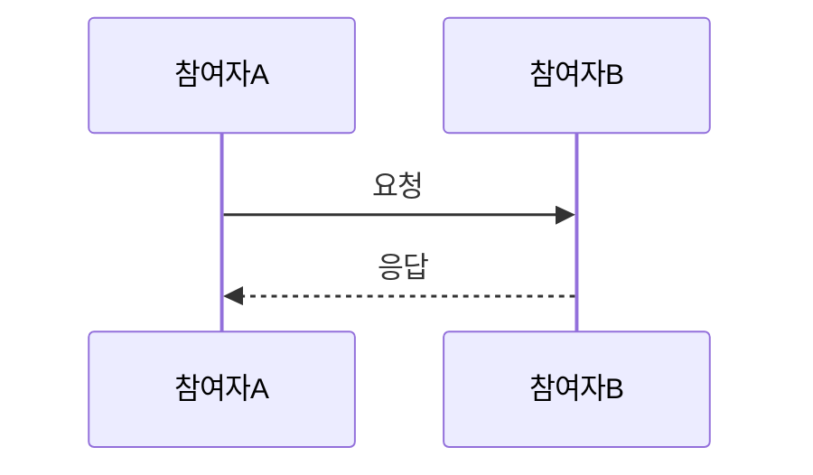

# [토픽명]

> **작성일**: YYYY-MM-DD
> **작성**: Claude (프롬프팅: @sikkzz)
> **학습 영역**: [PROJECT_ROOT의 6영역 중 어디에 속하는지]
> **관련 문서**: [Spec](../specs/xxx.md), [ADR](../decisions/xxx.md)

---

## 한 줄 요약

이게 뭔지 한 문장으로.

## 우리 프로젝트에서 어디에 쓰이는가

- 어떤 기능/Phase에서 사용
- 왜 이 프로젝트엔 이게 필요한가

## 어떻게 동작하는가

핵심 메커니즘 설명. 다이어그램이 도움 되면 Mermaid로.



### 핵심 개념

- **개념 1**: 설명
- **개념 2**: 설명

### 코드 예시 (선택)

```typescript
// 최소 동작 예시
```

## 왜 다른 선택지가 아닌 이걸 골랐나

대안과 비교. (ADR이 있으면 거기에 자세히, 여기엔 요약만)

## 흔한 함정 / 주의할 점

- 본인이 실수하기 쉬운 부분
- 디버깅 시 먼저 의심해야 할 것

## 더 파볼 거리 (선택)

지금은 안 다루지만 나중에 깊이 갈 만한 주제.

- ...

## 참고 링크

- [공식 문서]()
- [좋은 글]()

## 추가 학습 기록

> 같은 토픽으로 추가 학습한 내용은 아래에 날짜 헤더로 누적.

### YYYY-MM-DD 추가

...
