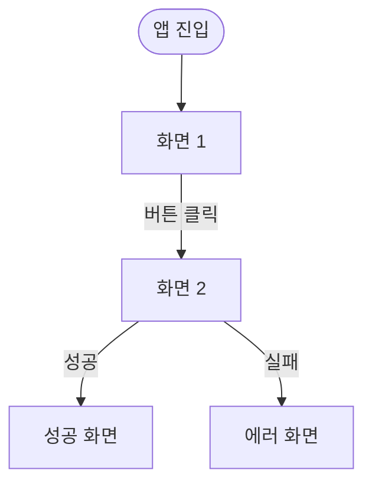

# [기능명] 화면 카탈로그

> **상태**: In Development / Stable
> **마지막 업데이트**: YYYY-MM-DD
> **작성**: Claude (캡처 제공: @sikkzz)
> **관련 Spec**: [Spec](../specs/xxx.md)

---

## 개요

이 기능의 화면들이 전체 앱에서 어떤 위치에 있는지 1~2줄.

## 사용자 플로우

## 화면별 상세

### 화면 1: [화면 이름]

**진입 경로**: 어디서 이 화면으로 오는가
**다음 화면**: 어디로 갈 수 있는가

**UI 요소**

- 요소 A: 설명
- 요소 B: 설명

**정책 / 동작 규칙**

- 조건 X일 때 Y가 일어난다
- Z 입력은 W 형식으로 검증

**인터랙션**

- 탭/스와이프/스크롤 동작

---

### 화면 2: [화면 이름]

(반복)

---

## 정책 요약

전체 화면을 가로지르는 공통 정책.

- 인증 필요 화면 vs 비로그인 가능 화면
- 오프라인 동작
- 로딩/에러 상태 표시 규칙

## 엣지 케이스

- 빈 상태 (Empty State)
- 에러 상태
- 권한 거부 시
- 네트워크 끊김

## 변경 이력

| 날짜       | 변경 내용           |
| ---------- | ------------------- |
| YYYY-MM-DD | 초기 화면 캡처 추가 |
