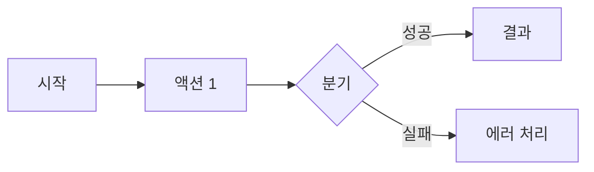

# [기능명] Spec

> **상태**: Draft / In Progress / Done
> **작성일**: YYYY-MM-DD
> **작성**: Claude (프롬프팅: @sikkzz)
> **관련 문서**: [ADR-XXXX](../decisions/XXXX-xxx.md), [화면 카탈로그](../screens/feature-xxx.md)

---

## 1. 한 줄 요약

이 기능이 무엇이며, 어떤 사용자 문제를 해결하는가.

## 2. 배경 / 왜 만드는가

- 어떤 맥락에서 필요한가
- 이 기능이 없을 때 어떤 불편이 있는가
- PROJECT_ROOT의 어떤 학습 영역과 연결되는가 (예: 이미지 파이프라인, 실시간 등)

## 3. 사용자 스토리

- **As a** [사용자 유형], **I want to** [행동], **so that** [목적]
- ...

## 4. 수용 기준 (Acceptance Criteria)

기능이 "완성"되었다고 말할 수 있는 객관적 조건. 체크리스트 형태.

- [ ] 사용자가 X 할 수 있다
- [ ] Y 조건에서 Z가 동작한다
- [ ] 에러 발생 시 W 메시지를 보여준다

## 5. 비범위 (Out of Scope)

이번엔 안 하는 것. 다음으로 미루는 것. (스코프 폭발 방지)

- ...

## 6. 사용자 플로우

## 7. 테스트 시나리오 (QA 관점)

| #   | 시나리오               | 예상 결과 | 자동화 여부 |
| --- | ---------------------- | --------- | ----------- |
| 1   | 정상 흐름 (Happy Path) | ...       | E2E         |
| 2   | 에러: 네트워크 끊김    | ...       | 수동        |
| 3   | 엣지 케이스: ...       | ...       | ...         |

## 8. 성공 지표

어떻게 "잘 동작하는지" 측정하는가. (없으면 생략)

## 9. 미정 사안 (Open Questions)

작성 중 결정 안 된 사항. 결정되면 ADR로 옮기거나 본문에 반영.

- ...

## 10. 변경 이력

| 날짜       | 변경 내용 |
| ---------- | --------- |
| YYYY-MM-DD | 최초 작성 |
